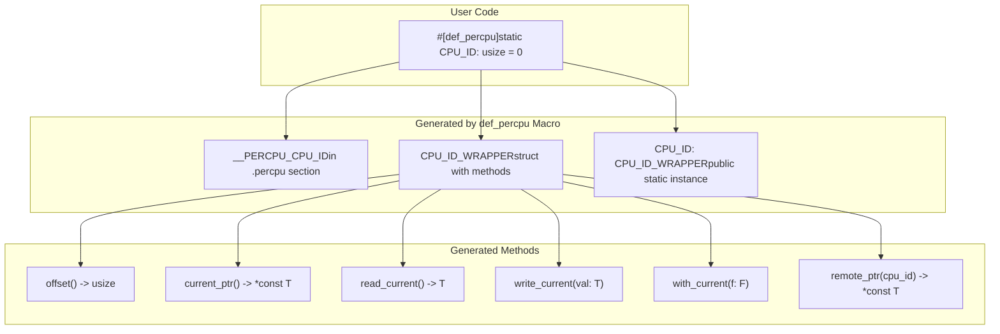
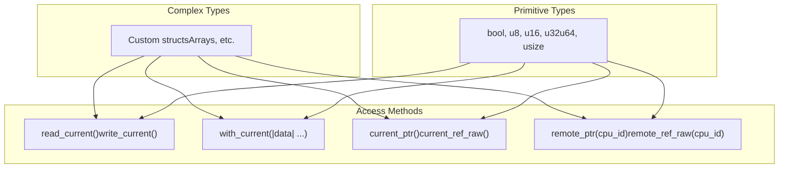

# Basic Usage Examples

> **Relevant source files**
> * [README.md](https://github.com/arceos-org/percpu/blob/89c8a54c/README.md)
> * [percpu/tests/test_percpu.rs](https://github.com/arceos-org/percpu/blob/89c8a54c/percpu/tests/test_percpu.rs)
> * [percpu_macros/src/lib.rs](https://github.com/arceos-org/percpu/blob/89c8a54c/percpu_macros/src/lib.rs)

This section demonstrates the fundamental patterns for defining and accessing per-CPU variables using the `def_percpu` macro. It covers the essential initialization sequence, current CPU data access, and remote CPU data manipulation techniques. For detailed information about system architecture and memory layout, see [Memory Layout and Initialization](/arceos-org/percpu/3.1-memory-layout-and-initialization). For comprehensive API documentation, see [def_percpu Macro](/arceos-org/percpu/4.1-def_percpu-macro).

## Variable Definition and Initialization

The core workflow begins with defining per-CPU variables using the `#[def_percpu]` attribute macro, followed by system initialization to set up memory areas and CPU registers.

### Basic Variable Definition

Per-CPU variables are defined using the `#[percpu::def_percpu]` attribute on static variables. The macro supports various primitive types and custom structures:

```
#[percpu::def_percpu]
static CPU_ID: usize = 0;

#[percpu::def_percpu]
static COUNTER: u64 = 0;

#[percpu::def_percpu]
static FLAG: bool = false;
```

Sources: [README.md(L40 - L41)&emsp;](https://github.com/arceos-org/percpu/blob/89c8a54c/README.md#L40-L41) [percpu/tests/test_percpu.rs(L7 - L23)&emsp;](https://github.com/arceos-org/percpu/blob/89c8a54c/percpu/tests/test_percpu.rs#L7-L23)

### System Initialization Sequence

Before accessing per-CPU data, the system must be initialized with `percpu::init()` and per-CPU registers configured with `percpu::init_percpu_reg()`:

```yaml
// Initialize per-CPU data areas
percpu::init();

// Set the thread pointer register to per-CPU data area 0
percpu::init_percpu_reg(0);
```

**Generated Code Structure**



Sources: [percpu_macros/src/lib.rs(L88 - L89)&emsp;](https://github.com/arceos-org/percpu/blob/89c8a54c/percpu_macros/src/lib.rs#L88-L89) [percpu_macros/src/lib.rs(L149 - L159)&emsp;](https://github.com/arceos-org/percpu/blob/89c8a54c/percpu_macros/src/lib.rs#L149-L159) [percpu_macros/src/lib.rs(L161 - L249)&emsp;](https://github.com/arceos-org/percpu/blob/89c8a54c/percpu_macros/src/lib.rs#L161-L249)

## Current CPU Data Access

The generated wrapper provides several methods for accessing per-CPU data on the current CPU. For primitive integer types, direct read/write methods are available.

### Direct Read/Write Operations

For primitive types (`bool`, `u8`, `u16`, `u32`, `u64`, `usize`), the macro generates optimized read and write methods:

```javascript
// Reading current CPU values
let value = CPU_ID.read_current();
let flag_state = FLAG.read_current();

// Writing to current CPU
CPU_ID.write_current(1);
FLAG.write_current(true);
COUNTER.write_current(0xdead_beef);
```

Sources: [README.md(L48 - L51)&emsp;](https://github.com/arceos-org/percpu/blob/89c8a54c/README.md#L48-L51) [percpu/tests/test_percpu.rs(L71 - L77)&emsp;](https://github.com/arceos-org/percpu/blob/89c8a54c/percpu/tests/test_percpu.rs#L71-L77) [percpu_macros/src/lib.rs(L129 - L139)&emsp;](https://github.com/arceos-org/percpu/blob/89c8a54c/percpu_macros/src/lib.rs#L129-L139)

### Safe Reference-Based Access

For complex data types and when multiple operations are needed, use the `with_current()` method which provides safe mutable access:

```css
#[percpu::def_percpu]
static STATS: Struct = Struct { foo: 0, bar: 0 };

// Safe manipulation with automatic preemption handling
STATS.with_current(|stats| {
    stats.foo = 0x2333;
    stats.bar = 100;
});
```

Sources: [percpu/tests/test_percpu.rs(L78 - L81)&emsp;](https://github.com/arceos-org/percpu/blob/89c8a54c/percpu/tests/test_percpu.rs#L78-L81) [percpu_macros/src/lib.rs(L201 - L207)&emsp;](https://github.com/arceos-org/percpu/blob/89c8a54c/percpu_macros/src/lib.rs#L201-L207)

### Unsafe Raw Access

For performance-critical scenarios where preemption is manually managed, raw access methods are available:

```javascript
unsafe {
    // Caller must ensure preemption is disabled
    let ptr = CPU_ID.current_ptr();
    let value = CPU_ID.read_current_raw();
    CPU_ID.write_current_raw(42);
}
```

Sources: [percpu_macros/src/lib.rs(L113 - L125)&emsp;](https://github.com/arceos-org/percpu/blob/89c8a54c/percpu_macros/src/lib.rs#L113-L125) [percpu_macros/src/lib.rs(L174 - L197)&emsp;](https://github.com/arceos-org/percpu/blob/89c8a54c/percpu_macros/src/lib.rs#L174-L197)

## Remote CPU Data Access

The system supports accessing per-CPU data from other CPUs using CPU ID-based addressing. This is essential for cross-CPU coordination and debugging.

### Remote Pointer Access

```javascript
unsafe {
    // Access data on CPU 1 from any CPU
    let remote_ptr = CPU_ID.remote_ptr(1);
    let remote_value = *remote_ptr;
    
    // Modify remote CPU data
    let remote_mut_ref = COUNTER.remote_ref_mut_raw(1);
    *remote_mut_ref = 0xfeed_feed_feed_feed;
}
```

Sources: [percpu/tests/test_percpu.rs(L110 - L122)&emsp;](https://github.com/arceos-org/percpu/blob/89c8a54c/percpu/tests/test_percpu.rs#L110-L122) [percpu_macros/src/lib.rs(L217 - L246)&emsp;](https://github.com/arceos-org/percpu/blob/89c8a54c/percpu_macros/src/lib.rs#L217-L246)

### CPU Context Switching

The per-CPU register can be updated to change the current CPU context:

```javascript
unsafe {
    // Switch to CPU 1's context
    percpu::write_percpu_reg(percpu::percpu_area_base(1));
    
    // Now read_current() accesses CPU 1's data
    let cpu1_value = CPU_ID.read_current();
}
```

Sources: [percpu/tests/test_percpu.rs(L139 - L154)&emsp;](https://github.com/arceos-org/percpu/blob/89c8a54c/percpu/tests/test_percpu.rs#L139-L154)

## Data Type Support Matrix

The `def_percpu` macro handles different data types with varying levels of optimization:

|Data Type|Direct Read/Write|with_current()|Remote Access|Notes|
| --- | --- | --- | --- | --- |
|bool|✓|✓|✓|Optimized methods generated|
|u8,u16,u32|✓|✓|✓|Optimized methods generated|
|u64,usize|✓|✓|✓|Optimized methods generated|
|Custom structs|✗|✓|✓|Reference-based access only|
|Arrays|✗|✓|✓|Reference-based access only|

**Per-CPU Data Type Access Patterns**



Sources: [percpu_macros/src/lib.rs(L91 - L93)&emsp;](https://github.com/arceos-org/percpu/blob/89c8a54c/percpu_macros/src/lib.rs#L91-L93) [percpu_macros/src/lib.rs(L100 - L145)&emsp;](https://github.com/arceos-org/percpu/blob/89c8a54c/percpu_macros/src/lib.rs#L100-L145) [percpu/tests/test_percpu.rs(L25 - L31)&emsp;](https://github.com/arceos-org/percpu/blob/89c8a54c/percpu/tests/test_percpu.rs#L25-L31)

## Understanding Generated Methods

Each per-CPU variable generates a wrapper struct with a comprehensive set of access methods:

### Core Methods (All Types)

* `offset() -> usize` - Returns variable offset within per-CPU area
* `current_ptr() -> *const T` - Raw pointer to current CPU's data
* `with_current<F>(f: F)` - Safe closure-based access with preemption handling
* `remote_ptr(cpu_id: usize) -> *const T` - Raw pointer to specified CPU's data

### Primitive Type Methods

For `bool`, `u8`, `u16`, `u32`, `u64`, `usize` only:

* `read_current() -> T` - Direct value read with preemption handling
* `write_current(val: T)` - Direct value write with preemption handling
* `read_current_raw() -> T` - Unsafe direct read (no preemption handling)
* `write_current_raw(val: T)` - Unsafe direct write (no preemption handling)

### Feature-Dependent Behavior

The generated code adapts based on enabled cargo features:

* **`preempt` feature**: Adds `NoPreemptGuard` to safe methods
* **`sp-naive` feature**: Uses global variables instead of per-CPU registers
* **`arm-el2` feature**: Uses `TPIDR_EL2` instead of `TPIDR_EL1` on AArch64

Sources: [percpu_macros/src/lib.rs(L94 - L98)&emsp;](https://github.com/arceos-org/percpu/blob/89c8a54c/percpu_macros/src/lib.rs#L94-L98) [README.md(L69 - L79)&emsp;](https://github.com/arceos-org/percpu/blob/89c8a54c/README.md#L69-L79)

## Complete Usage Example

This example demonstrates the full workflow from definition to access:

```rust
use percpu::*;

// Define various per-CPU variables
#[def_percpu]
static CPU_ID: usize = 0;

#[def_percpu]
static COUNTER: u64 = 0;

struct CpuStats {
    interrupts: u64,
    context_switches: u64,
}

#[def_percpu]
static STATS: CpuStats = CpuStats {
    interrupts: 0,
    context_switches: 0,
};

fn main() {
    // Initialize the per-CPU system
    percpu::init();
    percpu::init_percpu_reg(0);
    
    // Access current CPU data
    CPU_ID.write_current(0);
    COUNTER.write_current(100);
    
    STATS.with_current(|stats| {
        stats.interrupts += 1;
        stats.context_switches += 1;
    });
    
    // Read values
    println!("CPU ID: {}", CPU_ID.read_current());
    println!("Counter: {}", COUNTER.read_current());
    
    // Access remote CPU data (unsafe)
    unsafe {
        *COUNTER.remote_ref_mut_raw(1) = 200;
        println!("CPU 1 counter: {}", *COUNTER.remote_ptr(1));
    }
}
```

Sources: [percpu/tests/test_percpu.rs(L34 - L105)&emsp;](https://github.com/arceos-org/percpu/blob/89c8a54c/percpu/tests/test_percpu.rs#L34-L105) [README.md(L39 - L52)&emsp;](https://github.com/arceos-org/percpu/blob/89c8a54c/README.md#L39-L52)