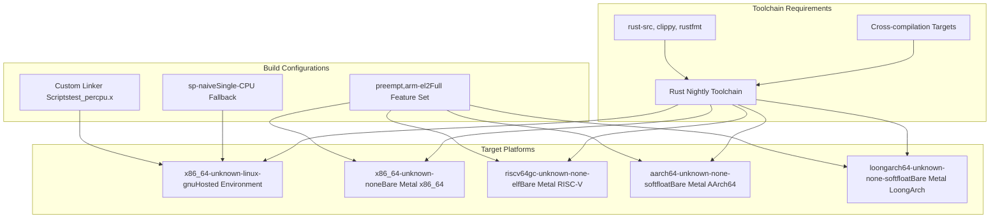
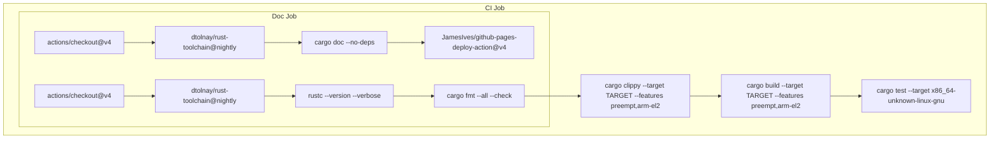
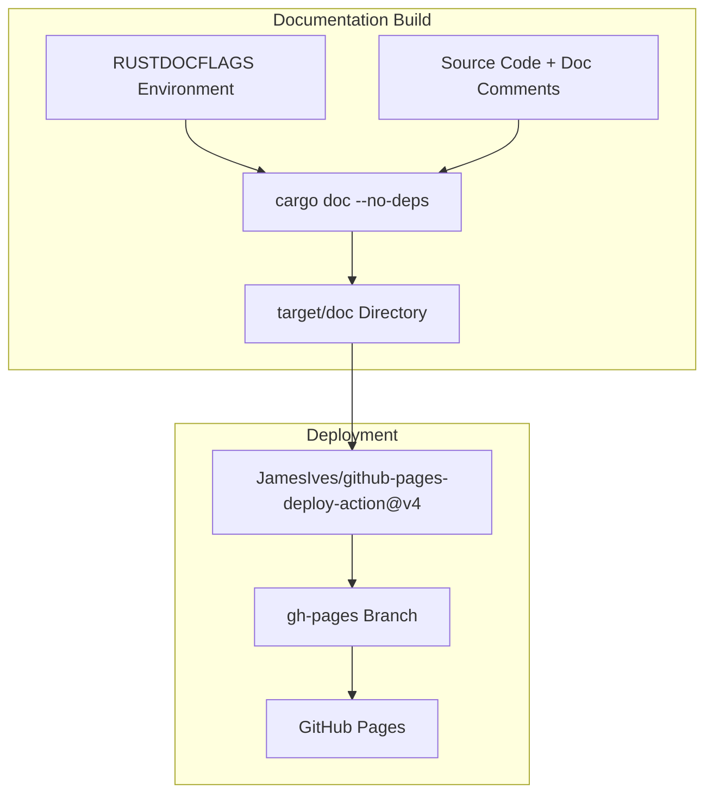

# Build System

> **Relevant source files**
> * [.github/workflows/ci.yml](https://github.com/arceos-org/percpu/blob/89c8a54c/.github/workflows/ci.yml)
> * [Cargo.lock](https://github.com/arceos-org/percpu/blob/89c8a54c/Cargo.lock)
> * [percpu/build.rs](https://github.com/arceos-org/percpu/blob/89c8a54c/percpu/build.rs)

This document covers the build process, CI/CD pipeline, and cross-compilation setup for the percpu crate ecosystem. The build system is designed to support multiple CPU architectures and testing environments while maintaining compatibility across bare-metal and hosted environments.

For information about feature flag configuration, see [Feature Flags Configuration](/arceos-org/percpu/2.3-feature-flags-configuration). For testing procedures and test structure, see [Testing Guide](/arceos-org/percpu/6.1-testing-guide).

## Overview

The percpu build system consists of several components working together to support cross-platform compilation and testing:

* **Cargo workspace** with two crates: `percpu` (runtime) and `percpu_macros` (procedural macros)
* **Multi-target CI/CD pipeline** testing across five different architectures
* **Custom build scripts** for linker integration and test configuration
* **Feature-based conditional compilation** for different deployment scenarios

Sources: [.github/workflows/ci.yml(L1 - L56)&emsp;](https://github.com/arceos-org/percpu/blob/89c8a54c/.github/workflows/ci.yml#L1-L56) [Cargo.lock(L1 - L149)&emsp;](https://github.com/arceos-org/percpu/blob/89c8a54c/Cargo.lock#L1-L149) [percpu/build.rs(L1 - L10)&emsp;](https://github.com/arceos-org/percpu/blob/89c8a54c/percpu/build.rs#L1-L10)

## Cross-Compilation Architecture

The build system supports a comprehensive matrix of target platforms, each requiring specific toolchain and runtime configurations:



Sources: [.github/workflows/ci.yml(L12 - L19)&emsp;](https://github.com/arceos-org/percpu/blob/89c8a54c/.github/workflows/ci.yml#L12-L19) [.github/workflows/ci.yml(L25 - L27)&emsp;](https://github.com/arceos-org/percpu/blob/89c8a54c/.github/workflows/ci.yml#L25-L27)

## CI/CD Pipeline

The automated build and test pipeline runs on every push and pull request, ensuring code quality and cross-platform compatibility:

### Build Matrix Configuration

|Target Platform|Test Environment|Feature Set|Special Requirements|
| --- | --- | --- | --- |
|x86_64-unknown-linux-gnu|Ubuntu 22.04|sp-naive+ default|Unit tests enabled|
|x86_64-unknown-none|Ubuntu 22.04|preempt,arm-el2|Bare metal|
|riscv64gc-unknown-none-elf|Ubuntu 22.04|preempt,arm-el2|Bare metal|
|aarch64-unknown-none-softfloat|Ubuntu 22.04|preempt,arm-el2|Bare metal|
|loongarch64-unknown-none-softfloat|Ubuntu 22.04|preempt,arm-el2|Bare metal|

### Pipeline Stages



Sources: [.github/workflows/ci.yml(L6 - L33)&emsp;](https://github.com/arceos-org/percpu/blob/89c8a54c/.github/workflows/ci.yml#L6-L33) [.github/workflows/ci.yml(L34 - L56)&emsp;](https://github.com/arceos-org/percpu/blob/89c8a54c/.github/workflows/ci.yml#L34-L56)

## Build Script Integration

The `percpu` crate includes a custom build script that handles linker configuration for testing environments:

### Conditional Linker Configuration

The build script in [percpu/build.rs(L1 - L10)&emsp;](https://github.com/arceos-org/percpu/blob/89c8a54c/percpu/build.rs#L1-L10) performs platform-specific setup:

```
// Pseudo-code representation of build.rs logic
if target_os == "linux" && !feature("sp-naive") {
    // Add custom linker script for per-CPU section testing
    add_link_arg("-no-pie");
    add_link_arg("-T test_percpu.x");
}
```

This configuration ensures:

* **Position-independent execution disabled** (`-no-pie`) for consistent memory layout
* **Custom linker script** (`test_percpu.x`) defines `.percpu` section placement
* **Conditional application** only for Linux userspace testing without naive fallback

Sources: [percpu/build.rs(L4 - L8)&emsp;](https://github.com/arceos-org/percpu/blob/89c8a54c/percpu/build.rs#L4-L8)

## Dependency Management

The build system manages a carefully curated set of dependencies optimized for cross-platform compatibility:

### Core Runtime Dependencies

|Crate|Version|Purpose|Platform Support|
| --- | --- | --- | --- |
|cfg-if|1.0.0|Conditional compilation|All platforms|
|kernel_guard|0.1.2|Preemption safety|no_std compatible|
|spin|0.9.8|Synchronization primitives|no_std compatible|
|x86|0.52.0|x86-specific operations|x86_64 only|

### Macro Dependencies

|Crate|Version|Purpose|
| --- | --- | --- |
|proc-macro2|1.0.93|Token manipulation|
|quote|1.0.38|Code generation|
|syn|2.0.96|AST parsing|

Sources: [Cargo.lock(L61 - L78)&emsp;](https://github.com/arceos-org/percpu/blob/89c8a54c/Cargo.lock#L61-L78)

## Documentation Generation

The build system includes automated documentation generation and deployment:

### Documentation Pipeline



### Documentation Configuration

The documentation build uses specific flags for enhanced output:

* `-Zunstable-options --enable-index-page` - Enables unified index page
* `-D rustdoc::broken_intra_doc_links` - Treats broken links as errors
* `-D missing-docs` - Requires documentation for all public items

Sources: [.github/workflows/ci.yml(L42 - L56)&emsp;](https://github.com/arceos-org/percpu/blob/89c8a54c/.github/workflows/ci.yml#L42-L56)

## Feature-Based Build Variants

The build system supports multiple feature combinations for different deployment scenarios:

### Feature Matrix

|Feature Set|Target Use Case|Platforms|Build Behavior|
| --- | --- | --- | --- |
|Default|Multi-CPU systems|Bare metal targets|Full per-CPU implementation|
|sp-naive|Single-CPU systems|Linux userspace|Global variable fallback|
|preempt|Preemption-aware|All platforms|NoPreemptGuard integration|
|arm-el2|Hypervisor mode|AArch64 only|EL2 register usage|

### Build Commands by Use Case

```markdown
# Bare metal development
cargo build --target x86_64-unknown-none --features "preempt,arm-el2"

# Linux userspace testing
cargo test --target x86_64-unknown-linux-gnu --features "sp-naive"

# Documentation generation
cargo doc --no-deps
```

Sources: [.github/workflows/ci.yml(L25 - L32)&emsp;](https://github.com/arceos-org/percpu/blob/89c8a54c/.github/workflows/ci.yml#L25-L32)