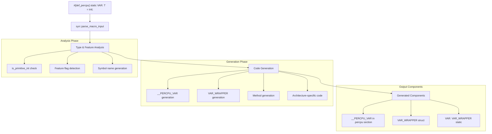
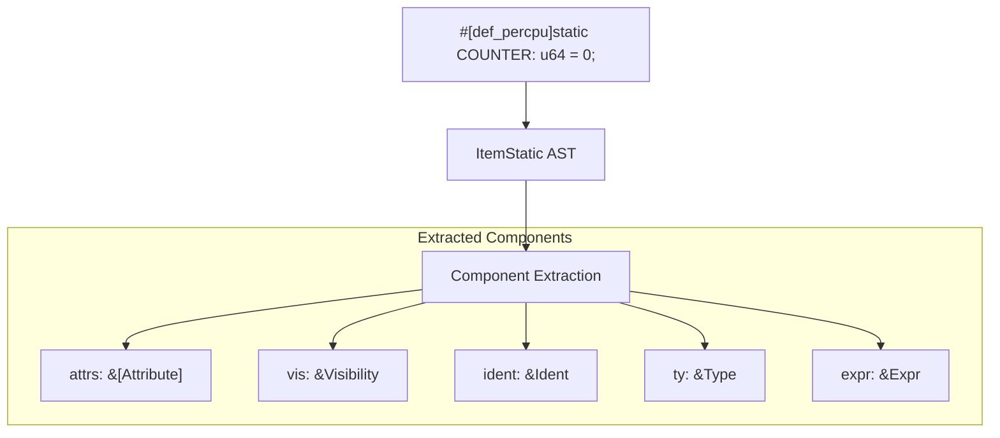
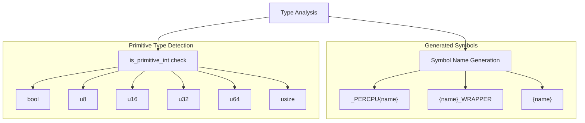
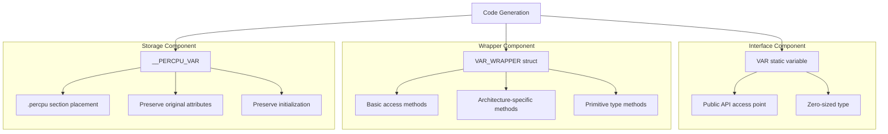
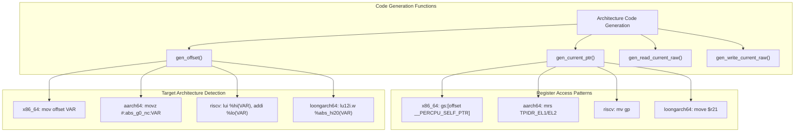
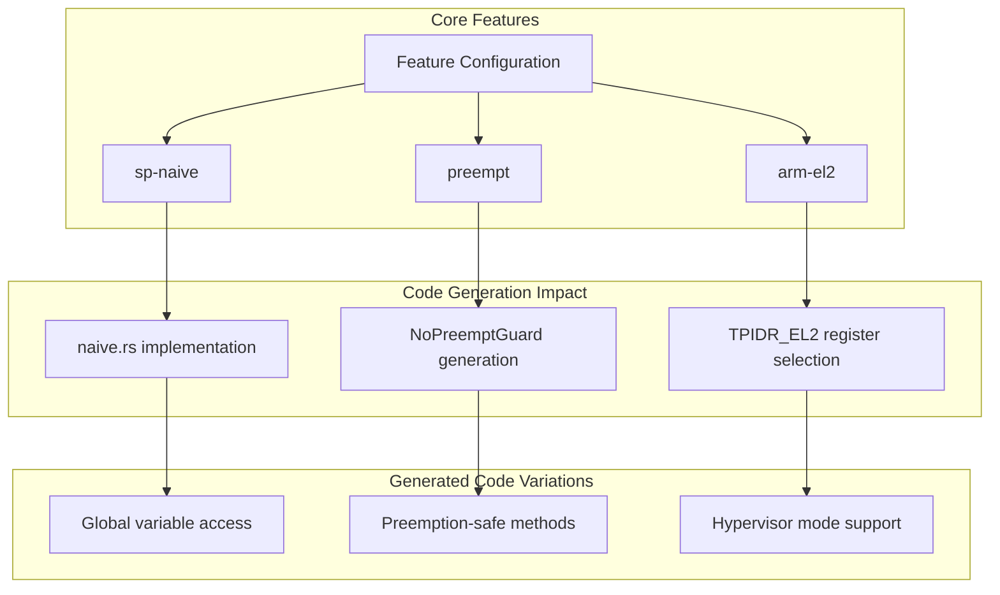
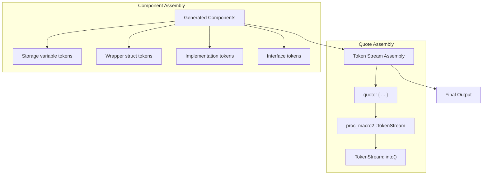

# Code Generation Pipeline

> **Relevant source files**
> * [percpu_macros/Cargo.toml](https://github.com/arceos-org/percpu/blob/89c8a54c/percpu_macros/Cargo.toml)
> * [percpu_macros/src/arch.rs](https://github.com/arceos-org/percpu/blob/89c8a54c/percpu_macros/src/arch.rs)
> * [percpu_macros/src/lib.rs](https://github.com/arceos-org/percpu/blob/89c8a54c/percpu_macros/src/lib.rs)

This document details the compile-time transformation pipeline that converts user-defined per-CPU variable declarations into architecture-specific, optimized access code. The pipeline is implemented as a procedural macro system that analyzes user code, detects target platform characteristics, and generates efficient per-CPU data access methods.

For information about the runtime memory layout and initialization, see [Memory Layout and Initialization](/arceos-org/percpu/3.1-memory-layout-and-initialization). For details about the specific assembly code generated for each architecture, see [Architecture-Specific Code Generation](/arceos-org/percpu/5.1-architecture-specific-code-generation).

## Pipeline Overview

The code generation pipeline transforms a simple user declaration into a comprehensive per-CPU data access system through multiple stages of analysis and code generation.

### High-Level Transformation Flow

**Sources:** [percpu_macros/src/lib.rs(L72 - L252)&emsp;](https://github.com/arceos-org/percpu/blob/89c8a54c/percpu_macros/src/lib.rs#L72-L252)

## Input Parsing and Analysis

The pipeline begins with the `def_percpu` procedural macro, which uses the `syn` crate to parse the user's static variable declaration into an Abstract Syntax Tree (AST).

### Parsing Stage

The parsing logic extracts key components from the declaration:

|Component|Purpose|Example|
| --- | --- | --- |
|attrs|Preserve original attributes|#[no_mangle]|
|vis|Maintain visibility|pub|
|ident|Variable name|COUNTER|
|ty|Type information|u64|
|expr|Initialization expression|0|

**Sources:** [percpu_macros/src/lib.rs(L80 - L86)&emsp;](https://github.com/arceos-org/percpu/blob/89c8a54c/percpu_macros/src/lib.rs#L80-L86)

### Type Analysis and Symbol Generation

The pipeline performs type analysis to determine code generation strategy and generates internal symbol names:

The type analysis at [percpu_macros/src/lib.rs(L91 - L92)&emsp;](https://github.com/arceos-org/percpu/blob/89c8a54c/percpu_macros/src/lib.rs#L91-L92) determines whether to generate optimized assembly access methods for primitive integer types.

**Sources:** [percpu_macros/src/lib.rs(L88 - L92)&emsp;](https://github.com/arceos-org/percpu/blob/89c8a54c/percpu_macros/src/lib.rs#L88-L92)

## Code Generation Stages

The pipeline generates three primary components for each per-CPU variable, with different methods and optimizations based on type and feature analysis.

### Component Generation Structure

**Sources:** [percpu_macros/src/lib.rs(L149 - L251)&emsp;](https://github.com/arceos-org/percpu/blob/89c8a54c/percpu_macros/src/lib.rs#L149-L251)

### Method Generation Logic

The wrapper struct receives different sets of methods based on type analysis and feature configuration:

|Method Category|Condition|Generated Methods|
| --- | --- | --- |
|Basic Access|Always|offset(),current_ptr(),current_ref_raw(),current_ref_mut_raw(),with_current(),remote_ptr(),remote_ref_raw(),remote_ref_mut_raw()|
|Primitive Optimized|is_primitive_int == true|read_current_raw(),write_current_raw(),read_current(),write_current()|
|Preemption Safety|feature = "preempt"|AutomaticNoPreemptGuardin safe methods|

**Sources:** [percpu_macros/src/lib.rs(L100 - L145)&emsp;](https://github.com/arceos-org/percpu/blob/89c8a54c/percpu_macros/src/lib.rs#L100-L145) [percpu_macros/src/lib.rs(L161 - L249)&emsp;](https://github.com/arceos-org/percpu/blob/89c8a54c/percpu_macros/src/lib.rs#L161-L249)

## Architecture-Specific Code Generation

The pipeline delegates architecture-specific code generation to specialized functions in the `arch` module, which produce optimized assembly code for each supported platform.

### Architecture Detection and Code Selection

**Sources:** [percpu_macros/src/arch.rs(L16 - L50)&emsp;](https://github.com/arceos-org/percpu/blob/89c8a54c/percpu_macros/src/arch.rs#L16-L50) [percpu_macros/src/arch.rs(L54 - L88)&emsp;](https://github.com/arceos-org/percpu/blob/89c8a54c/percpu_macros/src/arch.rs#L54-L88)

### Assembly Code Generation Patterns

The architecture-specific functions generate different assembly instruction sequences based on the target platform and operation type:

|Architecture|Offset Calculation|Current Pointer Access|Direct Read/Write|
| --- | --- | --- | --- |
|x86_64|mov {reg}, offset {symbol}|mov {reg}, gs:[offset __PERCPU_SELF_PTR]|mov gs:[offset {symbol}], {val}|
|AArch64|movz {reg}, #:abs_g0_nc:{symbol}|mrs {reg}, TPIDR_EL1|Not implemented|
|RISC-V|lui {reg}, %hi({symbol})|mv {reg}, gp|lui + add + load/store|
|LoongArch|lu12i.w {reg}, %abs_hi20({symbol})|move {reg}, $r21|lu12i.w + ori + load/store|

**Sources:** [percpu_macros/src/arch.rs(L94 - L181)&emsp;](https://github.com/arceos-org/percpu/blob/89c8a54c/percpu_macros/src/arch.rs#L94-L181) [percpu_macros/src/arch.rs(L187 - L263)&emsp;](https://github.com/arceos-org/percpu/blob/89c8a54c/percpu_macros/src/arch.rs#L187-L263)

## Feature-Based Code Variations

The pipeline adapts code generation based on feature flags, creating different implementations for various use cases and platform configurations.

### Feature Flag Processing

The feature-based variations are configured at [percpu_macros/Cargo.toml(L15 - L25)&emsp;](https://github.com/arceos-org/percpu/blob/89c8a54c/percpu_macros/Cargo.toml#L15-L25) and affect code generation in several ways:

|Feature|Impact|Code Changes|
| --- | --- | --- |
|sp-naive|Single-processor fallback|Usesnaive.rsinstead ofarch.rs|
|preempt|Preemption safety|GeneratesNoPreemptGuardin safe methods|
|arm-el2|Hypervisor mode|UsesTPIDR_EL2instead ofTPIDR_EL1|

**Sources:** [percpu_macros/src/lib.rs(L59 - L60)&emsp;](https://github.com/arceos-org/percpu/blob/89c8a54c/percpu_macros/src/lib.rs#L59-L60) [percpu_macros/src/lib.rs(L94 - L98)&emsp;](https://github.com/arceos-org/percpu/blob/89c8a54c/percpu_macros/src/lib.rs#L94-L98) [percpu_macros/src/arch.rs(L55 - L61)&emsp;](https://github.com/arceos-org/percpu/blob/89c8a54c/percpu_macros/src/arch.rs#L55-L61)

## Final Code Generation and Output

The pipeline concludes by assembling all generated components into the final token stream using the `quote!` macro.

### Output Structure Assembly

The final assembly process at [percpu_macros/src/lib.rs(L149 - L251)&emsp;](https://github.com/arceos-org/percpu/blob/89c8a54c/percpu_macros/src/lib.rs#L149-L251) combines:

1. **Storage Declaration**: `static mut __PERCPU_{name}: {type} = {init};` with `.percpu` section attribute
2. **Wrapper Struct**: Zero-sized struct with generated methods for access
3. **Implementation Block**: All the generated methods for the wrapper
4. **Public Interface**: `static {name}: {name}_WRAPPER = {name}_WRAPPER {};`

The complete transformation ensures that a simple `#[def_percpu] static VAR: T = init;` declaration becomes a comprehensive per-CPU data access system with architecture-optimized assembly code, type-safe interfaces, and optional preemption safety.

**Sources:** [percpu_macros/src/lib.rs(L149 - L252)&emsp;](https://github.com/arceos-org/percpu/blob/89c8a54c/percpu_macros/src/lib.rs#L149-L252)