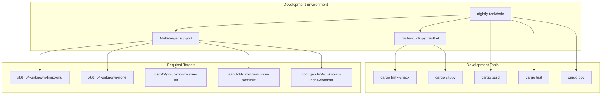
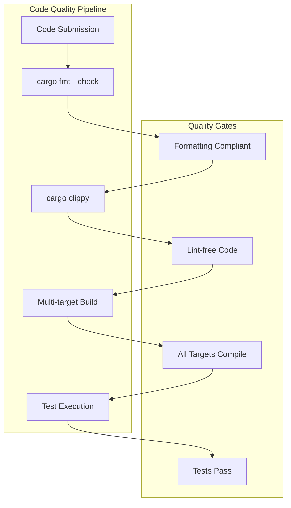
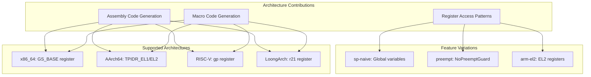
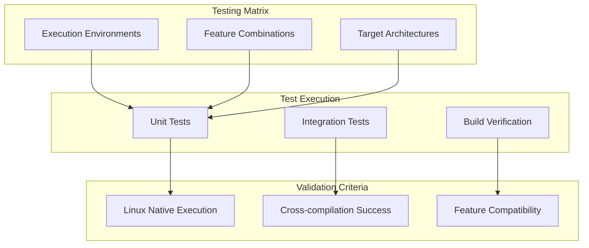

# Contributing

> **Relevant source files**
> * [.github/workflows/ci.yml](https://github.com/arceos-org/percpu/blob/89c8a54c/.github/workflows/ci.yml)
> * [.gitignore](https://github.com/arceos-org/percpu/blob/89c8a54c/.gitignore)
> * [CHANGELOG.md](https://github.com/arceos-org/percpu/blob/89c8a54c/CHANGELOG.md)

This page provides comprehensive guidelines for contributing to the percpu crate ecosystem, including development environment setup, code standards, testing requirements, and the pull request workflow. The information covers both runtime implementation contributions to the main `percpu` crate and compile-time macro contributions to the `percpu_macros` crate.

For information about the testing infrastructure and test execution, see [Testing Guide](/arceos-org/percpu/6.1-testing-guide). For details about the build system and CI/CD pipeline implementation, see [Build System](/arceos-org/percpu/6.2-build-system).

## Development Environment Setup

### Prerequisites and Toolchain

The percpu crate requires a nightly Rust toolchain due to its use of unstable features for low-level per-CPU data management. The development environment must support cross-compilation to multiple target architectures.



**Required Installation Commands:**

```
rustup toolchain install nightly
rustup component add --toolchain nightly rust-src clippy rustfmt
rustup target add x86_64-unknown-linux-gnu x86_64-unknown-none
rustup target add riscv64gc-unknown-none-elf aarch64-unknown-none-softfloat
rustup target add loongarch64-unknown-none-softfloat
```

Sources: [.github/workflows/ci.yml(L15 - L19)&emsp;](https://github.com/arceos-org/percpu/blob/89c8a54c/.github/workflows/ci.yml#L15-L19)

### Workspace Structure

The percpu workspace contains two main crates with distinct development considerations:

|Crate|Purpose|Development Focus|
| --- | --- | --- |
|percpu|Runtime implementation|Architecture-specific assembly, memory management, register access|
|percpu_macros|Procedural macros|Code generation, AST manipulation, cross-platform abstraction|

Contributors must understand both the runtime behavior and compile-time code generation when making changes that affect the public API.

Sources: Based on system architecture diagrams

## Code Quality Standards

### Formatting and Linting Requirements

All contributions must pass automated code quality checks enforced by the CI pipeline:



**Pre-submission Checklist:**

* Run `cargo fmt --all -- --check` to verify formatting
* Run `cargo clippy --target <TARGET> --features "preempt,arm-el2"` for all supported targets
* Ensure all builds pass: `cargo build --target <TARGET> --features "preempt,arm-el2"`
* Execute tests for applicable targets

Sources: [.github/workflows/ci.yml(L23 - L27)&emsp;](https://github.com/arceos-org/percpu/blob/89c8a54c/.github/workflows/ci.yml#L23-L27)

### Documentation Standards

The crate enforces strict documentation requirements through `RUSTDOCFLAGS` configuration. All public APIs must include comprehensive documentation with examples.

**Documentation Requirements:**

* All public functions, structs, and macros must have doc comments
* Examples should demonstrate real-world usage patterns
* Architecture-specific behavior must be clearly documented
* Breaking changes require CHANGELOG.md updates

Sources: [.github/workflows/ci.yml(L42)&emsp;](https://github.com/arceos-org/percpu/blob/89c8a54c/.github/workflows/ci.yml#L42-L42)

## Architecture-Specific Contribution Guidelines

### Cross-Platform Code Generation

When contributing to architecture-specific functionality, developers must understand the code generation pipeline for each supported platform:



**Architecture Addition Requirements:**

* Implement register access patterns in `percpu_macros/src/lib.rs`
* Add target-specific assembly generation
* Update feature flag handling for new architecture
* Add comprehensive tests for the new platform
* Update CI configuration to include new target

Sources: Based on system architecture and [CHANGELOG.md(L25)&emsp;](https://github.com/arceos-org/percpu/blob/89c8a54c/CHANGELOG.md#L25-L25)

### Feature Flag Considerations

New features must integrate with the existing feature flag system:

|Feature|Impact|Testing Requirements|
| --- | --- | --- |
|sp-naive|Single-CPU fallback implementation|Test with and without feature|
|preempt|Preemption-safe operations|Test atomic behavior|
|arm-el2|AArch64 EL2 privilege level|Test on EL2-capable systems|

Sources: [.github/workflows/ci.yml(L25)&emsp;](https://github.com/arceos-org/percpu/blob/89c8a54c/.github/workflows/ci.yml#L25-L25) [CHANGELOG.md(L43)&emsp;](https://github.com/arceos-org/percpu/blob/89c8a54c/CHANGELOG.md#L43-L43)

## Testing and Validation

### Multi-Target Testing Strategy

Contributors must validate changes across all supported target architectures. The CI system provides the definitive testing matrix:



**Testing Commands:**

* Linux native: `cargo test --target x86_64-unknown-linux-gnu --features "sp-naive"`
* Standard features: `cargo test --target x86_64-unknown-linux-gnu`
* Cross-compilation: `cargo build --target <TARGET> --features "preempt,arm-el2"`

Sources: [.github/workflows/ci.yml(L29 - L32)&emsp;](https://github.com/arceos-org/percpu/blob/89c8a54c/.github/workflows/ci.yml#L29-L32)

### Test Coverage Requirements

New functionality requires comprehensive test coverage including:

* Unit tests for core functionality
* Integration tests for cross-component interactions
* Architecture-specific validation where applicable
* Feature flag combination testing

## Pull Request Workflow

### Submission Requirements

Pull requests must satisfy all CI checks before review consideration:

1. **Automated Checks:** All CI jobs must pass successfully
2. **Code Review:** At least one maintainer approval required
3. **Testing:** Comprehensive test coverage for new functionality
4. **Documentation:** Updated documentation for API changes
5. **Changelog:** Version-appropriate changelog entries

### API Evolution Guidelines

Based on the changelog history, API changes follow specific patterns:

**Breaking Changes (Major Version):**

* Function signature modifications
* Public API restructuring
* Initialization process changes

**Compatible Changes (Minor Version):**

* New architecture support
* Additional feature flags
* New accessor methods

**Patch Changes:**

* Bug fixes
* Internal optimizations
* Documentation improvements

Sources: [CHANGELOG.md(L1 - L48)&emsp;](https://github.com/arceos-org/percpu/blob/89c8a54c/CHANGELOG.md#L1-L48)

### Review Criteria

Maintainers evaluate contributions based on:

* **Correctness:** Proper per-CPU data isolation
* **Safety:** Memory safety and race condition prevention
* **Performance:** Minimal overhead for per-CPU access
* **Portability:** Cross-platform compatibility
* **Maintainability:** Clear, well-documented code

## Documentation and Release Process

### Documentation Generation

The project automatically generates and deploys documentation to GitHub Pages for the main branch. Contributors should ensure their changes integrate properly with the documentation pipeline.

**Documentation Commands:**

* Local generation: `cargo doc --no-deps`
* Link checking: Automated through `RUSTDOCFLAGS`
* Deployment: Automatic on main branch merge

Sources: [.github/workflows/ci.yml(L34 - L55)&emsp;](https://github.com/arceos-org/percpu/blob/89c8a54c/.github/workflows/ci.yml#L34-L55)

### Release Coordination

Version releases require careful coordination across both crates in the workspace. Contributors should coordinate with maintainers for:

* API stability guarantees
* Cross-crate compatibility
* Architecture support matrix updates
* Feature flag deprecation schedules

This ensures the percpu ecosystem maintains consistent behavior across all supported platforms and use cases.

Sources: [CHANGELOG.md(L1 - L48)&emsp;](https://github.com/arceos-org/percpu/blob/89c8a54c/CHANGELOG.md#L1-L48) [.github/workflows/ci.yml(L1 - L56)&emsp;](https://github.com/arceos-org/percpu/blob/89c8a54c/.github/workflows/ci.yml#L1-L56)