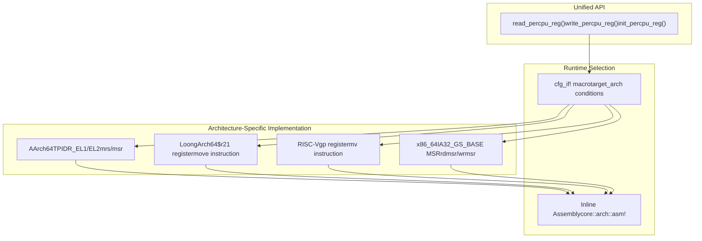
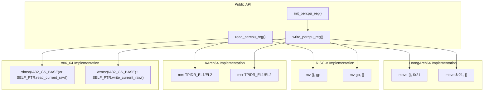
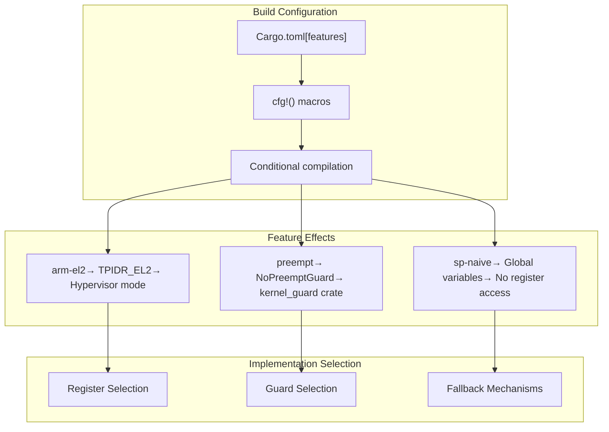

# Cross-Platform Abstraction

> **Relevant source files**
> * [README.md](https://github.com/arceos-org/percpu/blob/89c8a54c/README.md)
> * [percpu/src/imp.rs](https://github.com/arceos-org/percpu/blob/89c8a54c/percpu/src/imp.rs)
> * [percpu_macros/src/arch.rs](https://github.com/arceos-org/percpu/blob/89c8a54c/percpu_macros/src/arch.rs)

This document explains how the percpu crate provides a unified interface across different CPU architectures while leveraging each platform's specific per-CPU register mechanisms. The abstraction layer enables portable per-CPU data management by generating architecture-specific assembly code at compile time and providing runtime functions that adapt to each platform's register conventions.

For details about memory layout and initialization processes, see [Memory Layout and Initialization](/arceos-org/percpu/3.1-memory-layout-and-initialization). For implementation specifics of the code generation process, see [Architecture-Specific Code Generation](/arceos-org/percpu/5.1-architecture-specific-code-generation).

## Architecture Support Matrix

The percpu system supports four major CPU architectures, each using different registers for per-CPU data access:

|Architecture|Per-CPU Register|Register Purpose|Feature Requirements|
| --- | --- | --- | --- |
|x86_64|GS_BASE|MSR-based segment register|MSR read/write access|
|AArch64|TPIDR_EL1/EL2|Thread pointer register|EL1 or EL2 privilege|
|RISC-V|gp|Global pointer register|Custom convention|
|LoongArch64|$r21|General purpose register|Native ISA support|

**Architecture Register Abstraction**



Sources: [README.md(L19 - L36)&emsp;](https://github.com/arceos-org/percpu/blob/89c8a54c/README.md#L19-L36) [percpu/src/imp.rs(L88 - L156)&emsp;](https://github.com/arceos-org/percpu/blob/89c8a54c/percpu/src/imp.rs#L88-L156)

## Runtime Register Management

The runtime system provides architecture-agnostic functions that internally dispatch to platform-specific register access code. Each architecture implements the same interface using its native register access mechanisms.

**Runtime Register Access Functions**



Sources: [percpu/src/imp.rs(L91 - L168)&emsp;](https://github.com/arceos-org/percpu/blob/89c8a54c/percpu/src/imp.rs#L91-L168)

## Compile-Time Code Generation Abstraction

The macro system generates architecture-specific assembly code for accessing per-CPU variables. Each architecture requires different instruction sequences and addressing modes, which are abstracted through the code generation functions in `percpu_macros/src/arch.rs`.

**Code Generation Pipeline by Architecture**

```mermaid
flowchart TD
subgraph subGraph5["LoongArch64 Assembly"]
    LA_OFFSET["lu12i.w {0}, %abs_hi20({VAR})ori {0}, {0}, %abs_lo12({VAR})"]
    LA_PTR["move {}, $r21"]
    LA_READ["lu12i.w {0}, %abs_hi20({VAR})ori {0}, {0}, %abs_lo12({VAR})ldx.hu {0}, {0}, $r21"]
    LA_WRITE["lu12i.w {0}, %abs_hi20({VAR})ori {0}, {0}, %abs_lo12({VAR})stx.h {1}, {0}, $r21"]
end
subgraph subGraph4["RISC-V Assembly"]
    RV_OFFSET["lui {0}, %hi({VAR})addi {0}, {0}, %lo({VAR})"]
    RV_PTR["mv {}, gp"]
    RV_READ["lui {0}, %hi({VAR})add {0}, {0}, gplhu {0}, %lo({VAR})({0})"]
    RV_WRITE["lui {0}, %hi({VAR})add {0}, {0}, gpsh {1}, %lo({VAR})({0})"]
end
subgraph subGraph3["AArch64 Assembly"]
    ARM_OFFSET["movz {0}, #:abs_g0_nc:{VAR}"]
    ARM_PTR["mrs {}, TPIDR_EL1/EL2"]
    ARM_FALLBACK["*self.current_ptr()"]
end
subgraph subGraph2["x86_64 Assembly"]
    X86_OFFSET["mov {0:e}, offset {VAR}"]
    X86_PTR["mov {0}, gs:[offset __PERCPU_SELF_PTR]add {0}, offset {VAR}"]
    X86_READ["mov {0:x}, word ptr gs:[offset {VAR}]"]
    X86_WRITE["mov word ptr gs:[offset {VAR}], {0:x}"]
end
subgraph subGraph1["Generation Functions"]
    OFFSET["gen_offset()"]
    CURRENTPTR["gen_current_ptr()"]
    READRAW["gen_read_current_raw()"]
    WRITERAW["gen_write_current_raw()"]
end
subgraph subGraph0["Macro Input"]
    DEFPERCPU["#[def_percpu]static VAR: T = init;"]
end

CURRENTPTR --> ARM_PTR
CURRENTPTR --> LA_PTR
CURRENTPTR --> RV_PTR
CURRENTPTR --> X86_PTR
DEFPERCPU --> CURRENTPTR
DEFPERCPU --> OFFSET
DEFPERCPU --> READRAW
DEFPERCPU --> WRITERAW
OFFSET --> ARM_OFFSET
OFFSET --> LA_OFFSET
OFFSET --> RV_OFFSET
OFFSET --> X86_OFFSET
READRAW --> ARM_FALLBACK
READRAW --> LA_READ
READRAW --> RV_READ
READRAW --> X86_READ
WRITERAW --> ARM_FALLBACK
WRITERAW --> LA_WRITE
WRITERAW --> RV_WRITE
WRITERAW --> X86_WRITE
```



Sources: [percpu_macros/src/arch.rs(L15 - L263)&emsp;](https://github.com/arceos-org/percpu/blob/89c8a54c/percpu_macros/src/arch.rs#L15-L263)

## Feature Flag Configuration

The system uses Cargo features to adapt behavior for different deployment scenarios and platform capabilities:

|Feature|Purpose|Effect on Abstraction|
| --- | --- | --- |
|sp-naive|Single-core systems|Disables per-CPU registers, uses global variables|
|preempt|Preemptible kernels|AddsNoPreemptGuardintegration|
|arm-el2|ARM hypervisors|UsesTPIDR_EL2instead ofTPIDR_EL1|

The `arm-el2` feature specifically affects the AArch64 register selection:

```javascript
// From percpu_macros/src/arch.rs:55-61
let aarch64_tpidr = if cfg!(feature = "arm-el2") {
    "TPIDR_EL2"
} else {
    "TPIDR_EL1"
};
```

**Feature-Based Configuration Flow**



Sources: [README.md(L69 - L79)&emsp;](https://github.com/arceos-org/percpu/blob/89c8a54c/README.md#L69-L79) [percpu_macros/src/arch.rs(L55 - L61)&emsp;](https://github.com/arceos-org/percpu/blob/89c8a54c/percpu_macros/src/arch.rs#L55-L61) [percpu/src/imp.rs(L105 - L108)&emsp;](https://github.com/arceos-org/percpu/blob/89c8a54c/percpu/src/imp.rs#L105-L108)

## Platform-Specific Implementation Details

Each architecture has unique characteristics that the abstraction layer must accommodate:

### x86_64 Specifics

* Uses Model-Specific Register (MSR) `IA32_GS_BASE` for per-CPU base pointer
* Requires special handling for Linux userspace via `arch_prctl` syscall
* Maintains `SELF_PTR` variable in per-CPU area for efficient access
* Supports direct GS-relative addressing in assembly

### AArch64 Specifics

* Uses Thread Pointer Identification Register (`TPIDR_EL1/EL2`)
* EL1 for kernel mode, EL2 for hypervisor mode (controlled by `arm-el2` feature)
* Limited offset range requires base+offset addressing for larger structures
* Falls back to pointer arithmetic for complex access patterns

### RISC-V Specifics

* Repurposes Global Pointer (`gp`) register for per-CPU base
* Thread Pointer (`tp`) remains available for thread-local storage
* Uses `lui`/`addi` instruction pairs for address calculation
* Supports direct load/store with calculated offsets

### LoongArch64 Specifics

* Uses general-purpose register `$r21` by convention
* Native instruction support with `lu12i.w`/`ori` for address formation
* Indexed load/store instructions for efficient per-CPU access
* Full 32-bit offset support for large per-CPU areas

Sources: [percpu/src/imp.rs(L94 - L156)&emsp;](https://github.com/arceos-org/percpu/blob/89c8a54c/percpu/src/imp.rs#L94-L156) [percpu_macros/src/arch.rs(L21 - L263)&emsp;](https://github.com/arceos-org/percpu/blob/89c8a54c/percpu_macros/src/arch.rs#L21-L263) [README.md(L28 - L35)&emsp;](https://github.com/arceos-org/percpu/blob/89c8a54c/README.md#L28-L35)