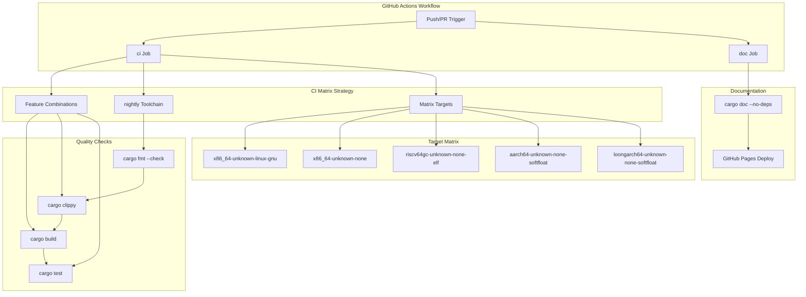

# Development and Testing

> **Relevant source files**
> * [.github/workflows/ci.yml](https://github.com/arceos-org/percpu/blob/89c8a54c/.github/workflows/ci.yml)
> * [Cargo.lock](https://github.com/arceos-org/percpu/blob/89c8a54c/Cargo.lock)
> * [percpu/tests/test_percpu.rs](https://github.com/arceos-org/percpu/blob/89c8a54c/percpu/tests/test_percpu.rs)

This document provides an overview of the development workflows, testing infrastructure, and continuous integration setup for the percpu crate ecosystem. It covers the automated testing pipeline, cross-platform validation, and contributor guidelines for maintaining code quality across multiple CPU architectures.

For detailed testing procedures and test case development, see [Testing Guide](/arceos-org/percpu/6.1-testing-guide). For build system configuration and cross-compilation setup, see [Build System](/arceos-org/percpu/6.2-build-system). For contribution guidelines and development environment setup, see [Contributing](/arceos-org/percpu/6.3-contributing).

## Development Workflow Overview

The percpu project follows a comprehensive development workflow that ensures code quality and cross-platform compatibility through automated testing and validation. The system is designed to support multiple CPU architectures and feature configurations while maintaining strict quality standards.

### Testing Infrastructure

The project uses a multi-layered testing approach that validates functionality across different target platforms and feature combinations:

```

```

**Sources:** [percpu/tests/test_percpu.rs(L1 - L163)&emsp;](https://github.com/arceos-org/percpu/blob/89c8a54c/percpu/tests/test_percpu.rs#L1-L163) [.github/workflows/ci.yml(L10 - L32)&emsp;](https://github.com/arceos-org/percpu/blob/89c8a54c/.github/workflows/ci.yml#L10-L32)

### CI/CD Pipeline Architecture

The continuous integration system validates all changes across multiple dimensions using GitHub Actions:



**Sources:** [.github/workflows/ci.yml(L1 - L56)&emsp;](https://github.com/arceos-org/percpu/blob/89c8a54c/.github/workflows/ci.yml#L1-L56)

## Test Execution Flow

The testing system follows a structured approach that validates both basic functionality and advanced features like remote CPU access:

```

```

**Sources:** [percpu/tests/test_percpu.rs(L34 - L105)&emsp;](https://github.com/arceos-org/percpu/blob/89c8a54c/percpu/tests/test_percpu.rs#L34-L105) [percpu/tests/test_percpu.rs(L107 - L162)&emsp;](https://github.com/arceos-org/percpu/blob/89c8a54c/percpu/tests/test_percpu.rs#L107-L162)

## Cross-Platform Validation

The build system validates functionality across all supported architectures using a comprehensive matrix strategy:

|Target Platform|Build|Clippy|Tests|Features|
| --- | --- | --- | --- | --- |
|x86_64-unknown-linux-gnu|✓|✓|✓|sp-naive, default|
|x86_64-unknown-none|✓|✓|-|preempt,arm-el2|
|riscv64gc-unknown-none-elf|✓|✓|-|preempt,arm-el2|
|aarch64-unknown-none-softfloat|✓|✓|-|preempt,arm-el2|
|loongarch64-unknown-none-softfloat|✓|✓|-|preempt,arm-el2|

The CI pipeline ensures that all changes maintain compatibility across the entire target matrix before merging.

**Sources:** [.github/workflows/ci.yml(L10 - L32)&emsp;](https://github.com/arceos-org/percpu/blob/89c8a54c/.github/workflows/ci.yml#L10-L32)

## Quality Assurance Tools

The project enforces code quality through multiple automated tools:

### Formatting and Linting

* **Rustfmt**: Enforces consistent code formatting across the codebase [`cargo fmt --all -- --check`](https://github.com/arceos-org/percpu/blob/89c8a54c/`cargo fmt --all -- --check`)()
* **Clippy**: Provides additional linting and best practice enforcement <FileRef file-url="[https://github.com/arceos-org/percpu/blob/89c8a54c/`cargo](https://github.com/arceos-org/percpu/blob/89c8a54c/%60cargo) clippy --target ${{ matrix.targets }} --features "preempt,arm-el2"`" undefined  file-path="`cargo clippy --target ${{ matrix.targets }} --features "preempt,arm-el2"`">Hii()

### Documentation Generation

* **Rust Documentation**: Automatically builds and deploys API documentation [`cargo doc --no-deps`](https://github.com/arceos-org/percpu/blob/89c8a54c/`cargo doc --no-deps`)()
* **GitHub Pages**: Hosts documentation with automatic updates on main branch changes [`.github/workflows/ci.yml(L49 - L55)&emsp;](https://github.com/arceos-org/percpu/blob/89c8a54c/`.github/workflows/ci.yml#L49-L55)

### Feature Flag Testing

The system validates different feature combinations to ensure compatibility:

* `sp-naive`: Single-processor fallback mode testing <FileRef file-url="[https://github.com/arceos-org/percpu/blob/89c8a54c/`cargo](https://github.com/arceos-org/percpu/blob/89c8a54c/%60cargo) test --target ${{ matrix.targets }} --features "sp-naive"`" undefined  file-path="`cargo test --target ${{ matrix.targets }} --features "sp-naive"`">Hii()
* `preempt` and `arm-el2`: Advanced feature testing across all build targets [`.github/workflows/ci.yml(L25 - L27)&emsp;](https://github.com/arceos-org/percpu/blob/89c8a54c/`.github/workflows/ci.yml#L25-L27)

**Sources:** [.github/workflows/ci.yml(L20 - L32)&emsp;](https://github.com/arceos-org/percpu/blob/89c8a54c/.github/workflows/ci.yml#L20-L32) [.github/workflows/ci.yml(L40 - L55)&emsp;](https://github.com/arceos-org/percpu/blob/89c8a54c/.github/workflows/ci.yml#L40-L55)