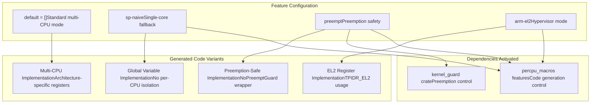
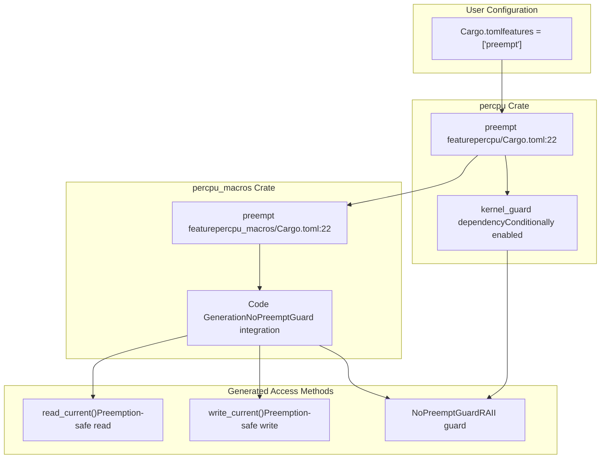
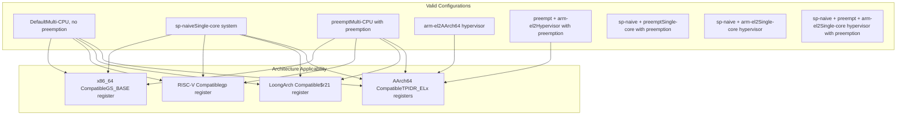
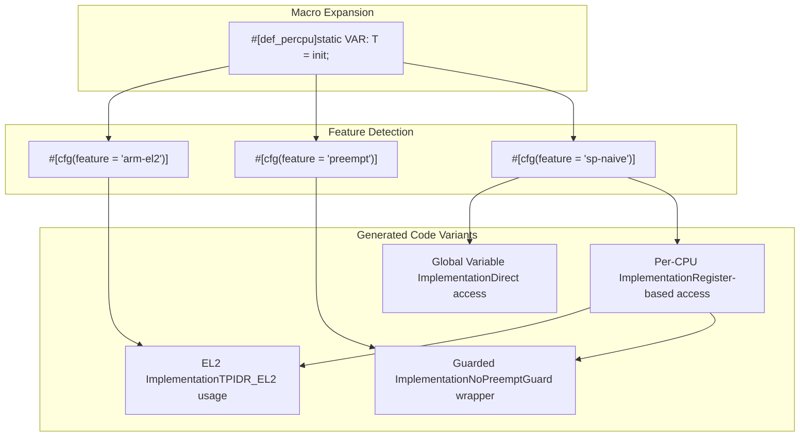

# Feature Flags Configuration

> **Relevant source files**
> * [README.md](https://github.com/arceos-org/percpu/blob/89c8a54c/README.md)
> * [percpu/Cargo.toml](https://github.com/arceos-org/percpu/blob/89c8a54c/percpu/Cargo.toml)
> * [percpu_macros/Cargo.toml](https://github.com/arceos-org/percpu/blob/89c8a54c/percpu_macros/Cargo.toml)

This document explains how to configure the percpu crate's feature flags to optimize per-CPU data management for different system architectures and use cases. It covers the three main feature flags (`sp-naive`, `preempt`, `arm-el2`) and their interaction with dependencies and code generation.

For basic usage examples and integration steps, see [Basic Usage Examples](/arceos-org/percpu/2.2-basic-usage-examples). For detailed implementation specifics of each feature, see [Naive Implementation](/arceos-org/percpu/5.2-naive-implementation).

## Overview of Feature Flags

The percpu crate provides three optional features that adapt the per-CPU data system to different operational environments and architectural requirements.

### Feature Flag Architecture



**Sources:** [percpu/Cargo.toml(L15 - L25)&emsp;](https://github.com/arceos-org/percpu/blob/89c8a54c/percpu/Cargo.toml#L15-L25) [percpu_macros/Cargo.toml(L15 - L25)&emsp;](https://github.com/arceos-org/percpu/blob/89c8a54c/percpu_macros/Cargo.toml#L15-L25) [README.md(L69 - L79)&emsp;](https://github.com/arceos-org/percpu/blob/89c8a54c/README.md#L69-L79)

## Feature Flag Descriptions

### sp-naive Feature

The `sp-naive` feature transforms per-CPU variables into standard global variables, eliminating per-CPU isolation for single-core systems.

|Aspect|Standard Mode|sp-naive Mode|
| --- | --- | --- |
|Variable Storage|Per-CPU memory areas|Global variables|
|Register Usage|Architecture-specific (GS_BASE, TPIDR_EL1, etc.)|None|
|Memory Layout|.percpu section with CPU multiplication|Standard .data/.bss sections|
|Access Method|CPU register + offset calculation|Direct global access|
|Initialization|percpu::init()andpercpu::init_percpu_reg()|Standard global initialization|

**Configuration:**

```
[dependencies]
percpu = { version = "0.2", features = ["sp-naive"] }
```

**Sources:** [percpu/Cargo.toml(L18 - L19)&emsp;](https://github.com/arceos-org/percpu/blob/89c8a54c/percpu/Cargo.toml#L18-L19) [percpu_macros/Cargo.toml(L18 - L19)&emsp;](https://github.com/arceos-org/percpu/blob/89c8a54c/percpu_macros/Cargo.toml#L18-L19) [README.md(L71 - L73)&emsp;](https://github.com/arceos-org/percpu/blob/89c8a54c/README.md#L71-L73)

### preempt Feature

The `preempt` feature enables preemption safety by integrating with the `kernel_guard` crate to prevent data corruption during per-CPU access.

### Feature Dependencies Chain



**Configuration:**

```
[dependencies]
percpu = { version = "0.2", features = ["preempt"] }
```

**Sources:** [percpu/Cargo.toml(L21 - L22)&emsp;](https://github.com/arceos-org/percpu/blob/89c8a54c/percpu/Cargo.toml#L21-L22) [percpu_macros/Cargo.toml(L21 - L22)&emsp;](https://github.com/arceos-org/percpu/blob/89c8a54c/percpu_macros/Cargo.toml#L21-L22) [README.md(L74 - L76)&emsp;](https://github.com/arceos-org/percpu/blob/89c8a54c/README.md#L74-L76)

### arm-el2 Feature

The `arm-el2` feature configures AArch64 systems to use the EL2 (Exception Level 2) thread pointer register for hypervisor environments.

|Register Usage|Default (arm-el2 disabled)|arm-el2 enabled|
| --- | --- | --- |
|AArch64 Register|TPIDR_EL1|TPIDR_EL2|
|Privilege Level|EL1 (kernel mode)|EL2 (hypervisor mode)|
|Use Case|Standard kernel|Hypervisor/VMM|
|Assembly Instructions|mrs/msrwithTPIDR_EL1|mrs/msrwithTPIDR_EL2|

**Configuration:**

```
[dependencies]
percpu = { version = "0.2", features = ["arm-el2"] }
```

**Sources:** [percpu/Cargo.toml(L24 - L25)&emsp;](https://github.com/arceos-org/percpu/blob/89c8a54c/percpu/Cargo.toml#L24-L25) [percpu_macros/Cargo.toml(L24 - L25)&emsp;](https://github.com/arceos-org/percpu/blob/89c8a54c/percpu_macros/Cargo.toml#L24-L25) [README.md(L33 - L35)&emsp;](https://github.com/arceos-org/percpu/blob/89c8a54c/README.md#L33-L35) [README.md(L77 - L79)&emsp;](https://github.com/arceos-org/percpu/blob/89c8a54c/README.md#L77-L79)

## Feature Combination Matrix

### Compatible Feature Combinations



**Sources:** [percpu/Cargo.toml(L15 - L25)&emsp;](https://github.com/arceos-org/percpu/blob/89c8a54c/percpu/Cargo.toml#L15-L25) [percpu_macros/Cargo.toml(L15 - L25)&emsp;](https://github.com/arceos-org/percpu/blob/89c8a54c/percpu_macros/Cargo.toml#L15-L25)

## Configuration Examples

### Bare Metal Single-Core System

For embedded systems or single-core environments:

```
[dependencies]
percpu = { version = "0.2", features = ["sp-naive"] }
```

This configuration eliminates per-CPU overhead and uses simple global variables.

### Multi-Core Preemptible Kernel

For operating system kernels with preemptive scheduling:

```
[dependencies]
percpu = { version = "0.2", features = ["preempt"] }
```

This enables preemption safety with `NoPreemptGuard` wrappers around access operations.

### AArch64 Hypervisor

For hypervisors running at EL2 privilege level:

```
[dependencies]
percpu = { version = "0.2", features = ["arm-el2"] }
```

This uses `TPIDR_EL2` instead of `TPIDR_EL1` for per-CPU base address storage.

### Multi-Core Hypervisor with Preemption

For complex hypervisor environments:

```
[dependencies]
percpu = { version = "0.2", features = ["preempt", "arm-el2"] }
```

This combines EL2 register usage with preemption safety mechanisms.

## Conditional Compilation Impact

### Feature-Dependent Code Paths



**Sources:** [percpu_macros/Cargo.toml(L15 - L25)&emsp;](https://github.com/arceos-org/percpu/blob/89c8a54c/percpu_macros/Cargo.toml#L15-L25)

## Architecture-Specific Considerations

### x86_64 Systems

All feature combinations are supported. The `arm-el2` feature has no effect on x86_64 targets.

**Register Used:** `GS_BASE` (unless `sp-naive` is enabled)

### AArch64 Systems

The `arm-el2` feature specifically affects AArch64 compilation:

* **Default:** Uses `TPIDR_EL1` register
* **With arm-el2:** Uses `TPIDR_EL2` register

### RISC-V Systems

The `arm-el2` feature has no effect. Uses `gp` register for per-CPU base address.

### LoongArch Systems

The `arm-el2` feature has no effect. Uses `$r21` register for per-CPU base address.

**Sources:** [README.md(L19 - L36)&emsp;](https://github.com/arceos-org/percpu/blob/89c8a54c/README.md#L19-L36)

## Dependencies and Build Impact

### Conditional Dependencies

The feature flags control which dependencies are included in the build:

|Feature|Additional Dependencies|Purpose|
| --- | --- | --- |
|sp-naive|None|Simplifies to global variables|
|preempt|kernel_guard = "0.1"|ProvidesNoPreemptGuard|
|arm-el2|None|Only affects macro code generation|

### Build Optimization

When `sp-naive` is enabled, the generated code is significantly simpler and may result in better optimization for single-core systems since it eliminates the per-CPU indirection overhead.

**Sources:** [percpu/Cargo.toml(L27 - L36)&emsp;](https://github.com/arceos-org/percpu/blob/89c8a54c/percpu/Cargo.toml#L27-L36)