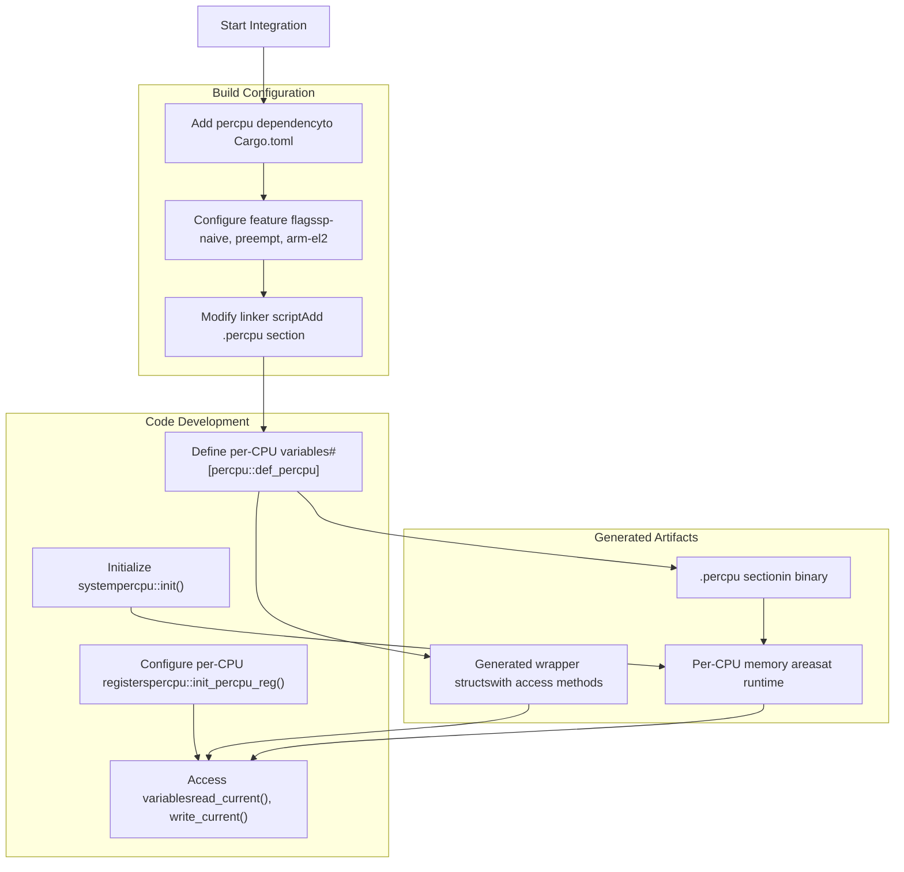
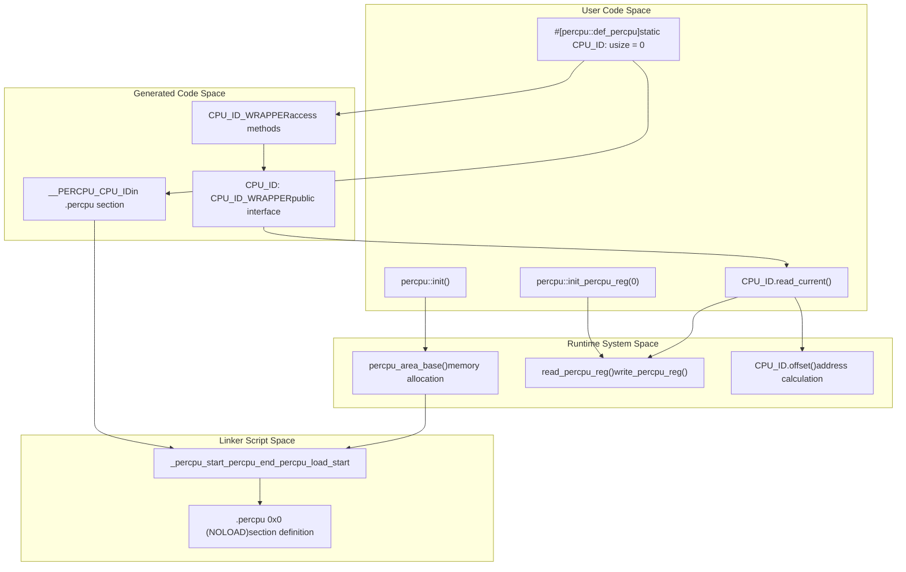

# Getting Started

> **Relevant source files**
> * [README.md](https://github.com/arceos-org/percpu/blob/89c8a54c/README.md)
> * [percpu/test_percpu.x](https://github.com/arceos-org/percpu/blob/89c8a54c/percpu/test_percpu.x)
> * [percpu/tests/test_percpu.rs](https://github.com/arceos-org/percpu/blob/89c8a54c/percpu/tests/test_percpu.rs)

This page provides a step-by-step guide to integrating and using the percpu crate for per-CPU data management in your projects. It covers the essential workflow from dependency setup through basic usage patterns, serving as an entry point for developers new to the percpu system.

For detailed installation instructions and build environment configuration, see [Installation and Setup](/arceos-org/percpu/2.1-installation-and-setup). For comprehensive examples and advanced usage patterns, see [Basic Usage Examples](/arceos-org/percpu/2.2-basic-usage-examples). For information about configuring features for different deployment scenarios, see [Feature Flags Configuration](/arceos-org/percpu/2.3-feature-flags-configuration).

## Integration Workflow Overview

The percpu crate requires coordination between compile-time code generation, linker script configuration, and runtime initialization. The following diagram illustrates the complete integration workflow:



**Sources:** [README.md(L39 - L52)&emsp;](https://github.com/arceos-org/percpu/blob/89c8a54c/README.md#L39-L52) [percpu/tests/test_percpu.rs(L35 - L50)&emsp;](https://github.com/arceos-org/percpu/blob/89c8a54c/percpu/tests/test_percpu.rs#L35-L50)

## Essential Components and Their Relationships

The percpu system consists of several key components that work together to provide efficient per-CPU data access. Understanding these relationships is crucial for proper integration:



**Sources:** [README.md(L40 - L51)&emsp;](https://github.com/arceos-org/percpu/blob/89c8a54c/README.md#L40-L51) [percpu/tests/test_percpu.rs(L7 - L31)&emsp;](https://github.com/arceos-org/percpu/blob/89c8a54c/percpu/tests/test_percpu.rs#L7-L31) [percpu/test_percpu.x(L6 - L14)&emsp;](https://github.com/arceos-org/percpu/blob/89c8a54c/percpu/test_percpu.x#L6-L14)

## Quick Start Example

The following table summarizes the minimal steps required to integrate percpu into a project:

|Step|Action|Code Example|Purpose|
| --- | --- | --- | --- |
|1|Add dependency|percpu = "0.1"in Cargo.toml|Enable percpu macros and runtime|
|2|Configure linker|Add.percpusection to linker script|Reserve memory for per-CPU data|
|3|Define variables|#[percpu::def_percpu] static VAR: Type = init;|Declare per-CPU storage|
|4|Initialize system|percpu::init();|Allocate per-CPU memory areas|
|5|Setup registers|percpu::init_percpu_reg(cpu_id);|Configure architecture registers|
|6|Access data|VAR.read_current(),VAR.write_current(value)|Use per-CPU variables|

Here's a complete minimal example demonstrating the basic workflow:

```rust
// In your source code
#[percpu::def_percpu]
static CPU_COUNTER: usize = 0;

fn main() {
    // Initialize the per-CPU system
    percpu::init();
    
    // Configure per-CPU register for CPU 0
    percpu::init_percpu_reg(0);
    
    // Access per-CPU data
    println!("Initial value: {}", CPU_COUNTER.read_current()); // prints "0"
    CPU_COUNTER.write_current(42);
    println!("Updated value: {}", CPU_COUNTER.read_current()); // prints "42"
}
```

And the corresponding linker script addition:

```css
. = ALIGN(4K);
_percpu_start = .;
_percpu_end = _percpu_start + SIZEOF(.percpu);
.percpu 0x0 (NOLOAD) : AT(_percpu_start) {
    _percpu_load_start = .;
    *(.percpu .percpu.*)
    _percpu_load_end = .;
    . = _percpu_load_start + ALIGN(64) * CPU_NUM;
}
. = _percpu_end;
```

**Sources:** [README.md(L39 - L51)&emsp;](https://github.com/arceos-org/percpu/blob/89c8a54c/README.md#L39-L51) [README.md(L54 - L67)&emsp;](https://github.com/arceos-org/percpu/blob/89c8a54c/README.md#L54-L67) [percpu/test_percpu.x(L1 - L16)&emsp;](https://github.com/arceos-org/percpu/blob/89c8a54c/percpu/test_percpu.x#L1-L16)

## Architecture-Specific Considerations

The percpu system supports multiple architectures with different per-CPU register mechanisms. The following table shows the supported platforms and their register usage:

|Architecture|Per-CPU Register|Usage Notes|
| --- | --- | --- |
|x86_64|GS_BASE|Standard x86_64 per-CPU mechanism|
|AArch64|TPIDR_EL1/TPIDR_EL2|EL1 by default, EL2 witharm-el2feature|
|RISC-V|gp|Global pointer register (non-standard usage)|
|LoongArch|$r21|Architecture-specific register|

The system automatically generates appropriate assembly code for each architecture during macro expansion. No manual architecture-specific code is required in user applications.

**Sources:** [README.md(L19 - L35)&emsp;](https://github.com/arceos-org/percpu/blob/89c8a54c/README.md#L19-L35)

## Feature Configuration Overview

The percpu crate provides several feature flags to adapt to different deployment scenarios:

* **`sp-naive`**: Single-processor mode using global variables instead of per-CPU mechanisms
* **`preempt`**: Preemption-safe mode with automatic guard integration
* **`arm-el2`**: Hypervisor mode support for AArch64 using EL2 registers

Choose features based on your target environment. For single-core systems, use `sp-naive`. For preemptible kernels, enable `preempt`. For ARM hypervisors, add `arm-el2`.

**Sources:** [README.md(L69 - L79)&emsp;](https://github.com/arceos-org/percpu/blob/89c8a54c/README.md#L69-L79)

## Next Steps

After completing the basic integration:

1. **Detailed Setup**: See [Installation and Setup](/arceos-org/percpu/2.1-installation-and-setup) for comprehensive dependency management, build configuration, and linker script integration
2. **Advanced Usage**: See [Basic Usage Examples](/arceos-org/percpu/2.2-basic-usage-examples) for complex data types, remote CPU access, and safety patterns
3. **Feature Configuration**: See [Feature Flags Configuration](/arceos-org/percpu/2.3-feature-flags-configuration) for choosing appropriate features for your deployment scenario
4. **Architecture Details**: See [Cross-Platform Abstraction](/arceos-org/percpu/3.2-cross-platform-abstraction) for understanding platform-specific implementation details
5. **Safety Guidelines**: See [Safety and Preemption](/arceos-org/percpu/4.3-safety-and-preemption) for proper usage patterns and avoiding common pitfalls

**Sources:** [README.md](https://github.com/arceos-org/percpu/blob/89c8a54c/README.md) [percpu/tests/test_percpu.rs](https://github.com/arceos-org/percpu/blob/89c8a54c/percpu/tests/test_percpu.rs)