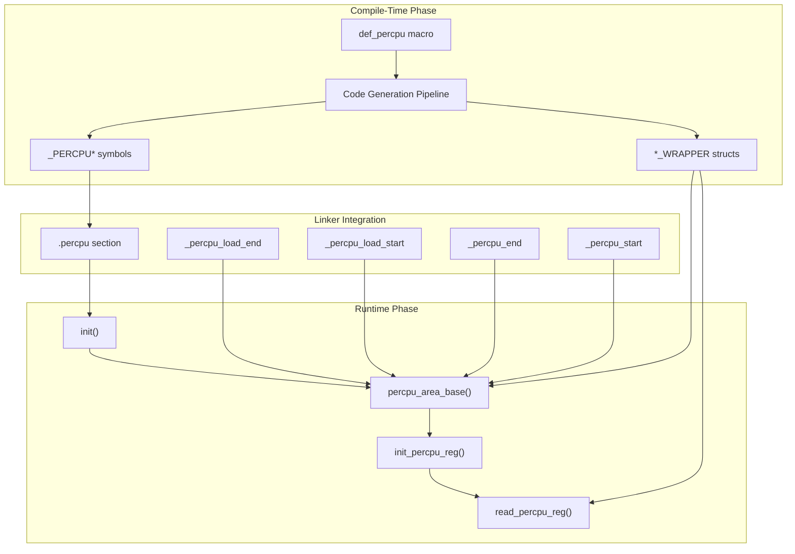
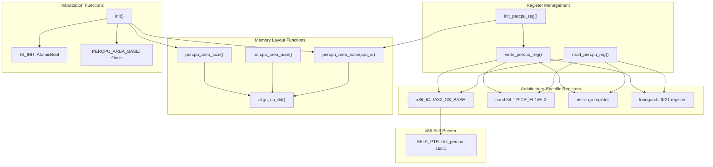
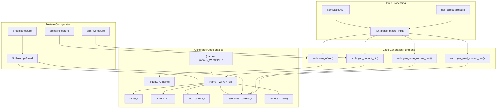
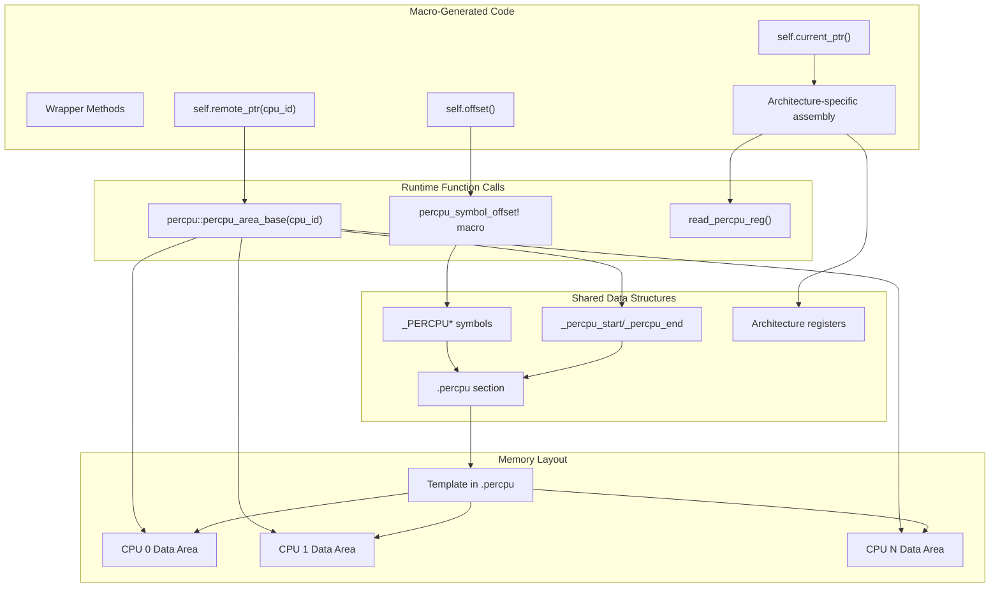

# Implementation Details

> **Relevant source files**
> * [percpu/src/imp.rs](https://github.com/arceos-org/percpu/blob/89c8a54c/percpu/src/imp.rs)
> * [percpu_macros/src/arch.rs](https://github.com/arceos-org/percpu/blob/89c8a54c/percpu_macros/src/arch.rs)
> * [percpu_macros/src/lib.rs](https://github.com/arceos-org/percpu/blob/89c8a54c/percpu_macros/src/lib.rs)

This page provides an overview of the internal implementation details of the percpu crate ecosystem for maintainers and advanced users. It covers the core implementation strategies, key code entities, and how the compile-time macro generation integrates with the runtime per-CPU data management system.

For detailed architecture-specific code generation, see [Architecture-Specific Code Generation](/arceos-org/percpu/5.1-architecture-specific-code-generation). For the simplified single-CPU implementation, see [Naive Implementation](/arceos-org/percpu/5.2-naive-implementation). For low-level memory management specifics, see [Memory Management Internals](/arceos-org/percpu/5.3-memory-management-internals).

## Core Implementation Strategy

The percpu system implements per-CPU data management through a two-phase approach: compile-time code generation via procedural macros and runtime memory area management. The system places all per-CPU variables in a special `.percpu` linker section, then creates per-CPU memory areas by copying this template section for each CPU.

Sources: [percpu_macros/src/lib.rs(L54 - L262)&emsp;](https://github.com/arceos-org/percpu/blob/89c8a54c/percpu_macros/src/lib.rs#L54-L262) [percpu/src/imp.rs(L1 - L179)&emsp;](https://github.com/arceos-org/percpu/blob/89c8a54c/percpu/src/imp.rs#L1-L179)

## Runtime Implementation Architecture

The runtime implementation in `imp.rs` manages per-CPU memory areas and provides architecture-specific register access. The core functions handle initialization, memory layout calculation, and register manipulation across different CPU architectures.

Sources: [percpu/src/imp.rs(L3 - L179)&emsp;](https://github.com/arceos-org/percpu/blob/89c8a54c/percpu/src/imp.rs#L3-L179)

## Compile-Time Code Generation Architecture

The macro system in `percpu_macros` transforms user-defined per-CPU variables into architecture-optimized access code. The `def_percpu` macro generates wrapper structs with methods for safe and unsafe access patterns.

Sources: [percpu_macros/src/lib.rs(L66 - L252)&emsp;](https://github.com/arceos-org/percpu/blob/89c8a54c/percpu_macros/src/lib.rs#L66-L252) [percpu_macros/src/arch.rs(L1 - L264)&emsp;](https://github.com/arceos-org/percpu/blob/89c8a54c/percpu_macros/src/arch.rs#L1-L264)

## Architecture-Specific Code Generation

The system generates different assembly code for each supported architecture to access per-CPU data efficiently. Each architecture uses different registers and instruction sequences for optimal performance.

|Architecture|Register|Offset Calculation|Access Pattern|
| --- | --- | --- | --- |
|x86_64|GS_BASE(IA32_GS_BASE)|offset symbol|mov gs:[offset VAR]|
|AArch64|TPIDR_EL1/TPIDR_EL2|#:abs_g0_nc:symbol|mrs TPIDR_ELx+ offset|
|RISC-V|gpregister|%hi(symbol)+%lo(symbol)|lui+addi+gp|
|LoongArch|$r21register|%abs_hi20+%abs_lo12|lu12i.w+ori+$r21|

```mermaid
flowchart TD
subgraph subGraph5["LoongArch Assembly"]
    LOONG_OFFSET["lu12i.w %abs_hi20 + ori %abs_lo12"]
    LOONG_R21_READ["move {}, $r21"]
    LOONG_R21_WRITE["move $r21, {}"]
    LOONG_LOAD_STORE["ldx./stx.with $r21"]
end
subgraph subGraph4["RISC-V Assembly"]
    RISCV_OFFSET["lui %hi + addi %lo"]
    RISCV_GP_READ["mv {}, gp"]
    RISCV_GP_WRITE["mv gp, {}"]
    RISCV_LOAD_STORE["ld/sd with gp offset"]
end
subgraph subGraph3["AArch64 Assembly"]
    ARM_OFFSET["movz #:abs_g0_nc:{VAR}"]
    ARM_TPIDR_READ["mrs TPIDR_EL1/EL2"]
    ARM_TPIDR_WRITE["msr TPIDR_EL1/EL2"]
end
subgraph subGraph2["x86_64 Assembly"]
    X86_OFFSET["mov {0:e}, offset {VAR}"]
    X86_READ["mov gs:[offset {VAR}]"]
    X86_WRITE["mov gs:[offset {VAR}], value"]
    X86_GS_BASE["IA32_GS_BASE MSR"]
end
subgraph subGraph1["Code Generation Functions"]
    GEN_OFFSET_IMPL["gen_offset()"]
    GEN_CURRENT_PTR_IMPL["gen_current_ptr()"]
    GEN_READ_IMPL["gen_read_current_raw()"]
    GEN_WRITE_IMPL["gen_write_current_raw()"]
end
subgraph subGraph0["Architecture Detection"]
    TARGET_ARCH["cfg!(target_arch)"]
    X86_64["x86_64"]
    AARCH64["aarch64"]
    RISCV["riscv32/riscv64"]
    LOONGARCH["loongarch64"]
end

AARCH64 --> GEN_OFFSET_IMPL
GEN_CURRENT_PTR_IMPL --> ARM_TPIDR_READ
GEN_CURRENT_PTR_IMPL --> LOONG_R21_READ
GEN_CURRENT_PTR_IMPL --> RISCV_GP_READ
GEN_OFFSET_IMPL --> ARM_OFFSET
GEN_OFFSET_IMPL --> LOONG_OFFSET
GEN_OFFSET_IMPL --> RISCV_OFFSET
GEN_OFFSET_IMPL --> X86_OFFSET
GEN_READ_IMPL --> LOONG_LOAD_STORE
GEN_READ_IMPL --> RISCV_LOAD_STORE
GEN_READ_IMPL --> X86_READ
GEN_WRITE_IMPL --> LOONG_LOAD_STORE
GEN_WRITE_IMPL --> RISCV_LOAD_STORE
GEN_WRITE_IMPL --> X86_WRITE
LOONGARCH --> GEN_OFFSET_IMPL
RISCV --> GEN_OFFSET_IMPL
TARGET_ARCH --> AARCH64
TARGET_ARCH --> LOONGARCH
TARGET_ARCH --> RISCV
TARGET_ARCH --> X86_64
```

Sources: [percpu_macros/src/arch.rs(L15 - L264)&emsp;](https://github.com/arceos-org/percpu/blob/89c8a54c/percpu_macros/src/arch.rs#L15-L264)

## Integration Between Runtime and Macros

The compile-time macros and runtime functions work together through shared conventions and generated code that calls runtime functions. The macros generate code that uses runtime functions for memory calculations and remote access.

Sources: [percpu_macros/src/lib.rs(L216 - L221)&emsp;](https://github.com/arceos-org/percpu/blob/89c8a54c/percpu_macros/src/lib.rs#L216-L221) [percpu/src/imp.rs(L32 - L44)&emsp;](https://github.com/arceos-org/percpu/blob/89c8a54c/percpu/src/imp.rs#L32-L44) [percpu_macros/src/lib.rs(L255 - L261)&emsp;](https://github.com/arceos-org/percpu/blob/89c8a54c/percpu_macros/src/lib.rs#L255-L261)