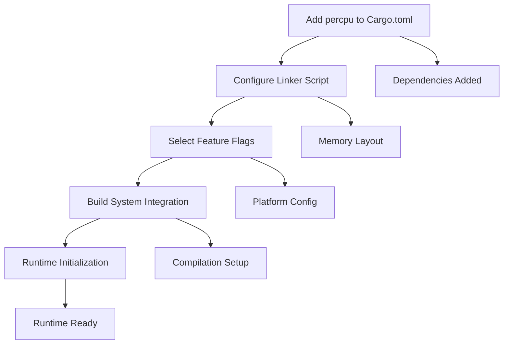
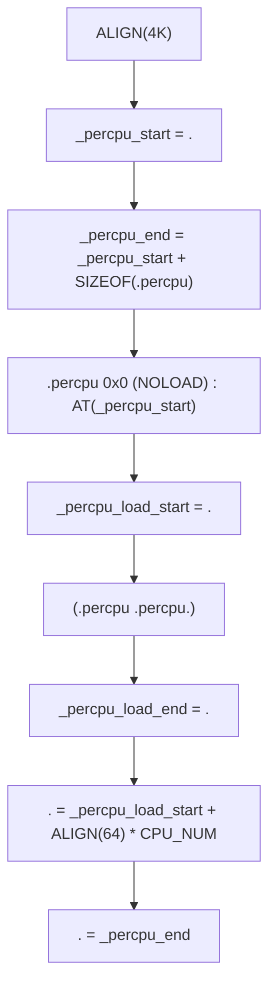
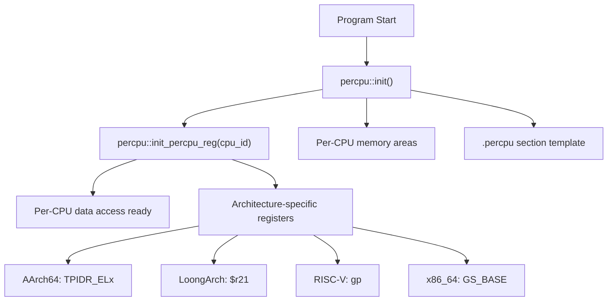

# Installation and Setup

> **Relevant source files**
> * [README.md](https://github.com/arceos-org/percpu/blob/89c8a54c/README.md)
> * [percpu/build.rs](https://github.com/arceos-org/percpu/blob/89c8a54c/percpu/build.rs)
> * [percpu/test_percpu.x](https://github.com/arceos-org/percpu/blob/89c8a54c/percpu/test_percpu.x)

This document covers the installation and configuration requirements for integrating the percpu crate into your project. It focuses on dependency management, linker script configuration, and build system setup. For detailed usage examples, see [Basic Usage Examples](/arceos-org/percpu/2.2-basic-usage-examples). For feature flag details, see [Feature Flags Configuration](/arceos-org/percpu/2.3-feature-flags-configuration). For understanding the underlying architecture, see [Memory Layout and Initialization](/arceos-org/percpu/3.1-memory-layout-and-initialization).

## Overview of Setup Requirements

The percpu crate requires several configuration steps beyond typical Rust dependency management due to its low-level nature and custom memory layout requirements.



**Setup Flow**: Each step depends on the previous ones being completed correctly

Sources: [README.md(L1 - L80)&emsp;](https://github.com/arceos-org/percpu/blob/89c8a54c/README.md#L1-L80)

## Adding Dependencies

Add the percpu crate to your `Cargo.toml` dependencies section:

```markdown
[dependencies]
percpu = "0.1"
percpu_macros = "0.1"  # Optional: only if using macros directly
```

The core `percpu` crate provides runtime functionality, while `percpu_macros` contains the procedural macros (automatically included by the main crate).

|Crate|Purpose|Required|
| --- | --- | --- |
|percpu|Runtime implementation, initialization functions|Yes|
|percpu_macros|def_percpumacro implementation|Included automatically|

Sources: [README.md(L3 - L4)&emsp;](https://github.com/arceos-org/percpu/blob/89c8a54c/README.md#L3-L4)

## Linker Script Configuration

The percpu crate requires manual linker script modification to create the `.percpu` section. This is a **mandatory step** that cannot be automated.

### Required Linker Script Sections

Add these sections to your linker script before the end of your existing sections:



**Linker Script Memory Layout**: The `.percpu` section layout with required symbols

The complete linker script addition from [percpu/test_percpu.x(L3 - L16)&emsp;](https://github.com/arceos-org/percpu/blob/89c8a54c/percpu/test_percpu.x#L3-L16):

* **`_percpu_start`**: Marks the beginning of the per-CPU template area
* **`_percpu_end`**: Marks the end of all per-CPU areas
* **`_percpu_load_start`** / **`_percpu_load_end`**: Template data boundaries
* **`CPU_NUM`**: Must be defined as the maximum number of CPUs
* **`ALIGN(64)`**: Ensures proper cache line alignment for each CPU area

### Example Integration

For a complete example, see the test linker script structure in [percpu/test_percpu.x(L1 - L17)&emsp;](https://github.com/arceos-org/percpu/blob/89c8a54c/percpu/test_percpu.x#L1-L17):

```sql
CPU_NUM = 4;

SECTIONS {
    /* Your existing sections */
    
    . = ALIGN(4K);
    _percpu_start = .;
    _percpu_end = _percpu_start + SIZEOF(.percpu);
    .percpu 0x0 (NOLOAD) : AT(_percpu_start) {
        _percpu_load_start = .;
        *(.percpu .percpu.*)
        _percpu_load_end = .;
        . = _percpu_load_start + ALIGN(64) * CPU_NUM;
    }
    . = _percpu_end;
}
INSERT AFTER .bss;
```

Sources: [README.md(L54 - L67)&emsp;](https://github.com/arceos-org/percpu/blob/89c8a54c/README.md#L54-L67) [percpu/test_percpu.x(L1 - L17)&emsp;](https://github.com/arceos-org/percpu/blob/89c8a54c/percpu/test_percpu.x#L1-L17)

## Feature Flags Configuration

Configure feature flags in `Cargo.toml` based on your target environment:

|Feature|Use Case|Effect|
| --- | --- | --- |
|sp-naive|Single-core systems|Uses global variables instead of per-CPU registers|
|preempt|Preemptible kernels|Integrates withkernel_guardfor atomic operations|
|arm-el2|ARM hypervisors|UsesTPIDR_EL2instead ofTPIDR_EL1|

### Feature Selection Matrix

```

```

**Feature Selection Logic**: Choose features based on your runtime environment

### Example Configurations

```markdown
# Single-core embedded system
[dependencies]
percpu = { version = "0.1", features = ["sp-naive"] }

# Multi-core preemptible kernel
[dependencies]
percpu = { version = "0.1", features = ["preempt"] }

# ARM hypervisor at EL2
[dependencies]
percpu = { version = "0.1", features = ["arm-el2"] }

# ARM hypervisor with preemption
[dependencies]
percpu = { version = "0.1", features = ["preempt", "arm-el2"] }
```

Sources: [README.md(L69 - L79)&emsp;](https://github.com/arceos-org/percpu/blob/89c8a54c/README.md#L69-L79)

## Build System Integration

### Conditional Build Configuration

The build system may require additional configuration for certain targets. The [percpu/build.rs(L1 - L9)&emsp;](https://github.com/arceos-org/percpu/blob/89c8a54c/percpu/build.rs#L1-L9) shows platform-specific build requirements:

```

```

**Build Configuration Logic**: Platform-specific build steps for Linux targets

### Required Build Steps

For Linux targets without `sp-naive` feature:

* **`-no-pie`**: Disables position-independent executable
* **`-T{script}`**: Specifies custom linker script path

The build system automatically handles:

* Linker script path resolution
* Test-specific linker arguments
* Feature flag conditional compilation

Sources: [percpu/build.rs(L1 - L9)&emsp;](https://github.com/arceos-org/percpu/blob/89c8a54c/percpu/build.rs#L1-L9)

## Runtime Initialization

After build configuration, initialize the percpu system at runtime:



**Initialization Sequence**: Runtime setup steps for per-CPU data access

### Initialization Functions

|Function|Purpose|When to Call|
| --- | --- | --- |
|percpu::init()|Allocate and initialize per-CPU areas|Once during system startup|
|percpu::init_percpu_reg(cpu_id)|Configure per-CPU register|Once per CPU during CPU initialization|

### Basic Initialization Example

```css
// System initialization
percpu::init();

// Per-CPU initialization (call for each CPU)
for cpu_id in 0..num_cpus {
    // Switch to CPU context, then:
    percpu::init_percpu_reg(cpu_id);
}
```

Sources: [README.md(L43 - L46)&emsp;](https://github.com/arceos-org/percpu/blob/89c8a54c/README.md#L43-L46)

## Verification

Verify your setup by testing basic per-CPU variable access:

```
#[percpu::def_percpu]
static TEST_VAR: usize = 42;

// After initialization
assert_eq!(TEST_VAR.read_current(), 42);
TEST_VAR.write_current(100);
assert_eq!(TEST_VAR.read_current(), 100);
```

### Common Setup Issues

|Issue|Symptom|Solution|
| --- | --- | --- |
|Missing linker script|Link errors about.percpusection|Add required linker script sections|
|Wrong feature flags|Runtime panics or incorrect behavior|Review target environment and feature selection|
|Missing initialization|Segmentation faults on access|Callpercpu::init()before any per-CPU access|
|Register not set|Wrong CPU data accessed|Callpercpu::init_percpu_reg()for each CPU|

Sources: [README.md(L39 - L52)&emsp;](https://github.com/arceos-org/percpu/blob/89c8a54c/README.md#L39-L52)