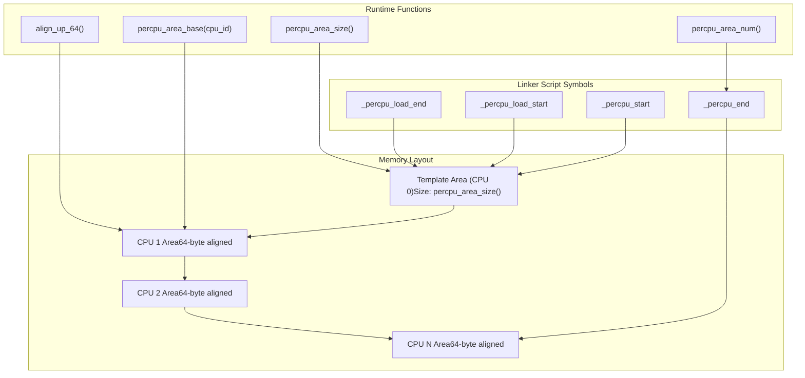
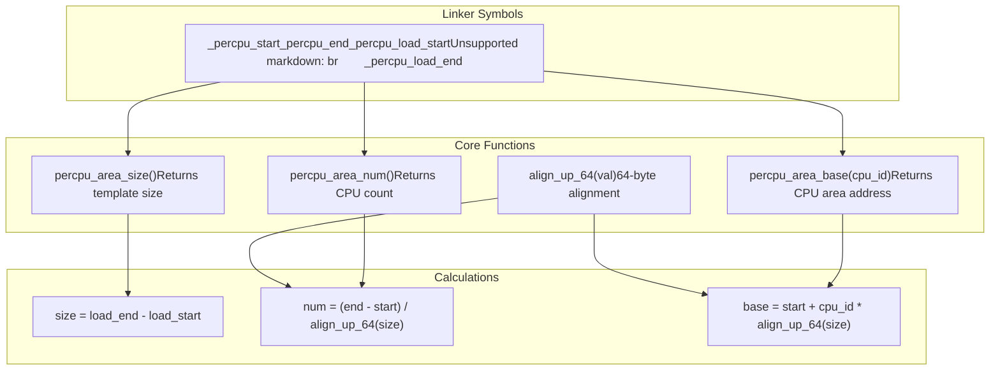
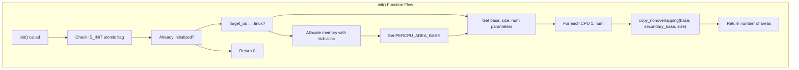
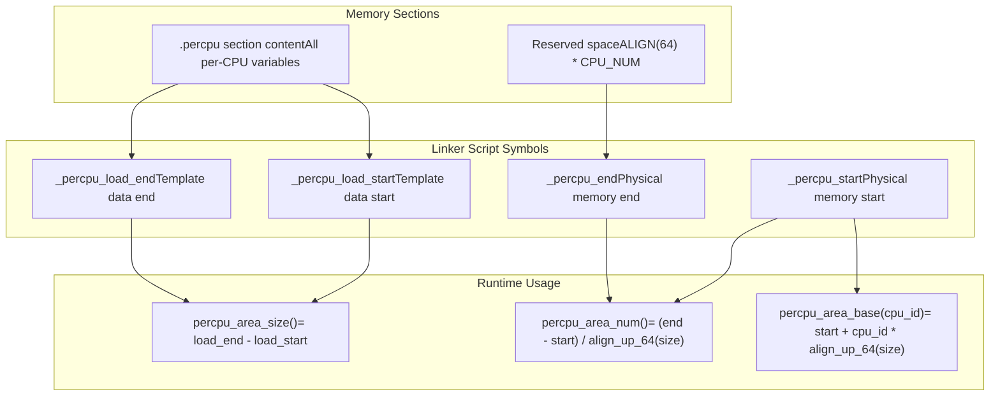
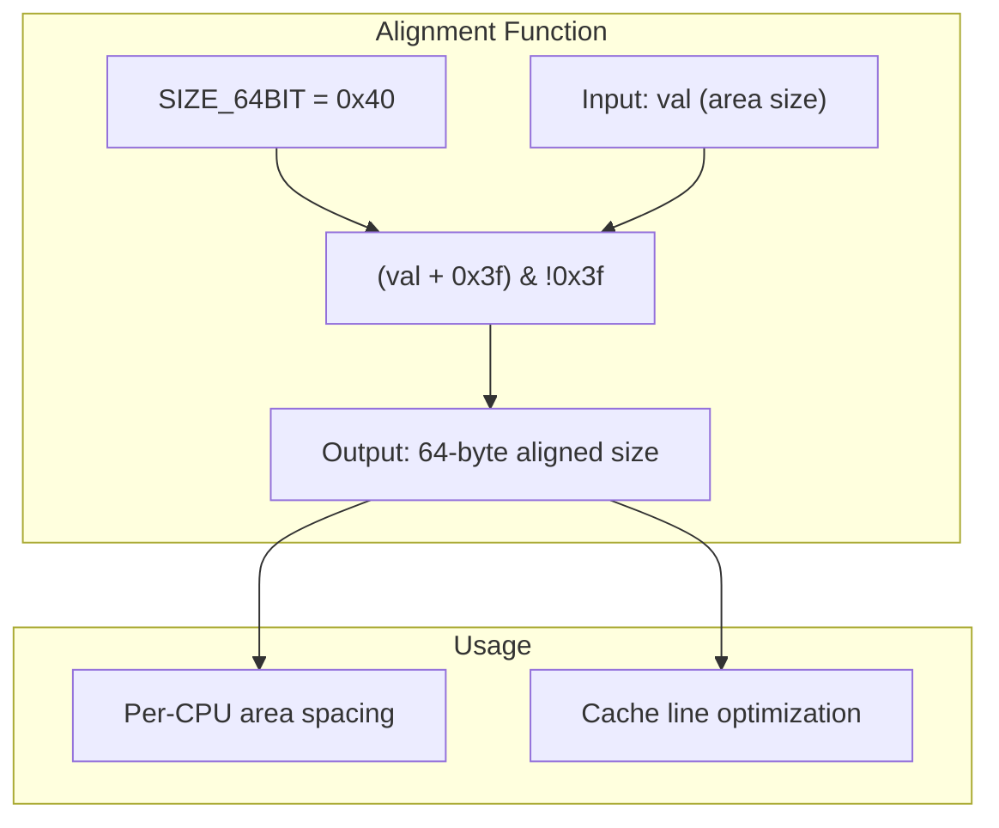

# Memory Layout and Initialization

> **Relevant source files**
> * [README.md](https://github.com/arceos-org/percpu/blob/89c8a54c/README.md)
> * [percpu/src/imp.rs](https://github.com/arceos-org/percpu/blob/89c8a54c/percpu/src/imp.rs)
> * [percpu/test_percpu.x](https://github.com/arceos-org/percpu/blob/89c8a54c/percpu/test_percpu.x)

This document explains the per-CPU memory layout structure, initialization process, and linker script integration in the percpu crate. It covers how per-CPU data areas are organized in memory, the template-based initialization process, and the relationship between linker script symbols and runtime address calculations.

For architecture-specific register management details, see [Cross-Platform Abstraction](/arceos-org/percpu/3.2-cross-platform-abstraction). For low-level memory management internals, see [Memory Management Internals](/arceos-org/percpu/5.3-memory-management-internals).

## Memory Layout Structure

The percpu system organizes per-CPU data using a template-based approach where all per-CPU variables are first collected into a single template area, then replicated for each CPU with proper alignment.

### Per-CPU Area Organization



The memory layout uses several key components:

|Component|Purpose|Implementation|
| --- | --- | --- |
|Template Area|Contains initial values for all per-CPU variables|Defined by.percpusection content|
|Per-CPU Areas|Individual copies for each CPU|Created byinit()function|
|64-byte Alignment|Cache line optimization|align_up_64()function|
|Address Calculation|Runtime pointer arithmetic|percpu_area_base()function|

Sources: [percpu/src/imp.rs(L5 - L44)&emsp;](https://github.com/arceos-org/percpu/blob/89c8a54c/percpu/src/imp.rs#L5-L44) [percpu/test_percpu.x(L1 - L17)&emsp;](https://github.com/arceos-org/percpu/blob/89c8a54c/percpu/test_percpu.x#L1-L17) [README.md(L54 - L67)&emsp;](https://github.com/arceos-org/percpu/blob/89c8a54c/README.md#L54-L67)

### Address Calculation Functions

The system provides several functions for calculating memory layout parameters:



Sources: [percpu/src/imp.rs(L20 - L44)&emsp;](https://github.com/arceos-org/percpu/blob/89c8a54c/percpu/src/imp.rs#L20-L44)

## Initialization Process

The initialization process occurs in two phases: global area setup via `init()` and per-CPU register configuration via `init_percpu_reg()`.

### Global Initialization Flow



The `init()` function performs these key operations:

1. **Initialization Guard**: Uses `IS_INIT` atomic boolean to prevent multiple initialization [percpu/src/imp.rs(L58 - L63)&emsp;](https://github.com/arceos-org/percpu/blob/89c8a54c/percpu/src/imp.rs#L58-L63)
2. **Platform-Specific Allocation**: On Linux, allocates memory dynamically; on bare metal, uses linker-provided memory [percpu/src/imp.rs(L65 - L71)&emsp;](https://github.com/arceos-org/percpu/blob/89c8a54c/percpu/src/imp.rs#L65-L71)
3. **Template Replication**: Copies CPU 0's template data to all other CPU areas [percpu/src/imp.rs(L76 - L84)&emsp;](https://github.com/arceos-org/percpu/blob/89c8a54c/percpu/src/imp.rs#L76-L84)

Sources: [percpu/src/imp.rs(L46 - L86)&emsp;](https://github.com/arceos-org/percpu/blob/89c8a54c/percpu/src/imp.rs#L46-L86)

### Per-CPU Register Initialization

```mermaid
flowchart TD
subgraph subGraph1["Architecture-Specific Registers"]
    X86_REG["x86_64: GS_BASE via MSR or syscall"]
    ARM_REG["aarch64: TPIDR_EL1/EL2 via msr"]
    RISCV_REG["riscv: gp register via mv"]
    LOONG_REG["loongarch64: $r21 via move"]
end
subgraph init_percpu_reg(cpu_id)["init_percpu_reg(cpu_id)"]
    CALC_BASE["percpu_area_base(cpu_id)"]
    WRITE_REG["write_percpu_reg(tp)"]
end

CALC_BASE --> WRITE_REG
WRITE_REG --> ARM_REG
WRITE_REG --> LOONG_REG
WRITE_REG --> RISCV_REG
WRITE_REG --> X86_REG
```

The `init_percpu_reg()` function configures the architecture-specific register to point to the appropriate per-CPU area base address.

Sources: [percpu/src/imp.rs(L158 - L168)&emsp;](https://github.com/arceos-org/percpu/blob/89c8a54c/percpu/src/imp.rs#L158-L168) [percpu/src/imp.rs(L119 - L156)&emsp;](https://github.com/arceos-org/percpu/blob/89c8a54c/percpu/src/imp.rs#L119-L156)

## Linker Script Integration

The percpu system requires specific linker script modifications to reserve memory for per-CPU areas and define necessary symbols.

### Required Linker Script Structure

The linker script must define a `.percpu` section with specific symbols and layout:

```css
. = ALIGN(4K);
_percpu_start = .;
_percpu_end = _percpu_start + SIZEOF(.percpu);
.percpu 0x0 (NOLOAD) : AT(_percpu_start) {
    _percpu_load_start = .;
    *(.percpu .percpu.*)
    _percpu_load_end = .;
    . = _percpu_load_start + ALIGN(64) * CPU_NUM;
}
. = _percpu_end;
```

### Symbol Relationships



Key linker script requirements:

|Symbol|Purpose|Usage in Runtime|
| --- | --- | --- |
|_percpu_start|Base address of all per-CPU areas|percpu_area_base()calculations|
|_percpu_end|End of reserved per-CPU memory|Area count calculations|
|_percpu_load_start|Start of template data|Template size calculations|
|_percpu_load_end|End of template data|Template size calculations|

Sources: [percpu/test_percpu.x(L1 - L17)&emsp;](https://github.com/arceos-org/percpu/blob/89c8a54c/percpu/test_percpu.x#L1-L17) [README.md(L54 - L67)&emsp;](https://github.com/arceos-org/percpu/blob/89c8a54c/README.md#L54-L67) [percpu/src/imp.rs(L13 - L18)&emsp;](https://github.com/arceos-org/percpu/blob/89c8a54c/percpu/src/imp.rs#L13-L18)

## Platform-Specific Considerations

The initialization process varies based on the target platform:

### Bare Metal (target_os = "none")

* Uses linker-provided memory directly via `_percpu_start` symbol
* Memory layout is fixed at compile time
* No dynamic allocation required

### Linux Userspace (target_os = "linux")

* Dynamically allocates memory using `std::alloc::alloc()`
* Stores base address in `PERCPU_AREA_BASE` static variable
* Uses `Once` synchronization for thread-safe initialization

### Memory Alignment Strategy

The system uses 64-byte alignment for performance optimization:



The `align_up_64()` function ensures each per-CPU area starts on a 64-byte boundary to optimize cache performance and prevent false sharing between CPUs.

Sources: [percpu/src/imp.rs(L5 - L8)&emsp;](https://github.com/arceos-org/percpu/blob/89c8a54c/percpu/src/imp.rs#L5-L8) [percpu/src/imp.rs(L36 - L44)&emsp;](https://github.com/arceos-org/percpu/blob/89c8a54c/percpu/src/imp.rs#L36-L44) [percpu/src/imp.rs(L65 - L71)&emsp;](https://github.com/arceos-org/percpu/blob/89c8a54c/percpu/src/imp.rs#L65-L71)