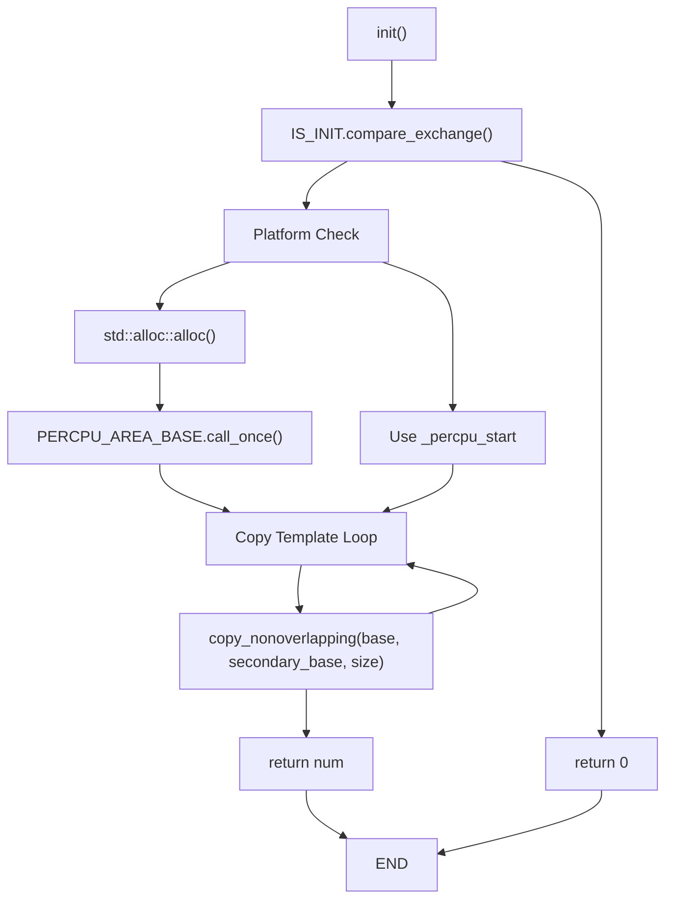
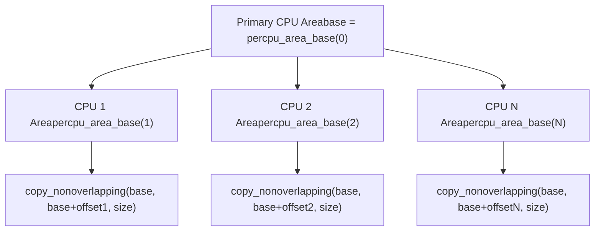
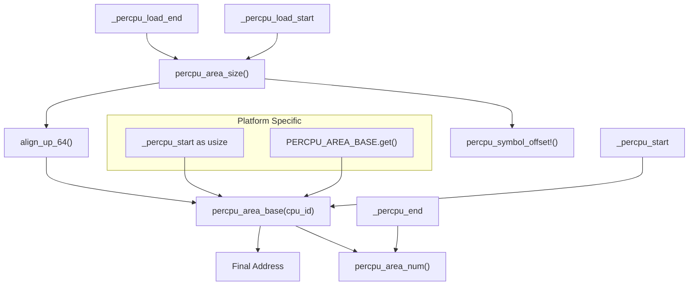
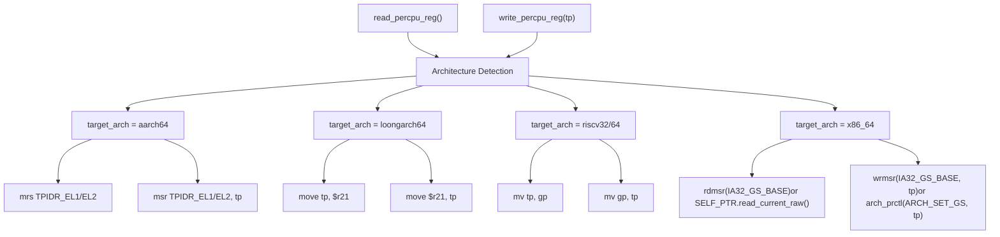
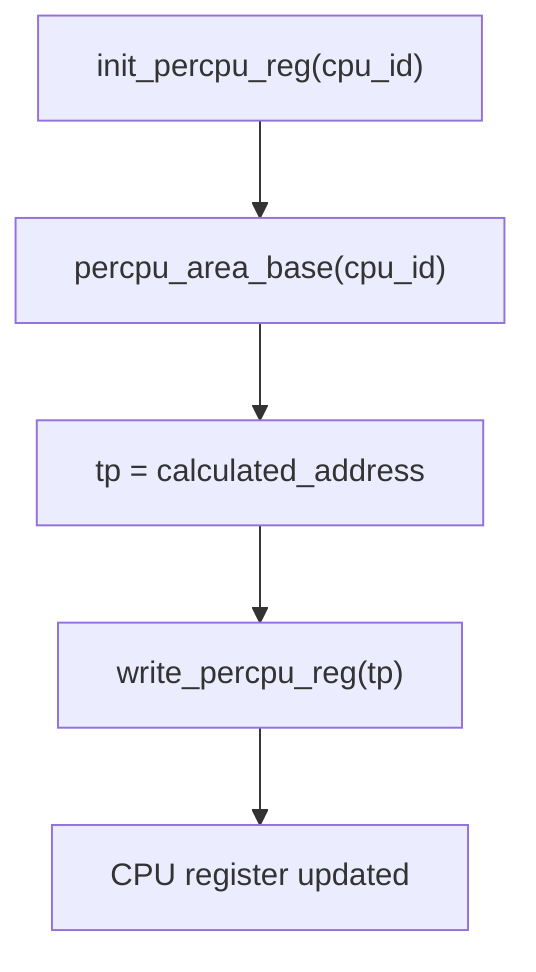
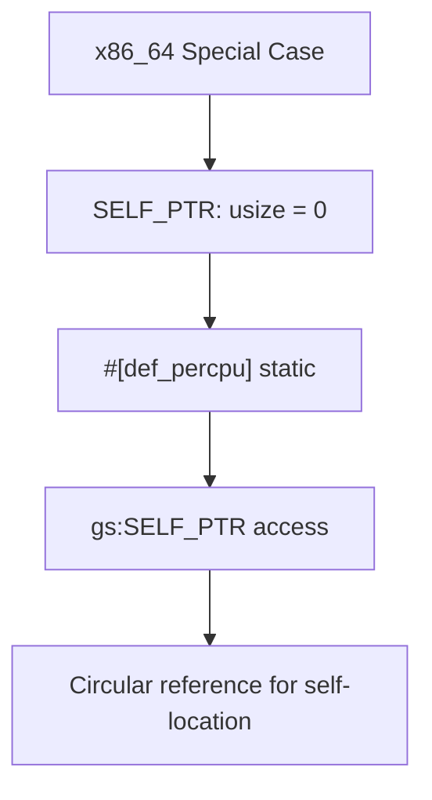
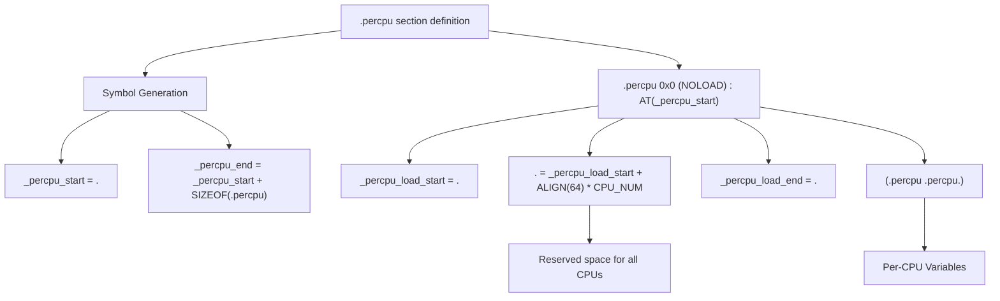
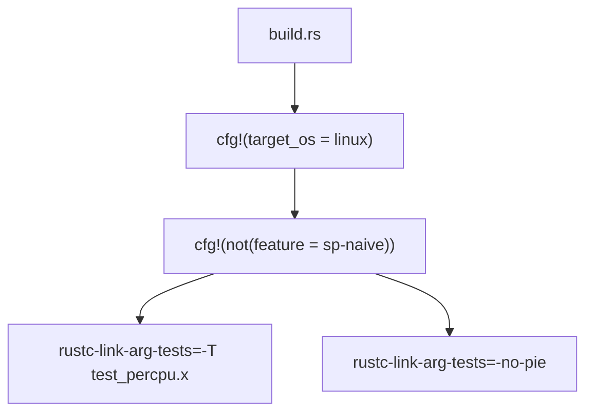

# Memory Management Internals

> **Relevant source files**
> * [percpu/build.rs](https://github.com/arceos-org/percpu/blob/89c8a54c/percpu/build.rs)
> * [percpu/src/imp.rs](https://github.com/arceos-org/percpu/blob/89c8a54c/percpu/src/imp.rs)
> * [percpu/test_percpu.x](https://github.com/arceos-org/percpu/blob/89c8a54c/percpu/test_percpu.x)

This document covers the low-level memory management implementation within the percpu crate, focusing on per-CPU data area allocation, address calculation, and register management. This section details the internal mechanisms that support the per-CPU data abstraction layer.

For high-level memory layout concepts, see [Architecture and Design](/arceos-org/percpu/3-architecture-and-design). For architecture-specific code generation details, see [Architecture-Specific Code Generation](/arceos-org/percpu/5.1-architecture-specific-code-generation). For the single-CPU fallback implementation, see [Naive Implementation](/arceos-org/percpu/5.2-naive-implementation).

## Memory Area Lifecycle

The per-CPU memory management system follows a well-defined lifecycle from initialization through runtime access. The process begins with linker script integration and proceeds through dynamic allocation and template copying.

### Initialization Process

The initialization process is controlled by the `init()` function which ensures single initialization and handles platform-specific memory allocation:

**Memory Area Initialization Sequence**
Sources: [percpu/src/imp.rs(L56 - L86)&emsp;](https://github.com/arceos-org/percpu/blob/89c8a54c/percpu/src/imp.rs#L56-L86)

The `IS_INIT` atomic boolean prevents re-initialization using compare-and-swap semantics. On Linux platforms, the system dynamically allocates memory since the `.percpu` section is not loaded in ELF files. On bare metal (`target_os = "none"`), the linker-defined symbols provide the memory area directly.

### Template Copying Mechanism

Per-CPU areas are initialized by copying from a primary template area to secondary CPU areas:

**Template to Per-CPU Area Copying**
Sources: [percpu/src/imp.rs(L76 - L84)&emsp;](https://github.com/arceos-org/percpu/blob/89c8a54c/percpu/src/imp.rs#L76-L84)

## Address Calculation and Layout

The memory layout uses 64-byte aligned areas calculated through several key functions that work together to provide consistent addressing across different platforms.

### Address Calculation Functions

**Address Calculation Dependencies**
Sources: [percpu/src/imp.rs(L21 - L44)&emsp;](https://github.com/arceos-org/percpu/blob/89c8a54c/percpu/src/imp.rs#L21-L44)

The `align_up_64()` function ensures all per-CPU areas are aligned to 64-byte boundaries for cache line optimization:

|Function|Purpose|Return Value|
| --- | --- | --- |
|percpu_area_size()|Template area size|Size in bytes from linker symbols|
|percpu_area_num()|Number of CPU areas|Total section size / aligned area size|
|percpu_area_base(cpu_id)|CPU-specific base address|Base + (cpu_id * aligned_size)|
|align_up_64(val)|64-byte alignment|(val + 63) & !63|

Sources: [percpu/src/imp.rs(L5 - L8)&emsp;](https://github.com/arceos-org/percpu/blob/89c8a54c/percpu/src/imp.rs#L5-L8) [percpu/src/imp.rs(L25 - L30)&emsp;](https://github.com/arceos-org/percpu/blob/89c8a54c/percpu/src/imp.rs#L25-L30) [percpu/src/imp.rs(L32 - L44)&emsp;](https://github.com/arceos-org/percpu/blob/89c8a54c/percpu/src/imp.rs#L32-L44) [percpu/src/imp.rs(L20 - L23)&emsp;](https://github.com/arceos-org/percpu/blob/89c8a54c/percpu/src/imp.rs#L20-L23)

## Register Management Internals

Each CPU architecture uses a dedicated register to hold the per-CPU data base address. The register management system provides unified access across different instruction sets.

### Architecture-Specific Register Access

**Per-CPU Register Access by Architecture**
Sources: [percpu/src/imp.rs(L88 - L117)&emsp;](https://github.com/arceos-org/percpu/blob/89c8a54c/percpu/src/imp.rs#L88-L117) [percpu/src/imp.rs(L119 - L156)&emsp;](https://github.com/arceos-org/percpu/blob/89c8a54c/percpu/src/imp.rs#L119-L156)

### Register Initialization Process

The `init_percpu_reg(cpu_id)` function combines address calculation with register writing:

**Register Initialization Flow**
Sources: [percpu/src/imp.rs(L158 - L168)&emsp;](https://github.com/arceos-org/percpu/blob/89c8a54c/percpu/src/imp.rs#L158-L168)

The x86_64 architecture requires special handling with the `SELF_PTR` variable that stores the per-CPU base address within the per-CPU area itself:

**x86_64 Self-Pointer Mechanism**
Sources: [percpu/src/imp.rs(L174 - L178)&emsp;](https://github.com/arceos-org/percpu/blob/89c8a54c/percpu/src/imp.rs#L174-L178)

## Linker Integration Details

The linker script integration creates the necessary memory layout for per-CPU data areas through carefully designed section definitions.

### Linker Script Structure

**Linker Script Memory Layout**
Sources: [percpu/test_percpu.x(L1 - L16)&emsp;](https://github.com/arceos-org/percpu/blob/89c8a54c/percpu/test_percpu.x#L1-L16)

|Symbol|Purpose|Usage|
| --- | --- | --- |
|_percpu_start|Section start address|Base address calculation|
|_percpu_end|Section end address|Total size calculation|
|_percpu_load_start|Template start|Size calculation for copying|
|_percpu_load_end|Template end|Size calculation for copying|

The `NOLOAD` directive ensures the section occupies space but isn't loaded from the ELF file, while `AT(_percpu_start)` specifies the load address for the template data.

### Build System Integration

The build system conditionally applies linker scripts based on target platform:

**Build System Linker Integration**
Sources: [percpu/build.rs(L3 - L9)&emsp;](https://github.com/arceos-org/percpu/blob/89c8a54c/percpu/build.rs#L3-L9)

## Platform-Specific Considerations

Different target platforms require distinct memory management strategies due to varying levels of hardware access and memory management capabilities.

### Platform Memory Allocation Matrix

|Platform|Allocation Method|Base Address Source|Register Access|
| --- | --- | --- | --- |
|Linux userspace|std::alloc::alloc()|PERCPU_AREA_BASE|arch_prctl()syscall|
|Bare metal|Linker symbols|_percpu_start|Direct MSR/register|
|Kernel/Hypervisor|Linker symbols|_percpu_start|Privileged instructions|

The `PERCPU_AREA_BASE` is a `spin::once::Once<usize>` that ensures thread-safe initialization of the dynamically allocated base address on platforms where the linker section is not available.

### Error Handling and Validation

The system includes several validation mechanisms:

* Atomic initialization checking with `IS_INIT`
* Address range validation on bare metal platforms
* Alignment verification through `align_up_64()`
* Platform capability detection through conditional compilation

Sources: [percpu/src/imp.rs(L1 - L179)&emsp;](https://github.com/arceos-org/percpu/blob/89c8a54c/percpu/src/imp.rs#L1-L179) [percpu/test_percpu.x(L1 - L16)&emsp;](https://github.com/arceos-org/percpu/blob/89c8a54c/percpu/test_percpu.x#L1-L16) [percpu/build.rs(L1 - L9)&emsp;](https://github.com/arceos-org/percpu/blob/89c8a54c/percpu/build.rs#L1-L9)