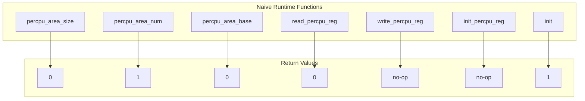
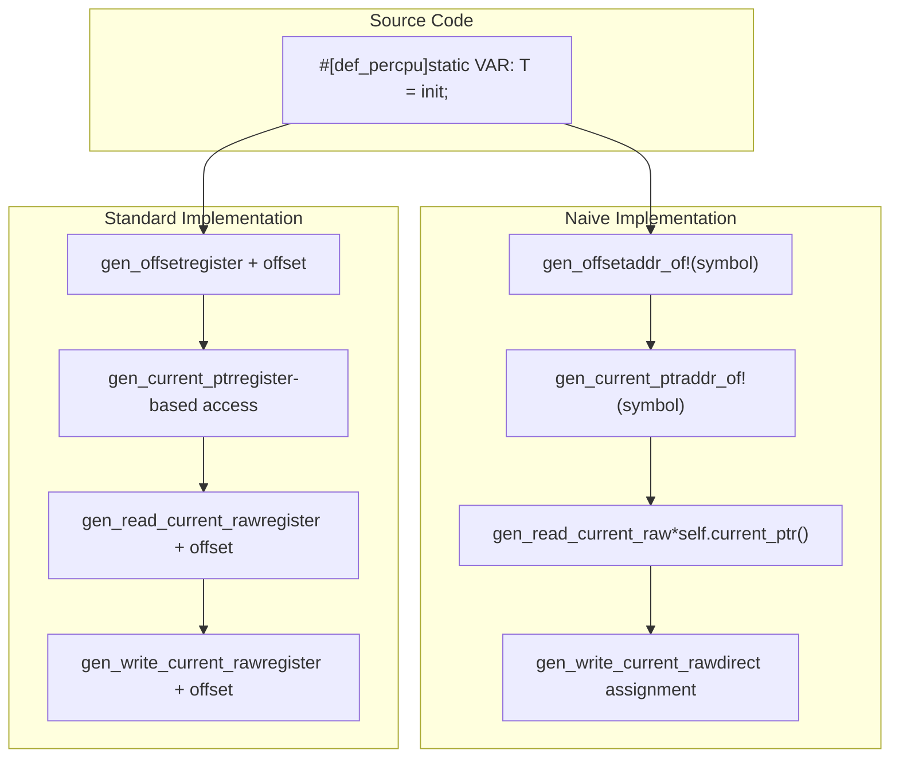
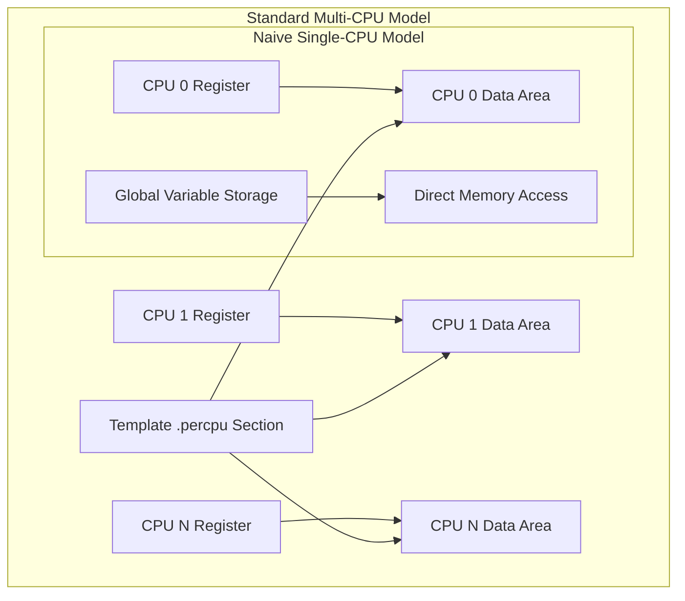

# Naive Implementation

> **Relevant source files**
> * [README.md](https://github.com/arceos-org/percpu/blob/89c8a54c/README.md)
> * [percpu/src/naive.rs](https://github.com/arceos-org/percpu/blob/89c8a54c/percpu/src/naive.rs)
> * [percpu_macros/src/naive.rs](https://github.com/arceos-org/percpu/blob/89c8a54c/percpu_macros/src/naive.rs)

## Purpose and Scope

This document covers the `sp-naive` feature implementation of the percpu crate, which provides a simplified fallback for single-CPU systems. This implementation treats all per-CPU variables as regular global variables, eliminating the need for architecture-specific per-CPU registers and memory area management.

For information about the full multi-CPU implementation details, see [Memory Management Internals](/arceos-org/percpu/5.3-memory-management-internals). For architecture-specific code generation in multi-CPU scenarios, see [Architecture-Specific Code Generation](/arceos-org/percpu/5.1-architecture-specific-code-generation).

## Overview

The naive implementation is activated when the `sp-naive` cargo feature is enabled. It provides a drastically simplified approach where:

* Per-CPU variables become standard global variables
* No per-CPU memory areas are allocated
* Architecture-specific registers (`GS_BASE`, `TPIDR_ELx`, `gp`, `$r21`) are not used
* All runtime functions become no-ops or return constant values

This approach is suitable for single-core embedded systems, testing environments, or scenarios where the overhead of true per-CPU data management is unnecessary.

## Runtime Implementation

### Naive Runtime Functions

The naive implementation provides stub versions of all runtime functions that would normally manage per-CPU memory areas and registers:



**Function Stub Implementations**

|Function|Purpose|Naive Return Value|
| --- | --- | --- |
|percpu_area_size()|Get per-CPU area size|Always0|
|percpu_area_num()|Get number of per-CPU areas|Always1|
|percpu_area_base(cpu_id)|Get base address for CPU|Always0|
|read_percpu_reg()|Read per-CPU register|Always0|
|write_percpu_reg(tp)|Write per-CPU register|No effect|
|init_percpu_reg(cpu_id)|Initialize CPU register|No effect|
|init()|Initialize per-CPU system|Returns1|

Sources: [percpu/src/naive.rs(L3 - L54)&emsp;](https://github.com/arceos-org/percpu/blob/89c8a54c/percpu/src/naive.rs#L3-L54)

## Code Generation Differences

### Macro Implementation Comparison

The naive implementation generates fundamentally different code compared to the standard multi-CPU implementation:



**Key Code Generation Functions**

The naive macro implementation in [percpu_macros/src/naive.rs(L6 - L28)&emsp;](https://github.com/arceos-org/percpu/blob/89c8a54c/percpu_macros/src/naive.rs#L6-L28) provides these core functions:

* `gen_offset()`: Returns `::core::ptr::addr_of!(symbol) as usize` instead of calculating register-relative offsets
* `gen_current_ptr()`: Returns `::core::ptr::addr_of!(symbol)` for direct global access
* `gen_read_current_raw()`: Uses `*self.current_ptr()` for simple dereference
* `gen_write_current_raw()`: Uses direct assignment `*(self.current_ptr() as *mut T) = val`

Sources: [percpu_macros/src/naive.rs(L6 - L28)&emsp;](https://github.com/arceos-org/percpu/blob/89c8a54c/percpu_macros/src/naive.rs#L6-L28)

## Memory Model Comparison

### Standard vs Naive Memory Layout



**Memory Allocation Differences**

|Aspect|Standard Implementation|Naive Implementation|
| --- | --- | --- |
|Memory Areas|Multiple per-CPU areas|Single global variables|
|Initialization|Copy template to each area|No copying required|
|Register Usage|Per-CPU register per core|No registers used|
|Address Calculation|Base + offset|Direct symbol address|
|Memory Overhead|area_size * num_cpus|Size of global variables only|

Sources: [percpu/src/naive.rs(L1 - L54)&emsp;](https://github.com/arceos-org/percpu/blob/89c8a54c/percpu/src/naive.rs#L1-L54) [README.md(L71 - L73)&emsp;](https://github.com/arceos-org/percpu/blob/89c8a54c/README.md#L71-L73)

## Feature Integration

### Build Configuration

The naive implementation is enabled through the `sp-naive` cargo feature:

```
[dependencies]
percpu = { version = "0.1", features = ["sp-naive"] }
```

When this feature is active:

* All architecture-specific code paths are bypassed
* No linker script modifications are required for per-CPU sections
* The system operates as if there is only one CPU

### Compatibility with Other Features

|Feature Combination|Behavior|
| --- | --- |
|sp-naivealone|Pure global variable mode|
|sp-naive+preempt|Global variables with preemption guards|
|sp-naive+arm-el2|Feature ignored, global variables used|

Sources: [README.md(L69 - L79)&emsp;](https://github.com/arceos-org/percpu/blob/89c8a54c/README.md#L69-L79)

## Use Cases and Limitations

### Appropriate Use Cases

The naive implementation is suitable for:

* **Single-core embedded systems**: Where true per-CPU isolation is unnecessary
* **Testing and development**: Simplified debugging without architecture concerns
* **Prototype development**: Quick implementation without per-CPU complexity
* **Resource-constrained environments**: Minimal memory overhead requirements

### Limitations

* **No CPU isolation**: All "per-CPU" variables are shared globally
* **No scalability**: Cannot be extended to multi-CPU systems without feature changes
* **Limited performance benefits**: No per-CPU cache locality optimizations
* **Testing coverage gaps**: May not expose multi-CPU race conditions during development

Sources: [README.md(L71 - L73)&emsp;](https://github.com/arceos-org/percpu/blob/89c8a54c/README.md#L71-L73) [percpu/src/naive.rs(L1 - L2)&emsp;](https://github.com/arceos-org/percpu/blob/89c8a54c/percpu/src/naive.rs#L1-L2)