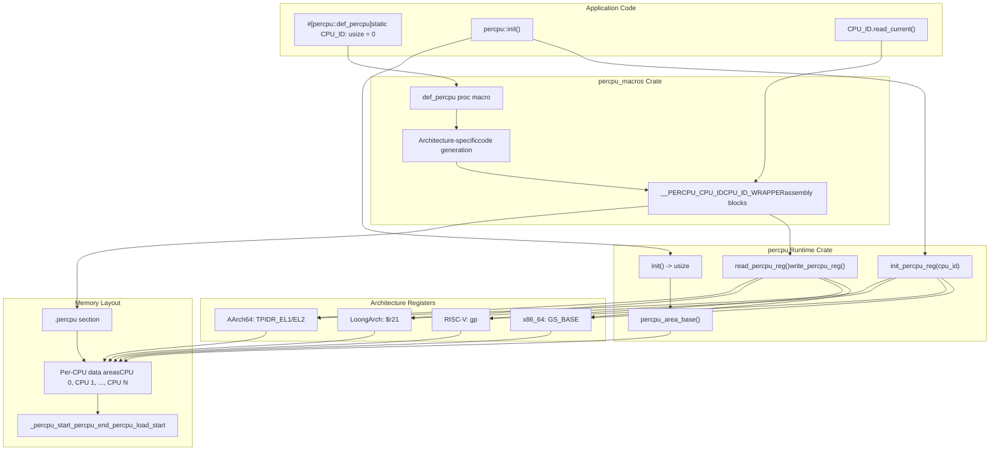
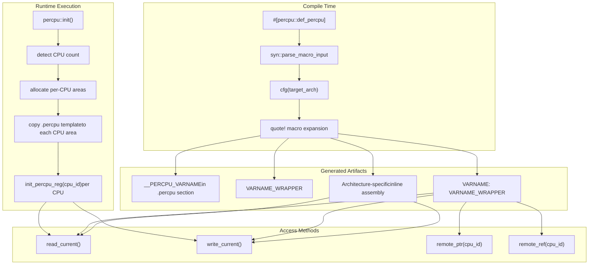

# Overview

> **Relevant source files**
> * [CHANGELOG.md](https://github.com/arceos-org/percpu/blob/89c8a54c/CHANGELOG.md)
> * [Cargo.toml](https://github.com/arceos-org/percpu/blob/89c8a54c/Cargo.toml)
> * [README.md](https://github.com/arceos-org/percpu/blob/89c8a54c/README.md)

This document provides an overview of the **percpu** crate ecosystem, a Rust library system that provides efficient per-CPU data management for bare-metal and kernel development. The system consists of two main crates that work together to enable safe, efficient access to CPU-local data structures across multiple processor architectures.

The percpu system solves the fundamental problem of managing data that needs to be accessible per-CPU without synchronization overhead, critical for kernel and hypervisor development. For detailed API usage patterns, see [Basic Usage Examples](/arceos-org/percpu/2.2-basic-usage-examples). For implementation details of the code generation pipeline, see [Code Generation Pipeline](/arceos-org/percpu/3.3-code-generation-pipeline).

## System Architecture

The percpu ecosystem is built around two cooperating crates that provide compile-time code generation and runtime per-CPU data management:



**Sources: [README.md(L40 - L52)&emsp;](https://github.com/arceos-org/percpu/blob/89c8a54c/README.md#L40-L52) [Cargo.toml(L4 - L7)&emsp;](https://github.com/arceos-org/percpu/blob/89c8a54c/Cargo.toml#L4-L7)**

## Code Generation and Runtime Flow

The system transforms user-defined per-CPU variables into architecture-specific implementations through a multi-stage process:



**Sources: [README.md(L39 - L52)&emsp;](https://github.com/arceos-org/percpu/blob/89c8a54c/README.md#L39-L52) [CHANGELOG.md(L8 - L12)&emsp;](https://github.com/arceos-org/percpu/blob/89c8a54c/CHANGELOG.md#L8-L12)**

## Platform Support Matrix

The percpu system provides cross-platform support through architecture-specific register handling:

|Architecture|Register Used|Assembly Instructions|Feature Support|
| --- | --- | --- | --- |
|x86_64|GS_BASE|mov gs:[offset], reg|Full support|
|AArch64|TPIDR_EL1/EL2|mrs/msrinstructions|EL1/EL2 modes|
|RISC-V|gp|mv gp, reg|32-bit and 64-bit|
|LoongArch|$r21|lu12i.w/ori|64-bit support|

The system adapts its code generation based on `cfg(target_arch)` directives and provides feature flags for specialized environments:

* **`sp-naive`**: Single-processor fallback using global variables
* **`preempt`**: Preemption-safe access with `NoPreemptGuard` integration
* **`arm-el2`**: Hypervisor mode support using `TPIDR_EL2`

**Sources: [README.md(L19 - L35)&emsp;](https://github.com/arceos-org/percpu/blob/89c8a54c/README.md#L19-L35) [README.md(L69 - L79)&emsp;](https://github.com/arceos-org/percpu/blob/89c8a54c/README.md#L69-L79)**

## Integration Requirements

### Linker Script Configuration

The system requires manual linker script modification to define the `.percpu` section layout:

```css
_percpu_start = .;
_percpu_end = _percpu_start + SIZEOF(.percpu);
.percpu 0x0 (NOLOAD) : AT(_percpu_start) {
    _percpu_load_start = .;
    *(.percpu .percpu.*)
    _percpu_load_end = .;
    . = _percpu_load_start + ALIGN(64) * CPU_NUM;
}
```

### Workspace Structure

The system is organized as a Cargo workspace containing:

* **`percpu`**: Runtime implementation and API
* **`percpu_macros`**: Procedural macro implementation

Both crates share common metadata and versioning through `workspace.package` configuration.

**Sources: [README.md(L54 - L67)&emsp;](https://github.com/arceos-org/percpu/blob/89c8a54c/README.md#L54-L67) [Cargo.toml(L1 - L25)&emsp;](https://github.com/arceos-org/percpu/blob/89c8a54c/Cargo.toml#L1-L25)**

## Key API Entry Points

The primary user interface consists of:

* **`percpu::def_percpu`**: Procedural macro for defining per-CPU variables
* **`percpu::init()`**: Initialize per-CPU memory areas, returns CPU count
* **`percpu::init_percpu_reg(cpu_id)`**: Configure per-CPU register for specific CPU
* **`.read_current()`** / **`.write_current()`**: Access current CPU's data
* **`.remote_ptr(cpu_id)`** / **`.remote_ref(cpu_id)`**: Access remote CPU data

The system generates wrapper types that provide these methods while maintaining type safety and architecture-specific optimization.

**Sources: [README.md(L40 - L52)&emsp;](https://github.com/arceos-org/percpu/blob/89c8a54c/README.md#L40-L52) [CHANGELOG.md(L8 - L12)&emsp;](https://github.com/arceos-org/percpu/blob/89c8a54c/CHANGELOG.md#L8-L12)**