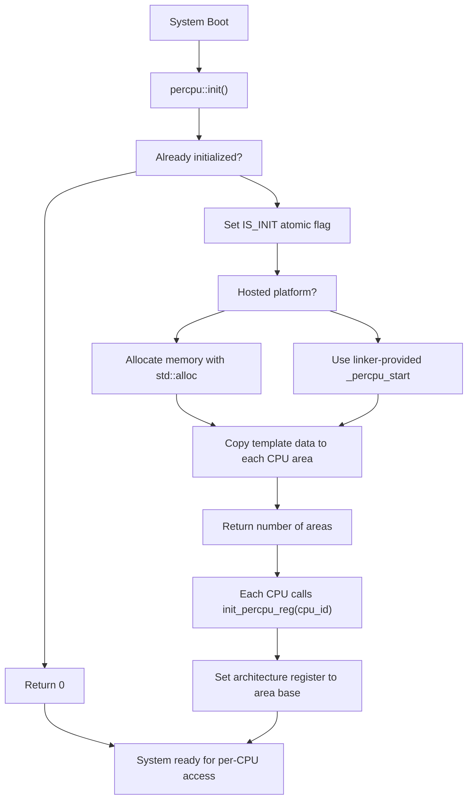
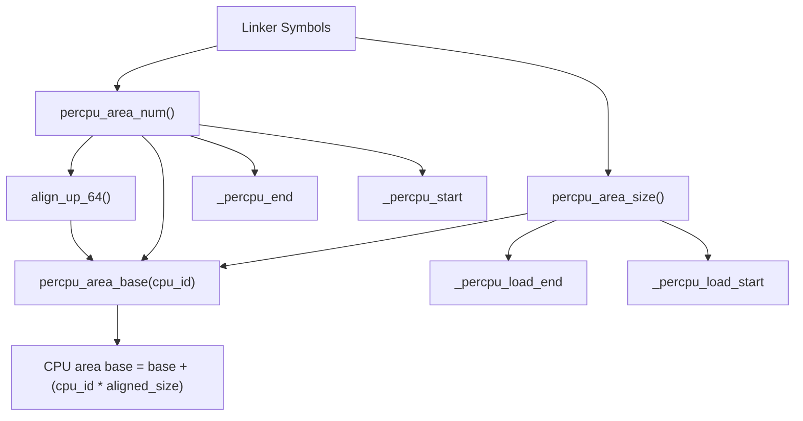
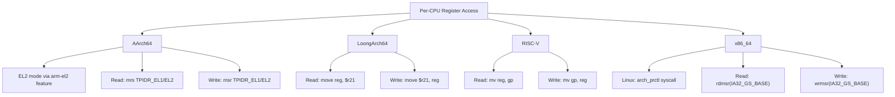
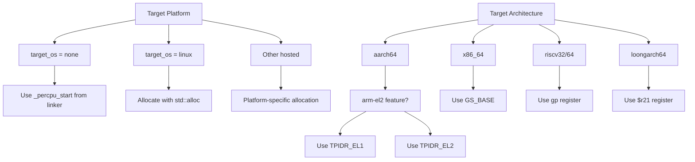

# Runtime Functions

> **Relevant source files**
> * [CHANGELOG.md](https://github.com/arceos-org/percpu/blob/89c8a54c/CHANGELOG.md)
> * [percpu/src/imp.rs](https://github.com/arceos-org/percpu/blob/89c8a54c/percpu/src/imp.rs)
> * [percpu/src/lib.rs](https://github.com/arceos-org/percpu/blob/89c8a54c/percpu/src/lib.rs)

This page documents the core runtime functions provided by the percpu crate for managing per-CPU data areas, initializing the system, and handling architecture-specific register operations. These functions form the low-level foundation that supports the high-level `def_percpu` macro interface.

For information about defining per-CPU variables, see [def_percpu Macro](/arceos-org/percpu/4.1-def_percpu-macro). For safety considerations and preemption handling, see [Safety and Preemption](/arceos-org/percpu/4.3-safety-and-preemption). For architectural details about memory layout, see [Memory Layout and Initialization](/arceos-org/percpu/3.1-memory-layout-and-initialization).

## System Initialization

The percpu system requires explicit initialization before per-CPU variables can be accessed. The initialization process sets up memory areas for each CPU and prepares the system for per-CPU data access.

### Core Initialization Function

The `init()` function is the primary entry point for initializing the per-CPU data system:

```rust
pub fn init() -> usize
```

This function performs the following operations:

* Prevents re-initialization using atomic synchronization
* Allocates per-CPU memory areas (on hosted platforms)
* Copies template data from the `.percpu` section to each CPU's area
* Returns the number of CPU areas initialized

The function uses an atomic boolean `IS_INIT` to ensure initialization occurs only once, returning 0 on subsequent calls.

### Per-CPU Register Initialization

After system initialization, each CPU must initialize its architecture-specific register:

```rust
pub fn init_percpu_reg(cpu_id: usize)
```

This function sets the per-CPU register to point to the appropriate memory area for the specified CPU. It is equivalent to calling `write_percpu_reg(percpu_area_base(cpu_id))`.



**Sources:** [percpu/src/imp.rs(L56 - L86)&emsp;](https://github.com/arceos-org/percpu/blob/89c8a54c/percpu/src/imp.rs#L56-L86) [percpu/src/imp.rs(L165 - L168)&emsp;](https://github.com/arceos-org/percpu/blob/89c8a54c/percpu/src/imp.rs#L165-L168)

## Memory Query Functions

The percpu system provides several functions for querying memory layout and dimensions of the per-CPU data areas.

### Area Dimensions

|Function|Return Type|Purpose|
| --- | --- | --- |
|percpu_area_num()|usize|Number of per-CPU areas reserved|
|percpu_area_size()|usize|Size in bytes of each CPU's data area|
|percpu_area_base(cpu_id: usize)|usize|Base address of the specified CPU's area|

### Memory Layout Calculation

The system calculates memory layout using several key components:

* **Template size**: Determined by `_percpu_load_end - _percpu_load_start`
* **Alignment**: Each area is aligned to 64-byte boundaries using `align_up_64()`
* **Total areas**: Calculated as `(_percpu_end - _percpu_start) / aligned_area_size`



**Sources:** [percpu/src/imp.rs(L21 - L44)&emsp;](https://github.com/arceos-org/percpu/blob/89c8a54c/percpu/src/imp.rs#L21-L44) [percpu/src/imp.rs(L5 - L8)&emsp;](https://github.com/arceos-org/percpu/blob/89c8a54c/percpu/src/imp.rs#L5-L8)

## Register Management Functions

Per-CPU data access relies on architecture-specific registers that hold the base address of the current CPU's data area. The system provides functions to read and write these registers.

### Register Access Functions

```rust
pub fn read_percpu_reg() -> usize
pub unsafe fn write_percpu_reg(tp: usize)
```

The `read_percpu_reg()` function returns the current value of the per-CPU register, while `write_percpu_reg()` sets it to a new value. The write function is marked `unsafe` because it directly manipulates low-level CPU registers.

### Architecture-Specific Register Mapping

Different CPU architectures use different registers and instruction sequences for per-CPU data access:



**Sources:** [percpu/src/imp.rs(L91 - L156)&emsp;](https://github.com/arceos-org/percpu/blob/89c8a54c/percpu/src/imp.rs#L91-L156)

## Architecture-Specific Behavior

The percpu system adapts to different target platforms and privilege levels through conditional compilation and feature flags.

### Platform-Specific Implementations

|Platform|Memory Source|Register Access Method|
| --- | --- | --- |
|target_os = "none"|Linker-provided.percpusection|Direct MSR/register access|
|target_os = "linux"|std::allocallocated memory|System calls (x86_64)|
|Other hosted|Platform-specific allocation|Platform-specific methods|

### Feature Flag Behavior

The system behavior changes based on enabled feature flags:

* **`arm-el2`**: Uses `TPIDR_EL2` instead of `TPIDR_EL1` on AArch64
* **`sp-naive`**: Uses alternative implementation (see [Naive Implementation](/arceos-org/percpu/5.2-naive-implementation))
* **`preempt`**: Integrates with `kernel_guard` for preemption safety



**Sources:** [percpu/src/imp.rs(L36 - L44)&emsp;](https://github.com/arceos-org/percpu/blob/89c8a54c/percpu/src/imp.rs#L36-L44) [percpu/src/imp.rs(L94 - L155)&emsp;](https://github.com/arceos-org/percpu/blob/89c8a54c/percpu/src/imp.rs#L94-L155)

## Usage Patterns

Runtime functions are typically used in specific patterns during system initialization and operation.

### Initialization Sequence

```javascript
// 1. Initialize the per-CPU system
let num_cpus = percpu::init();

// 2. Each CPU initializes its register
// (usually called in per-CPU startup code)
percpu::init_percpu_reg(cpu_id);

// 3. Query system information if needed
let area_size = percpu::percpu_area_size();
let cpu_base = percpu::percpu_area_base(cpu_id);
```

### Register Management

```javascript
// Read current per-CPU register value
let current_base = percpu::read_percpu_reg();

// Manually set per-CPU register (unsafe)
unsafe {
    percpu::write_percpu_reg(new_base_address);
}
```

### Integration with Generated Code

The runtime functions work together with the code generated by the `def_percpu` macro. The macro-generated code uses these functions internally to calculate variable addresses and manage access patterns.

**Sources:** [percpu/src/imp.rs(L1 - L179)&emsp;](https://github.com/arceos-org/percpu/blob/89c8a54c/percpu/src/imp.rs#L1-L179) [percpu/src/lib.rs(L7 - L17)&emsp;](https://github.com/arceos-org/percpu/blob/89c8a54c/percpu/src/lib.rs#L7-L17)