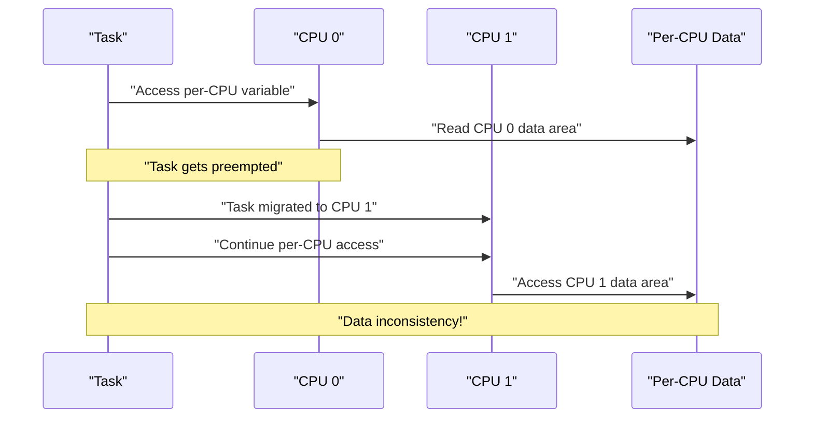
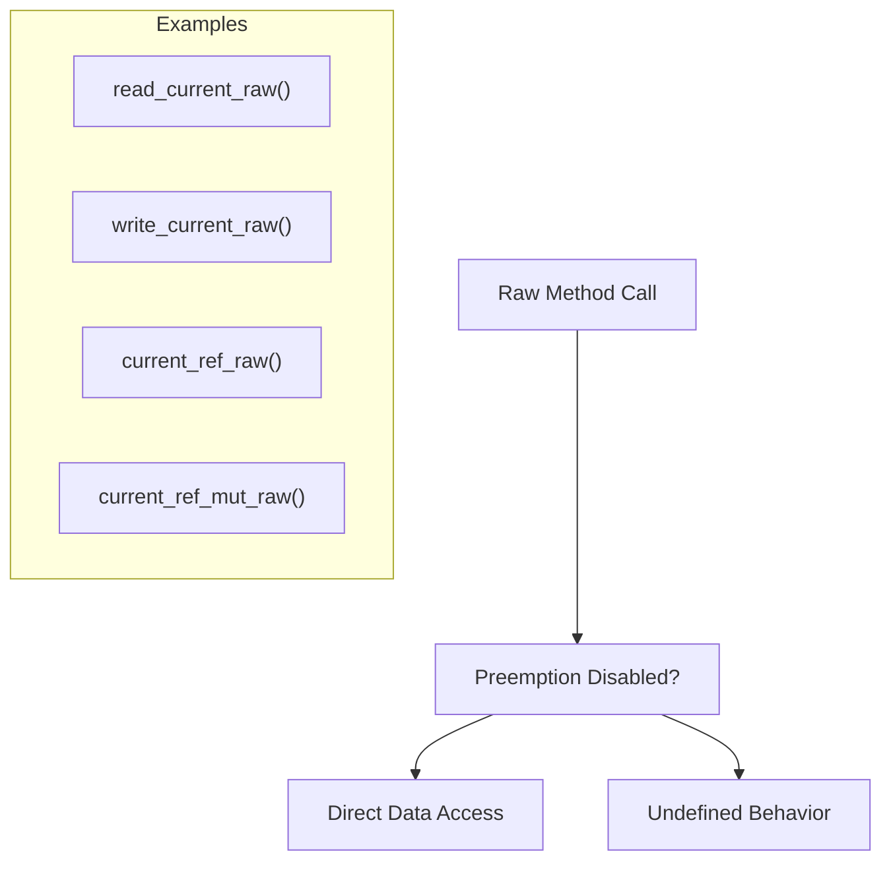
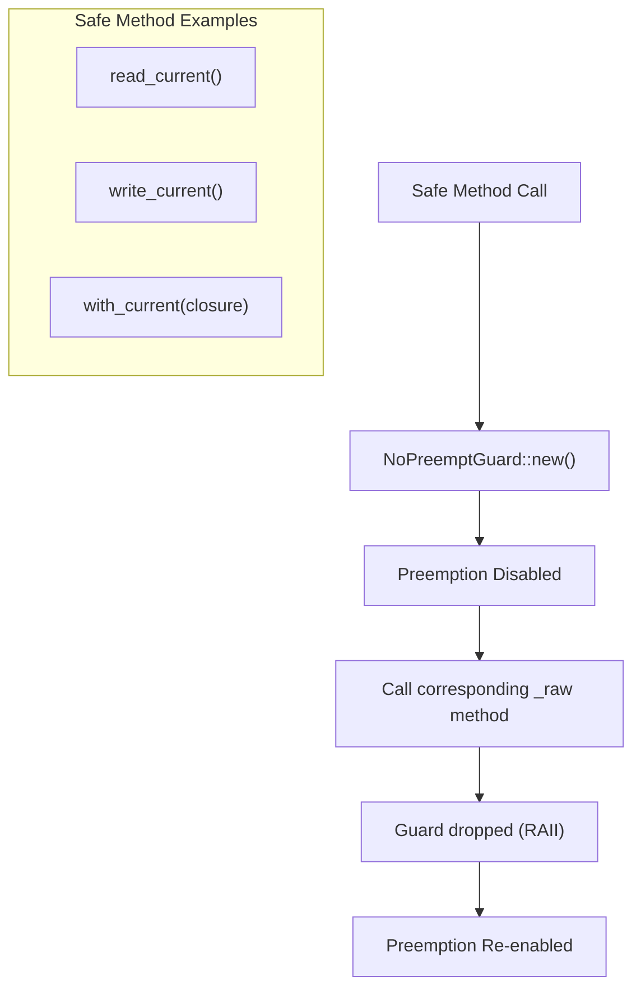
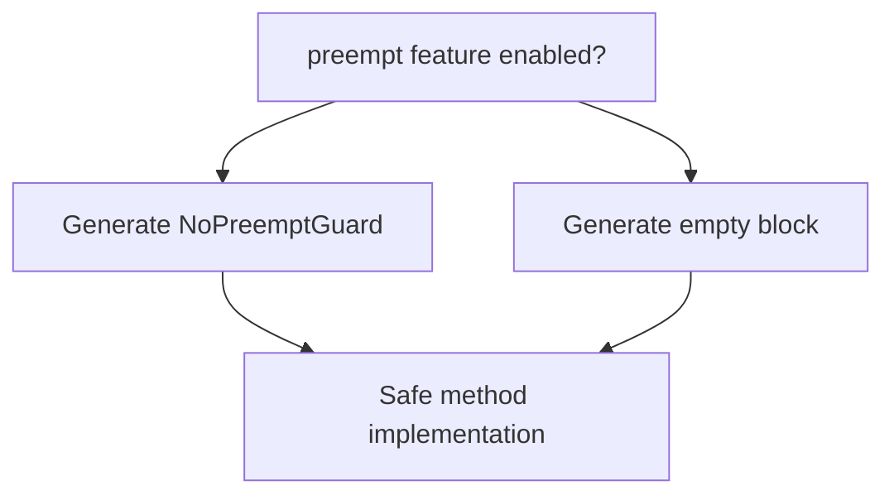
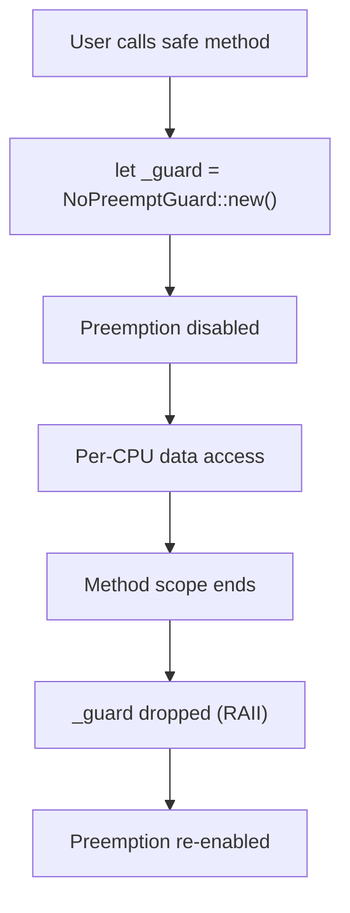
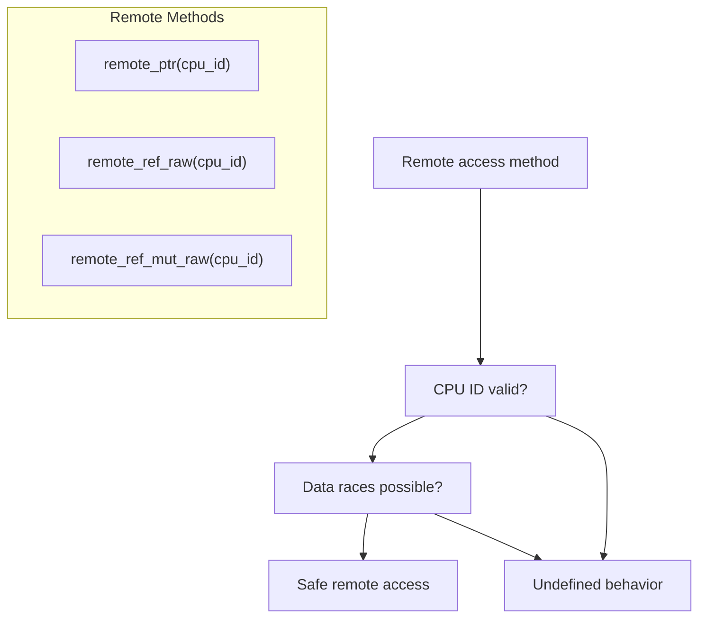
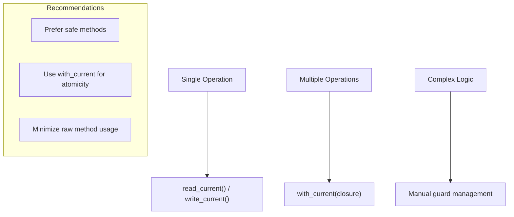

# Safety and Preemption

> **Relevant source files**
> * [percpu/Cargo.toml](https://github.com/arceos-org/percpu/blob/89c8a54c/percpu/Cargo.toml)
> * [percpu/src/lib.rs](https://github.com/arceos-org/percpu/blob/89c8a54c/percpu/src/lib.rs)
> * [percpu_macros/src/lib.rs](https://github.com/arceos-org/percpu/blob/89c8a54c/percpu_macros/src/lib.rs)

This document covers the safety mechanisms and preemption handling in the percpu crate system. It explains how per-CPU data access is protected from preemption-related data races and provides guidance on choosing between different safety models. For information about memory layout and initialization safety, see [Memory Layout and Initialization](/arceos-org/percpu/3.1-memory-layout-and-initialization). For details about architecture-specific implementation safety, see [Architecture-Specific Code Generation](/arceos-org/percpu/5.1-architecture-specific-code-generation).

## Preemption Safety Concepts

Per-CPU data access presents unique safety challenges in preemptible systems. When a task accesses per-CPU data and is then preempted and migrated to another CPU, it may inadvertently access data belonging to a different CPU, leading to data races and inconsistent state.

The percpu crate provides two safety models to address this challenge:

|Safety Model|Description|Use Case|
| --- | --- | --- |
|Raw Methods|Require manual preemption control|Performance-critical code with existing preemption management|
|Safe Methods|Automatic preemption disabling|General application code requiring safety guarantees|

Sources: [percpu_macros/src/lib.rs(L94 - L98)&emsp;](https://github.com/arceos-org/percpu/blob/89c8a54c/percpu_macros/src/lib.rs#L94-L98) [percpu_macros/src/lib.rs(L109 - L140)&emsp;](https://github.com/arceos-org/percpu/blob/89c8a54c/percpu_macros/src/lib.rs#L109-L140)

## Safety Models and Method Types

### Raw Methods (*_rawfunctions)

Raw methods provide direct access to per-CPU data without automatic preemption control. These methods are marked `unsafe` and require the caller to ensure preemption is disabled.

Key raw methods include:

* `read_current_raw()` - Returns value without preemption protection
* `write_current_raw()` - Sets value without preemption protection
* `current_ref_raw()` - Returns reference without preemption protection
* `current_ref_mut_raw()` - Returns mutable reference without preemption protection

Sources: [percpu_macros/src/lib.rs(L113 - L125)&emsp;](https://github.com/arceos-org/percpu/blob/89c8a54c/percpu_macros/src/lib.rs#L113-L125) [percpu_macros/src/lib.rs(L184 - L197)&emsp;](https://github.com/arceos-org/percpu/blob/89c8a54c/percpu_macros/src/lib.rs#L184-L197)

### Safe Methods (Automatic Preemption Control)

Safe methods automatically disable preemption during the operation using the `NoPreemptGuard` mechanism when the `preempt` feature is enabled.

The code generation logic determines preemption handling based on feature flags:

Sources: [percpu_macros/src/lib.rs(L129 - L139)&emsp;](https://github.com/arceos-org/percpu/blob/89c8a54c/percpu_macros/src/lib.rs#L129-L139) [percpu_macros/src/lib.rs(L201 - L207)&emsp;](https://github.com/arceos-org/percpu/blob/89c8a54c/percpu_macros/src/lib.rs#L201-L207)

## NoPreemptGuard Integration

The `NoPreemptGuard` provides RAII-based preemption control through integration with the `kernel_guard` crate. This integration is enabled by the `preempt` feature flag.

### Feature Configuration

|Feature State|Behavior|Dependencies|
| --- | --- | --- |
|preemptenabled|Automatic preemption guards|kernel_guardcrate|
|preemptdisabled|No preemption protection|No additional dependencies|

### Guard Implementation

The guard is implemented as a module re-export that conditionally includes the `kernel_guard::NoPreempt` type:

Sources: [percpu/src/lib.rs(L14 - L17)&emsp;](https://github.com/arceos-org/percpu/blob/89c8a54c/percpu/src/lib.rs#L14-L17) [percpu/Cargo.toml(L21 - L22)&emsp;](https://github.com/arceos-org/percpu/blob/89c8a54c/percpu/Cargo.toml#L21-L22) [percpu_macros/src/lib.rs(L94 - L98)&emsp;](https://github.com/arceos-org/percpu/blob/89c8a54c/percpu_macros/src/lib.rs#L94-L98)

## Remote Access Safety

Remote CPU access methods (`remote_*`) require additional safety considerations beyond preemption control, as they access data belonging to other CPUs.

### Remote Access Safety Requirements

|Method|Safety Requirements|
| --- | --- |
|remote_ptr(cpu_id)|Valid CPU ID + No data races|
|remote_ref_raw(cpu_id)|Valid CPU ID + No data races|
|remote_ref_mut_raw(cpu_id)|Valid CPU ID + Exclusive access|

Sources: [percpu_macros/src/lib.rs(L209 - L246)&emsp;](https://github.com/arceos-org/percpu/blob/89c8a54c/percpu_macros/src/lib.rs#L209-L246)

## Best Practices

### Choosing Safety Models

1. **Use safe methods by default** - Automatic preemption protection prevents common bugs
2. **Use raw methods for performance-critical paths** - When preemption is already managed externally
3. **Enable `preempt` feature in production** - Unless running on single-CPU systems

### Safe Usage Patterns

### Feature Flag Configuration

For different deployment scenarios:

|Scenario|Feature Configuration|Rationale|
| --- | --- | --- |
|Production kernel|preemptenabled|Full safety guarantees|
|Single-CPU embedded|sp-naiveenabled|No preemption needed|
|Performance testing|preemptdisabled|Measure raw performance|

Sources: [percpu/Cargo.toml(L15 - L25)&emsp;](https://github.com/arceos-org/percpu/blob/89c8a54c/percpu/Cargo.toml#L15-L25) [percpu_macros/src/lib.rs(L100 - L145)&emsp;](https://github.com/arceos-org/percpu/blob/89c8a54c/percpu_macros/src/lib.rs#L100-L145)