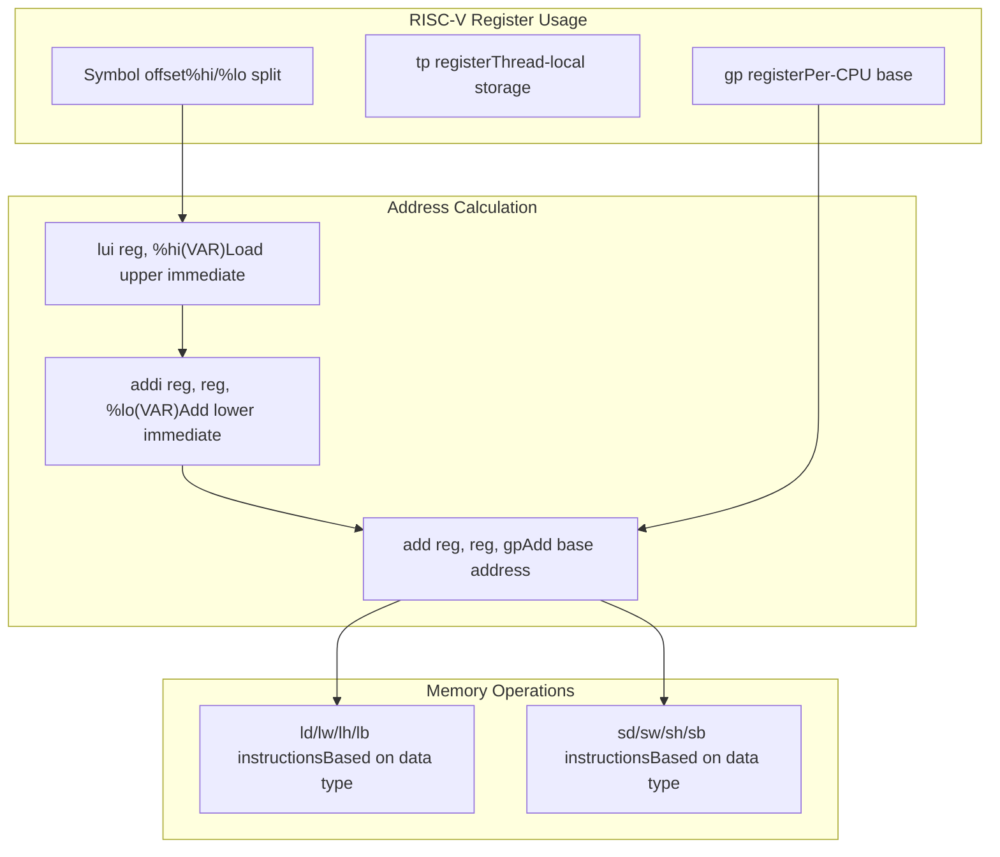

# Supported Platforms

> **Relevant source files**
> * [.github/workflows/ci.yml](https://github.com/arceos-org/percpu/blob/89c8a54c/.github/workflows/ci.yml)
> * [README.md](https://github.com/arceos-org/percpu/blob/89c8a54c/README.md)
> * [percpu_macros/src/arch.rs](https://github.com/arceos-org/percpu/blob/89c8a54c/percpu_macros/src/arch.rs)

This document provides a comprehensive overview of the CPU architectures and platforms supported by the percpu crate ecosystem. It covers architecture-specific per-CPU register usage, implementation details, and platform-specific considerations for integrating per-CPU data management.

For information about setting up these platforms in your build environment, see [Installation and Setup](/arceos-org/percpu/2.1-installation-and-setup). For details about the architecture-specific code generation mechanisms, see [Architecture-Specific Code Generation](/arceos-org/percpu/5.1-architecture-specific-code-generation).

## Supported Architecture Overview

The percpu crate supports four major CPU architectures, each utilizing different registers for per-CPU data access:

|Architecture|per-CPU Register|Register Type|Supported Variants|
| --- | --- | --- | --- |
|x86_64|GS_BASE|Segment base register|Standard x86_64|
|AArch64|TPIDR_ELx|Thread pointer register|EL1, EL2 modes|
|RISC-V|gp|Global pointer register|32-bit, 64-bit|
|LoongArch|$r21|General purpose register|64-bit|

**Platform Register Usage**

Sources: [README.md(L19 - L31)&emsp;](https://github.com/arceos-org/percpu/blob/89c8a54c/README.md#L19-L31) [percpu_macros/src/arch.rs(L21 - L46)&emsp;](https://github.com/arceos-org/percpu/blob/89c8a54c/percpu_macros/src/arch.rs#L21-L46)

## Platform-Specific Implementation Details

### x86_64 Architecture

The x86_64 implementation uses the `GS_BASE` model-specific register to store the base address of the per-CPU data area. This approach leverages the x86_64 segment architecture for efficient per-CPU data access.

**Key characteristics:**

* Uses `GS_BASE` MSR for per-CPU base address storage
* Accesses data via `gs:[offset]` addressing mode
* Requires offset values ≤ 0xffff_ffff for 32-bit displacement
* Supports optimized single-instruction memory operations

Sources: [percpu_macros/src/arch.rs(L66 - L76)&emsp;](https://github.com/arceos-org/percpu/blob/89c8a54c/percpu_macros/src/arch.rs#L66-L76) [percpu_macros/src/arch.rs(L131 - L150)&emsp;](https://github.com/arceos-org/percpu/blob/89c8a54c/percpu_macros/src/arch.rs#L131-L150) [percpu_macros/src/arch.rs(L232 - L251)&emsp;](https://github.com/arceos-org/percpu/blob/89c8a54c/percpu_macros/src/arch.rs#L232-L251)

### AArch64 Architecture

The AArch64 implementation uses thread pointer registers that vary based on the exception level. The system supports both EL1 (kernel) and EL2 (hypervisor) execution environments.

**Key characteristics:**

* Uses `TPIDR_EL1` by default, `TPIDR_EL2` when `arm-el2` feature is enabled
* Requires `mrs`/`msr` instructions for register access
* Offset calculations limited to 16-bit immediate values (≤ 0xffff)
* Two-instruction sequence for per-CPU data access

The register selection is controlled at compile time:

Sources: [percpu_macros/src/arch.rs(L55 - L62)&emsp;](https://github.com/arceos-org/percpu/blob/89c8a54c/percpu_macros/src/arch.rs#L55-L62) [percpu_macros/src/arch.rs(L79 - L80)&emsp;](https://github.com/arceos-org/percpu/blob/89c8a54c/percpu_macros/src/arch.rs#L79-L80) [README.md(L33 - L35)&emsp;](https://github.com/arceos-org/percpu/blob/89c8a54c/README.md#L33-L35)

### RISC-V Architecture

The RISC-V implementation uses the global pointer (`gp`) register for per-CPU data base addressing. This is a deviation from typical RISC-V conventions where `gp` is used for global data access.

**Key characteristics:**

* Uses `gp` register instead of standard thread pointer (`tp`)
* Supports both 32-bit and 64-bit variants
* Uses `lui`/`addi` instruction sequence for address calculation
* Offset values limited to 32-bit signed immediate range

**Important note:** The `tp` register remains available for thread-local storage, while `gp` is repurposed for per-CPU data.

Sources: [percpu_macros/src/arch.rs(L81 - L82)&emsp;](https://github.com/arceos-org/percpu/blob/89c8a54c/percpu_macros/src/arch.rs#L81-L82) [percpu_macros/src/arch.rs(L33 - L39)&emsp;](https://github.com/arceos-org/percpu/blob/89c8a54c/percpu_macros/src/arch.rs#L33-L39) [README.md(L28 - L31)&emsp;](https://github.com/arceos-org/percpu/blob/89c8a54c/README.md#L28-L31)

### LoongArch Architecture

The LoongArch implementation uses the `$r21` general-purpose register for per-CPU data base addressing. This architecture provides native support for per-CPU data patterns.

**Key characteristics:**

* Uses `$r21` general-purpose register for base addressing
* Supports 64-bit architecture (LoongArch64)
* Uses `lu12i.w`/`ori` instruction sequence for address calculation
* Provides specialized load/store indexed instructions

Sources: [percpu_macros/src/arch.rs(L83 - L84)&emsp;](https://github.com/arceos-org/percpu/blob/89c8a54c/percpu_macros/src/arch.rs#L83-L84) [percpu_macros/src/arch.rs(L40 - L46)&emsp;](https://github.com/arceos-org/percpu/blob/89c8a54c/percpu_macros/src/arch.rs#L40-L46) [percpu_macros/src/arch.rs(L114 - L129)&emsp;](https://github.com/arceos-org/percpu/blob/89c8a54c/percpu_macros/src/arch.rs#L114-L129)

## Continuous Integration and Testing Coverage

The percpu crate maintains comprehensive testing across all supported platforms through automated CI/CD pipelines. The testing matrix ensures compatibility and correctness across different target environments.

**CI Target Matrix:**

|Target|Architecture|Environment|Test Coverage|
| --- | --- | --- | --- |
|x86_64-unknown-linux-gnu|x86_64|Linux userspace|Full tests + unit tests|
|x86_64-unknown-none|x86_64|Bare metal/no_std|Build + clippy only|
|riscv64gc-unknown-none-elf|RISC-V 64|Bare metal/no_std|Build + clippy only|
|aarch64-unknown-none-softfloat|AArch64|Bare metal/no_std|Build + clippy only|
|loongarch64-unknown-none-softfloat|LoongArch64|Bare metal/no_std|Build + clippy only|

**Testing Strategy:**

Sources: [.github/workflows/ci.yml(L8 - L32)&emsp;](https://github.com/arceos-org/percpu/blob/89c8a54c/.github/workflows/ci.yml#L8-L32)

## Platform-Specific Limitations and Considerations

### macOS Development Limitation

The crate includes a development-time limitation for macOS hosts, where architecture-specific assembly code is disabled and replaced with unimplemented stubs. This affects local development but not target deployment.

### Offset Size Constraints

Each architecture imposes different constraints on the maximum offset values for per-CPU variables:

* **x86_64**: 32-bit signed displacement (≤ 0xffff_ffff)
* **AArch64**: 16-bit immediate value (≤ 0xffff)
* **RISC-V**: 32-bit signed immediate (split hi/lo)
* **LoongArch**: 32-bit absolute address (split hi20/lo12)

### Register Conflicts and Conventions

* **RISC-V**: Repurposes `gp` register, deviating from standard ABI conventions
* **AArch64**: Requires careful exception level management for register selection
* **x86_64**: Depends on GS segment register configuration by system initialization

Sources: [percpu_macros/src/arch.rs(L4 - L13)&emsp;](https://github.com/arceos-org/percpu/blob/89c8a54c/percpu_macros/src/arch.rs#L4-L13) [percpu_macros/src/arch.rs(L23 - L46)&emsp;](https://github.com/arceos-org/percpu/blob/89c8a54c/percpu_macros/src/arch.rs#L23-L46) [README.md(L28 - L35)&emsp;](https://github.com/arceos-org/percpu/blob/89c8a54c/README.md#L28-L35)