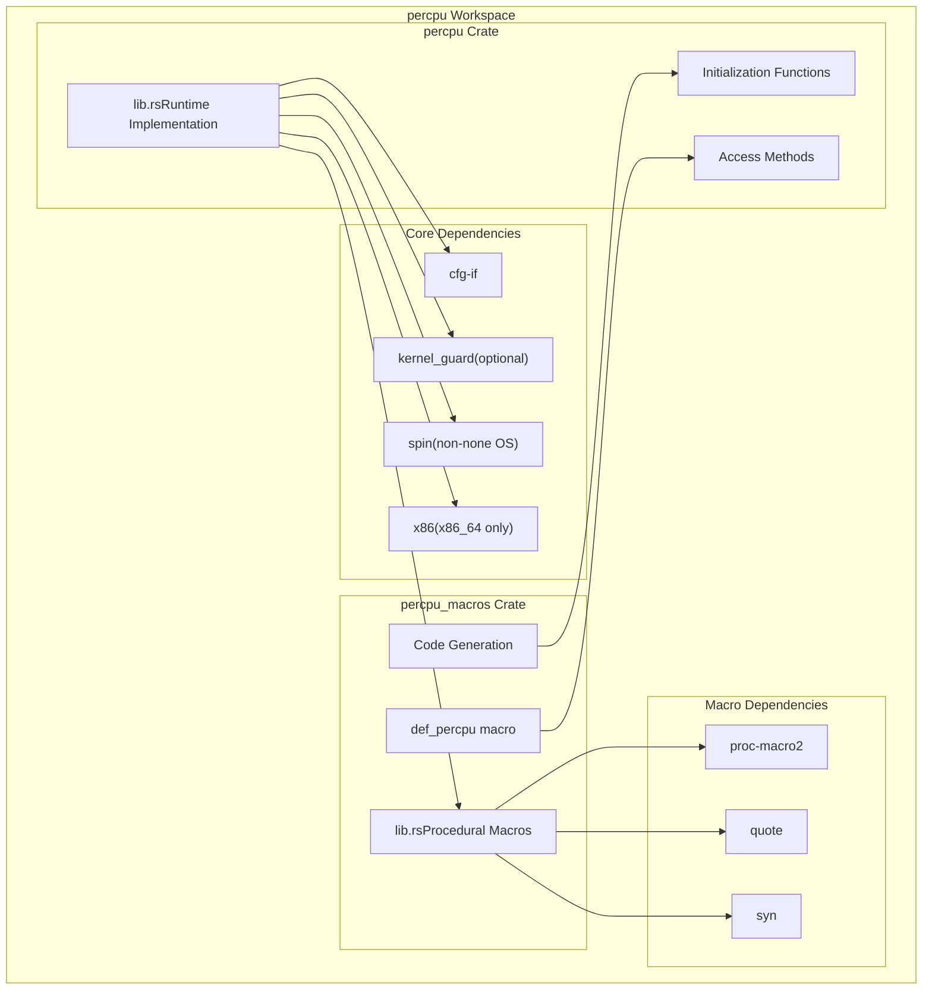
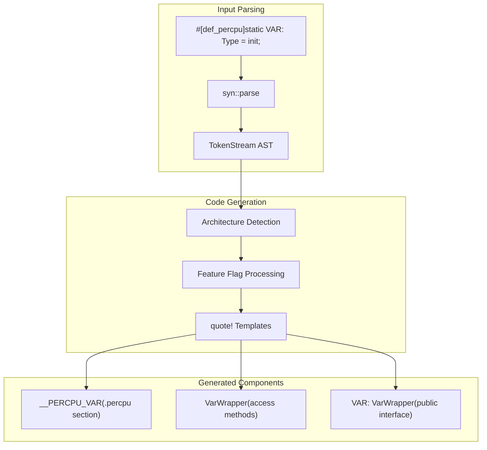
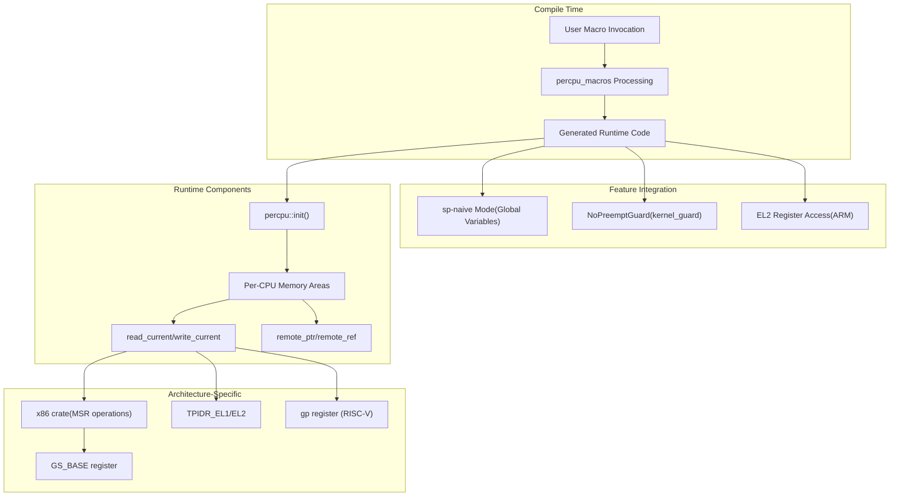

# System Components

> **Relevant source files**
> * [Cargo.toml](https://github.com/arceos-org/percpu/blob/89c8a54c/Cargo.toml)
> * [percpu/Cargo.toml](https://github.com/arceos-org/percpu/blob/89c8a54c/percpu/Cargo.toml)
> * [percpu_macros/Cargo.toml](https://github.com/arceos-org/percpu/blob/89c8a54c/percpu_macros/Cargo.toml)

## Purpose and Scope

This document details the architectural components of the percpu crate ecosystem, focusing on the two main crates (`percpu` and `percpu_macros`) and their integration with dependencies. It covers the workspace structure, feature configuration, and how the components collaborate to provide per-CPU data management functionality.

For platform-specific implementation details, see [Supported Platforms](/arceos-org/percpu/1.2-supported-platforms). For detailed API usage, see [API Reference](/arceos-org/percpu/4-api-reference).

## Core Components Architecture

**Workspace Component Structure**

Sources: [Cargo.toml(L4 - L7)&emsp;](https://github.com/arceos-org/percpu/blob/89c8a54c/Cargo.toml#L4-L7) [percpu/Cargo.toml(L27 - L36)&emsp;](https://github.com/arceos-org/percpu/blob/89c8a54c/percpu/Cargo.toml#L27-L36) [percpu_macros/Cargo.toml(L27 - L30)&emsp;](https://github.com/arceos-org/percpu/blob/89c8a54c/percpu_macros/Cargo.toml#L27-L30)

## Runtime Implementation (percpuCrate)

The `percpu` crate provides the runtime infrastructure for per-CPU data management. It handles memory allocation, initialization, and provides safe access methods to per-CPU variables.

### Key Responsibilities

|Component|Function|Dependencies|
| --- | --- | --- |
|Initialization|Allocates per-CPU memory areas and configures CPU registers|cfg-if, architecture-specific registers|
|Access Methods|Provides safe local and remote per-CPU data access|Generated bypercpu_macros|
|Memory Management|Manages per-CPU memory layout and addressing|Linker script integration|
|Preemption Safety|Optional preemption-safe operations|kernel_guard(whenpreemptfeature enabled)|

### Feature Configuration

The runtime crate supports three main feature flags:

* **`sp-naive`**: Single-processor mode using global variables instead of per-CPU storage
* **`preempt`**: Enables preemption safety with `kernel_guard` integration
* **`arm-el2`**: ARM-specific support for EL2 privilege level execution

Sources: [percpu/Cargo.toml(L15 - L25)&emsp;](https://github.com/arceos-org/percpu/blob/89c8a54c/percpu/Cargo.toml#L15-L25)

## Macro Implementation (percpu_macrosCrate)

The `percpu_macros` crate provides compile-time code generation through procedural macros. It transforms user-defined per-CPU variable declarations into architecture-specific implementation code.

**Macro Processing Pipeline**

### Macro Dependencies

|Dependency|Purpose|Usage|
| --- | --- | --- |
|syn|AST parsing and manipulation|Parses#[def_percpu]macro input|
|quote|Code generation templates|Generates architecture-specific access code|
|proc-macro2|Token stream processing|Handles procedural macro token manipulation|

Sources: [percpu_macros/Cargo.toml(L27 - L30)&emsp;](https://github.com/arceos-org/percpu/blob/89c8a54c/percpu_macros/Cargo.toml#L27-L30) [percpu_macros/Cargo.toml(L32 - L33)&emsp;](https://github.com/arceos-org/percpu/blob/89c8a54c/percpu_macros/Cargo.toml#L32-L33)

## Component Integration and Data Flow

**Inter-Component Communication**

### Workspace Configuration

The workspace is configured as a multi-crate project with shared metadata and dependency management:

* **Version**: 0.2.0 across all crates
* **Edition**: Rust 2021
* **License**: Triple-licensed (GPL-3.0-or-later OR Apache-2.0 OR MulanPSL-2.0)
* **Target Platforms**: `no-std` embedded systems and kernel environments

Sources: [Cargo.toml(L9 - L24)&emsp;](https://github.com/arceos-org/percpu/blob/89c8a54c/Cargo.toml#L9-L24)

## Feature Flag Synchronization

Both crates maintain identical feature flag definitions to ensure consistent behavior across the macro generation and runtime execution phases:

|Feature|percpuCrate|percpu_macrosCrate|Effect|
| --- | --- | --- | --- |
|sp-naive|Enables global variable fallback|Controls code generation mode|Single-CPU optimization|
|preempt|Addskernel_guarddependency|Generates preemption-safe code|Thread safety|
|arm-el2|Architecture-specific config|Selects EL2 register usage|Hypervisor support|

This synchronization ensures that macro-generated code matches the runtime environment configuration.

Sources: [percpu/Cargo.toml(L18 - L25)&emsp;](https://github.com/arceos-org/percpu/blob/89c8a54c/percpu/Cargo.toml#L18-L25) [percpu_macros/Cargo.toml(L18 - L25)&emsp;](https://github.com/arceos-org/percpu/blob/89c8a54c/percpu_macros/Cargo.toml#L18-L25)