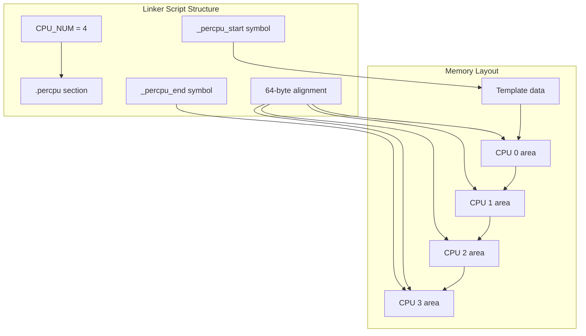
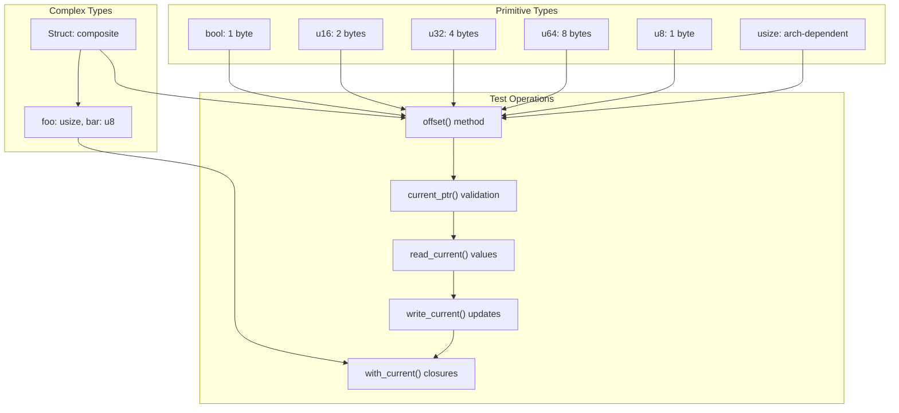
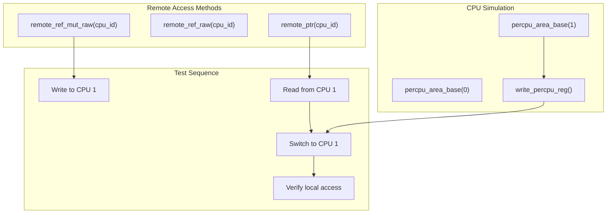
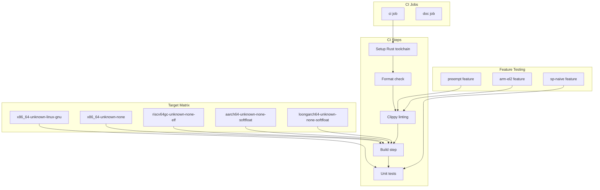

# Testing Guide

> **Relevant source files**
> * [.github/workflows/ci.yml](https://github.com/arceos-org/percpu/blob/89c8a54c/.github/workflows/ci.yml)
> * [percpu/test_percpu.x](https://github.com/arceos-org/percpu/blob/89c8a54c/percpu/test_percpu.x)
> * [percpu/tests/test_percpu.rs](https://github.com/arceos-org/percpu/blob/89c8a54c/percpu/tests/test_percpu.rs)

This document explains how to run tests, understand the test structure, and add new test cases for the percpu crate ecosystem. The testing framework validates per-CPU data management across multiple architectures and feature configurations.

For information about the build system and CI/CD pipeline details, see [Build System](/arceos-org/percpu/6.2-build-system). For general development guidelines, see [Contributing](/arceos-org/percpu/6.3-contributing).

## Test Structure Overview

The percpu crate uses a comprehensive testing strategy that validates functionality across different architectures, feature flags, and execution modes. The test suite is designed to work with both real per-CPU implementations and the single-CPU fallback mode.

### Test Architecture

```

```

Sources: [percpu/tests/test_percpu.rs(L1 - L163)&emsp;](https://github.com/arceos-org/percpu/blob/89c8a54c/percpu/tests/test_percpu.rs#L1-L163)

### Linker Script Configuration

The test environment uses a custom linker script to set up the `.percpu` section for testing with multiple simulated CPUs.



Sources: [percpu/test_percpu.x(L1 - L17)&emsp;](https://github.com/arceos-org/percpu/blob/89c8a54c/percpu/test_percpu.x#L1-L17)

## Running Tests Locally

### Basic Test Execution

To run the standard test suite on x86_64 Linux:

```markdown
# Run with default features
cargo test -- --nocapture

# Run with sp-naive feature (single-CPU mode)
cargo test --features "sp-naive" -- --nocapture
```

The `--nocapture` flag ensures that debug output from the tests is displayed, which includes offset information and per-CPU area details.

### Architecture-Specific Testing

Tests can be run on different target architectures, though unit tests only execute on `x86_64-unknown-linux-gnu`:

```markdown
# Cross-compile for other architectures (build only)
cargo build --target riscv64gc-unknown-none-elf --features "preempt,arm-el2"
cargo build --target aarch64-unknown-none-softfloat --features "preempt,arm-el2"
cargo build --target loongarch64-unknown-none-softfloat --features "preempt,arm-el2"
```

### Feature Flag Testing

The test suite validates different feature combinations:

|Feature|Purpose|Test Impact|
| --- | --- | --- |
|sp-naive|Single-CPU fallback|Disables remote CPU access tests|
|preempt|Preemption safety|EnablesNoPreemptGuardintegration|
|arm-el2|AArch64 EL2 support|UsesTPIDR_EL2instead ofTPIDR_EL1|

Sources: [.github/workflows/ci.yml(L25 - L32)&emsp;](https://github.com/arceos-org/percpu/blob/89c8a54c/.github/workflows/ci.yml#L25-L32)

## Test Coverage and Scenarios

### Data Type Coverage

The test suite validates per-CPU variables of different types and sizes:



Sources: [percpu/tests/test_percpu.rs(L7 - L31)&emsp;](https://github.com/arceos-org/percpu/blob/89c8a54c/percpu/tests/test_percpu.rs#L7-L31) [percpu/tests/test_percpu.rs(L52 - L58)&emsp;](https://github.com/arceos-org/percpu/blob/89c8a54c/percpu/tests/test_percpu.rs#L52-L58)

### Remote CPU Access Testing

When not using the `sp-naive` feature, the test suite validates remote CPU access patterns:



Sources: [percpu/tests/test_percpu.rs(L107 - L162)&emsp;](https://github.com/arceos-org/percpu/blob/89c8a54c/percpu/tests/test_percpu.rs#L107-L162)

## CI/CD Pipeline

### Architecture Matrix Testing

The GitHub Actions CI pipeline tests across multiple architectures and configurations:



Sources: [.github/workflows/ci.yml(L1 - L56)&emsp;](https://github.com/arceos-org/percpu/blob/89c8a54c/.github/workflows/ci.yml#L1-L56)

### Test Execution Strategy

|Target|Format|Clippy|Build|Unit Tests|
| --- | --- | --- | --- | --- |
|x86_64-unknown-linux-gnu|✓|✓|✓|✓|
|x86_64-unknown-none|✓|✓|✓|✗|
|riscv64gc-unknown-none-elf|✓|✓|✓|✗|
|aarch64-unknown-none-softfloat|✓|✓|✓|✗|
|loongarch64-unknown-none-softfloat|✓|✓|✓|✗|

Unit tests only run on `x86_64-unknown-linux-gnu` because they require userspace Linux environment for per-CPU area simulation.

Sources: [.github/workflows/ci.yml(L29 - L32)&emsp;](https://github.com/arceos-org/percpu/blob/89c8a54c/.github/workflows/ci.yml#L29-L32)

## Platform-Specific Considerations

### Linux Testing Requirements

The test suite has specific platform requirements:

* **Excluded platforms**: macOS is explicitly excluded via `#![cfg(not(target_os = "macos"))]`
* **Linux-only tests**: Main test function uses `#[cfg(target_os = "linux")]`
* **Userspace simulation**: Tests simulate per-CPU areas in userspace using `init()` and manual register management

### Test Environment Setup

The test environment requires:

1. **Per-CPU area initialization**: Calls `init()` to allocate per-CPU memory areas
2. **Register simulation**: Uses `write_percpu_reg()` and `read_percpu_reg()` to simulate CPU switching
3. **Memory validation**: Validates that calculated pointers match expected base + offset calculations

### Architecture-Specific Limitations

Different architectures have varying test coverage:

* **x86_64**: Full unit test coverage including remote access
* **AArch64/RISC-V/LoongArch**: Build-time validation only
* **Bare metal targets**: No userspace test execution

Sources: [percpu/tests/test_percpu.rs(L1)&emsp;](https://github.com/arceos-org/percpu/blob/89c8a54c/percpu/tests/test_percpu.rs#L1-L1) [percpu/tests/test_percpu.rs(L33 - L34)&emsp;](https://github.com/arceos-org/percpu/blob/89c8a54c/percpu/tests/test_percpu.rs#L33-L34)

## Adding New Test Cases

### Test Structure Guidelines

When adding new test cases, follow the established patterns:

1. **Variable definition**: Use `#[def_percpu]` with zero-initialized values
2. **Offset validation**: Test the `offset()` method for memory layout
3. **Pointer validation**: Verify `current_ptr()` calculations
4. **Value operations**: Test `read_current()`, `write_current()`, and `with_current()`
5. **Remote access**: Include remote CPU access tests for non-naive mode

### Example Test Pattern

New test cases should follow this structure:

```css
// Define per-CPU variable
#[def_percpu]
static NEW_VAR: NewType = NewType::default();

// Test offset and pointer calculations
assert_eq!(base + NEW_VAR.offset(), NEW_VAR.current_ptr() as usize);

// Test value operations
NEW_VAR.write_current(test_value);
assert_eq!(NEW_VAR.read_current(), test_value);

// Test remote access (non-naive only)
#[cfg(not(feature = "sp-naive"))]
unsafe {
    *NEW_VAR.remote_ref_mut_raw(1) = remote_value;
    assert_eq!(*NEW_VAR.remote_ptr(1), remote_value);
}
```

### Feature-Specific Testing

New tests should account for different feature configurations:

* Use `cfg!(feature = "sp-naive")` for conditional logic
* Wrap remote access tests with `#[cfg(not(feature = "sp-naive"))]`
* Consider preemption safety when adding tests for the `preempt` feature

Sources: [percpu/tests/test_percpu.rs(L61 - L105)&emsp;](https://github.com/arceos-org/percpu/blob/89c8a54c/percpu/tests/test_percpu.rs#L61-L105) [percpu/tests/test_percpu.rs(L107 - L162)&emsp;](https://github.com/arceos-org/percpu/blob/89c8a54c/percpu/tests/test_percpu.rs#L107-L162)