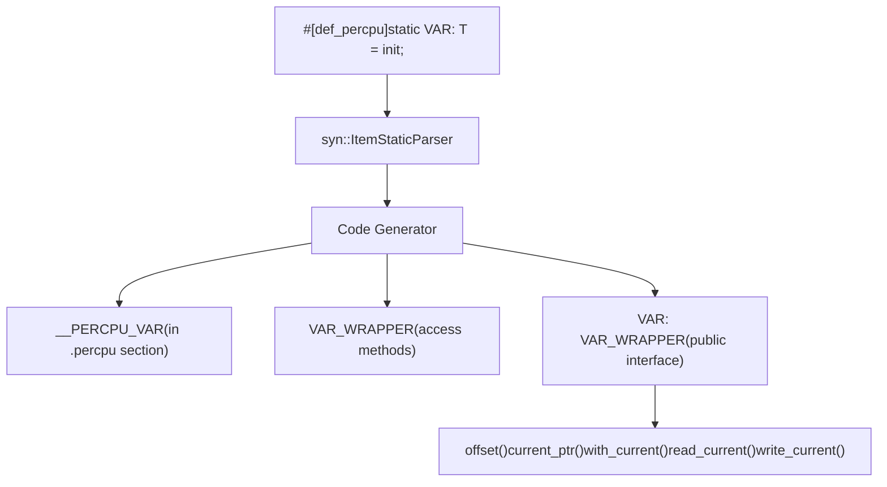
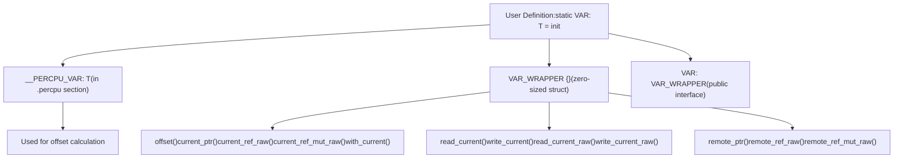
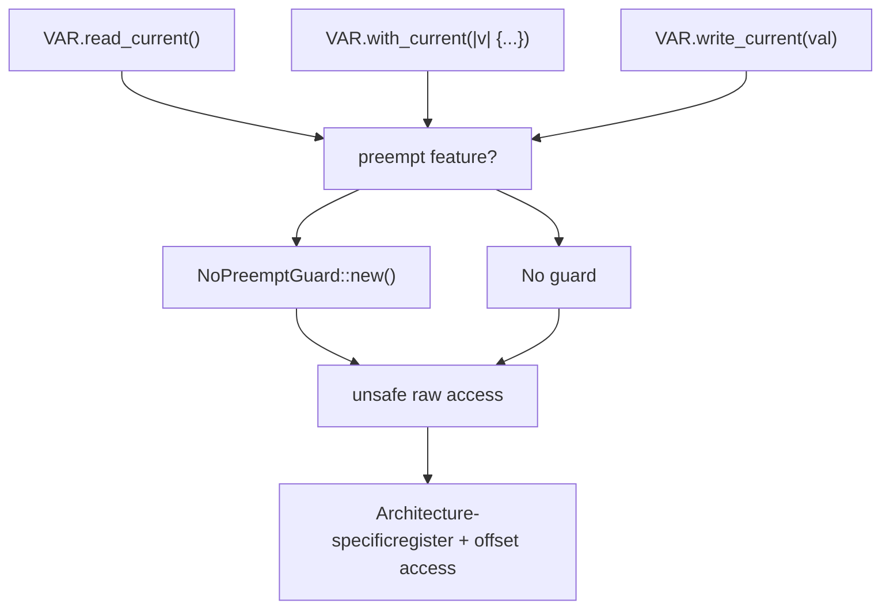
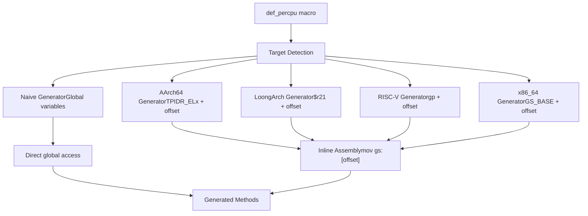

# def_percpu Macro

> **Relevant source files**
> * [README.md](https://github.com/arceos-org/percpu/blob/89c8a54c/README.md)
> * [percpu/tests/test_percpu.rs](https://github.com/arceos-org/percpu/blob/89c8a54c/percpu/tests/test_percpu.rs)
> * [percpu_macros/src/lib.rs](https://github.com/arceos-org/percpu/blob/89c8a54c/percpu_macros/src/lib.rs)

The `def_percpu` macro is the primary interface for defining per-CPU static variables. It transforms a standard static variable declaration into a per-CPU data structure with architecture-specific access methods and automatic memory layout management.

For information about the runtime initialization and register management, see [Runtime Functions](/arceos-org/percpu/4.2-runtime-functions). For details about preemption safety and guard mechanisms, see [Safety and Preemption](/arceos-org/percpu/4.3-safety-and-preemption).

## Syntax and Basic Usage

The `def_percpu` macro is applied as an attribute to static variable declarations:

```
#[percpu::def_percpu]
static VARIABLE_NAME: Type = initial_value;
```

The macro accepts no parameters and must be applied to `static` variables only. The original variable name becomes the public interface, while the macro generates the underlying implementation.

**Code Transformation Overview**



Sources: [percpu_macros/src/lib.rs(L71 - L91)&emsp;](https://github.com/arceos-org/percpu/blob/89c8a54c/percpu_macros/src/lib.rs#L71-L91) [percpu_macros/src/lib.rs(L149 - L159)&emsp;](https://github.com/arceos-org/percpu/blob/89c8a54c/percpu_macros/src/lib.rs#L149-L159)

## Generated Code Structure

For each variable `X` with type `T`, the macro generates three main components:

|Component|Name Pattern|Purpose|Visibility|
| --- | --- | --- | --- |
|Storage Variable|__PERCPU_X|Actual data storage in.percpusection|Private|
|Wrapper Struct|X_WRAPPER|Access methods container|Matches original|
|Public Interface|X|User-facing API|Matches original|

**Generated Items Relationship**



Sources: [percpu_macros/src/lib.rs(L33 - L52)&emsp;](https://github.com/arceos-org/percpu/blob/89c8a54c/percpu_macros/src/lib.rs#L33-L52) [percpu_macros/src/lib.rs(L88 - L89)&emsp;](https://github.com/arceos-org/percpu/blob/89c8a54c/percpu_macros/src/lib.rs#L88-L89) [percpu_macros/src/lib.rs(L149 - L159)&emsp;](https://github.com/arceos-org/percpu/blob/89c8a54c/percpu_macros/src/lib.rs#L149-L159)

## Available Methods

The generated wrapper struct provides different sets of methods depending on the data type and enabled features.

### Core Methods (All Types)

These methods are available for all per-CPU variables regardless of type:

|Method|Return Type|Safety|Purpose|
| --- | --- | --- | --- |
|offset()|usize|Safe|Returns offset from per-CPU area base|
|current_ptr()|*const T|Unsafe|Raw pointer to current CPU's data|
|current_ref_raw()|&T|Unsafe|Reference to current CPU's data|
|current_ref_mut_raw()|&mut T|Unsafe|Mutable reference to current CPU's data|
|with_current<F, R>(f: F) -> R|R|Safe|Execute closure with mutable reference|

### Remote Access Methods

These methods enable access to per-CPU data on other CPUs:

|Method|Parameters|Return Type|Safety Requirements|
| --- | --- | --- | --- |
|remote_ptr(cpu_id)|usize|*const T|Valid CPU ID, no data races|
|remote_ref_raw(cpu_id)|usize|&T|Valid CPU ID, no data races|
|remote_ref_mut_raw(cpu_id)|usize|&mut T|Valid CPU ID, no data races|

### Primitive Type Methods

Additional methods for primitive integer types (`bool`, `u8`, `u16`, `u32`, `u64`, `usize`):

|Method|Parameters|Safety|Preemption Handling|
| --- | --- | --- | --- |
|read_current()|None|Safe|Automatic guard|
|write_current(val)|T|Safe|Automatic guard|
|read_current_raw()|None|Unsafe|Manual management|
|write_current_raw(val)|T|Unsafe|Manual management|

Sources: [percpu_macros/src/lib.rs(L161 - L248)&emsp;](https://github.com/arceos-org/percpu/blob/89c8a54c/percpu_macros/src/lib.rs#L161-L248) [percpu_macros/src/lib.rs(L100 - L145)&emsp;](https://github.com/arceos-org/percpu/blob/89c8a54c/percpu_macros/src/lib.rs#L100-L145)

## Preemption Safety Integration

The macro automatically integrates with the preemption safety system when the `preempt` feature is enabled:

**Preemption Guard Integration**



Sources: [percpu_macros/src/lib.rs(L94 - L98)&emsp;](https://github.com/arceos-org/percpu/blob/89c8a54c/percpu_macros/src/lib.rs#L94-L98) [percpu_macros/src/lib.rs(L129 - L139)&emsp;](https://github.com/arceos-org/percpu/blob/89c8a54c/percpu_macros/src/lib.rs#L129-L139) [percpu_macros/src/lib.rs(L201 - L207)&emsp;](https://github.com/arceos-org/percpu/blob/89c8a54c/percpu_macros/src/lib.rs#L201-L207)

## Data Type Support and Behavior

### Primitive Integer Types

For `bool`, `u8`, `u16`, `u32`, `u64`, and `usize`, the macro generates optimized read/write methods:

```javascript
// Example usage for primitive types
COUNTER.write_current(42);
let value = COUNTER.read_current();
```

The macro detects primitive types through string comparison of the type representation.

### Custom Structures and Complex Types

For non-primitive types, only the core access methods are generated. Access requires using `with_current()` or the raw pointer methods:

```
// Example usage for custom types
CUSTOM_STRUCT.with_current(|s| {
    s.field1 = new_value;
    s.field2 += increment;
});
```

Sources: [percpu_macros/src/lib.rs(L91 - L93)&emsp;](https://github.com/arceos-org/percpu/blob/89c8a54c/percpu_macros/src/lib.rs#L91-L93) [percpu_macros/src/lib.rs(L100 - L145)&emsp;](https://github.com/arceos-org/percpu/blob/89c8a54c/percpu_macros/src/lib.rs#L100-L145)

## Architecture-Specific Code Generation

The macro delegates architecture-specific code generation to the `arch` module, which varies based on the target platform:

**Architecture Code Generation Pipeline**



Sources: [percpu_macros/src/lib.rs(L59 - L60)&emsp;](https://github.com/arceos-org/percpu/blob/89c8a54c/percpu_macros/src/lib.rs#L59-L60) [percpu_macros/src/lib.rs(L102 - L104)&emsp;](https://github.com/arceos-org/percpu/blob/89c8a54c/percpu_macros/src/lib.rs#L102-L104) [percpu_macros/src/lib.rs(L147 - L148)&emsp;](https://github.com/arceos-org/percpu/blob/89c8a54c/percpu_macros/src/lib.rs#L147-L148)

## Usage Examples

### Basic Primitive Type

```javascript
#[percpu::def_percpu]
static COUNTER: usize = 0;

// Safe access with automatic preemption handling
COUNTER.write_current(42);
let value = COUNTER.read_current();
```

### Custom Structure

```css
struct Stats {
    operations: u64,
    errors: u32,
}

#[percpu::def_percpu]
static CPU_STATS: Stats = Stats { operations: 0, errors: 0 };

// Access through closure
CPU_STATS.with_current(|stats| {
    stats.operations += 1;
    if error_occurred {
        stats.errors += 1;
    }
});
```

### Remote CPU Access

```javascript
// Access data on a specific CPU (unsafe)
unsafe {
    let remote_value = *COUNTER.remote_ptr(cpu_id);
    *COUNTER.remote_ref_mut_raw(cpu_id) = new_value;
}
```

Sources: [README.md(L39 - L52)&emsp;](https://github.com/arceos-org/percpu/blob/89c8a54c/README.md#L39-L52) [percpu/tests/test_percpu.rs(L7 - L32)&emsp;](https://github.com/arceos-org/percpu/blob/89c8a54c/percpu/tests/test_percpu.rs#L7-L32) [percpu/tests/test_percpu.rs(L71 - L101)&emsp;](https://github.com/arceos-org/percpu/blob/89c8a54c/percpu/tests/test_percpu.rs#L71-L101)

## Error Conditions

The macro will generate compile-time errors in the following cases:

|Condition|Error Message|
| --- | --- |
|Non-empty attribute|expect an empty attribute: #[def_percpu]|
|Non-static item|Parser error fromsyn::parse_macro_input!|
|Invalid syntax|Various parser errors fromsyn|

Sources: [percpu_macros/src/lib.rs(L73 - L78)&emsp;](https://github.com/arceos-org/percpu/blob/89c8a54c/percpu_macros/src/lib.rs#L73-L78) [percpu_macros/src/lib.rs(L80)&emsp;](https://github.com/arceos-org/percpu/blob/89c8a54c/percpu_macros/src/lib.rs#L80-L80)

## Feature-Specific Behavior

The macro behavior changes based on enabled Cargo features:

* **`sp-naive`**: Uses global variables instead of per-CPU areas
* **`preempt`**: Automatically includes `NoPreemptGuard` in safe methods
* **`arm-el2`**: Targets `TPIDR_EL2` register instead of `TPIDR_EL1`

For detailed information about these features, see [Feature Flags Configuration](/arceos-org/percpu/2.3-feature-flags-configuration).

Sources: [percpu_macros/src/lib.rs(L94 - L98)&emsp;](https://github.com/arceos-org/percpu/blob/89c8a54c/percpu_macros/src/lib.rs#L94-L98) [README.md(L69 - L79)&emsp;](https://github.com/arceos-org/percpu/blob/89c8a54c/README.md#L69-L79)