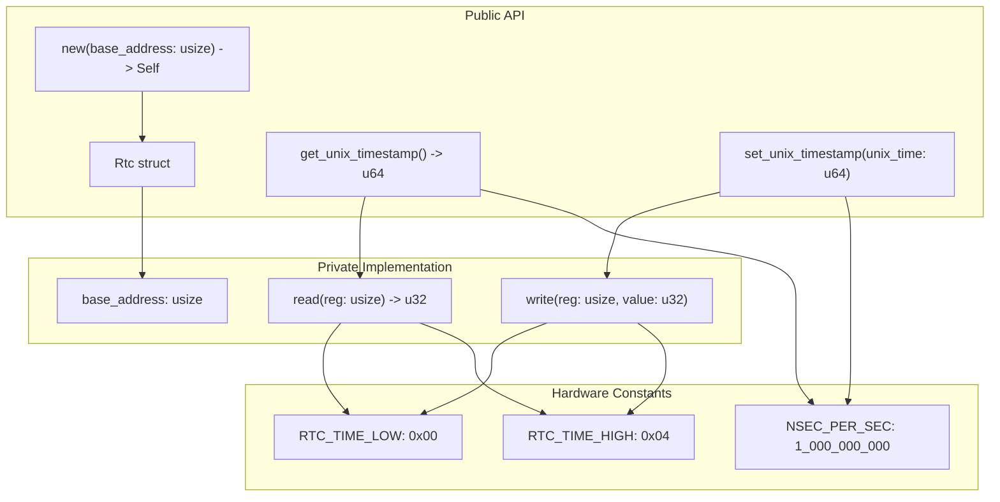
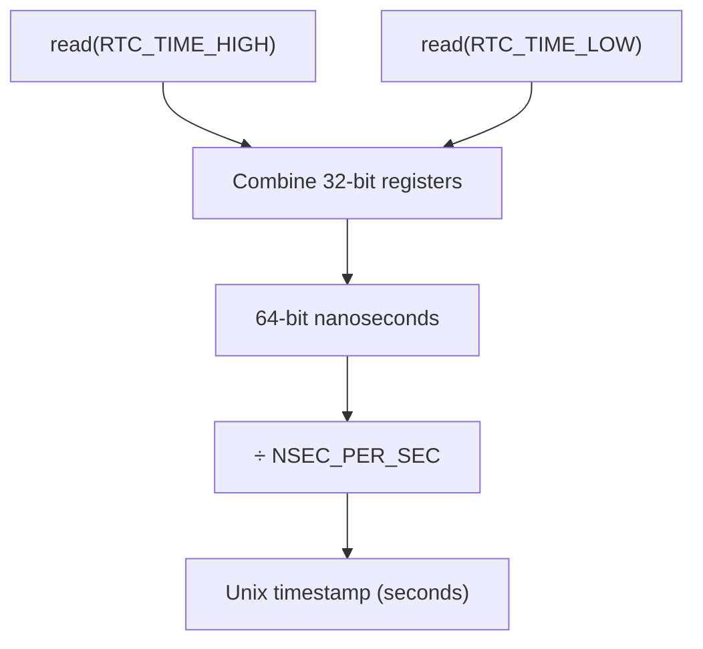
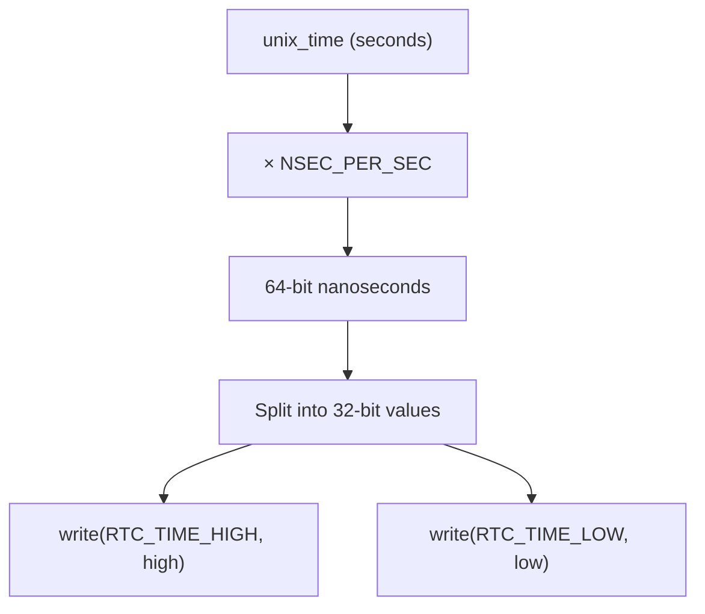

# API Reference

> **Relevant source files**
> * [README.md](https://github.com/arceos-org/riscv_goldfish/blob/61e0493d/README.md)
> * [src/lib.rs](https://github.com/arceos-org/riscv_goldfish/blob/61e0493d/src/lib.rs)

This document provides comprehensive reference documentation for the public API of the `riscv_goldfish` crate. The API consists of a single `Rtc` struct that provides a safe, high-level interface to the Goldfish RTC hardware through memory-mapped I/O operations.

For hardware-specific implementation details and register layouts, see [Hardware Interface](/arceos-org/riscv_goldfish/2.2-hardware-interface). For time conversion algorithms and data flow, see [Time Conversion](/arceos-org/riscv_goldfish/2.3-time-conversion).

## Public API Overview

The `riscv_goldfish` crate exposes a minimal but complete API through the `Rtc` struct and its associated methods. The API follows standard Rust conventions for hardware driver interfaces.

### API Structure Diagram



Sources: [src/lib.rs(L11 - L50)&emsp;](https://github.com/arceos-org/riscv_goldfish/blob/61e0493d/src/lib.rs#L11-L50)

## Constructor

### Rtc::new

```rust
pub fn new(base_address: usize) -> Self
```

Creates a new `Rtc` instance that interfaces with Goldfish RTC hardware at the specified memory address.

**Parameters:**

* `base_address`: The physical base address of the RTC device's memory-mapped registers, typically obtained from device tree configuration

**Returns:**

* A new `Rtc` instance ready for timestamp operations

**Safety:**
The constructor itself is safe, but subsequent operations assume the provided `base_address` points to valid, accessible RTC hardware registers. Invalid addresses will cause undefined behavior during read/write operations.

**Example:**

```javascript
use riscv_goldfish::Rtc;

// Address from device tree: rtc@101000
let rtc = Rtc::new(0x101000);
```

Sources: [src/lib.rs(L27 - L33)&emsp;](https://github.com/arceos-org/riscv_goldfish/blob/61e0493d/src/lib.rs#L27-L33) [README.md(L12)&emsp;](https://github.com/arceos-org/riscv_goldfish/blob/61e0493d/README.md#L12-L12) [README.md(L24 - L29)&emsp;](https://github.com/arceos-org/riscv_goldfish/blob/61e0493d/README.md#L24-L29)

## Timestamp Operations

### get_unix_timestamp

```rust
pub fn get_unix_timestamp(&self) -> u64
```

Reads the current time from the RTC hardware and returns it as seconds since the Unix epoch (January 1, 1970, 00:00:00 UTC).

**Returns:**

* Current time as Unix timestamp in seconds

**Implementation Details:**
The method performs two 32-bit register reads to construct a 64-bit nanosecond value, then converts to seconds by dividing by `NSEC_PER_SEC`.



Sources: [src/lib.rs(L35 - L40)&emsp;](https://github.com/arceos-org/riscv_goldfish/blob/61e0493d/src/lib.rs#L35-L40)

### set_unix_timestamp

```rust
pub fn set_unix_timestamp(&self, unix_time: u64)
```

Sets the RTC hardware clock to the specified Unix timestamp.

**Parameters:**

* `unix_time`: Time in seconds since Unix epoch

**Implementation Details:**
The method converts the Unix timestamp to nanoseconds, then writes the value as two 32-bit register operations. The high-order register is written first, followed by the low-order register.



Sources: [src/lib.rs(L42 - L49)&emsp;](https://github.com/arceos-org/riscv_goldfish/blob/61e0493d/src/lib.rs#L42-L49)

## Usage Patterns

### Basic Time Reading

```javascript
use riscv_goldfish::Rtc;

let rtc = Rtc::new(0x101000);
let current_time = rtc.get_unix_timestamp();
println!("Current time: {} seconds since epoch", current_time);
```

### Time Setting and Verification

```javascript
use riscv_goldfish::Rtc;

let rtc = Rtc::new(0x101000);

// Set time to a specific timestamp
let target_time = 1640995200; // January 1, 2022, 00:00:00 UTC
rtc.set_unix_timestamp(target_time);

// Verify the time was set correctly
let actual_time = rtc.get_unix_timestamp();
assert_eq!(actual_time, target_time);
```

### Device Tree Integration

The base address parameter is typically obtained from device tree parsing:

|Property|Value|Description|
| --- | --- | --- |
|compatible|"google,goldfish-rtc"|Device identification|
|reg|<0x00 0x101000 0x00 0x1000>|Base address and size|
|interrupts|<0x0b>|Interrupt number (unused by driver)|

Sources: [README.md(L15 - L32)&emsp;](https://github.com/arceos-org/riscv_goldfish/blob/61e0493d/README.md#L15-L32)

## Constants and Internal Implementation

### Hardware Register Offsets

|Constant|Value|Purpose|
| --- | --- | --- |
|RTC_TIME_LOW|0x00|Lower 32 bits of nanosecond timestamp|
|RTC_TIME_HIGH|0x04|Upper 32 bits of nanosecond timestamp|

### Time Conversion

|Constant|Value|Purpose|
| --- | --- | --- |
|NSEC_PER_SEC|1_000_000_000|Nanoseconds per second conversion factor|

### Memory-Mapped I/O Operations

The driver uses unsafe volatile operations for hardware access:

|Method|Purpose|Safety Requirements|
| --- | --- | --- |
|read(reg: usize)|Read 32-bit register value|Valid base address + register offset|
|write(reg: usize, value: u32)|Write 32-bit register value|Valid base address + register offset|

Sources: [src/lib.rs(L6 - L9)&emsp;](https://github.com/arceos-org/riscv_goldfish/blob/61e0493d/src/lib.rs#L6-L9) [src/lib.rs(L17 - L24)&emsp;](https://github.com/arceos-org/riscv_goldfish/blob/61e0493d/src/lib.rs#L17-L24)

## API Constraints and Limitations

### Thread Safety

The `Rtc` struct does not implement `Send` or `Sync` traits. Multiple threads accessing the same RTC instance require external synchronization.

### Error Handling

The API does not return `Result` types. Invalid memory addresses or hardware failures will cause undefined behavior rather than recoverable errors.

### Platform Requirements

* Requires `no_std` environment compatibility
* Assumes little-endian byte ordering for register operations
* Requires unsafe memory access capabilities

Sources: [src/lib.rs(L4)&emsp;](https://github.com/arceos-org/riscv_goldfish/blob/61e0493d/src/lib.rs#L4-L4) [src/lib.rs(L17 - L23)&emsp;](https://github.com/arceos-org/riscv_goldfish/blob/61e0493d/src/lib.rs#L17-L23)