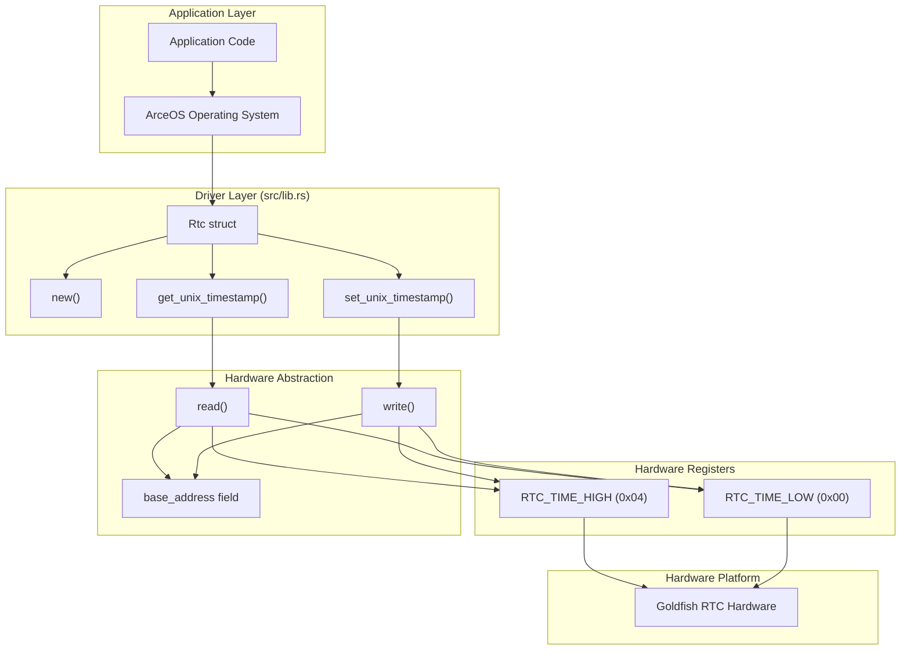
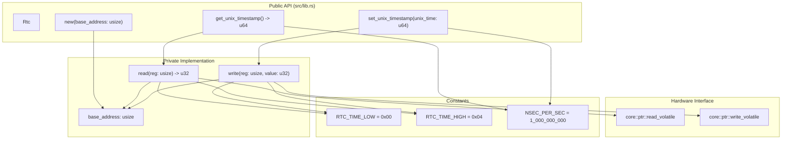
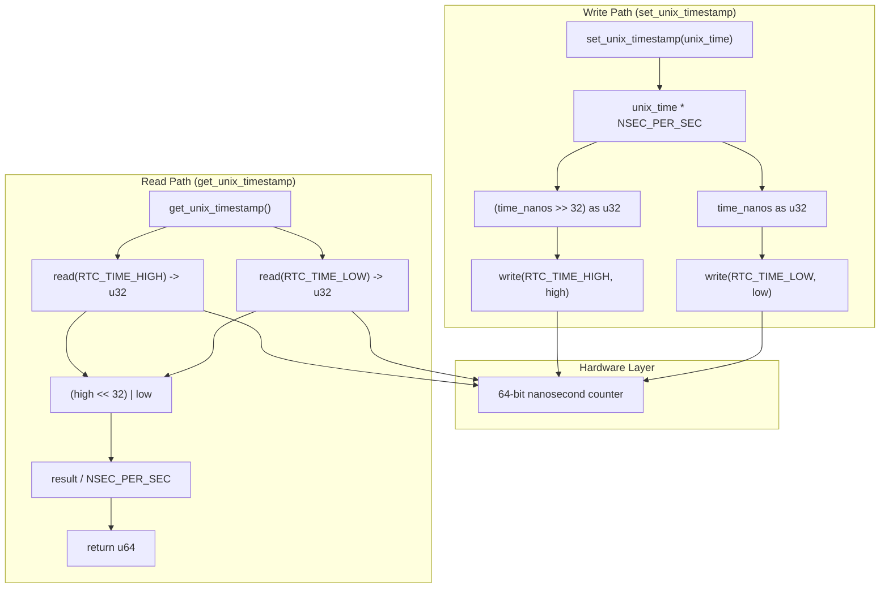
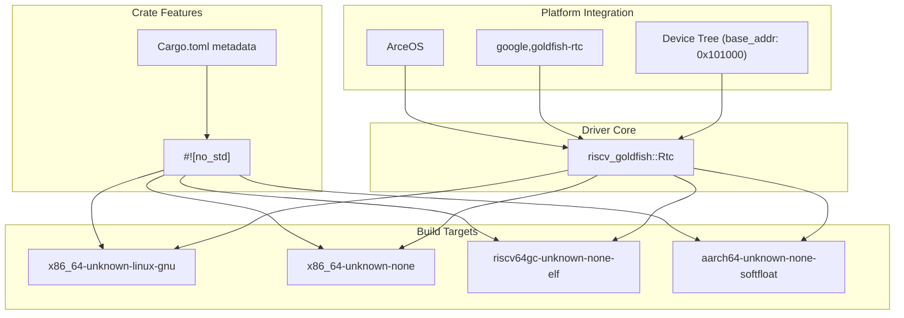

# Architecture Overview

> **Relevant source files**
> * [README.md](https://github.com/arceos-org/riscv_goldfish/blob/61e0493d/README.md)
> * [src/lib.rs](https://github.com/arceos-org/riscv_goldfish/blob/61e0493d/src/lib.rs)

This document provides a high-level view of the `riscv_goldfish` system architecture, showing how the RTC driver components integrate from the hardware layer up to application interfaces. It covers the overall system stack, component relationships, and data flow patterns without diving into implementation details.

For detailed API documentation, see [API Reference](/arceos-org/riscv_goldfish/2.1-api-reference). For hardware register specifics, see [Hardware Interface](/arceos-org/riscv_goldfish/2.2-hardware-interface). For time conversion implementation details, see [Time Conversion](/arceos-org/riscv_goldfish/2.3-time-conversion).

## System Stack Architecture

The `riscv_goldfish` driver operates within a layered architecture that spans from hardware registers to application-level time services:

This architecture demonstrates the clear separation of concerns between application logic, driver abstraction, hardware interface, and physical hardware. The `Rtc` struct serves as the primary abstraction boundary, providing a safe interface to unsafe hardware operations.

**Sources: [src/lib.rs(L11 - L14)&emsp;](https://github.com/arceos-org/riscv_goldfish/blob/61e0493d/src/lib.rs#L11-L14) [src/lib.rs(L26 - L33)&emsp;](https://github.com/arceos-org/riscv_goldfish/blob/61e0493d/src/lib.rs#L26-L33) [src/lib.rs(L35 - L49)&emsp;](https://github.com/arceos-org/riscv_goldfish/blob/61e0493d/src/lib.rs#L35-L49)**

## Component Architecture

The core driver architecture centers around the `Rtc` struct and its associated methods:

The component design follows a minimal surface area principle with only three public methods exposed. The private `read` and `write` methods encapsulate all unsafe hardware interactions, while constants define the register layout and time conversion factors.

**Sources: [src/lib.rs(L6 - L9)&emsp;](https://github.com/arceos-org/riscv_goldfish/blob/61e0493d/src/lib.rs#L6-L9) [src/lib.rs(L12 - L14)&emsp;](https://github.com/arceos-org/riscv_goldfish/blob/61e0493d/src/lib.rs#L12-L14) [src/lib.rs(L17 - L23)&emsp;](https://github.com/arceos-org/riscv_goldfish/blob/61e0493d/src/lib.rs#L17-L23) [src/lib.rs(L27 - L49)&emsp;](https://github.com/arceos-org/riscv_goldfish/blob/61e0493d/src/lib.rs#L27-L49)**

## Data Flow Architecture

The driver implements bidirectional data flow between Unix timestamps and hardware nanosecond values:

The data flow demonstrates the critical conversion between user-space Unix timestamps (seconds) and hardware nanosecond representation. The 64-bit hardware value must be split across two 32-bit registers for write operations and reconstructed for read operations.

**Sources: [src/lib.rs(L36 - L40)&emsp;](https://github.com/arceos-org/riscv_goldfish/blob/61e0493d/src/lib.rs#L36-L40) [src/lib.rs(L43 - L49)&emsp;](https://github.com/arceos-org/riscv_goldfish/blob/61e0493d/src/lib.rs#L43-L49) [src/lib.rs(L9)&emsp;](https://github.com/arceos-org/riscv_goldfish/blob/61e0493d/src/lib.rs#L9-L9)**

## Integration Architecture

The driver integrates within the broader ArceOS ecosystem and cross-platform build system:

The integration architecture shows how the `no_std` design enables cross-compilation to multiple targets while maintaining compatibility with the ArceOS operating system. Device tree integration provides the necessary `base_address` configuration for hardware discovery.

**Sources: [src/lib.rs(L4)&emsp;](https://github.com/arceos-org/riscv_goldfish/blob/61e0493d/src/lib.rs#L4-L4) [README.md(L15 - L32)&emsp;](https://github.com/arceos-org/riscv_goldfish/blob/61e0493d/README.md#L15-L32) [README.md(L5)&emsp;](https://github.com/arceos-org/riscv_goldfish/blob/61e0493d/README.md#L5-L5) [README.md(L10 - L13)&emsp;](https://github.com/arceos-org/riscv_goldfish/blob/61e0493d/README.md#L10-L13)**