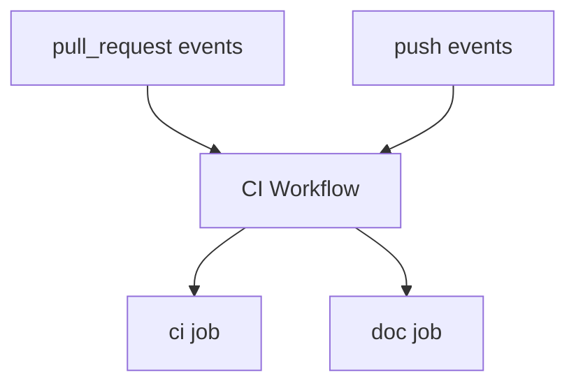
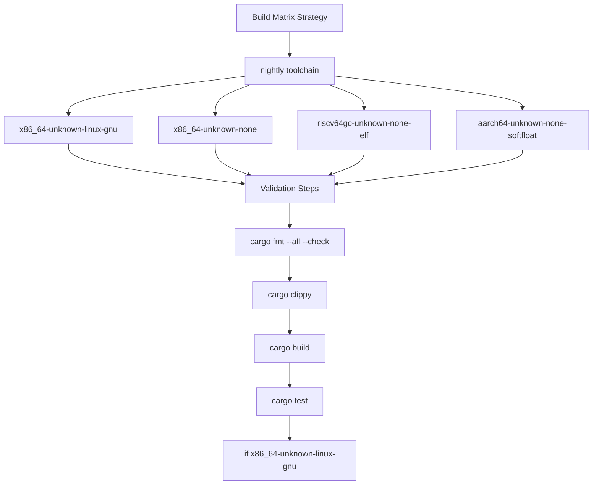
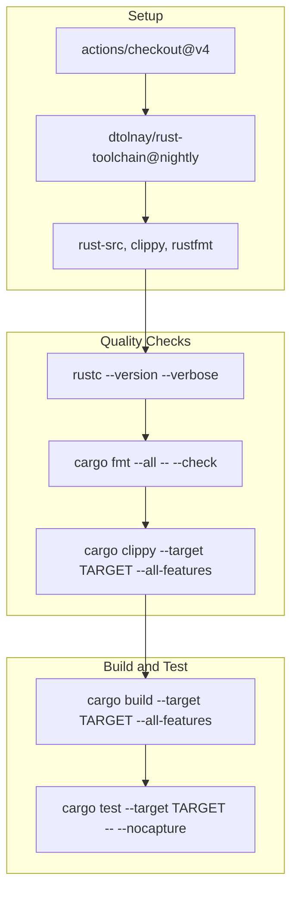
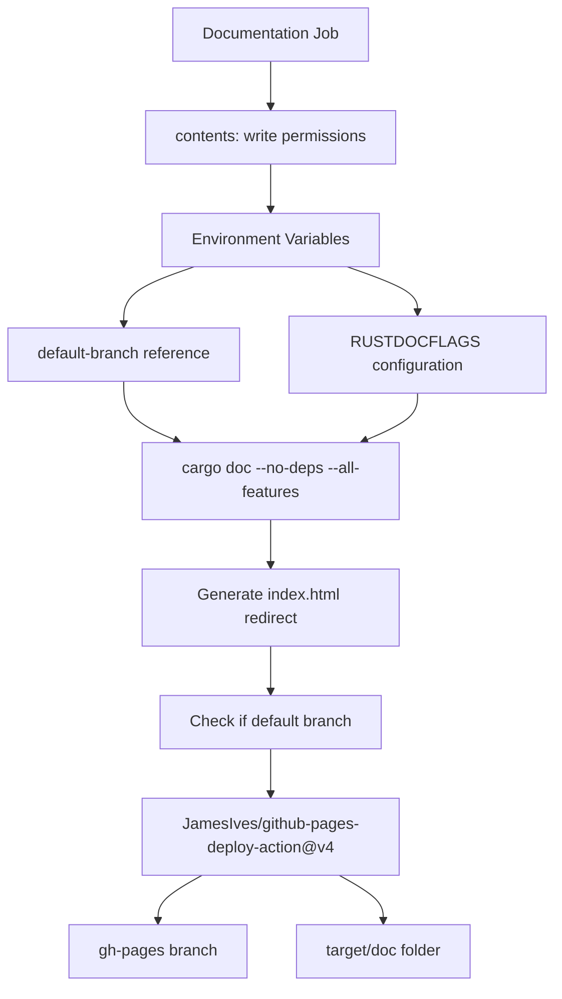
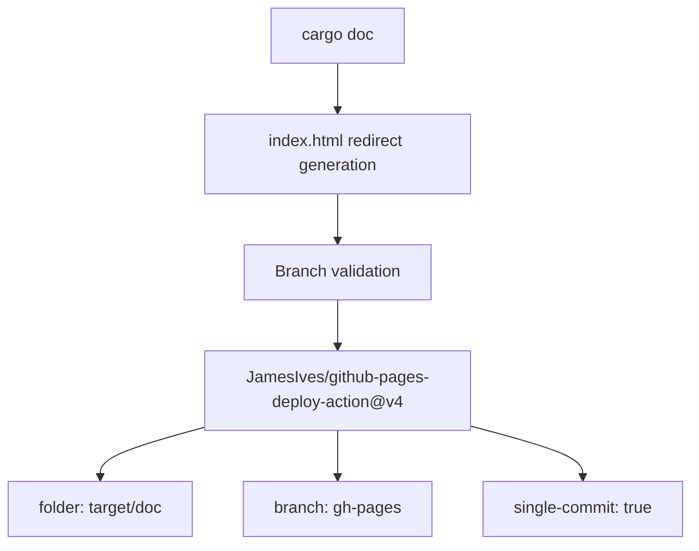

# CI/CD Pipeline

> **Relevant source files**
> * [.github/workflows/ci.yml](https://github.com/arceos-org/riscv_goldfish/blob/61e0493d/.github/workflows/ci.yml)

This document covers the automated continuous integration and continuous deployment pipeline for the riscv_goldfish crate. The pipeline validates code quality, builds across multiple target architectures, runs tests, and automatically deploys documentation.

For information about local development environment setup, see [Development Environment Setup](/arceos-org/riscv_goldfish/4.2-development-environment-setup). For details about supported target platforms and cross-compilation, see [Target Platforms and Cross-Compilation](/arceos-org/riscv_goldfish/3.1-target-platforms-and-cross-compilation).

## Pipeline Overview

The CI/CD pipeline is implemented using GitHub Actions and consists of two primary workflows: code validation (`ci` job) and documentation deployment (`doc` job). The pipeline ensures code quality across multiple architectures while maintaining comprehensive documentation.

### Workflow Trigger Configuration



**Sources:** [.github/workflows/ci.yml(L3)&emsp;](https://github.com/arceos-org/riscv_goldfish/blob/61e0493d/.github/workflows/ci.yml#L3-L3)

## Multi-Architecture Build Matrix

The CI pipeline validates the codebase across four target architectures using a build matrix strategy. This ensures the `no_std` crate compiles correctly for both hosted and bare-metal environments.

### Target Architecture Matrix

|Target|Purpose|Testing|
| --- | --- | --- |
|x86_64-unknown-linux-gnu|Development and testing|Full unit tests|
|x86_64-unknown-none|Bare-metal x86_64|Build-only|
|riscv64gc-unknown-none-elf|Primary RISC-V target|Build-only|
|aarch64-unknown-none-softfloat|ARM64 embedded|Build-only|

### Build Matrix Flow



**Sources:** [.github/workflows/ci.yml(L8 - L12)&emsp;](https://github.com/arceos-org/riscv_goldfish/blob/61e0493d/.github/workflows/ci.yml#L8-L12) [.github/workflows/ci.yml(L22 - L30)&emsp;](https://github.com/arceos-org/riscv_goldfish/blob/61e0493d/.github/workflows/ci.yml#L22-L30)

## Code Quality Validation Pipeline

The pipeline enforces code quality through multiple validation stages executed for each target architecture.

### Validation Stage Details



**Sources:** [.github/workflows/ci.yml(L14 - L30)&emsp;](https://github.com/arceos-org/riscv_goldfish/blob/61e0493d/.github/workflows/ci.yml#L14-L30)

### Clippy Configuration

The pipeline uses specific clippy configuration to suppress false positives while maintaining code quality:

* Allows `clippy::new_without_default` warnings since the RTC driver requires a base address parameter

**Sources:** [.github/workflows/ci.yml(L25)&emsp;](https://github.com/arceos-org/riscv_goldfish/blob/61e0493d/.github/workflows/ci.yml#L25-L25)

## Documentation Generation and Deployment

The documentation workflow builds API documentation and automatically deploys it to GitHub Pages for the default branch.

### Documentation Workflow



**Sources:** [.github/workflows/ci.yml(L32 - L55)&emsp;](https://github.com/arceos-org/riscv_goldfish/blob/61e0493d/.github/workflows/ci.yml#L32-L55)

### Documentation Quality Enforcement

The pipeline enforces documentation quality through `RUSTDOCFLAGS`:

```yaml
RUSTDOCFLAGS: -D rustdoc::broken_intra_doc_links -D missing-docs
```

This configuration:

* Treats broken internal documentation links as errors (`-D rustdoc::broken_intra_doc_links`)
* Requires documentation for all public items (`-D missing-docs`)

**Sources:** [.github/workflows/ci.yml(L40)&emsp;](https://github.com/arceos-org/riscv_goldfish/blob/61e0493d/.github/workflows/ci.yml#L40-L40)

### GitHub Pages Deployment Strategy



The deployment only occurs for pushes to the default branch, with pull requests receiving build validation but no deployment.

**Sources:** [.github/workflows/ci.yml(L49 - L55)&emsp;](https://github.com/arceos-org/riscv_goldfish/blob/61e0493d/.github/workflows/ci.yml#L49-L55)

## Pipeline Configuration Summary

### Job Execution Environment

Both CI jobs execute on `ubuntu-latest` runners with the following characteristics:

* **Rust Toolchain**: Nightly (required for `no_std` development)
* **Failure Strategy**: `fail-fast: false` allows other matrix jobs to continue if one fails
* **Required Components**: `rust-src`, `clippy`, `rustfmt`

### Testing Strategy

The pipeline implements a tiered testing approach:

1. **Format and Lint**: Applied to all targets
2. **Build Validation**: Applied to all targets
3. **Unit Testing**: Limited to `x86_64-unknown-linux-gnu` due to test execution constraints

This strategy ensures cross-platform compatibility while providing comprehensive testing coverage where practically feasible.

**Sources:** [.github/workflows/ci.yml(L1 - L56)&emsp;](https://github.com/arceos-org/riscv_goldfish/blob/61e0493d/.github/workflows/ci.yml#L1-L56)