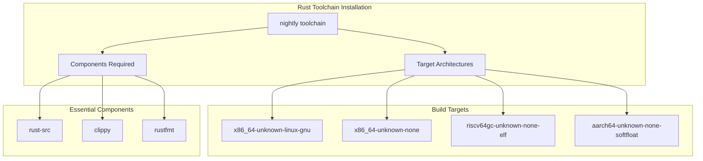
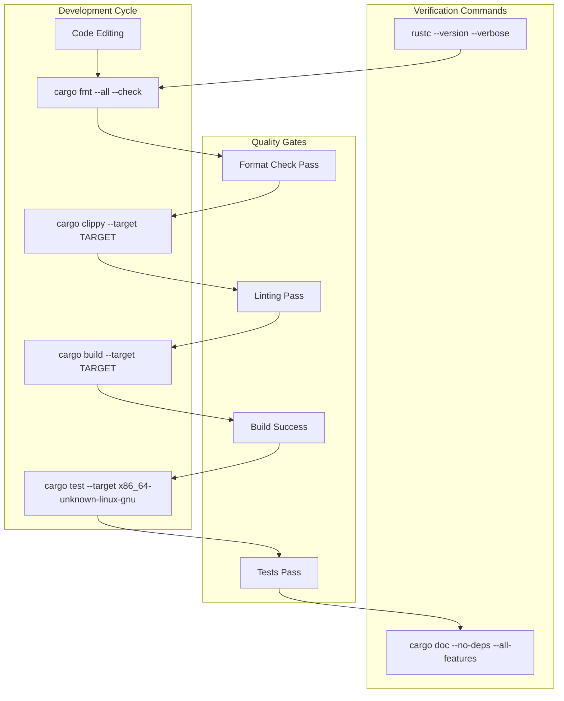
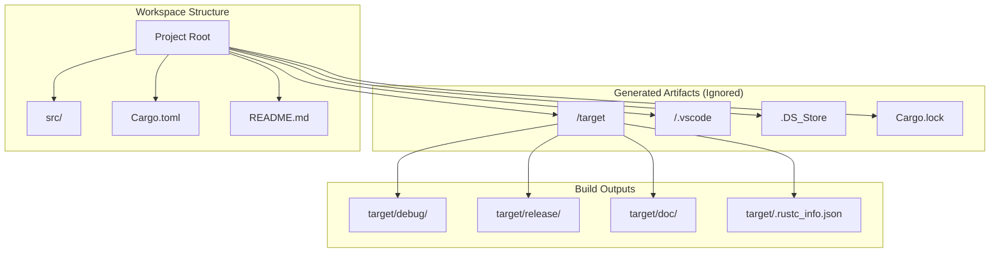
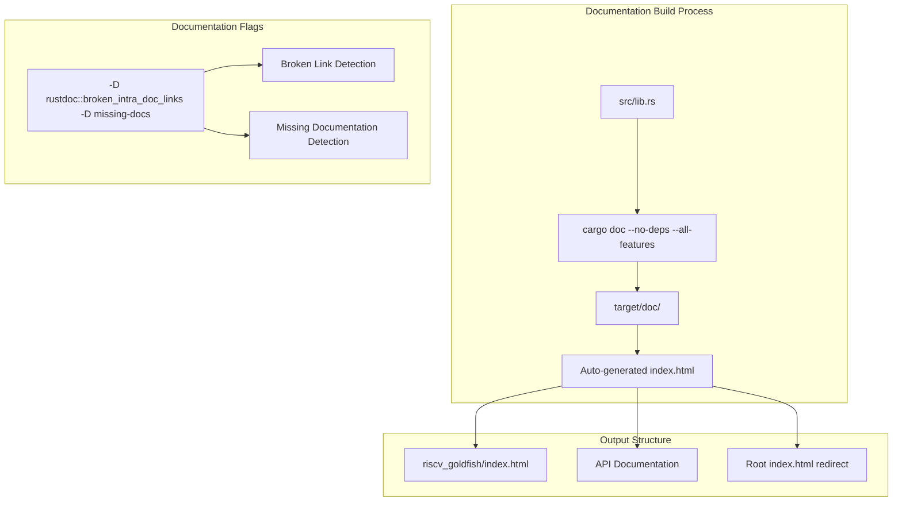

# Development Environment Setup

> **Relevant source files**
> * [.github/workflows/ci.yml](https://github.com/arceos-org/riscv_goldfish/blob/61e0493d/.github/workflows/ci.yml)
> * [.gitignore](https://github.com/arceos-org/riscv_goldfish/blob/61e0493d/.gitignore)

This document provides comprehensive instructions for setting up a local development environment for the riscv_goldfish RTC driver. It covers toolchain installation, environment configuration, and development workflow procedures necessary for contributing to the codebase.

For information about the CI/CD pipeline and automated testing, see [CI/CD Pipeline](/arceos-org/riscv_goldfish/4.1-cicd-pipeline). For details about target platform configuration and cross-compilation, see [Target Platforms and Cross-Compilation](/arceos-org/riscv_goldfish/3.1-target-platforms-and-cross-compilation).

## Prerequisites and Toolchain Requirements

The riscv_goldfish driver requires a specific Rust toolchain configuration to support cross-compilation across multiple embedded targets. The development environment must be capable of building for bare-metal and no_std targets.

### Rust Toolchain Setup

The project requires Rust nightly toolchain with specific components and target architectures. The CI pipeline defines the exact requirements that must be replicated locally.

**Required Toolchain Installation Commands:**

|Component|Installation Command|
| --- | --- |
|Nightly Toolchain|rustup toolchain install nightly|
|rust-src Component|rustup component add rust-src --toolchain nightly|
|clippy Component|rustup component add clippy --toolchain nightly|
|rustfmt Component|rustup component add rustfmt --toolchain nightly|
|x86_64-unknown-linux-gnu|rustup target add x86_64-unknown-linux-gnu --toolchain nightly|
|x86_64-unknown-none|rustup target add x86_64-unknown-none --toolchain nightly|
|riscv64gc-unknown-none-elf|rustup target add riscv64gc-unknown-none-elf --toolchain nightly|
|aarch64-unknown-none-softfloat|rustup target add aarch64-unknown-none-softfloat --toolchain nightly|

Sources: [.github/workflows/ci.yml(L11 - L19)&emsp;](https://github.com/arceos-org/riscv_goldfish/blob/61e0493d/.github/workflows/ci.yml#L11-L19)

## Local Development Workflow

The development workflow mirrors the CI pipeline to ensure consistency between local development and automated testing. Each step corresponds to a specific quality gate that must pass before code submission.

### Development Command Reference

|Development Task|Command|Target Requirement|
| --- | --- | --- |
|Format Check|cargo fmt --all -- --check|All|
|Auto Format|cargo fmt --all|All|
|Linting|cargo clippy --target $TARGET --all-features -- -A clippy::new_without_default|Each target|
|Build|cargo build --target $TARGET --all-features|Each target|
|Unit Tests|cargo test --target x86_64-unknown-linux-gnu -- --nocapture|x86_64-unknown-linux-gnu only|
|Documentation|cargo doc --no-deps --all-features|Any|
|Version Check|rustc --version --verbose|Any|

Sources: [.github/workflows/ci.yml(L20 - L30)&emsp;](https://github.com/arceos-org/riscv_goldfish/blob/61e0493d/.github/workflows/ci.yml#L20-L30) [.github/workflows/ci.yml(L44 - L48)&emsp;](https://github.com/arceos-org/riscv_goldfish/blob/61e0493d/.github/workflows/ci.yml#L44-L48)

## Build Artifacts and Ignored Files

The development environment generates various artifacts and temporary files that are excluded from version control through `.gitignore` configuration.

### Ignored File Categories

|File/Directory|Purpose|Reason for Ignoring|
| --- | --- | --- |
|/target|Cargo build artifacts|Generated content, platform-specific|
|/.vscode|VS Code workspace settings|Editor-specific configuration|
|.DS_Store|macOS system metadata|Platform-specific system files|
|Cargo.lock|Dependency lock file|Library crate, consumers manage versions|

Sources: [.gitignore(L1 - L4)&emsp;](https://github.com/arceos-org/riscv_goldfish/blob/61e0493d/.gitignore#L1-L4)

## Documentation Generation and Verification

Local documentation generation follows the same process as the CI pipeline, ensuring documentation quality and link integrity.

### Local Documentation Commands

|Task|Command|Environment Variable|
| --- | --- | --- |
|Build Documentation|cargo doc --no-deps --all-features|RUSTDOCFLAGS="-D rustdoc::broken_intra_doc_links -D missing-docs"|
|Open Documentation|cargo doc --no-deps --all-features --open|Same as above|
|Check Links Only|cargo doc --no-deps|RUSTDOCFLAGS="-D rustdoc::broken_intra_doc_links"|

Sources: [.github/workflows/ci.yml(L40)&emsp;](https://github.com/arceos-org/riscv_goldfish/blob/61e0493d/.github/workflows/ci.yml#L40-L40) [.github/workflows/ci.yml(L44 - L48)&emsp;](https://github.com/arceos-org/riscv_goldfish/blob/61e0493d/.github/workflows/ci.yml#L44-L48)

## Cross-Target Development Verification

Development workflow must verify functionality across all supported target architectures. This ensures the `no_std` compatibility and cross-platform portability requirements are maintained.

### Target-Specific Build Matrix

|Target Architecture|Build Command|Test Support|Primary Use Case|
| --- | --- | --- | --- |
|x86_64-unknown-linux-gnu|cargo build --target x86_64-unknown-linux-gnu|✅ Unit tests supported|Development and testing|
|x86_64-unknown-none|cargo build --target x86_64-unknown-none|❌ No std library|Bare metal x86_64|
|riscv64gc-unknown-none-elf|cargo build --target riscv64gc-unknown-none-elf|❌ Cross-compilation|Primary target platform|
|aarch64-unknown-none-softfloat|cargo build --target aarch64-unknown-none-softfloat|❌ Cross-compilation|ARM64 embedded systems|

Sources: [.github/workflows/ci.yml(L12)&emsp;](https://github.com/arceos-org/riscv_goldfish/blob/61e0493d/.github/workflows/ci.yml#L12-L12) [.github/workflows/ci.yml(L25 - L30)&emsp;](https://github.com/arceos-org/riscv_goldfish/blob/61e0493d/.github/workflows/ci.yml#L25-L30)