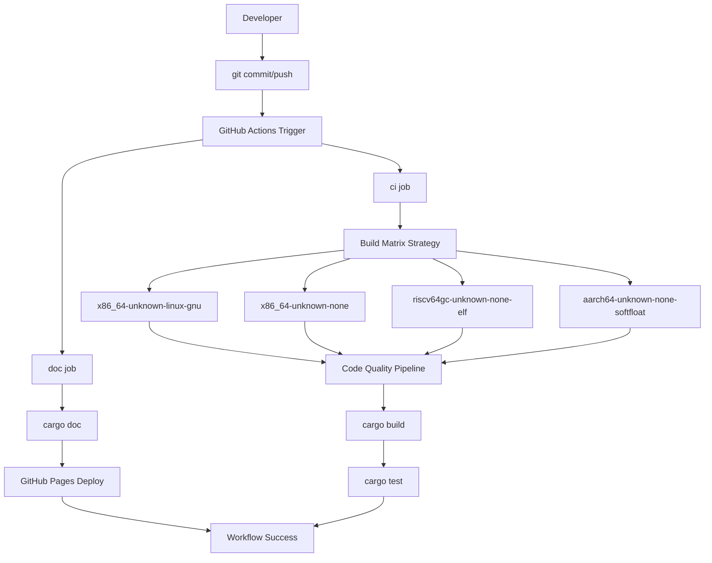
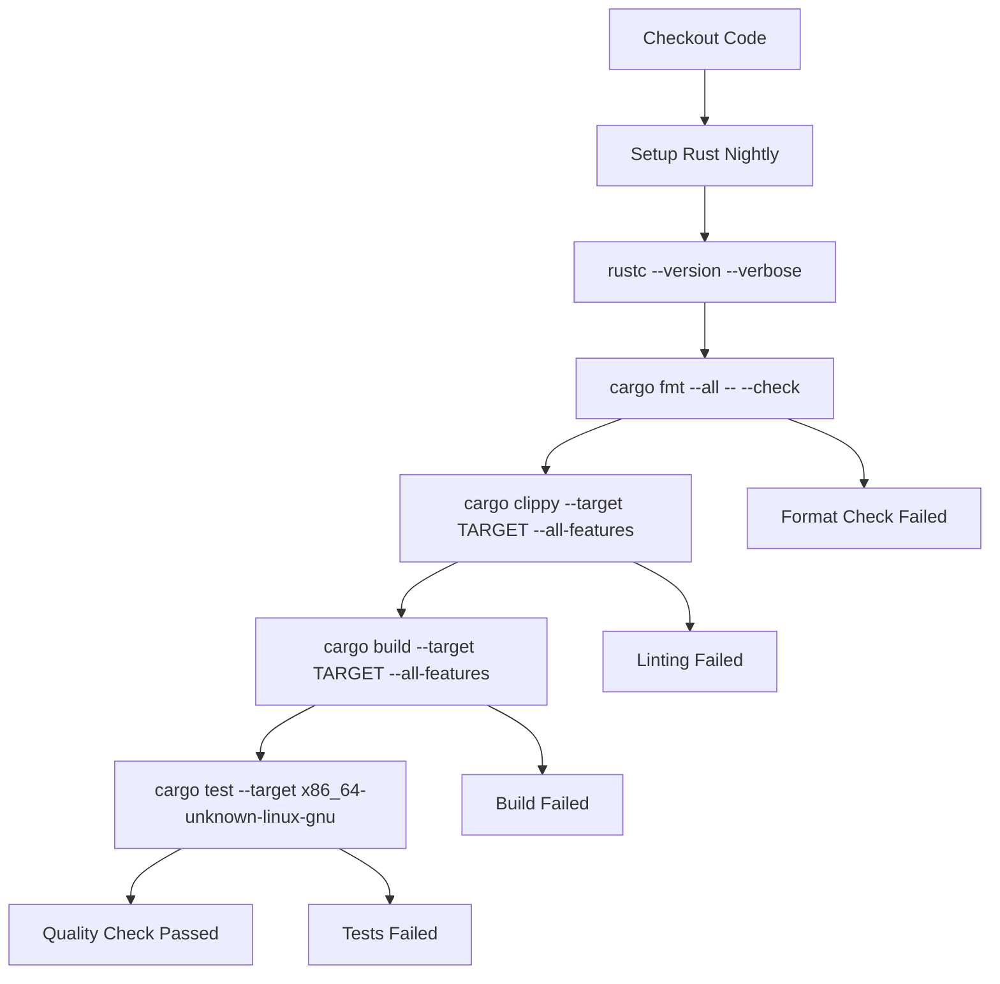
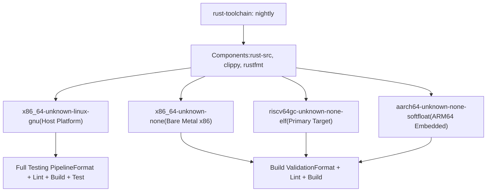
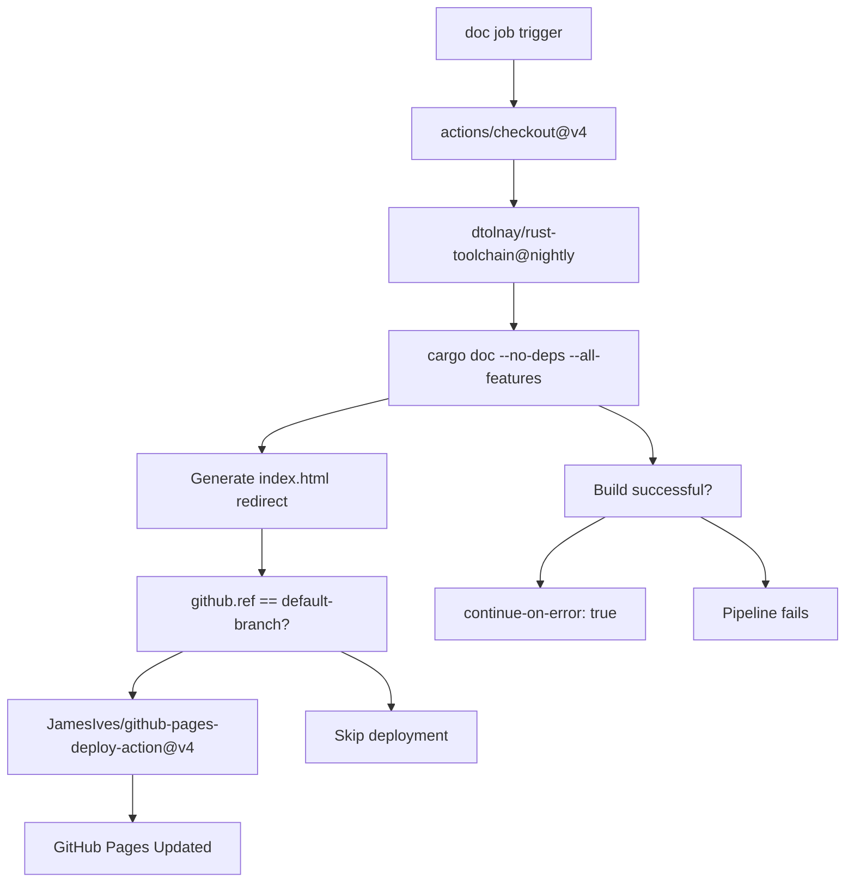

# Development Workflow

> **Relevant source files**
> * [.github/workflows/ci.yml](https://github.com/arceos-org/riscv_goldfish/blob/61e0493d/.github/workflows/ci.yml)
> * [.gitignore](https://github.com/arceos-org/riscv_goldfish/blob/61e0493d/.gitignore)

This document provides an overview of the development workflow for the riscv_goldfish RTC driver, covering the essential processes that contributors and maintainers follow when working with the codebase. This includes code quality assurance, multi-platform building and testing, and documentation generation.

For detailed information about the automated CI/CD pipeline configuration and build matrix, see [CI/CD Pipeline](/arceos-org/riscv_goldfish/4.1-cicd-pipeline). For local development environment setup and tooling requirements, see [Development Environment Setup](/arceos-org/riscv_goldfish/4.2-development-environment-setup).

## Workflow Overview

The development workflow is built around a robust continuous integration system that ensures code quality and cross-platform compatibility. The process validates changes across multiple target architectures while maintaining strict code formatting and linting standards.

**Development Workflow Overview**

The workflow consists of two parallel jobs that validate different aspects of the codebase: the `ci` job focuses on code quality and cross-compilation, while the `doc` job handles documentation generation and deployment.

Sources: [.github/workflows/ci.yml(L1 - L56)&emsp;](https://github.com/arceos-org/riscv_goldfish/blob/61e0493d/.github/workflows/ci.yml#L1-L56)

## Code Quality Pipeline

The quality assurance process enforces consistent coding standards and catches potential issues before they reach the main branch. Each target platform goes through the same rigorous validation steps.

**Code Quality Validation Steps**

The pipeline uses specific Rust toolchain components and flags to ensure comprehensive validation. The `clippy` step includes a specific allow flag `-A clippy::new_without_default` to suppress false positives for the RTC driver's constructor pattern.

Sources: [.github/workflows/ci.yml(L15 - L30)&emsp;](https://github.com/arceos-org/riscv_goldfish/blob/61e0493d/.github/workflows/ci.yml#L15-L30)

## Multi-Target Build Matrix

The build process validates the driver against multiple target architectures to ensure broad compatibility across different embedded and bare-metal environments.

|Target Platform|Purpose|Testing|
| --- | --- | --- |
|x86_64-unknown-linux-gnu|Development and testing host|Unit tests enabled|
|x86_64-unknown-none|Bare metal x86_64|Build validation only|
|riscv64gc-unknown-none-elf|Primary RISC-V target|Build validation only|
|aarch64-unknown-none-softfloat|ARM64 embedded systems|Build validation only|

The matrix strategy uses `fail-fast: false` to ensure all targets are tested even if one fails, providing comprehensive feedback about platform-specific issues.

**Build Target Matrix Configuration**

The testing strategy recognizes that unit tests are most practical on the host platform (`x86_64-unknown-linux-gnu`) while ensuring the driver compiles correctly for all target environments.

Sources: [.github/workflows/ci.yml(L8 - L30)&emsp;](https://github.com/arceos-org/riscv_goldfish/blob/61e0493d/.github/workflows/ci.yml#L8-L30)

## Development Environment Configuration

The development environment is configured to exclude build artifacts and IDE-specific files from version control, maintaining a clean repository while supporting different development setups.

|Ignored Path|Purpose|Impact|
| --- | --- | --- |
|/target|Cargo build output|Prevents binary artifacts in VCS|
|/.vscode|Visual Studio Code settings|Supports multiple IDE preferences|
|.DS_Store|macOS system files|Cross-platform compatibility|
|Cargo.lock|Dependency lock file|Library crate best practice|

The exclusion of `Cargo.lock` follows Rust library crate conventions, allowing downstream consumers to resolve their own dependency versions while ensuring the crate builds with compatible dependency ranges.

Sources: [.gitignore(L1 - L5)&emsp;](https://github.com/arceos-org/riscv_goldfish/blob/61e0493d/.gitignore#L1-L5)

## Documentation Pipeline

The documentation system automatically generates and deploys API documentation to GitHub Pages, ensuring the public documentation stays synchronized with the codebase.

**Documentation Generation and Deployment**

The documentation pipeline uses strict linting flags (`RUSTDOCFLAGS: -D rustdoc::broken_intra_doc_links -D missing-docs`) to ensure comprehensive and accurate documentation. Deployment only occurs from the default branch to prevent documentation pollution from feature branches.

Sources: [.github/workflows/ci.yml(L32 - L56)&emsp;](https://github.com/arceos-org/riscv_goldfish/blob/61e0493d/.github/workflows/ci.yml#L32-L56)

## Contributing Process

Contributors should ensure their changes pass the complete quality pipeline before submitting pull requests. The automated checks provide immediate feedback on code formatting, linting violations, build failures, and test regressions.

Key requirements for contributions:

* Code must pass `cargo fmt` formatting checks
* All `clippy` lints must be resolved (except explicitly allowed ones)
* Changes must build successfully on all target platforms
* Unit tests must pass on the host platform
* Documentation must build without warnings or broken links

The workflow automatically triggers on both `push` and `pull_request` events, providing consistent validation regardless of how changes are submitted.

Sources: [.github/workflows/ci.yml(L3)&emsp;](https://github.com/arceos-org/riscv_goldfish/blob/61e0493d/.github/workflows/ci.yml#L3-L3)