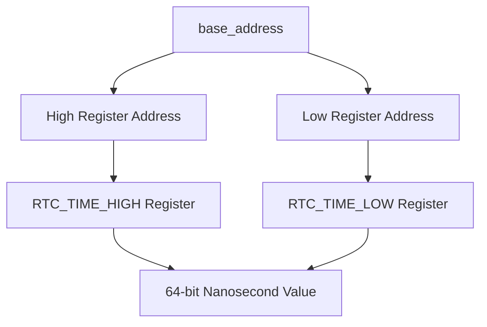
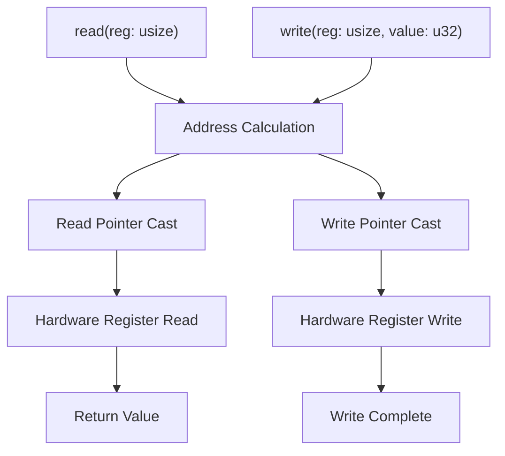
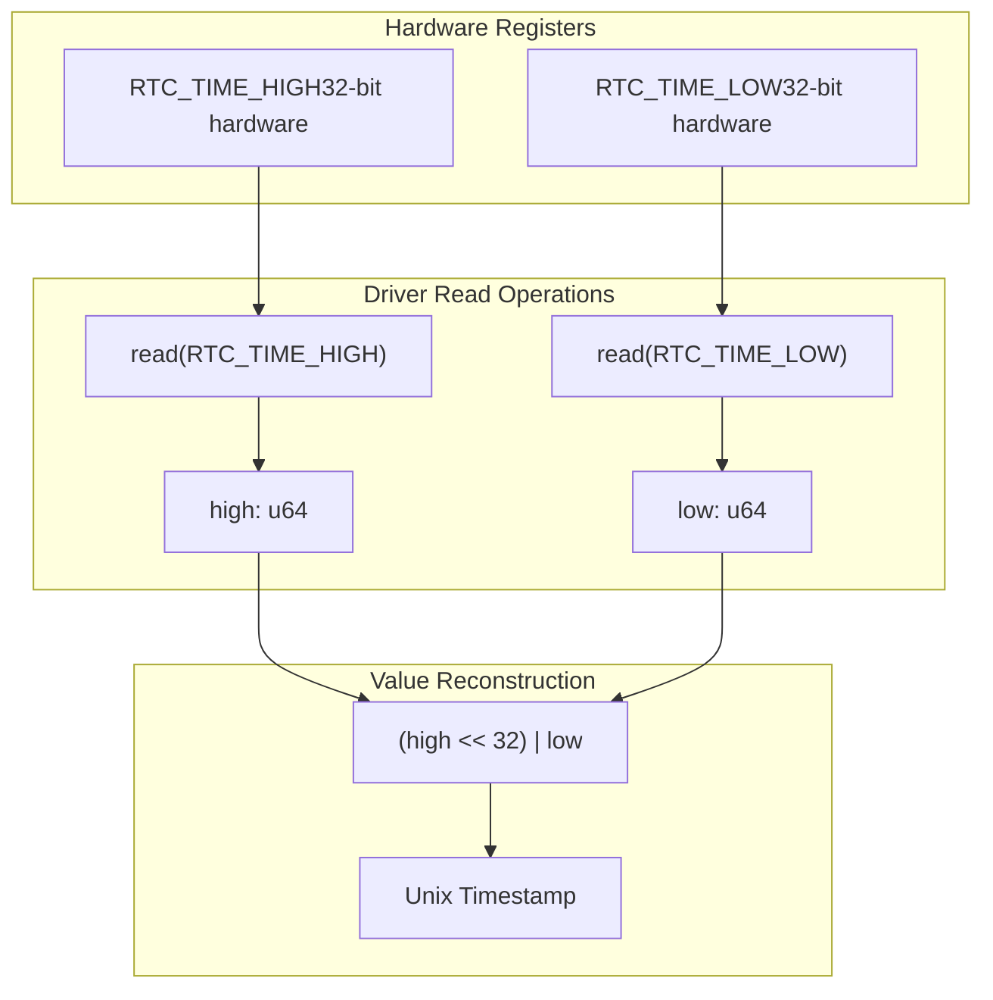
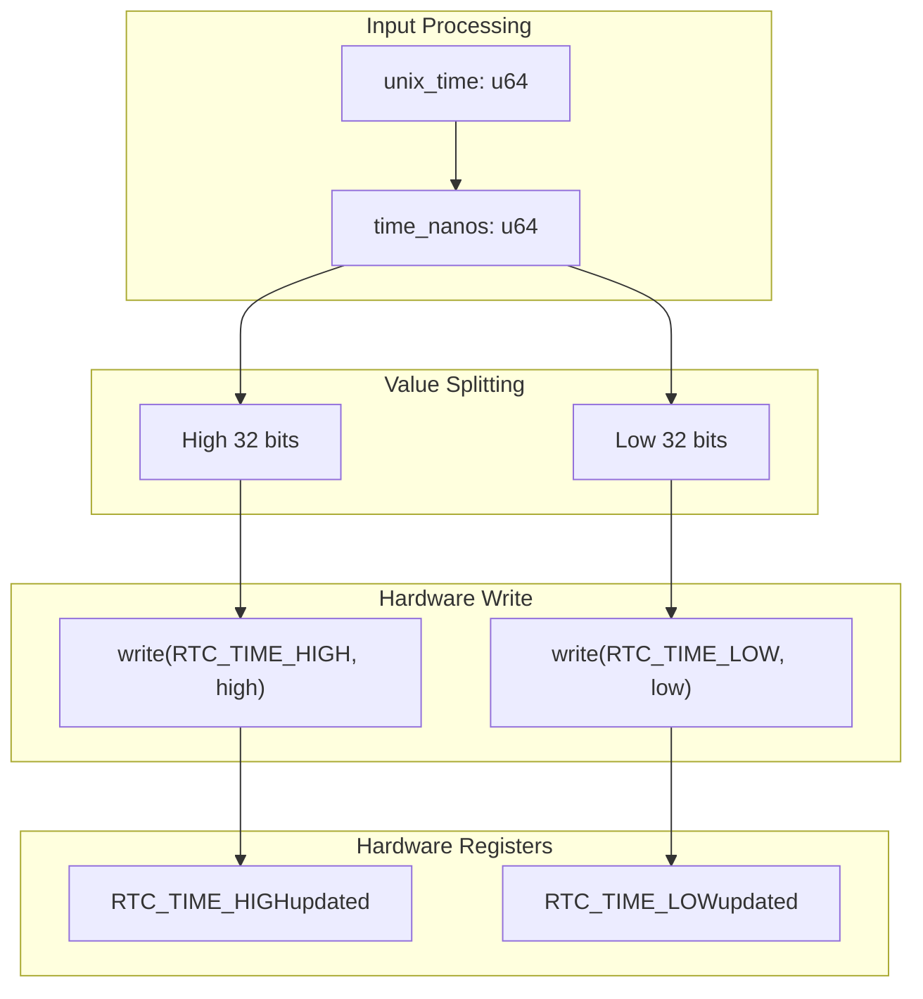
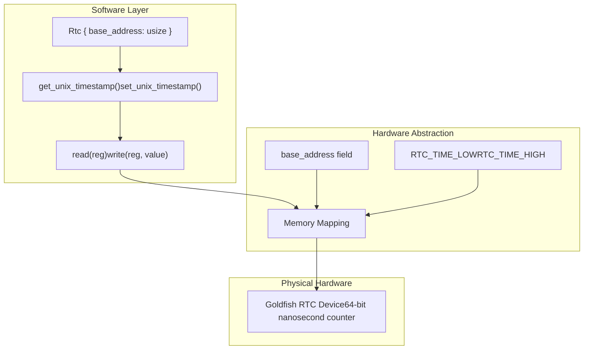

# Hardware Interface

> **Relevant source files**
> * [src/lib.rs](https://github.com/arceos-org/riscv_goldfish/blob/61e0493d/src/lib.rs)

This document covers the low-level hardware interface implementation of the riscv_goldfish RTC driver, focusing on memory-mapped I/O operations, register layout, and the abstraction layer between software and the Goldfish RTC hardware. For higher-level API usage patterns, see [API Reference](/arceos-org/riscv_goldfish/2.1-api-reference). For time conversion logic, see [Time Conversion](/arceos-org/riscv_goldfish/2.3-time-conversion).

## Register Layout and Memory Mapping

The Goldfish RTC hardware exposes a simple memory-mapped interface consisting of two 32-bit registers that together form a 64-bit nanosecond timestamp counter. The driver defines the register offsets as compile-time constants and uses a base address provided during initialization.

### Register Map

|Offset|Register Name|Width|Purpose|
| --- | --- | --- | --- |
|0x00|RTC_TIME_LOW|32-bit|Lower 32 bits of nanosecond timestamp|
|0x04|RTC_TIME_HIGH|32-bit|Upper 32 bits of nanosecond timestamp|

### Memory Address Calculation

The driver calculates absolute register addresses by adding the register offset constants to the base address provided during `Rtc::new()` construction.

Sources: [src/lib.rs(L6 - L7)&emsp;](https://github.com/arceos-org/riscv_goldfish/blob/61e0493d/src/lib.rs#L6-L7) [src/lib.rs(L31 - L33)&emsp;](https://github.com/arceos-org/riscv_goldfish/blob/61e0493d/src/lib.rs#L31-L33)

## Memory-Mapped I/O Operations

The hardware interface implements volatile memory operations to ensure proper communication with the RTC hardware. The driver provides two core memory access functions that handle the low-level register reads and writes.

### Volatile Memory Access Functions

The `read()` function performs volatile reads to prevent compiler optimizations that might cache register values, while `write()` ensures immediate hardware updates. Both operations are marked `unsafe` due to raw pointer manipulation.

Sources: [src/lib.rs(L17 - L23)&emsp;](https://github.com/arceos-org/riscv_goldfish/blob/61e0493d/src/lib.rs#L17-L23)

## 64-bit Value Handling Across 32-bit Registers

The Goldfish RTC hardware stores nanosecond timestamps as a 64-bit value, but exposes this through two separate 32-bit registers. The driver implements bidirectional conversion between the unified 64-bit representation and the split register format.

### Read Operation Data Flow

### Write Operation Data Flow

The write operation updates the high register first, then the low register, to maintain temporal consistency during the split-register update sequence.

Sources: [src/lib.rs(L36 - L40)&emsp;](https://github.com/arceos-org/riscv_goldfish/blob/61e0493d/src/lib.rs#L36-L40) [src/lib.rs(L43 - L49)&emsp;](https://github.com/arceos-org/riscv_goldfish/blob/61e0493d/src/lib.rs#L43-L49)

## Hardware Abstraction Layer

The `Rtc` struct provides a clean abstraction over the raw hardware interface, encapsulating the base address and providing safe access patterns for register operations.

### Driver Structure and Hardware Mapping

The abstraction separates hardware-specific details (register offsets, volatile operations) from the public API, allowing safe high-level operations while maintaining direct hardware access efficiency.

Sources: [src/lib.rs(L11 - L14)&emsp;](https://github.com/arceos-org/riscv_goldfish/blob/61e0493d/src/lib.rs#L11-L14) [src/lib.rs(L26 - L50)&emsp;](https://github.com/arceos-org/riscv_goldfish/blob/61e0493d/src/lib.rs#L26-L50)

## Safety Considerations

The hardware interface implements several safety measures to ensure reliable operation:

* **Volatile Operations**: All register access uses `read_volatile()` and `write_volatile()` to prevent compiler optimizations that could interfere with hardware communication
* **Unsafe Boundaries**: Raw pointer operations are confined to private methods, exposing only safe public APIs
* **Type Safety**: Register values are properly cast between `u32` hardware format and `u64` application format
* **Address Validation**: Base address is stored during construction and used consistently for all register calculations

The driver assumes the provided base address corresponds to valid, mapped Goldfish RTC hardware, typically obtained from device tree parsing during system initialization.

Sources: [src/lib.rs(L17 - L23)&emsp;](https://github.com/arceos-org/riscv_goldfish/blob/61e0493d/src/lib.rs#L17-L23) [src/lib.rs(L31 - L33)&emsp;](https://github.com/arceos-org/riscv_goldfish/blob/61e0493d/src/lib.rs#L31-L33)