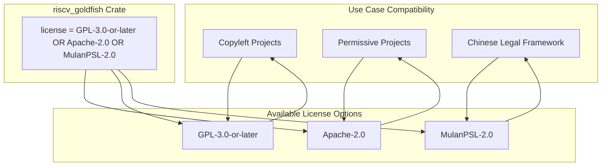
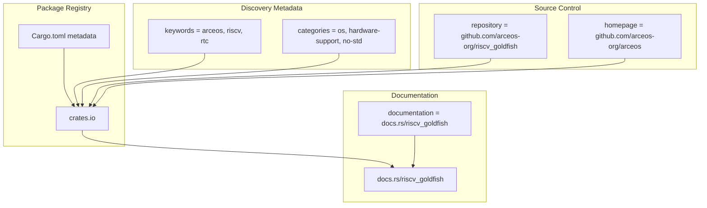
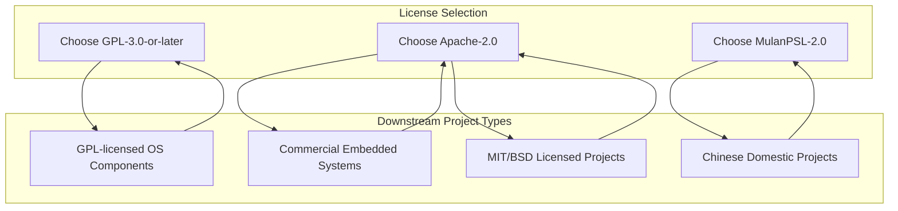

# Licensing and Distribution

> **Relevant source files**
> * [Cargo.toml](https://github.com/arceos-org/riscv_goldfish/blob/61e0493d/Cargo.toml)

This document covers the licensing strategy and distribution mechanisms for the `riscv_goldfish` crate. It explains the triple licensing scheme, distribution channels, package metadata configuration, and legal implications for different integration scenarios. For information about target platform configuration and cross-compilation setup, see [Target Platforms and Cross-Compilation](/arceos-org/riscv_goldfish/3.1-target-platforms-and-cross-compilation).

## Licensing Strategy

The `riscv_goldfish` crate employs a triple licensing approach that maximizes compatibility across different legal frameworks and use cases. The license specification uses an OR-based structure allowing users to choose the most appropriate license for their specific requirements.

### Triple License Configuration

The crate is licensed under three alternative licenses as defined in [Cargo.toml(L7)&emsp;](https://github.com/arceos-org/riscv_goldfish/blob/61e0493d/Cargo.toml#L7-L7):

```
GPL-3.0-or-later OR Apache-2.0 OR MulanPSL-2.0
```

#### License Selection Framework



**Sources:** [Cargo.toml(L7)&emsp;](https://github.com/arceos-org/riscv_goldfish/blob/61e0493d/Cargo.toml#L7-L7)

#### License Characteristics

|License|Type|Primary Use Case|Key Features|
| --- | --- | --- | --- |
|GPL-3.0-or-later|Copyleft|Open source projects requiring strong copyleft|Patent protection, source disclosure requirements|
|Apache-2.0|Permissive|Commercial and proprietary integrations|Patent grant, trademark protection, business-friendly|
|MulanPSL-2.0|Permissive|Chinese legal jurisdictions|Domestic legal framework compliance, simplified terms|

**Sources:** [Cargo.toml(L7)&emsp;](https://github.com/arceos-org/riscv_goldfish/blob/61e0493d/Cargo.toml#L7-L7)

## Distribution Channels

The crate is distributed through multiple channels to ensure accessibility and discoverability across different platforms and communities.

### Distribution Infrastructure



**Sources:** [Cargo.toml(L8 - L12)&emsp;](https://github.com/arceos-org/riscv_goldfish/blob/61e0493d/Cargo.toml#L8-L12)

### Package Metadata Configuration

The distribution strategy leverages comprehensive metadata to maximize discoverability and provide clear project context:

#### Core Metadata Fields

* **Package Name**: `riscv_goldfish` - clearly identifies the target platform and hardware component
* **Version**: `0.1.1` - semantic versioning with patch-level updates
* **Authors**: `Keyang Hu <keyang.hu@qq.com>` - primary maintainer contact
* **Description**: System Real Time Clock (RTC) Drivers for riscv based on goldfish

#### Discovery and Classification

The crate uses targeted keywords and categories to ensure proper classification in the Rust ecosystem:

**Keywords** [Cargo.toml(L11)&emsp;](https://github.com/arceos-org/riscv_goldfish/blob/61e0493d/Cargo.toml#L11-L11):

* `arceos` - Associates with the ArceOS operating system project
* `riscv` - Identifies the target processor architecture
* `rtc` - Specifies the hardware component type

**Categories** [Cargo.toml(L12)&emsp;](https://github.com/arceos-org/riscv_goldfish/blob/61e0493d/Cargo.toml#L12-L12):

* `os` - Operating system components
* `hardware-support` - Hardware abstraction and drivers
* `no-std` - Embedded and bare-metal compatibility

**Sources:** [Cargo.toml(L2 - L12)&emsp;](https://github.com/arceos-org/riscv_goldfish/blob/61e0493d/Cargo.toml#L2-L12)

## Legal Implications and Use Cases

The triple licensing structure addresses different legal requirements and integration scenarios that may arise when incorporating the RTC driver into various projects.

### Integration Scenarios

#### ArceOS Integration

The crate is designed for integration with the ArceOS operating system project, as indicated by the homepage reference [Cargo.toml(L8)&emsp;](https://github.com/arceos-org/riscv_goldfish/blob/61e0493d/Cargo.toml#L8-L8) The licensing allows ArceOS to choose the most appropriate license based on their distribution strategy.

#### Commercial Embedded Systems

The Apache-2.0 option enables integration into proprietary embedded systems and commercial products without source disclosure requirements, making it suitable for industrial IoT and embedded applications.

#### Open Source Projects

The GPL-3.0-or-later option ensures compatibility with other GPL-licensed operating system components while providing future license version flexibility.

#### Chinese Market Compliance

The MulanPSL-2.0 option addresses specific legal framework requirements for distribution within Chinese jurisdictions, supporting domestic technology adoption.

### License Compatibility Matrix



**Sources:** [Cargo.toml(L7 - L8)&emsp;](https://github.com/arceos-org/riscv_goldfish/blob/61e0493d/Cargo.toml#L7-L8)

## Distribution Workflow

The package distribution leverages Cargo's ecosystem integration to provide automated publishing and documentation generation:

1. **Source Publication**: Code is maintained in the GitHub repository specified in [Cargo.toml(L9)&emsp;](https://github.com/arceos-org/riscv_goldfish/blob/61e0493d/Cargo.toml#L9-L9)
2. **Package Registry**: Automated publishing to crates.io using metadata from [Cargo.toml(L1 - L12)&emsp;](https://github.com/arceos-org/riscv_goldfish/blob/61e0493d/Cargo.toml#L1-L12)
3. **Documentation Generation**: Automatic docs.rs publication linked from [Cargo.toml(L10)&emsp;](https://github.com/arceos-org/riscv_goldfish/blob/61e0493d/Cargo.toml#L10-L10)
4. **Discoverability**: Search optimization through keywords and categories in [Cargo.toml(L11 - L12)&emsp;](https://github.com/arceos-org/riscv_goldfish/blob/61e0493d/Cargo.toml#L11-L12)

The triple licensing approach ensures that regardless of the downstream project's legal requirements, there is a compatible license option available, maximizing the driver's utility across different integration scenarios while maintaining compliance with various legal frameworks.

**Sources:** [Cargo.toml(L7 - L12)&emsp;](https://github.com/arceos-org/riscv_goldfish/blob/61e0493d/Cargo.toml#L7-L12)