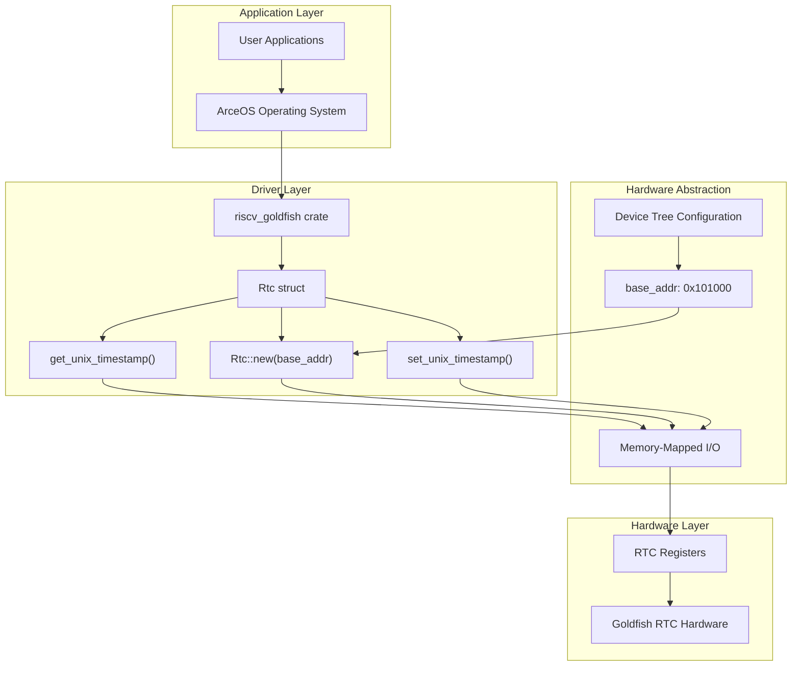
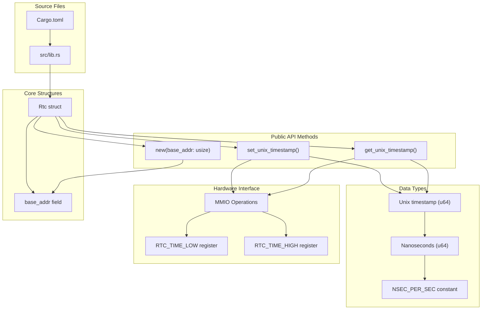

# Overview

> **Relevant source files**
> * [Cargo.toml](https://github.com/arceos-org/riscv_goldfish/blob/61e0493d/Cargo.toml)
> * [README.md](https://github.com/arceos-org/riscv_goldfish/blob/61e0493d/README.md)

This document provides comprehensive documentation for the `riscv_goldfish` repository, a specialized Real Time Clock (RTC) driver crate designed for RISC-V systems running on the Goldfish platform. The repository implements a `no_std` compatible driver that provides Unix timestamp functionality through memory-mapped I/O operations.

The `riscv_goldfish` crate serves as a hardware abstraction layer between operating system components and Goldfish RTC hardware, enabling time management capabilities in embedded and bare-metal RISC-V environments. This driver is specifically designed for integration with the ArceOS operating system ecosystem but maintains compatibility across multiple target architectures.

For detailed API documentation and usage examples, see [API Reference](/arceos-org/riscv_goldfish/2.1-api-reference). For information about cross-platform compilation and target support, see [Target Platforms and Cross-Compilation](/arceos-org/riscv_goldfish/3.1-target-platforms-and-cross-compilation).

## Repository Purpose and Scope

The `riscv_goldfish` crate provides a minimal, efficient RTC driver implementation with the following core responsibilities:

|Component|Purpose|Code Entity|
| --- | --- | --- |
|RTC Driver Core|Hardware abstraction and timestamp management|Rtcstruct|
|Memory Interface|Direct hardware register access|MMIO operations|
|Time Conversion|Unix timestamp to nanosecond conversion|get_unix_timestamp(),set_unix_timestamp()|
|Platform Integration|Device tree compatibility|Base address configuration|

The driver operates in a `no_std` environment, making it suitable for embedded systems, kernel-level components, and bare-metal applications across multiple architectures including RISC-V, x86_64, and ARM64.

Sources: [Cargo.toml(L1 - L15)&emsp;](https://github.com/arceos-org/riscv_goldfish/blob/61e0493d/Cargo.toml#L1-L15) [README.md(L1 - L33)&emsp;](https://github.com/arceos-org/riscv_goldfish/blob/61e0493d/README.md#L1-L33)

## System Architecture

**System Integration Architecture**

This architecture demonstrates the layered approach from applications down to hardware, with the `Rtc` struct serving as the primary interface point. The `base_addr` parameter from device tree configuration initializes the driver through the `Rtc::new()` constructor.

Sources: [README.md(L10 - L12)&emsp;](https://github.com/arceos-org/riscv_goldfish/blob/61e0493d/README.md#L10-L12) [README.md(L24 - L28)&emsp;](https://github.com/arceos-org/riscv_goldfish/blob/61e0493d/README.md#L24-L28) [Cargo.toml(L6)&emsp;](https://github.com/arceos-org/riscv_goldfish/blob/61e0493d/Cargo.toml#L6-L6)

## Core Components and Data Flow

**RTC Driver Component Mapping**

The driver implements a clean separation between the public API surface and hardware-specific operations. The `Rtc` struct encapsulates the base address and provides methods that handle the conversion between Unix timestamps and hardware nanosecond representations through direct register manipulation.

Sources: [README.md(L10 - L12)&emsp;](https://github.com/arceos-org/riscv_goldfish/blob/61e0493d/README.md#L10-L12) [Cargo.toml(L2)&emsp;](https://github.com/arceos-org/riscv_goldfish/blob/61e0493d/Cargo.toml#L2-L2)

## Target Platform Support

The crate supports multiple target architectures through its `no_std` design:

|Target Architecture|Purpose|Compatibility|
| --- | --- | --- |
|riscv64gc-unknown-none-elf|Primary RISC-V target|Bare metal, embedded|
|x86_64-unknown-linux-gnu|Development and testing|Linux userspace|
|x86_64-unknown-none|Bare metal x86_64|Kernel, bootloader|
|aarch64-unknown-none-softfloat|ARM64 embedded|Bare metal ARM|

The driver maintains cross-platform compatibility while providing hardware-specific optimizations for the Goldfish RTC implementation. The `no-std` category classification enables deployment in resource-constrained environments typical of embedded systems.

Sources: [Cargo.toml(L12)&emsp;](https://github.com/arceos-org/riscv_goldfish/blob/61e0493d/Cargo.toml#L12-L12) [Cargo.toml(L6)&emsp;](https://github.com/arceos-org/riscv_goldfish/blob/61e0493d/Cargo.toml#L6-L6)

## Integration with ArceOS Ecosystem

The `riscv_goldfish` crate is designed as a component within the broader ArceOS operating system project. The driver provides essential time management capabilities required by kernel-level services and system calls. The crate's licensing scheme supports integration with both open-source and commercial projects through its triple license approach (GPL-3.0, Apache-2.0, MulanPSL-2.0).

Device tree integration follows standard practices, with the driver expecting a compatible string of `"google,goldfish-rtc"` and memory-mapped register access at the specified base address. This standardized approach ensures compatibility across different RISC-V platform implementations that include Goldfish RTC hardware.

Sources: [Cargo.toml(L7 - L8)&emsp;](https://github.com/arceos-org/riscv_goldfish/blob/61e0493d/Cargo.toml#L7-L8) [Cargo.toml(L11)&emsp;](https://github.com/arceos-org/riscv_goldfish/blob/61e0493d/Cargo.toml#L11-L11) [README.md(L24 - L28)&emsp;](https://github.com/arceos-org/riscv_goldfish/blob/61e0493d/README.md#L24-L28)