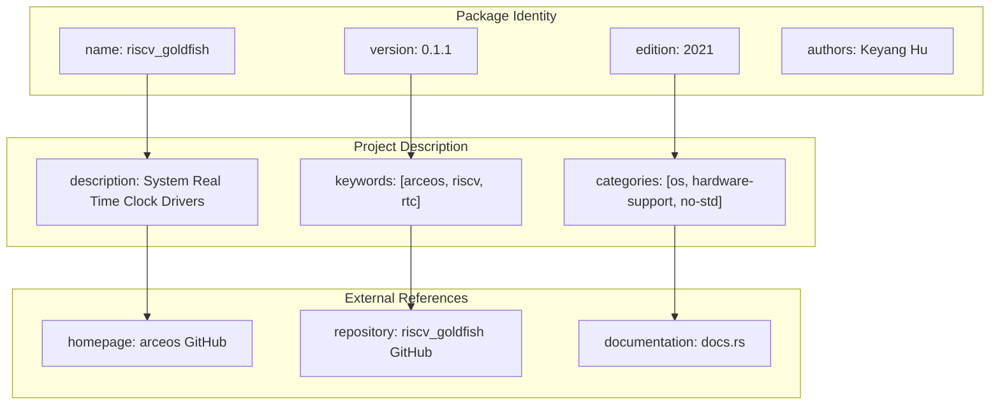
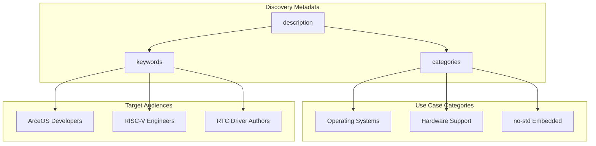
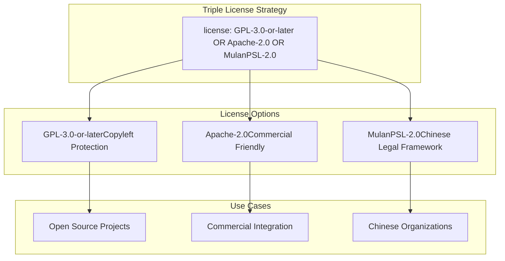
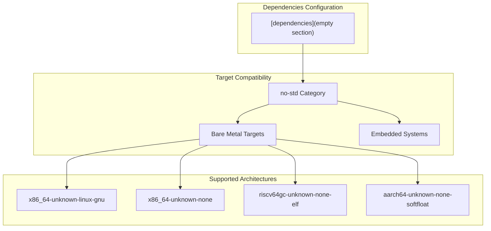
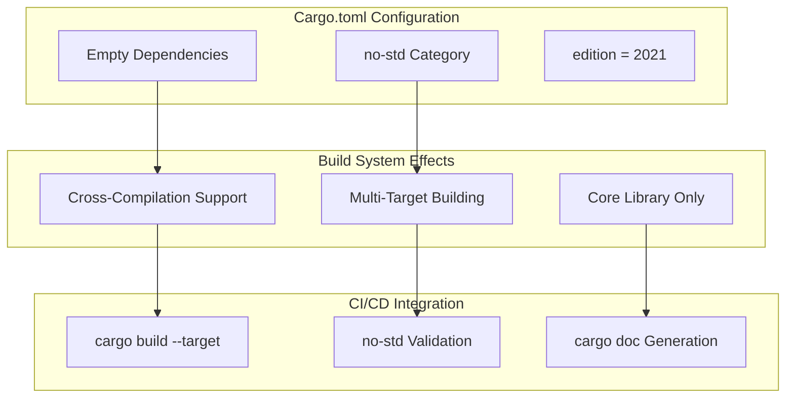

# Project Configuration

> **Relevant source files**
> * [Cargo.toml](https://github.com/arceos-org/riscv_goldfish/blob/61e0493d/Cargo.toml)

This document covers the comprehensive project configuration for the riscv_goldfish crate as defined in the Cargo.toml manifest. It details package metadata, licensing strategy, target platform specifications, and dependency management that enable cross-platform RTC driver functionality within the ArceOS ecosystem.

For implementation details of the RTC driver itself, see [RTC Driver Implementation](/arceos-org/riscv_goldfish/2-rtc-driver-implementation). For CI/CD build matrix and testing procedures, see [CI/CD Pipeline](/arceos-org/riscv_goldfish/4.1-cicd-pipeline).

## Package Metadata and Identity

The project configuration establishes the fundamental identity and purpose of the riscv_goldfish crate through standardized Cargo package metadata.

### Core Package Definition

**Package Metadata Configuration**

|Field|Value|Purpose|
| --- | --- | --- |
|name|riscv_goldfish|Crate identifier for Cargo registry|
|version|0.1.1|Semantic versioning for API compatibility|
|edition|2021|Rust language edition compatibility|
|authors|Keyang Hu <keyang.hu@qq.com>|Primary maintainer contact|

The package name follows Rust naming conventions using underscores and clearly indicates both the target architecture (`riscv`) and hardware platform (`goldfish`). The version `0.1.1` indicates this is an early release with patch-level updates from the initial `0.1.0` version.

**Sources:** [Cargo.toml(L1 - L6)&emsp;](https://github.com/arceos-org/riscv_goldfish/blob/61e0493d/Cargo.toml#L1-L6)

### Project Classification and Discovery

The configuration includes strategic metadata for package discovery and classification within the Rust ecosystem.

The `categories` field strategically positions the crate in three key areas:

* `os`: Operating system components and kernel-level drivers
* `hardware-support`: Low-level hardware interface libraries
* `no-std`: Embedded and bare-metal compatible crates

The `keywords` array enables discovery by ArceOS ecosystem users (`arceos`), RISC-V developers (`riscv`), and those seeking RTC functionality (`rtc`).

**Sources:** [Cargo.toml(L6 - L12)&emsp;](https://github.com/arceos-org/riscv_goldfish/blob/61e0493d/Cargo.toml#L6-L12)

## Licensing and Legal Framework

The project employs a triple licensing strategy to maximize compatibility across different legal and organizational requirements.

### Multi-License Configuration

The `OR` operator in the license field allows users to choose any of the three licenses based on their specific requirements:

* **GPL-3.0-or-later**: Ensures derivative works remain open source
* **Apache-2.0**: Permits commercial use with patent grant protections
* **MulanPSL-2.0**: Provides compatibility with Chinese legal frameworks

This licensing strategy is particularly important for operating system components that may be integrated into diverse software stacks with varying legal requirements.

**Sources:** [Cargo.toml(L7)&emsp;](https://github.com/arceos-org/riscv_goldfish/blob/61e0493d/Cargo.toml#L7-L7)

## Target Platform and Architecture Support

The configuration enables cross-platform compatibility through careful dependency management and metadata specification.

### No-Standard Library Configuration

The absence of dependencies in the `[dependencies]` section is intentional and critical for the crate's design:

1. **Zero Dependencies**: Enables compilation for bare-metal targets without standard library
2. **no-std Compatibility**: Listed in categories to indicate embedded system support
3. **Cross-Compilation**: Supports multiple architecture targets through pure Rust implementation

This configuration allows the RTC driver to function in resource-constrained environments where the standard library is unavailable or undesirable.

**Sources:** [Cargo.toml(L12 - L15)&emsp;](https://github.com/arceos-org/riscv_goldfish/blob/61e0493d/Cargo.toml#L12-L15)

### Repository and Documentation Links

The configuration establishes clear pathways for users to access source code, documentation, and project information.

|Link Type|URL|Purpose|
| --- | --- | --- |
|homepage|https://github.com/arceos-org/arceos|ArceOS project ecosystem|
|repository|https://github.com/arceos-org/riscv_goldfish|Source code repository|
|documentation|https://docs.rs/riscv_goldfish|API documentation|

The `homepage` points to the broader ArceOS ecosystem, indicating this crate's role as a component within a larger operating system project. The `repository` field provides direct access to source code, while `documentation` enables automatic API documentation generation and hosting on docs.rs.

**Sources:** [Cargo.toml(L8 - L10)&emsp;](https://github.com/arceos-org/riscv_goldfish/blob/61e0493d/Cargo.toml#L8-L10)

## Configuration Impact on Build System

The Cargo.toml configuration directly influences the build system's behavior and capabilities across different target platforms.

The configuration enables several critical build system behaviors:

1. **Dependency-Free Building**: Empty dependencies section allows compilation without external crates
2. **Target Flexibility**: no-std category signals compatibility with embedded toolchains
3. **Modern Rust**: Edition 2021 ensures access to latest language features while maintaining compatibility

This configuration is essential for the CI/CD pipeline's ability to validate the driver across multiple architectures and deployment scenarios.

**Sources:** [Cargo.toml(L4 - L15)&emsp;](https://github.com/arceos-org/riscv_goldfish/blob/61e0493d/Cargo.toml#L4-L15)