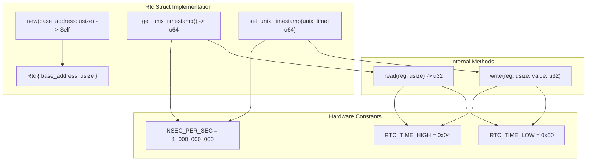
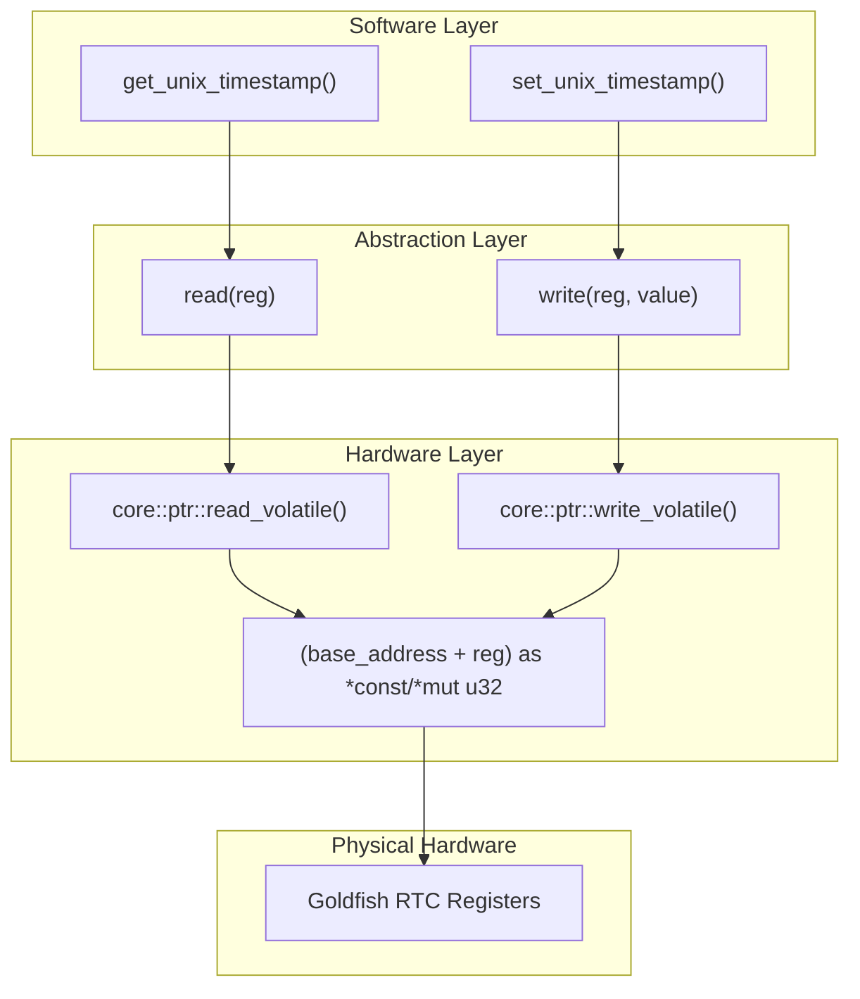
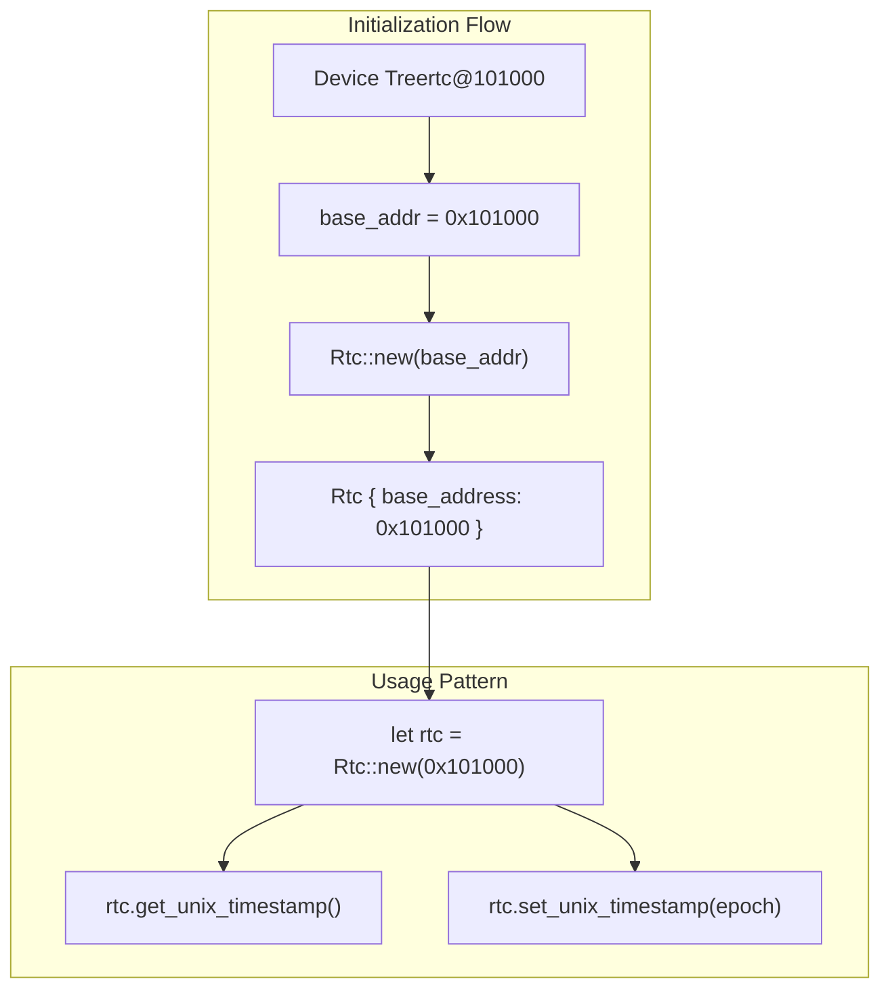
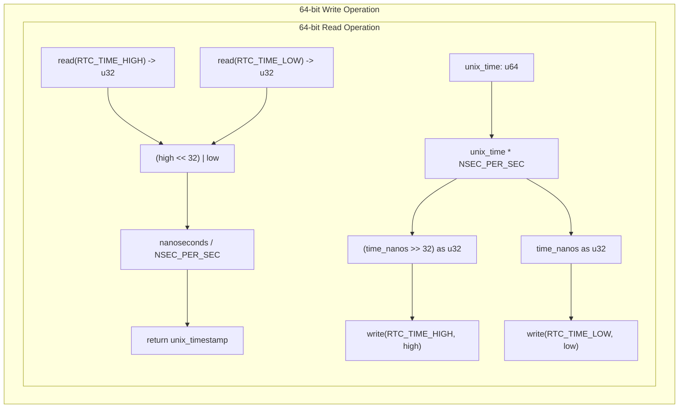
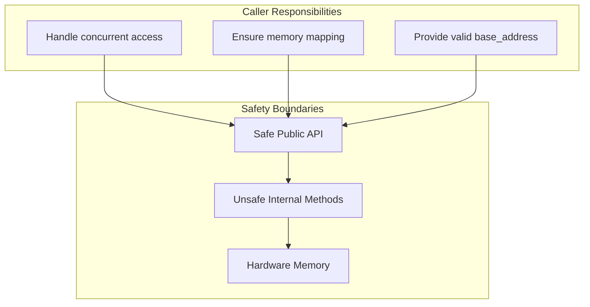

# RTC Driver Implementation

> **Relevant source files**
> * [README.md](https://github.com/arceos-org/riscv_goldfish/blob/61e0493d/README.md)
> * [src/lib.rs](https://github.com/arceos-org/riscv_goldfish/blob/61e0493d/src/lib.rs)

This document covers the core implementation details of the RISC-V Goldfish RTC driver, including the main `Rtc` struct, its methods, and the underlying hardware abstraction mechanisms. The implementation provides a clean interface for reading and writing Unix timestamps to Goldfish RTC hardware through memory-mapped I/O operations.

For complete API documentation and usage examples, see [API Reference](/arceos-org/riscv_goldfish/2.1-api-reference). For detailed hardware register mapping and MMIO specifics, see [Hardware Interface](/arceos-org/riscv_goldfish/2.2-hardware-interface). For in-depth time conversion algorithms, see [Time Conversion](/arceos-org/riscv_goldfish/2.3-time-conversion).

## Core Driver Structure

The RTC driver is implemented as a single `Rtc` struct that encapsulates all functionality for interfacing with the Goldfish RTC hardware. The driver follows a minimalist design pattern suitable for embedded and bare-metal environments.

**Sources:** [src/lib.rs(L11 - L50)&emsp;](https://github.com/arceos-org/riscv_goldfish/blob/61e0493d/src/lib.rs#L11-L50)

## Memory-Mapped I/O Layer

The driver implements a low-level hardware abstraction through unsafe memory operations. All hardware access is channeled through two core methods that handle volatile memory operations to prevent compiler optimizations from interfering with hardware communication.

|Method|Purpose|Safety|Return Type|
| --- | --- | --- | --- |
|read(reg: usize)|Read 32-bit value from hardware register|Unsafe - requires valid base address|u32|
|write(reg: usize, value: u32)|Write 32-bit value to hardware register|Unsafe - requires valid base address|()|

**Sources:** [src/lib.rs(L17 - L24)&emsp;](https://github.com/arceos-org/riscv_goldfish/blob/61e0493d/src/lib.rs#L17-L24)

## Driver Initialization and Configuration

The `Rtc::new()` constructor provides the single entry point for driver instantiation. The method requires a base memory address that corresponds to the hardware device's memory-mapped location, typically obtained from device tree parsing during system initialization.

The constructor performs no hardware validation or initialization - it simply stores the provided base address for future memory operations. This design assumes that hardware initialization and memory mapping have been handled by the system's device management layer.

**Sources:** [src/lib.rs(L27 - L33)&emsp;](https://github.com/arceos-org/riscv_goldfish/blob/61e0493d/src/lib.rs#L27-L33) [README.md(L10 - L16)&emsp;](https://github.com/arceos-org/riscv_goldfish/blob/61e0493d/README.md#L10-L16)

## 64-bit Register Handling

The Goldfish RTC hardware stores time as a 64-bit nanosecond value split across two consecutive 32-bit registers. The driver handles this split through careful register sequencing and bit manipulation to maintain data integrity during multi-register operations.

The write operation follows a specific sequence where the high register is written first, followed by the low register. This ordering ensures atomic updates from the hardware perspective and prevents temporal inconsistencies during timestamp updates.

**Sources:** [src/lib.rs(L36 - L49)&emsp;](https://github.com/arceos-org/riscv_goldfish/blob/61e0493d/src/lib.rs#L36-L49)

## Error Handling and Safety Model

The driver implementation uses Rust's `unsafe` blocks to perform direct memory access while maintaining memory safety through controlled access patterns. The safety model relies on several assumptions:

* The provided `base_address` points to valid, mapped memory
* The memory region corresponds to actual Goldfish RTC hardware
* Concurrent access is managed by the calling code
* The hardware registers maintain their expected layout

The driver does not perform runtime validation of memory addresses or hardware responses, prioritizing performance and simplicity for embedded use cases where system-level guarantees about hardware presence and memory mapping are typically established during boot.

**Sources:** [src/lib.rs(L17 - L24)&emsp;](https://github.com/arceos-org/riscv_goldfish/blob/61e0493d/src/lib.rs#L17-L24)