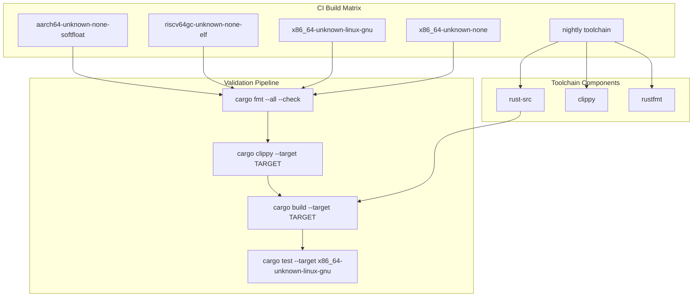
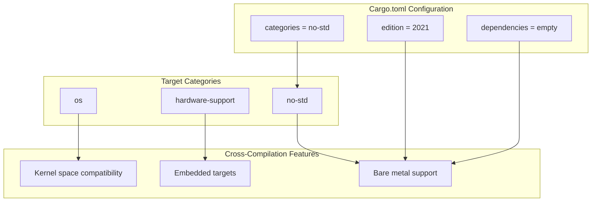
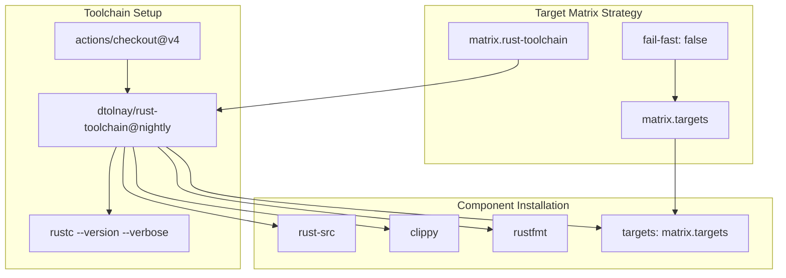
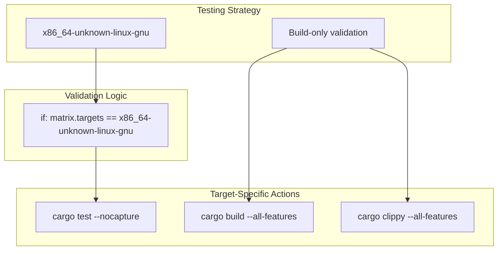

# Target Platforms and Cross-Compilation

> **Relevant source files**
> * [.github/workflows/ci.yml](https://github.com/arceos-org/riscv_goldfish/blob/61e0493d/.github/workflows/ci.yml)
> * [Cargo.toml](https://github.com/arceos-org/riscv_goldfish/blob/61e0493d/Cargo.toml)

This document covers the target platform support and cross-compilation configuration for the `riscv_goldfish` crate. It details the supported architectures, `no_std` compatibility requirements, and the automated validation pipeline that ensures cross-platform compatibility. For information about the core RTC driver implementation, see [RTC Driver Implementation](/arceos-org/riscv_goldfish/2-rtc-driver-implementation). For details about project licensing and distribution, see [Licensing and Distribution](/arceos-org/riscv_goldfish/3.2-licensing-and-distribution).

## Supported Target Platforms

The `riscv_goldfish` crate is designed as a `no_std` library that supports multiple target architectures through Rust's cross-compilation capabilities. The primary target is RISC-V, but the crate maintains compatibility with x86_64 and ARM64 platforms for development and testing purposes.

### Target Architecture Matrix

|Target Triple|Architecture|Environment|Testing|Purpose|
| --- | --- | --- | --- | --- |
|riscv64gc-unknown-none-elf|RISC-V 64-bit|Bare metal|Build only|Primary target platform|
|x86_64-unknown-linux-gnu|x86_64|Linux userspace|Full tests|Development and testing|
|x86_64-unknown-none|x86_64|Bare metal|Build only|Bare metal validation|
|aarch64-unknown-none-softfloat|ARM64|Bare metal|Build only|Embedded ARM compatibility|

**Target Platform Validation Pipeline**



Sources: [.github/workflows/ci.yml(L8 - L30)&emsp;](https://github.com/arceos-org/riscv_goldfish/blob/61e0493d/.github/workflows/ci.yml#L8-L30) [Cargo.toml(L12)&emsp;](https://github.com/arceos-org/riscv_goldfish/blob/61e0493d/Cargo.toml#L12-L12)

## Cross-Compilation Configuration

The crate leverages Rust's built-in cross-compilation support through the `no_std` attribute and careful dependency management. The configuration enables compilation for embedded and bare-metal targets without requiring a standard library.

### Package Configuration for Cross-Compilation



Sources: [Cargo.toml(L12)&emsp;](https://github.com/arceos-org/riscv_goldfish/blob/61e0493d/Cargo.toml#L12-L12) [Cargo.toml(L14 - L15)&emsp;](https://github.com/arceos-org/riscv_goldfish/blob/61e0493d/Cargo.toml#L14-L15)

The crate maintains zero dependencies, which eliminates potential compatibility issues during cross-compilation. This design choice ensures that the RTC driver can be integrated into any environment that supports basic memory-mapped I/O operations.

## Toolchain Requirements

### Rust Nightly Toolchain

The project requires the Rust nightly toolchain to access unstable features necessary for bare-metal development. The CI pipeline specifically configures the following components:

* **`rust-src`**: Required for cross-compilation to `no_std` targets
* **`clippy`**: Static analysis for all target platforms
* **`rustfmt`**: Code formatting consistency across architectures

### Target Installation

For local development, targets must be installed using `rustup`:

```
rustup target add riscv64gc-unknown-none-elf
rustup target add x86_64-unknown-none
rustup target add aarch64-unknown-none-softfloat
```

**CI Toolchain Configuration Flow**



Sources: [.github/workflows/ci.yml(L14 - L19)&emsp;](https://github.com/arceos-org/riscv_goldfish/blob/61e0493d/.github/workflows/ci.yml#L14-L19) [.github/workflows/ci.yml(L8 - L12)&emsp;](https://github.com/arceos-org/riscv_goldfish/blob/61e0493d/.github/workflows/ci.yml#L8-L12)

## Platform-Specific Considerations

### RISC-V Target (riscv64gc-unknown-none-elf)

This is the primary target platform for the Goldfish RTC driver. The `riscv64gc` specification includes:

* **G**: General-purpose integer and floating-point extensions
* **C**: Compressed instruction extension
* **unknown-none-elf**: Bare-metal environment with ELF binary format

### Testing Strategy

The CI pipeline implements a pragmatic testing approach where unit tests only execute on `x86_64-unknown-linux-gnu` due to the complexity of running tests in bare-metal environments. All other targets undergo build validation to ensure compilation compatibility.



Sources: [.github/workflows/ci.yml(L28 - L30)&emsp;](https://github.com/arceos-org/riscv_goldfish/blob/61e0493d/.github/workflows/ci.yml#L28-L30) [.github/workflows/ci.yml(L25 - L27)&emsp;](https://github.com/arceos-org/riscv_goldfish/blob/61e0493d/.github/workflows/ci.yml#L25-L27)

This approach ensures that the driver code compiles correctly for all supported architectures while maintaining practical CI execution times and avoiding the complexity of cross-architecture test execution environments.