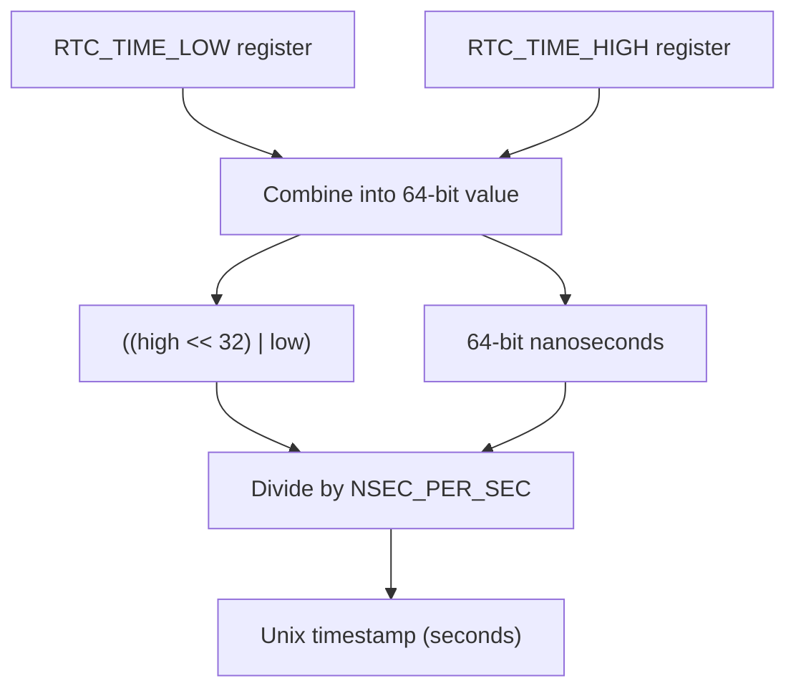
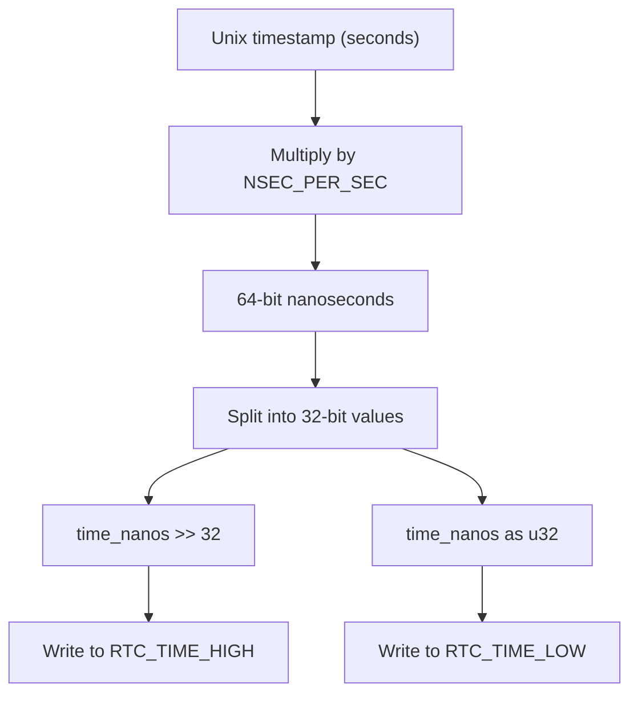
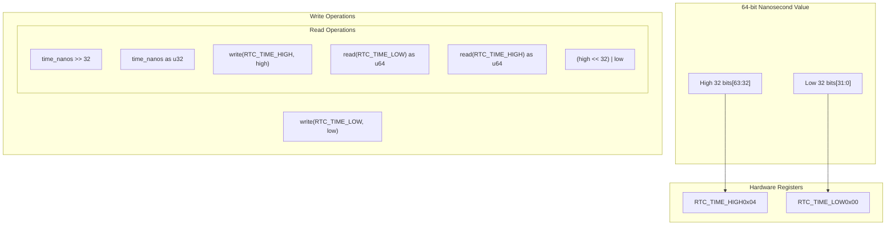

# Time Conversion

> **Relevant source files**
> * [src/lib.rs](https://github.com/arceos-org/riscv_goldfish/blob/61e0493d/src/lib.rs)

This document explains the time conversion logic implemented in the RTC driver, covering the transformation between Unix timestamps (seconds) and hardware nanosecond representations. The conversion process handles bidirectional data flow between software time formats and the Goldfish RTC hardware's internal 64-bit nanosecond counter.

For details about the hardware register interface used in these conversions, see [Hardware Interface](/arceos-org/riscv_goldfish/2.2-hardware-interface). For the complete public API that exposes these conversion functions, see [API Reference](/arceos-org/riscv_goldfish/2.1-api-reference).

## Time Representation Formats

The RTC driver handles two distinct time representation formats that require conversion between software and hardware layers.

### Unix Timestamp Format

The driver's public API operates using Unix timestamps expressed as `u64` values representing seconds since the Unix epoch (January 1, 1970, 00:00:00 UTC). This format provides a standard interface for operating system integration and application compatibility.

### Hardware Nanosecond Format

The Goldfish RTC hardware internally maintains time as a 64-bit counter representing nanoseconds since the Unix epoch. This high-resolution format is stored across two 32-bit memory-mapped registers: `RTC_TIME_HIGH` and `RTC_TIME_LOW`.

Sources: [src/lib.rs(L6 - L7)&emsp;](https://github.com/arceos-org/riscv_goldfish/blob/61e0493d/src/lib.rs#L6-L7) [src/lib.rs(L35 - L39)&emsp;](https://github.com/arceos-org/riscv_goldfish/blob/61e0493d/src/lib.rs#L35-L39) [src/lib.rs(L42 - L44)&emsp;](https://github.com/arceos-org/riscv_goldfish/blob/61e0493d/src/lib.rs#L42-L44)

## Conversion Constants

The time conversion relies on a single fundamental constant that defines the relationship between seconds and nanoseconds.

|Constant|Value|Purpose|
| --- | --- | --- |
|NSEC_PER_SEC|1_000_000_000|Nanoseconds per second conversion factor|

This constant enables precise conversion between the second-granularity Unix timestamps and the nanosecond-granularity hardware representation without loss of precision in the direction from seconds to nanoseconds.

Sources: [src/lib.rs(L9)&emsp;](https://github.com/arceos-org/riscv_goldfish/blob/61e0493d/src/lib.rs#L9-L9)

## Time Conversion Data Flow

### Reading Time from Hardware

**Reading Time Conversion Process**

The `get_unix_timestamp()` function implements a multi-step process to extract time from hardware registers and convert to Unix timestamp format.

Sources: [src/lib.rs(L36 - L40)&emsp;](https://github.com/arceos-org/riscv_goldfish/blob/61e0493d/src/lib.rs#L36-L40)

### Writing Time to Hardware

**Writing Time Conversion Process**

The `set_unix_timestamp()` function performs the inverse conversion, transforming Unix timestamps into the hardware's nanosecond format and distributing the value across two registers.

Sources: [src/lib.rs(L43 - L49)&emsp;](https://github.com/arceos-org/riscv_goldfish/blob/61e0493d/src/lib.rs#L43-L49)

## Bit Manipulation and Register Mapping

The conversion process requires careful handling of 64-bit values across 32-bit register boundaries, involving specific bit manipulation operations.

**Register Bit Mapping and Operations**

Sources: [src/lib.rs(L37 - L39)&emsp;](https://github.com/arceos-org/riscv_goldfish/blob/61e0493d/src/lib.rs#L37-L39) [src/lib.rs(L45 - L47)&emsp;](https://github.com/arceos-org/riscv_goldfish/blob/61e0493d/src/lib.rs#L45-L47)

## Implementation Analysis

### Precision and Range Considerations

The conversion implementation maintains full precision when converting from Unix seconds to nanoseconds, as the multiplication by `NSEC_PER_SEC` is exact for integer values. However, the reverse conversion from nanoseconds to seconds uses integer division, which truncates sub-second precision.

**Supported Time Range:**

* Maximum representable time: `(2^64 - 1) / NSEC_PER_SEC` ≈ 584 years from Unix epoch
* Minimum granularity: 1 second (in Unix timestamp format)
* Hardware granularity: 1 nanosecond (internal representation)

### Atomic Operation Considerations

The current implementation does not provide atomic guarantees when reading or writing the split 64-bit value across two 32-bit registers. The `get_unix_timestamp()` function reads `RTC_TIME_LOW` first, then `RTC_TIME_HIGH`, while `set_unix_timestamp()` writes `RTC_TIME_HIGH` first, then `RTC_TIME_LOW`. This ordering could potentially result in inconsistent reads if the hardware updates between register accesses.

Sources: [src/lib.rs(L36 - L40)&emsp;](https://github.com/arceos-org/riscv_goldfish/blob/61e0493d/src/lib.rs#L36-L40) [src/lib.rs(L43 - L49)&emsp;](https://github.com/arceos-org/riscv_goldfish/blob/61e0493d/src/lib.rs#L43-L49)