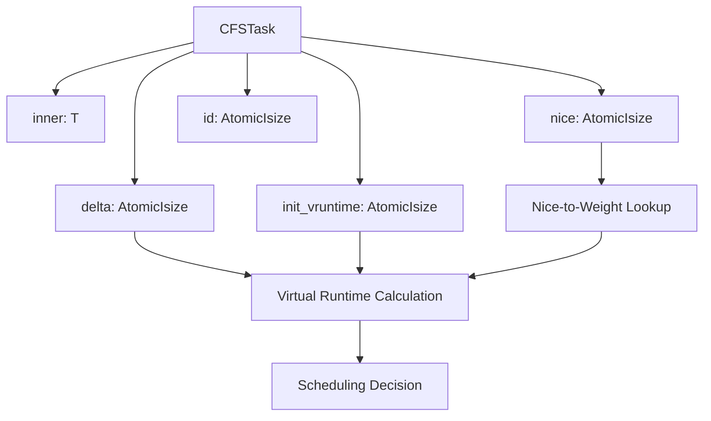
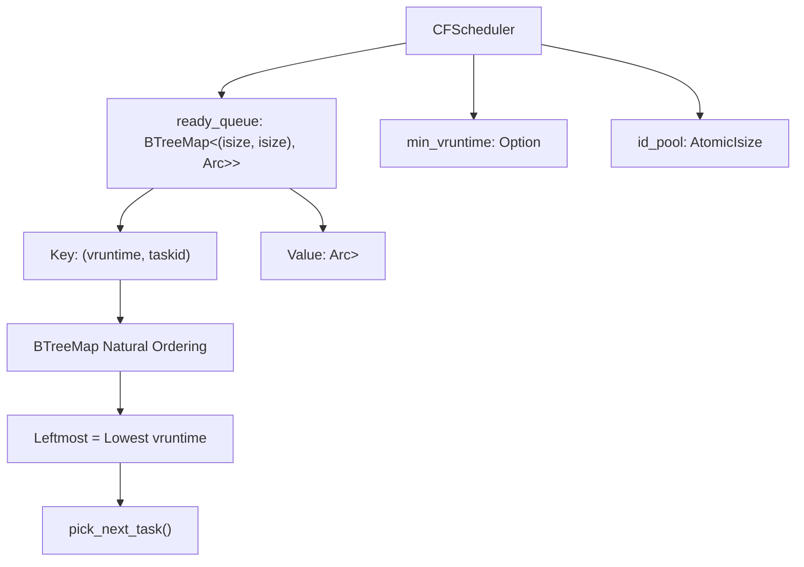
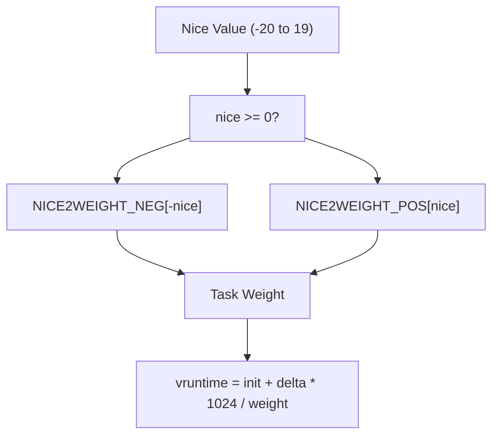
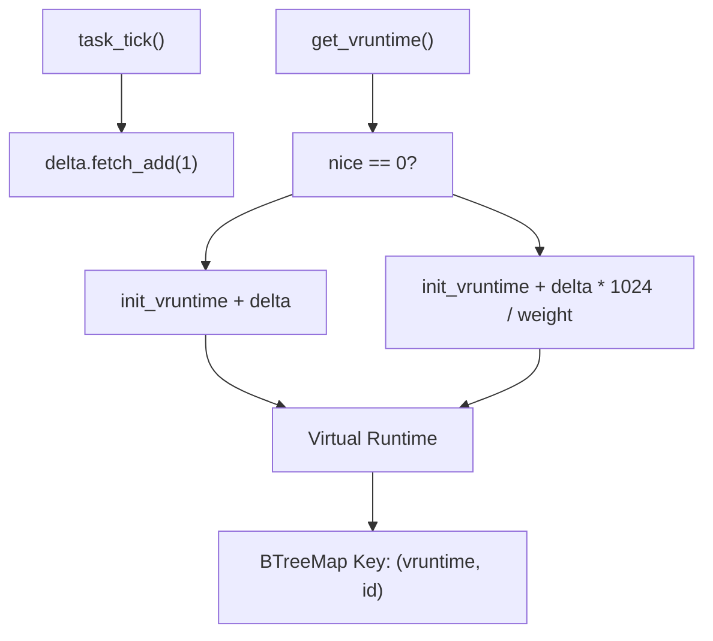
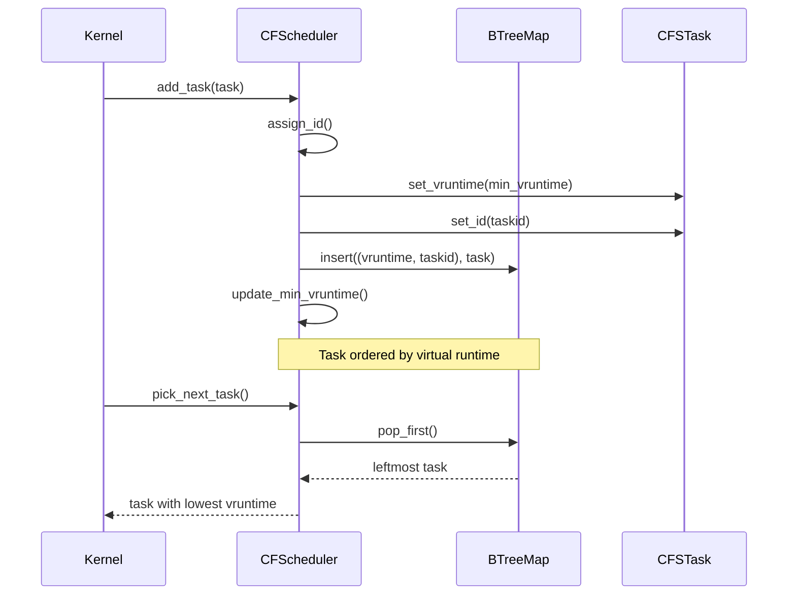
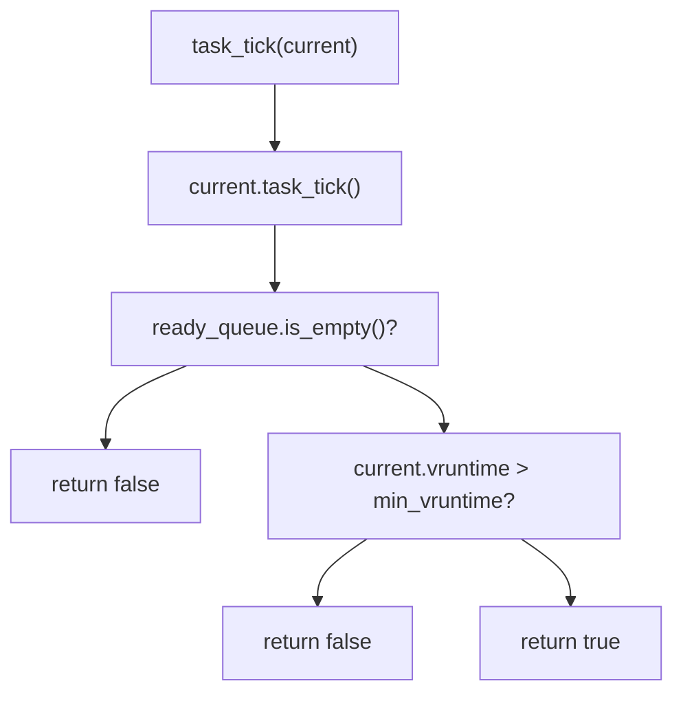
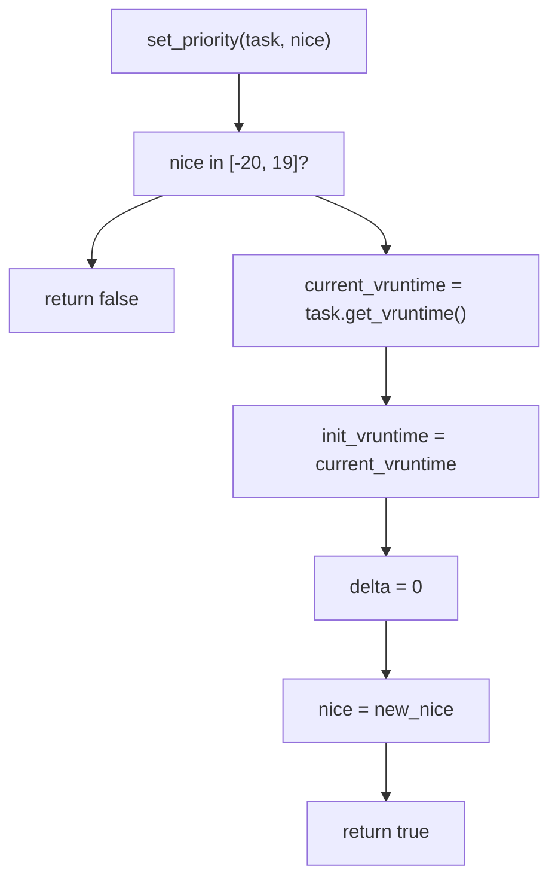
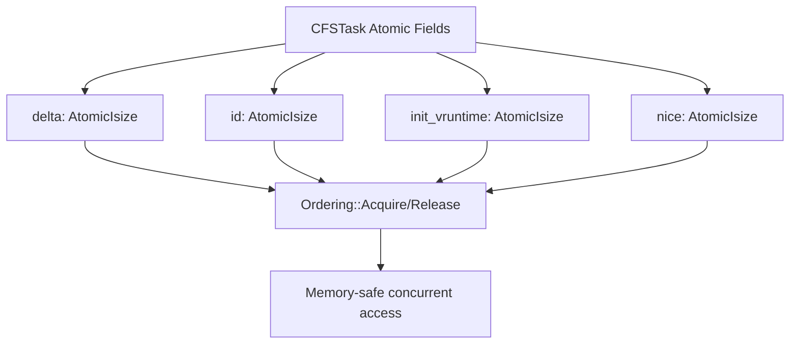

# Completely Fair Scheduler (CFS)

> **Relevant source files**
> * [src/cfs.rs](https://github.com/arceos-org/scheduler/blob/7bb444d5/src/cfs.rs)

This document covers the Completely Fair Scheduler (CFS) implementation provided by the scheduler crate. The CFS implementation aims to provide fair CPU time allocation among tasks based on virtual runtime calculations and supports priority adjustment through nice values.

For information about the overall scheduler architecture and BaseScheduler trait, see [Core Architecture](/arceos-org/scheduler/2-core-architecture). For comparisons with other scheduler implementations, see [Scheduler Comparison](/arceos-org/scheduler/3.4-scheduler-comparison).

## Purpose and Fairness Model

The `CFScheduler` implements a simplified version of the Linux Completely Fair Scheduler algorithm. It maintains fairness by tracking virtual runtime for each task and always selecting the task with the lowest virtual runtime for execution. Tasks with higher priority (lower nice values) accumulate virtual runtime more slowly, allowing them to run more frequently.

**Key Fairness Principles:**

* Tasks are ordered by virtual runtime in a red-black tree (implemented as `BTreeMap`)
* Virtual runtime accumulates based on actual execution time and task weight
* Higher priority tasks (negative nice values) get lower weights, accumulating vruntime slower
* The scheduler always picks the leftmost task (lowest virtual runtime) from the tree

Sources: [src/cfs.rs(L100 - L122)&emsp;](https://github.com/arceos-org/scheduler/blob/7bb444d5/src/cfs.rs#L100-L122)

## Core Data Structures

### CFSTask Wrapper

The `CFSTask<T>` struct wraps user tasks with CFS-specific metadata:

|Field|Type|Purpose|
| --- | --- | --- |
|inner|T|The wrapped user task|
|init_vruntime|AtomicIsize|Initial virtual runtime baseline|
|delta|AtomicIsize|Accumulated execution time delta|
|nice|AtomicIsize|Priority value (-20 to 19 range)|
|id|AtomicIsize|Unique task identifier|

Sources: [src/cfs.rs(L7 - L14)&emsp;](https://github.com/arceos-org/scheduler/blob/7bb444d5/src/cfs.rs#L7-L14) [src/cfs.rs(L31 - L41)&emsp;](https://github.com/arceos-org/scheduler/blob/7bb444d5/src/cfs.rs#L31-L41)

### CFScheduler Structure

The main scheduler maintains a `BTreeMap` as the ready queue and tracks global minimum virtual runtime:

Sources: [src/cfs.rs(L103 - L107)&emsp;](https://github.com/arceos-org/scheduler/blob/7bb444d5/src/cfs.rs#L103-L107) [src/cfs.rs(L109 - L122)&emsp;](https://github.com/arceos-org/scheduler/blob/7bb444d5/src/cfs.rs#L109-L122)

## Virtual Runtime Calculation

The virtual runtime algorithm ensures fairness by adjusting how quickly tasks accumulate runtime based on their priority:

### Nice-to-Weight Conversion

CFS uses Linux-compatible lookup tables to convert nice values to weights:

The weight tables are defined as constants with nice value 0 corresponding to weight 1024:

* Positive nice values (0-19): Lower priority, higher weights
* Negative nice values (-20 to -1): Higher priority, lower weights

Sources: [src/cfs.rs(L16 - L29)&emsp;](https://github.com/arceos-org/scheduler/blob/7bb444d5/src/cfs.rs#L16-L29) [src/cfs.rs(L43 - L50)&emsp;](https://github.com/arceos-org/scheduler/blob/7bb444d5/src/cfs.rs#L43-L50)

### Runtime Accumulation

Sources: [src/cfs.rs(L56 - L63)&emsp;](https://github.com/arceos-org/scheduler/blob/7bb444d5/src/cfs.rs#L56-L63) [src/cfs.rs(L83 - L85)&emsp;](https://github.com/arceos-org/scheduler/blob/7bb444d5/src/cfs.rs#L83-L85)

## Scheduling Algorithm Flow

### Task Addition and Removal

Sources: [src/cfs.rs(L129 - L143)&emsp;](https://github.com/arceos-org/scheduler/blob/7bb444d5/src/cfs.rs#L129-L143) [src/cfs.rs(L161 - L167)&emsp;](https://github.com/arceos-org/scheduler/blob/7bb444d5/src/cfs.rs#L161-L167)

### Preemption Decision

The CFS scheduler makes preemption decisions in `task_tick()` by comparing the current task's virtual runtime with the minimum virtual runtime in the ready queue:

Sources: [src/cfs.rs(L176 - L183)&emsp;](https://github.com/arceos-org/scheduler/blob/7bb444d5/src/cfs.rs#L176-L183)

## Priority Management

CFS supports dynamic priority changes through the nice value interface:

This implementation preserves the task's current virtual runtime position while applying the new priority for future runtime accumulation.

Sources: [src/cfs.rs(L69 - L77)&emsp;](https://github.com/arceos-org/scheduler/blob/7bb444d5/src/cfs.rs#L69-L77) [src/cfs.rs(L185 - L192)&emsp;](https://github.com/arceos-org/scheduler/blob/7bb444d5/src/cfs.rs#L185-L192)

## BaseScheduler Trait Integration

The `CFScheduler` implements the `BaseScheduler` trait with the following type and method mappings:

|BaseScheduler Method|CFS Implementation|Behavior|
| --- | --- | --- |
|SchedItem|Arc<CFSTask<T>>|Reference-counted task wrapper|
|add_task()|Insert into BTreeMap|Assigns ID and initial vruntime|
|remove_task()|Remove from BTreeMap|Updates min_vruntime tracking|
|pick_next_task()|pop_first()|Selects leftmost (lowest vruntime)|
|put_prev_task()|Re-insert with new ID|Maintains vruntime ordering|
|task_tick()|Compare with min_vruntime|Preemption based on fairness|
|set_priority()|Update nice value|Range validation and vruntime preservation|

Sources: [src/cfs.rs(L124 - L193)&emsp;](https://github.com/arceos-org/scheduler/blob/7bb444d5/src/cfs.rs#L124-L193)

## Thread Safety and Atomics

All CFS task metadata uses atomic operations for thread-safe access:

The scheduler itself is not thread-safe and requires external synchronization, but individual task metadata can be safely accessed concurrently.

Sources: [src/cfs.rs(L10 - L13)&emsp;](https://github.com/arceos-org/scheduler/blob/7bb444d5/src/cfs.rs#L10-L13) [src/cfs.rs(L44)&emsp;](https://github.com/arceos-org/scheduler/blob/7bb444d5/src/cfs.rs#L44-L44) [src/cfs.rs(L57)&emsp;](https://github.com/arceos-org/scheduler/blob/7bb444d5/src/cfs.rs#L57-L57) [src/cfs.rs(L66)&emsp;](https://github.com/arceos-org/scheduler/blob/7bb444d5/src/cfs.rs#L66-L66) [src/cfs.rs(L76)&emsp;](https://github.com/arceos-org/scheduler/blob/7bb444d5/src/cfs.rs#L76-L76) [src/cfs.rs(L84)&emsp;](https://github.com/arceos-org/scheduler/blob/7bb444d5/src/cfs.rs#L84-L84)