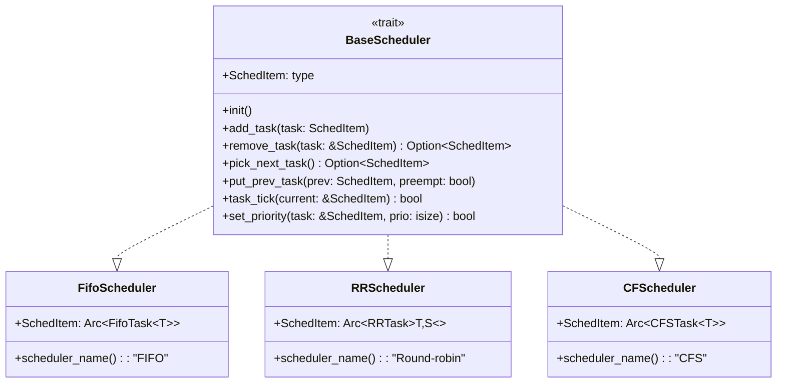
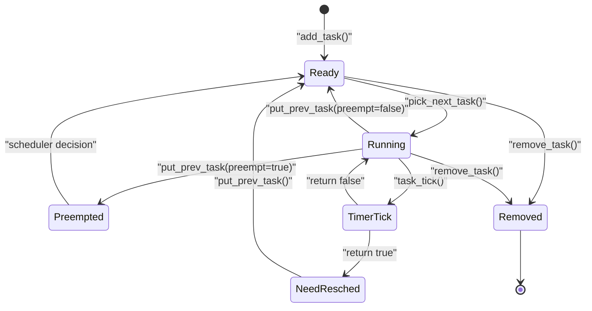
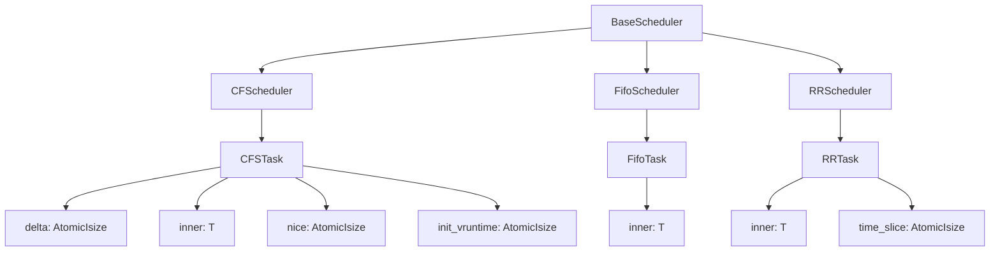
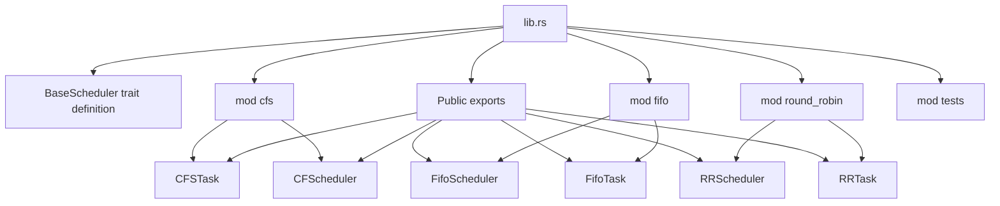

# Core Architecture

> **Relevant source files**
> * [src/lib.rs](https://github.com/arceos-org/scheduler/blob/7bb444d5/src/lib.rs)

This document explains the foundational design of the scheduler crate, focusing on the `BaseScheduler` trait and the architectural principles that enable a unified interface across different scheduling algorithms. For specific implementation details of individual schedulers, see [Scheduler Implementations](/arceos-org/scheduler/3-scheduler-implementations). For testing methodology, see [Testing Framework](/arceos-org/scheduler/4-testing-framework).

## Unified Scheduler Interface

The scheduler crate's core architecture is built around the `BaseScheduler` trait, which provides a consistent interface for all scheduling algorithm implementations. This trait defines eight essential methods that every scheduler must implement, ensuring predictable behavior across different scheduling policies.

### BaseScheduler Trait Structure



**Sources:** [src/lib.rs(L24 - L68)&emsp;](https://github.com/arceos-org/scheduler/blob/7bb444d5/src/lib.rs#L24-L68)

The trait uses an associated type `SchedItem` to allow each scheduler implementation to define its own task wrapper type, providing type safety while maintaining interface consistency.

## Task Lifecycle Management

The architecture defines a clear task lifecycle through the trait methods, ensuring that all schedulers handle task state transitions uniformly.

### Task State Flow



**Sources:** [src/lib.rs(L35 - L67)&emsp;](https://github.com/arceos-org/scheduler/blob/7bb444d5/src/lib.rs#L35-L67)

## Core Methods and Responsibilities

The `BaseScheduler` trait defines specific responsibilities for each method:

|Method|Purpose|Return Type|Safety Requirements|
| --- | --- | --- | --- |
|init|Initialize scheduler state|()|None|
|add_task|Add runnable task to scheduler|()|Task must be runnable|
|remove_task|Remove task by reference|Option<SchedItem>|Task must exist in scheduler|
|pick_next_task|Select and remove next task|Option<SchedItem>|None|
|put_prev_task|Return task to scheduler|()|None|
|task_tick|Process timer tick|bool|Current task must be valid|
|set_priority|Modify task priority|bool|Task must exist in scheduler|

**Sources:** [src/lib.rs(L32 - L67)&emsp;](https://github.com/arceos-org/scheduler/blob/7bb444d5/src/lib.rs#L32-L67)

## Scheduler Implementation Pattern

The architecture follows a consistent pattern where each scheduler implementation manages its own specialized task wrapper type and internal data structures.

### Implementation Hierarchy



**Sources:** [src/lib.rs(L20 - L22)&emsp;](https://github.com/arceos-org/scheduler/blob/7bb444d5/src/lib.rs#L20-L22)

## Design Principles

### Type Safety through Associated Types

The architecture uses Rust's associated type system to ensure compile-time type safety while allowing each scheduler to define its own task wrapper:

```
type SchedItem; // Defined per implementation
```

This approach prevents mixing task types between different scheduler implementations while maintaining a unified interface.

### Memory Safety Patterns

The trait design incorporates several memory safety patterns:

* **Ownership Transfer**: `pick_next_task()` transfers ownership of tasks out of the scheduler
* **Reference-based Operations**: `remove_task()` and `task_tick()` use references to avoid unnecessary ownership transfers
* **Optional Returns**: Methods return `Option<SchedItem>` to handle empty scheduler states safely

### Preemption Awareness

The architecture explicitly supports both cooperative and preemptive scheduling through the `preempt` parameter in `put_prev_task()`, allowing schedulers to implement different policies for preempted versus yielding tasks.

**Sources:** [src/lib.rs(L55 - L58)&emsp;](https://github.com/arceos-org/scheduler/blob/7bb444d5/src/lib.rs#L55-L58)

## Module Organization

The crate follows a modular architecture with clear separation of concerns:



**Sources:** [src/lib.rs(L11 - L22)&emsp;](https://github.com/arceos-org/scheduler/blob/7bb444d5/src/lib.rs#L11-L22)

This modular design ensures that each scheduling algorithm is self-contained while contributing to the unified interface through the central trait definition.