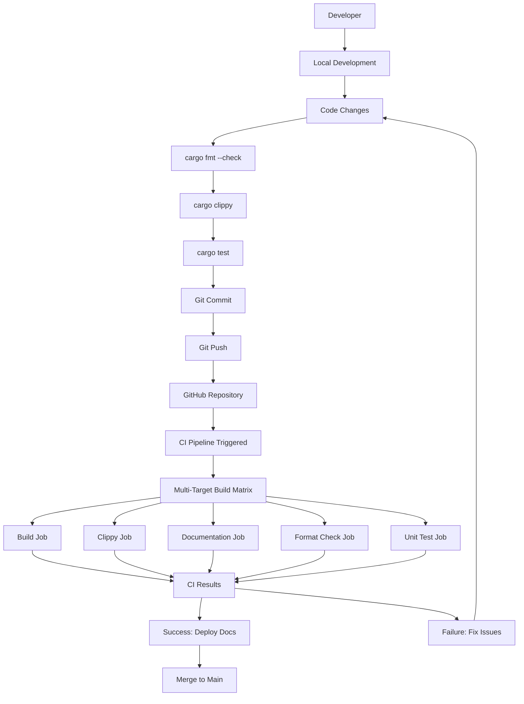
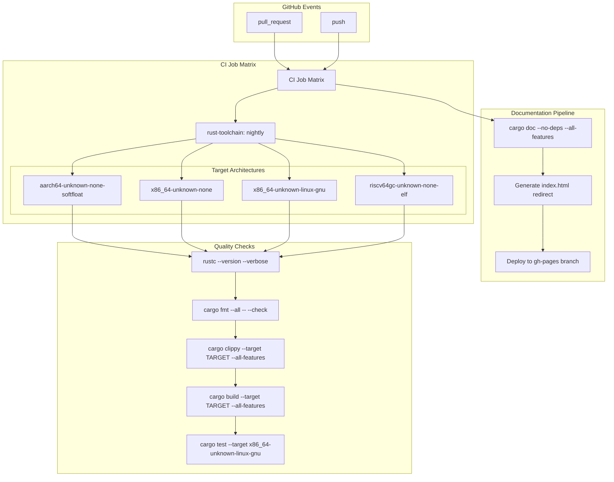
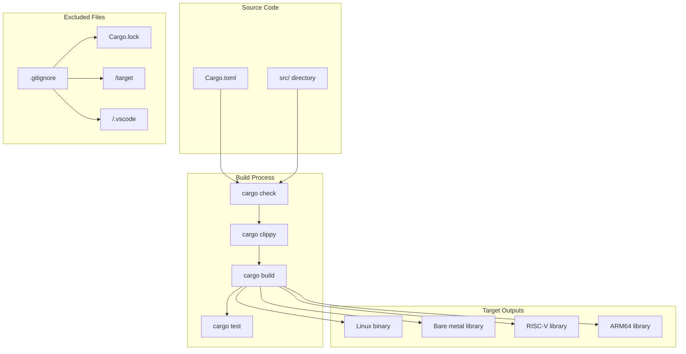
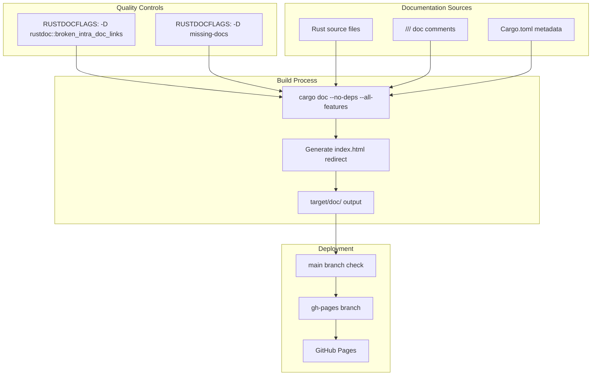

# Development Guide

> **Relevant source files**
> * [.github/workflows/ci.yml](https://github.com/arceos-org/scheduler/blob/7bb444d5/.github/workflows/ci.yml)
> * [.gitignore](https://github.com/arceos-org/scheduler/blob/7bb444d5/.gitignore)

## Purpose and Scope

This guide covers the development workflow, build system, and continuous integration pipeline for the scheduler crate. It provides instructions for contributors on setting up the development environment, running tests, and understanding the automated quality assurance processes.

For information about the testing framework and test structure, see [Testing Framework](/arceos-org/scheduler/4-testing-framework). For details about the scheduler implementations themselves, see [Scheduler Implementations](/arceos-org/scheduler/3-scheduler-implementations).

## Development Workflow

The scheduler crate follows a standard Rust development workflow with automated quality checks enforced through GitHub Actions.

### Development Workflow Overview



Sources: [.github/workflows/ci.yml(L1 - L56)&emsp;](https://github.com/arceos-org/scheduler/blob/7bb444d5/.github/workflows/ci.yml#L1-L56)

### Local Development Setup

The project requires Rust nightly toolchain with specific components and target support:

|Component|Purpose|
| --- | --- |
|rust-src|Source code for cross-compilation|
|clippy|Linting and code analysis|
|rustfmt|Code formatting|

Target architectures that must be installed locally:

* `x86_64-unknown-linux-gnu` - Linux development and testing
* `x86_64-unknown-none` - Bare metal x86_64
* `riscv64gc-unknown-none-elf` - RISC-V bare metal
* `aarch64-unknown-none-softfloat` - ARM64 bare metal

Sources: [.github/workflows/ci.yml(L15 - L19)&emsp;](https://github.com/arceos-org/scheduler/blob/7bb444d5/.github/workflows/ci.yml#L15-L19)

## Continuous Integration Pipeline

The CI system uses GitHub Actions with a comprehensive test matrix covering multiple target architectures and quality checks.

### CI Pipeline Architecture



Sources: [.github/workflows/ci.yml(L1 - L56)&emsp;](https://github.com/arceos-org/scheduler/blob/7bb444d5/.github/workflows/ci.yml#L1-L56)

### CI Configuration Details

The CI pipeline consists of two main jobs defined in [.github/workflows/ci.yml(L6 - L56)&emsp;](https://github.com/arceos-org/scheduler/blob/7bb444d5/.github/workflows/ci.yml#L6-L56):

#### Main CI Job (ci)

* **Trigger**: Push and pull request events [.github/workflows/ci.yml(L3)&emsp;](https://github.com/arceos-org/scheduler/blob/7bb444d5/.github/workflows/ci.yml#L3-L3)
* **Matrix Strategy**: Tests against all target architectures [.github/workflows/ci.yml(L10 - L12)&emsp;](https://github.com/arceos-org/scheduler/blob/7bb444d5/.github/workflows/ci.yml#L10-L12)
* **Rust Toolchain**: Nightly with required components [.github/workflows/ci.yml(L17 - L18)&emsp;](https://github.com/arceos-org/scheduler/blob/7bb444d5/.github/workflows/ci.yml#L17-L18)
* **Quality Gates**:
* Code formatting verification [.github/workflows/ci.yml(L23)&emsp;](https://github.com/arceos-org/scheduler/blob/7bb444d5/.github/workflows/ci.yml#L23-L23)
* Clippy linting with custom allow rules [.github/workflows/ci.yml(L25)&emsp;](https://github.com/arceos-org/scheduler/blob/7bb444d5/.github/workflows/ci.yml#L25-L25)
* Cross-compilation builds [.github/workflows/ci.yml(L27)&emsp;](https://github.com/arceos-org/scheduler/blob/7bb444d5/.github/workflows/ci.yml#L27-L27)
* Unit tests (Linux target only) [.github/workflows/ci.yml(L29 - L30)&emsp;](https://github.com/arceos-org/scheduler/blob/7bb444d5/.github/workflows/ci.yml#L29-L30)

#### Documentation Job (doc)

* **Environment**: Dedicated permissions for GitHub Pages deployment [.github/workflows/ci.yml(L36 - L37)&emsp;](https://github.com/arceos-org/scheduler/blob/7bb444d5/.github/workflows/ci.yml#L36-L37)
* **Rustdoc Flags**: Strict documentation requirements [.github/workflows/ci.yml(L40)&emsp;](https://github.com/arceos-org/scheduler/blob/7bb444d5/.github/workflows/ci.yml#L40-L40)
* **Deployment**: Automatic deployment to `gh-pages` branch on main branch pushes [.github/workflows/ci.yml(L49 - L55)&emsp;](https://github.com/arceos-org/scheduler/blob/7bb444d5/.github/workflows/ci.yml#L49-L55)

## Build System

### Target Architecture Support

The scheduler crate supports four distinct target architectures, each serving different deployment scenarios:

|Target|Environment|Use Case|
| --- | --- | --- |
|x86_64-unknown-linux-gnu|Hosted Linux|Development and testing|
|x86_64-unknown-none|Bare metal x86_64|ArceOS deployment|
|riscv64gc-unknown-none-elf|Bare metal RISC-V|Embedded ArceOS|
|aarch64-unknown-none-softfloat|Bare metal ARM64|ARM-based systems|

Sources: [.github/workflows/ci.yml(L12)&emsp;](https://github.com/arceos-org/scheduler/blob/7bb444d5/.github/workflows/ci.yml#L12-L12)

### Build Process Flow



Sources: [.github/workflows/ci.yml(L25 - L27)&emsp;](https://github.com/arceos-org/scheduler/blob/7bb444d5/.github/workflows/ci.yml#L25-L27) [.gitignore(L1 - L4)&emsp;](https://github.com/arceos-org/scheduler/blob/7bb444d5/.gitignore#L1-L4)

## Testing Procedures

### Local Testing Commands

For comprehensive local testing, developers should run the following commands:

```markdown
# Format check
cargo fmt --all -- --check

# Linting 
cargo clippy --all-features -- -A clippy::new_without_default

# Build for all targets
cargo build --target x86_64-unknown-linux-gnu --all-features
cargo build --target x86_64-unknown-none --all-features
cargo build --target riscv64gc-unknown-none-elf --all-features
cargo build --target aarch64-unknown-none-softfloat --all-features

# Unit tests (Linux only)
cargo test --target x86_64-unknown-linux-gnu -- --nocapture
```

Sources: [.github/workflows/ci.yml(L23 - L30)&emsp;](https://github.com/arceos-org/scheduler/blob/7bb444d5/.github/workflows/ci.yml#L23-L30)

### Test Execution Strategy

The testing framework uses a conditional execution model:

* **Format and Linting**: Applied to all targets
* **Build Verification**: Cross-compiled for all supported architectures
* **Unit Test Execution**: Limited to `x86_64-unknown-linux-gnu` target for practical execution

This approach ensures code quality across all platforms while maintaining efficient CI execution times.

Sources: [.github/workflows/ci.yml(L29 - L30)&emsp;](https://github.com/arceos-org/scheduler/blob/7bb444d5/.github/workflows/ci.yml#L29-L30)

## Documentation System

### Documentation Generation Process



Sources: [.github/workflows/ci.yml(L40 - L55)&emsp;](https://github.com/arceos-org/scheduler/blob/7bb444d5/.github/workflows/ci.yml#L40-L55)

### Documentation Deployment

The documentation system enforces strict quality requirements through rustdoc flags:

* Broken intra-documentation links are treated as errors [.github/workflows/ci.yml(L40)&emsp;](https://github.com/arceos-org/scheduler/blob/7bb444d5/.github/workflows/ci.yml#L40-L40)
* Missing documentation comments trigger build failures [.github/workflows/ci.yml(L40)&emsp;](https://github.com/arceos-org/scheduler/blob/7bb444d5/.github/workflows/ci.yml#L40-L40)

Deployment occurs automatically when changes are pushed to the main branch, using the `JamesIves/github-pages-deploy-action` for single-commit deployment to the `gh-pages` branch [.github/workflows/ci.yml(L51 - L55)&emsp;](https://github.com/arceos-org/scheduler/blob/7bb444d5/.github/workflows/ci.yml#L51-L55)

Sources: [.github/workflows/ci.yml(L32 - L55)&emsp;](https://github.com/arceos-org/scheduler/blob/7bb444d5/.github/workflows/ci.yml#L32-L55)