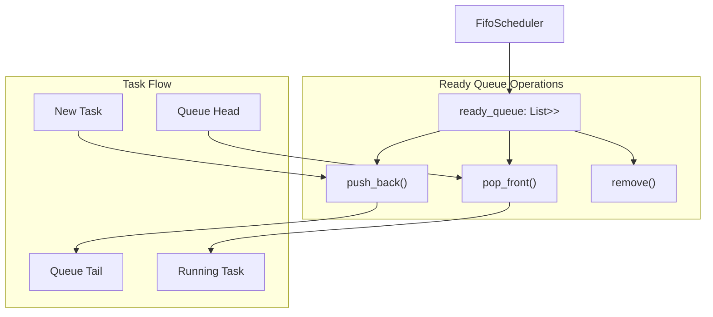
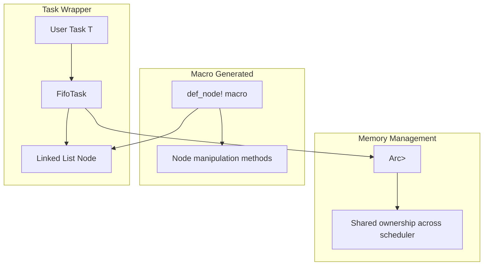
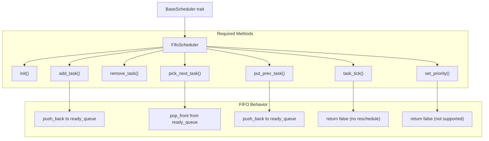
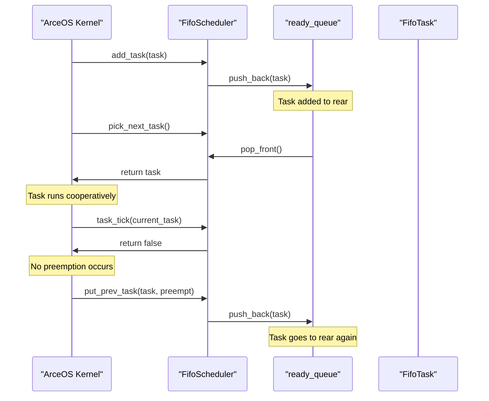

# FIFO Scheduler

> **Relevant source files**
> * [src/fifo.rs](https://github.com/arceos-org/scheduler/blob/7bb444d5/src/fifo.rs)

## Purpose and Scope

This document covers the FIFO (First-In-First-Out) scheduler implementation within the ArceOS scheduler crate. The FIFO scheduler provides cooperative task scheduling with simple queue-based ordering. For information about the unified scheduler interface, see [Core Architecture](/arceos-org/scheduler/2-core-architecture). For comparisons with other scheduling algorithms, see [Scheduler Comparison](/arceos-org/scheduler/3.4-scheduler-comparison).

## Overview

The FIFO scheduler is the simplest scheduling algorithm provided by the scheduler crate. It implements a cooperative, non-preemptive scheduling policy where tasks are executed in the order they were added to the ready queue.

### Key Characteristics

|Characteristic|Value|
| --- | --- |
|Scheduling Policy|Cooperative, Non-preemptive|
|Data Structure|Linked List (linked_list_r4l::List)|
|Task Ordering|First-In-First-Out|
|Priority Support|No|
|Timer Preemption|No|
|Scheduler Name|"FIFO"|

**Sources:** [src/fifo.rs(L14 - L22)&emsp;](https://github.com/arceos-org/scheduler/blob/7bb444d5/src/fifo.rs#L14-L22) [src/fifo.rs(L35 - L37)&emsp;](https://github.com/arceos-org/scheduler/blob/7bb444d5/src/fifo.rs#L35-L37)

## Implementation Architecture

### FIFO Scheduler Structure

The `FifoScheduler<T>` maintains a single ready queue implemented as a linked list:



**Sources:** [src/fifo.rs(L23 - L25)&emsp;](https://github.com/arceos-org/scheduler/blob/7bb444d5/src/fifo.rs#L23-L25) [src/fifo.rs(L46)&emsp;](https://github.com/arceos-org/scheduler/blob/7bb444d5/src/fifo.rs#L46-L46) [src/fifo.rs(L54)&emsp;](https://github.com/arceos-org/scheduler/blob/7bb444d5/src/fifo.rs#L54-L54) [src/fifo.rs(L50)&emsp;](https://github.com/arceos-org/scheduler/blob/7bb444d5/src/fifo.rs#L50-L50)

## Task Wrapper Implementation

### FifoTask Structure

The `FifoTask<T>` wraps user tasks to work with the linked list data structure:



The `FifoTask` is defined using the `def_node!` macro from `linked_list_r4l`, which automatically generates the necessary linked list node methods.

**Sources:** [src/fifo.rs(L7 - L12)&emsp;](https://github.com/arceos-org/scheduler/blob/7bb444d5/src/fifo.rs#L7-L12)

## BaseScheduler Implementation

### Core Scheduling Methods

The `FifoScheduler` implements all required `BaseScheduler` trait methods:



**Sources:** [src/fifo.rs(L40 - L68)&emsp;](https://github.com/arceos-org/scheduler/blob/7bb444d5/src/fifo.rs#L40-L68)

### Method Implementations

|Method|Implementation|Return Value|
| --- | --- | --- |
|init()|No initialization required|()|
|add_task()|Adds task to rear of queue viapush_back()|()|
|remove_task()|Removes task using unsaferemove()|Option<Self::SchedItem>|
|pick_next_task()|Gets task from front viapop_front()|Option<Self::SchedItem>|
|put_prev_task()|Adds task back to rear of queue|()|
|task_tick()|No action (cooperative scheduling)|false|
|set_priority()|No priority support|false|

**Sources:** [src/fifo.rs(L43 - L67)&emsp;](https://github.com/arceos-org/scheduler/blob/7bb444d5/src/fifo.rs#L43-L67)

## Scheduling Behavior

### Task Lifecycle in FIFO Scheduler



**Sources:** [src/fifo.rs(L45 - L46)&emsp;](https://github.com/arceos-org/scheduler/blob/7bb444d5/src/fifo.rs#L45-L46) [src/fifo.rs(L53 - L54)&emsp;](https://github.com/arceos-org/scheduler/blob/7bb444d5/src/fifo.rs#L53-L54) [src/fifo.rs(L57 - L58)&emsp;](https://github.com/arceos-org/scheduler/blob/7bb444d5/src/fifo.rs#L57-L58) [src/fifo.rs(L61 - L62)&emsp;](https://github.com/arceos-org/scheduler/blob/7bb444d5/src/fifo.rs#L61-L62)

### Cooperative Scheduling Model

The FIFO scheduler operates under a cooperative model where:

1. **No Preemption**: Tasks run until they voluntarily yield control
2. **Timer Tick Ignored**: The `task_tick()` method always returns `false`, indicating no need for rescheduling
3. **Simple Ordering**: Tasks are scheduled strictly in FIFO order
4. **No Priorities**: All tasks have equal scheduling priority

**Sources:** [src/fifo.rs(L20)&emsp;](https://github.com/arceos-org/scheduler/blob/7bb444d5/src/fifo.rs#L20-L20) [src/fifo.rs(L61 - L62)&emsp;](https://github.com/arceos-org/scheduler/blob/7bb444d5/src/fifo.rs#L61-L62) [src/fifo.rs(L65 - L66)&emsp;](https://github.com/arceos-org/scheduler/blob/7bb444d5/src/fifo.rs#L65-L66)

## Constructor and Utility Methods

The `FifoScheduler` provides simple construction and identification:

```javascript
// Constructor
pub const fn new() -> Self

// Scheduler identification  
pub fn scheduler_name() -> &'static str
```

The `new()` method creates an empty scheduler with an initialized but empty `ready_queue`. The `scheduler_name()` method returns the string `"FIFO"` for identification purposes.

**Sources:** [src/fifo.rs(L28 - L33)&emsp;](https://github.com/arceos-org/scheduler/blob/7bb444d5/src/fifo.rs#L28-L33) [src/fifo.rs(L34 - L37)&emsp;](https://github.com/arceos-org/scheduler/blob/7bb444d5/src/fifo.rs#L34-L37)