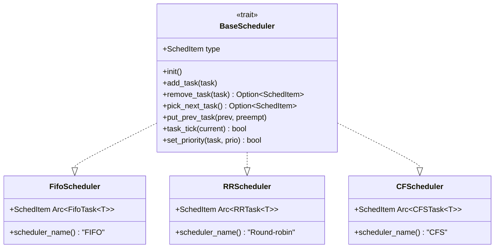

# Overview

> **Relevant source files**
> * [Cargo.toml](https://github.com/arceos-org/scheduler/blob/7bb444d5/Cargo.toml)
> * [src/lib.rs](https://github.com/arceos-org/scheduler/blob/7bb444d5/src/lib.rs)

## Purpose and Scope

The scheduler crate provides a unified interface for multiple scheduling algorithms within the ArceOS operating system project. This document covers the overall architecture, core components, and design principles of the scheduler system. The crate implements three distinct scheduling algorithms—FIFO, Round Robin, and Completely Fair Scheduler (CFS)—through a common `BaseScheduler` trait interface.

For detailed information about individual scheduler implementations, see [Scheduler Implementations](/arceos-org/scheduler/3-scheduler-implementations). For guidance on extending or modifying the scheduler system, see [Development Guide](/arceos-org/scheduler/5-development-guide).

## System Architecture

The scheduler crate follows a trait-based design pattern that enables polymorphic usage of different scheduling algorithms within the ArceOS kernel. The system consists of a core trait definition, multiple algorithm implementations, and associated task wrapper types.

### Core Components Overview

```

```

**Sources:** [src/lib.rs(L24 - L68)&emsp;](https://github.com/arceos-org/scheduler/blob/7bb444d5/src/lib.rs#L24-L68) [Cargo.toml(L1 - L14)&emsp;](https://github.com/arceos-org/scheduler/blob/7bb444d5/Cargo.toml#L1-L14)

### Trait Implementation Mapping



**Sources:** [src/lib.rs(L28 - L68)&emsp;](https://github.com/arceos-org/scheduler/blob/7bb444d5/src/lib.rs#L28-L68) [src/lib.rs(L20 - L22)&emsp;](https://github.com/arceos-org/scheduler/blob/7bb444d5/src/lib.rs#L20-L22)

## Algorithm Characteristics

The crate provides three scheduling algorithms with distinct characteristics and use cases:

|Algorithm|Type|Preemption|Priority Support|Data Structure|
| --- | --- | --- | --- | --- |
|FIFO|Cooperative|No|No|linked_list_r4l::List|
|Round Robin|Preemptive|Timer-based|No|VecDeque|
|CFS|Preemptive|Virtual runtime|Nice values|BTreeMap|

## Core Interface Design

The `BaseScheduler` trait defines the fundamental operations required by all scheduling algorithms. The trait uses an associated type `SchedItem` to represent scheduled entities, enabling type-safe implementation across different task wrapper types.

Key operations include:

* **Task Management**: `add_task()`, `remove_task()` for inserting and removing tasks from the scheduler
* **Scheduling Decisions**: `pick_next_task()` for selecting the next task to execute
* **Context Switching**: `put_prev_task()` for handling previously running tasks
* **Timer Integration**: `task_tick()` for time-based scheduling decisions
* **Priority Control**: `set_priority()` for dynamic priority adjustment

**Sources:** [src/lib.rs(L28 - L68)&emsp;](https://github.com/arceos-org/scheduler/blob/7bb444d5/src/lib.rs#L28-L68)

## Integration with ArceOS

The scheduler crate is designed as a foundational component for the ArceOS operating system, providing the scheduling subsystem that manages task execution. The unified interface allows the kernel to interact with different scheduling policies through the same API, enabling runtime scheduler selection or algorithm-specific optimizations.

The crate uses `#![cfg_attr(not(test), no_std)]` to support both hosted testing environments and bare-metal execution contexts required by ArceOS.

**Sources:** [src/lib.rs(L9)&emsp;](https://github.com/arceos-org/scheduler/blob/7bb444d5/src/lib.rs#L9-L9) [Cargo.toml(L8 - L10)&emsp;](https://github.com/arceos-org/scheduler/blob/7bb444d5/Cargo.toml#L8-L10)

## Testing and Validation

The crate includes a comprehensive testing framework that validates the behavior of all scheduler implementations. The testing system uses macro-based test generation to ensure consistent validation across different algorithms.

For detailed information about the testing framework and development workflow, see [Testing Framework](/arceos-org/scheduler/4-testing-framework) and [Development Guide](/arceos-org/scheduler/5-development-guide).

**Sources:** [src/lib.rs(L15 - L16)&emsp;](https://github.com/arceos-org/scheduler/blob/7bb444d5/src/lib.rs#L15-L16)

## Next Steps

This overview provides the foundation for understanding the scheduler crate architecture. For more detailed information:

* [Core Architecture](/arceos-org/scheduler/2-core-architecture) - Deep dive into the `BaseScheduler` trait design and implementation patterns
* [Scheduler Implementations](/arceos-org/scheduler/3-scheduler-implementations) - Detailed documentation of each scheduling algorithm
* [Testing Framework](/arceos-org/scheduler/4-testing-framework) - Testing infrastructure and validation methodology
* [Development Guide](/arceos-org/scheduler/5-development-guide) - Guidelines for contributing to and extending the scheduler system