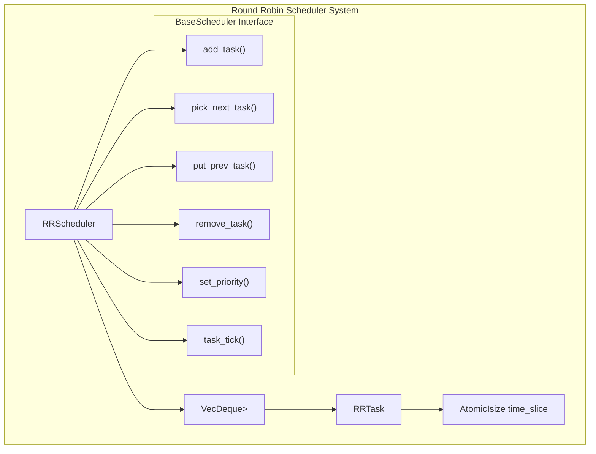
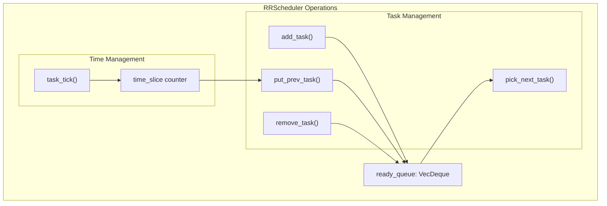
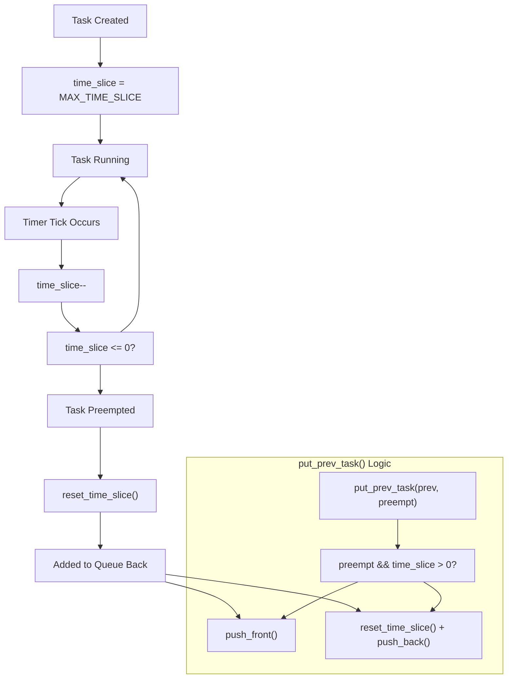

# Round Robin Scheduler

> **Relevant source files**
> * [src/round_robin.rs](https://github.com/arceos-org/scheduler/blob/7bb444d5/src/round_robin.rs)

## Purpose and Scope

This document covers the Round Robin scheduler implementation (`RRScheduler`) in the scheduler crate, which provides preemptive scheduling based on time quantum allocation. The Round Robin scheduler ensures fair CPU time distribution among tasks by rotating execution using fixed time slices.

For information about the unified scheduler interface, see [Core Architecture](/arceos-org/scheduler/2-core-architecture). For comparisons with other scheduling algorithms, see [Scheduler Comparison](/arceos-org/scheduler/3.4-scheduler-comparison).

## Architecture Overview

The Round Robin scheduler consists of two main components: the `RRTask` wrapper that adds time slice tracking to tasks, and the `RRScheduler` that implements the preemptive scheduling logic using a FIFO queue with time quantum management.

### Round Robin Scheduler Components



**Sources:** [src/round_robin.rs(L1 - L114)&emsp;](https://github.com/arceos-org/scheduler/blob/7bb444d5/src/round_robin.rs#L1-L114)

## RRTask Wrapper

The `RRTask` wrapper extends any task type `T` with time slice management capabilities. It maintains an atomic counter that tracks the remaining time slice for preemption decisions.

### RRTask Structure and Methods

|Method|Purpose|Atomicity|
| --- | --- | --- |
|new(inner: T)|Creates wrapper with initial time slice set toMAX_TIME_SLICE|-|
|time_slice()|Returns current time slice value|Acquireordering|
|reset_time_slice()|Resets time slice toMAX_TIME_SLICE|Releaseordering|
|inner()|Provides access to wrapped task|-|

The time slice counter is implemented as an `AtomicIsize` to ensure thread-safe access during concurrent scheduler operations.

**Sources:** [src/round_robin.rs(L7 - L44)&emsp;](https://github.com/arceos-org/scheduler/blob/7bb444d5/src/round_robin.rs#L7-L44)

## RRScheduler Implementation

The `RRScheduler` implements the `BaseScheduler` trait using a `VecDeque` as the ready queue. This provides O(1) insertion and removal at both ends, but O(n) removal from arbitrary positions.

### Scheduler Data Structure and Core Methods



### Key Implementation Details

* **Ready Queue**: Uses `VecDeque<Arc<RRTask<T, MAX_TIME_SLICE>>>` for task storage
* **Task Addition**: New tasks are added to the back of the queue via `push_back()`
* **Task Selection**: Next task is selected from the front via `pop_front()`
* **Task Removal**: Requires O(n) search using `Arc::ptr_eq()` for pointer comparison
* **Priority Support**: Not supported - `set_priority()` always returns `false`

**Sources:** [src/round_robin.rs(L58 - L113)&emsp;](https://github.com/arceos-org/scheduler/blob/7bb444d5/src/round_robin.rs#L58-L113)

## Time Slice Management

The Round Robin scheduler's core feature is its time quantum management system. Each task receives a fixed time slice that determines how long it can execute before being preempted.

### Time Slice Lifecycle



### Timer Tick Implementation

The `task_tick()` method implements the time slice decrement logic:

```javascript
// From src/round_robin.rs:105-108
fn task_tick(&mut self, current: &Self::SchedItem) -> bool {
    let old_slice = current.time_slice.fetch_sub(1, Ordering::Release);
    old_slice <= 1
}
```

This atomic operation decrements the time slice and returns `true` when the task should be preempted (when the slice reaches zero).

**Sources:** [src/round_robin.rs(L105 - L108)&emsp;](https://github.com/arceos-org/scheduler/blob/7bb444d5/src/round_robin.rs#L105-L108)

## Scheduling Behavior

The Round Robin scheduler exhibits specific behavior patterns that distinguish it from other scheduling algorithms in the crate.

### Task State Transitions

|Scheduler Method|Action|Queue Position|Time Slice Action|
| --- | --- | --- | --- |
|add_task()|Add new task|Back of queue|Set toMAX_TIME_SLICE|
|pick_next_task()|Select task|Remove from front|No change|
|put_prev_task()(preempted, slice > 0)|Voluntary yield|Front of queue|No change|
|put_prev_task()(preempted, slice = 0)|Time expired|Back of queue|Reset toMAX_TIME_SLICE|
|put_prev_task()(not preempted)|Cooperative yield|Back of queue|Reset toMAX_TIME_SLICE|

### Preemption Logic

The scheduler distinguishes between voluntary and involuntary preemption in its `put_prev_task()` implementation:

* **Voluntary Preemption**: Task still has time slice remaining and yielded voluntarily - placed at front of queue
* **Time Expiration**: Task's time slice reached zero - time slice reset and task placed at back of queue
* **Cooperative Yield**: Task not preempted (blocking I/O, etc.) - time slice reset and task placed at back of queue

**Sources:** [src/round_robin.rs(L96 - L103)&emsp;](https://github.com/arceos-org/scheduler/blob/7bb444d5/src/round_robin.rs#L96-L103)

## Performance Characteristics

### Computational Complexity

|Operation|Time Complexity|Space Complexity|Notes|
| --- | --- | --- | --- |
|add_task()|O(1)|O(1)|VecDeque::push_back()|
|pick_next_task()|O(1)|O(1)|VecDeque::pop_front()|
|remove_task()|O(n)|O(1)|Linear search withArc::ptr_eq()|
|put_prev_task()|O(1)|O(1)|VecDeque::push_front()orpush_back()|
|task_tick()|O(1)|O(1)|Atomic decrement operation|

### Design Tradeoffs

* **Fairness**: Provides time-based fairness through fixed time slices
* **Preemption**: Supports timer-based preemption unlike FIFO scheduler
* **Simplicity**: Simpler than CFS but more complex than FIFO
* **Performance**: O(n) task removal limits scalability for workloads with frequent task removal
* **Priority**: No priority support - all tasks receive equal time allocation

**Sources:** [src/round_robin.rs(L84 - L90)&emsp;](https://github.com/arceos-org/scheduler/blob/7bb444d5/src/round_robin.rs#L84-L90) [src/round_robin.rs(L110 - L112)&emsp;](https://github.com/arceos-org/scheduler/blob/7bb444d5/src/round_robin.rs#L110-L112)