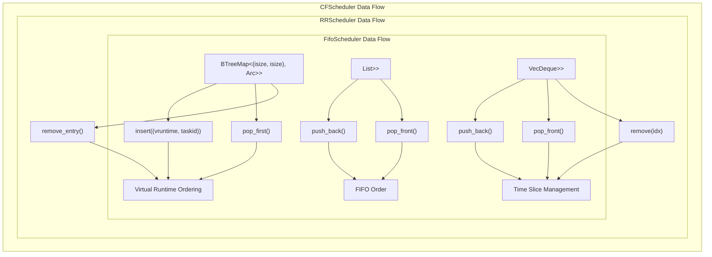
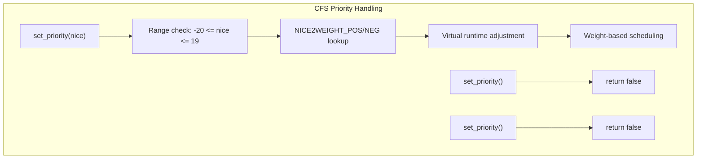
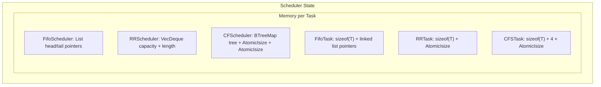
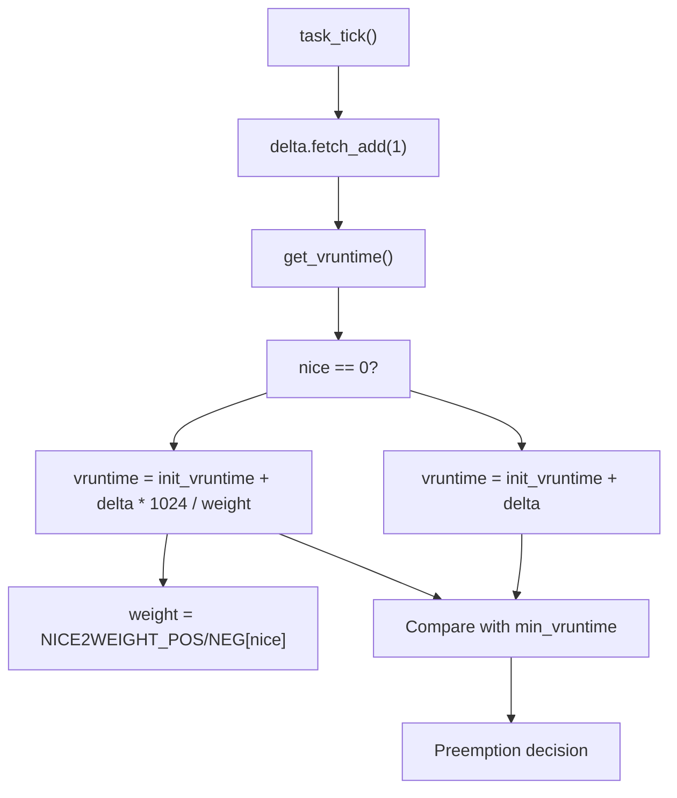

# Scheduler Comparison

> **Relevant source files**
> * [src/cfs.rs](https://github.com/arceos-org/scheduler/blob/7bb444d5/src/cfs.rs)
> * [src/fifo.rs](https://github.com/arceos-org/scheduler/blob/7bb444d5/src/fifo.rs)
> * [src/round_robin.rs](https://github.com/arceos-org/scheduler/blob/7bb444d5/src/round_robin.rs)

This document compares the three scheduler implementations provided by the scheduler crate: FIFO, Round Robin, and Completely Fair Scheduler (CFS). The comparison covers their scheduling algorithms, data structures, performance characteristics, and appropriate use cases.

For detailed implementation specifics of each scheduler, see [FIFO Scheduler](/arceos-org/scheduler/3.1-fifo-scheduler), [Round Robin Scheduler](/arceos-org/scheduler/3.3-round-robin-scheduler), and [Completely Fair Scheduler](/arceos-org/scheduler/3.2-completely-fair-scheduler-(cfs)).

## Scheduler Overview

The scheduler crate provides three distinct scheduling algorithms, each implementing the `BaseScheduler` trait but with fundamentally different approaches to task management and execution ordering.

|Scheduler|Type|Data Structure|Preemption|Priority Support|Complexity|
| --- | --- | --- | --- | --- | --- |
|FifoScheduler|Cooperative|List<Arc<FifoTask<T>>>|None|None|O(1) add/pick, O(n) remove|
|RRScheduler|Preemptive|VecDeque<Arc<RRTask<T, S>>>|Time-based|None|O(1) add/pick, O(n) remove|
|CFScheduler|Preemptive|BTreeMap<(isize, isize), Arc<CFSTask<T>>>|Virtual runtime|Nice values (-20 to 19)|O(log n) all operations|

Sources: [src/fifo.rs(L23 - L25)&emsp;](https://github.com/arceos-org/scheduler/blob/7bb444d5/src/fifo.rs#L23-L25) [src/round_robin.rs(L58 - L60)&emsp;](https://github.com/arceos-org/scheduler/blob/7bb444d5/src/round_robin.rs#L58-L60) [src/cfs.rs(L103 - L107)&emsp;](https://github.com/arceos-org/scheduler/blob/7bb444d5/src/cfs.rs#L103-L107)

## Data Structure Comparison

### Ready Queue Implementation Comparison



Sources: [src/fifo.rs(L46 - L47)&emsp;](https://github.com/arceos-org/scheduler/blob/7bb444d5/src/fifo.rs#L46-L47) [src/round_robin.rs(L81 - L82)&emsp;](https://github.com/arceos-org/scheduler/blob/7bb444d5/src/round_robin.rs#L81-L82) [src/cfs.rs(L137)&emsp;](https://github.com/arceos-org/scheduler/blob/7bb444d5/src/cfs.rs#L137-L137)

### Task Wrapper Feature Comparison

```mermaid
flowchart TD
subgraph CFSTask<T>["CFSTask"]
    C1["inner: T"]
    C2["init_vruntime: AtomicIsize"]
    C4["nice: AtomicIsize"]
    C5["id: AtomicIsize"]
    R1["inner: T"]
    R2["time_slice: AtomicIsize"]
    F1["inner: T"]
    F2["No additional state"]
    subgraph subGraph1["RRTask"]
        C3["delta: AtomicIsize"]
        R3["MAX_TIME_SLICE: const"]
        subgraph FifoTask<T>["FifoTask"]
            C1["inner: T"]
            C2["init_vruntime: AtomicIsize"]
            R1["inner: T"]
            R2["time_slice: AtomicIsize"]
            F1["inner: T"]
            F2["No additional state"]
        end
    end
end
```

Sources: [src/fifo.rs(L7 - L12)&emsp;](https://github.com/arceos-org/scheduler/blob/7bb444d5/src/fifo.rs#L7-L12) [src/round_robin.rs(L10 - L13)&emsp;](https://github.com/arceos-org/scheduler/blob/7bb444d5/src/round_robin.rs#L10-L13) [src/cfs.rs(L8 - L14)&emsp;](https://github.com/arceos-org/scheduler/blob/7bb444d5/src/cfs.rs#L8-L14)

## Scheduling Behavior Analysis

### Preemption and Time Management

|Method|FifoScheduler|RRScheduler|CFScheduler|
| --- | --- | --- | --- |
|task_tick()|Always returnsfalse|Decrements time slice, returnstruewhen<= 1|Incrementsdelta, compares withmin_vruntime|
|put_prev_task()|Always re-queues at back|Conditional placement based on preemption and time slice|Re-inserts with updatedvruntime|
|Preemption Logic|None (cooperative)|old_slice <= 1|current.get_vruntime() > min_vruntime|

Sources: [src/fifo.rs(L61 - L63)&emsp;](https://github.com/arceos-org/scheduler/blob/7bb444d5/src/fifo.rs#L61-L63) [src/round_robin.rs(L105 - L108)&emsp;](https://github.com/arceos-org/scheduler/blob/7bb444d5/src/round_robin.rs#L105-L108) [src/cfs.rs(L176 - L183)&emsp;](https://github.com/arceos-org/scheduler/blob/7bb444d5/src/cfs.rs#L176-L183)

### Priority and Weight System



Sources: [src/fifo.rs(L65 - L67)&emsp;](https://github.com/arceos-org/scheduler/blob/7bb444d5/src/fifo.rs#L65-L67) [src/round_robin.rs(L110 - L112)&emsp;](https://github.com/arceos-org/scheduler/blob/7bb444d5/src/round_robin.rs#L110-L112) [src/cfs.rs(L185 - L192)&emsp;](https://github.com/arceos-org/scheduler/blob/7bb444d5/src/cfs.rs#L185-L192)

## Performance Characteristics

### Algorithmic Complexity

|Operation|FifoScheduler|RRScheduler|CFScheduler|
| --- | --- | --- | --- |
|add_task()|O(1) -push_back()|O(1) -push_back()|O(log n) -BTreeMap::insert()|
|remove_task()|O(n) - linked list traversal|O(n) -VecDequesearch|O(log n) -BTreeMap::remove_entry()|
|pick_next_task()|O(1) -pop_front()|O(1) -pop_front()|O(log n) -BTreeMap::pop_first()|
|put_prev_task()|O(1) -push_back()|O(1) - conditional placement|O(log n) -BTreeMap::insert()|

Sources: [src/fifo.rs(L45 - L58)&emsp;](https://github.com/arceos-org/scheduler/blob/7bb444d5/src/fifo.rs#L45-L58) [src/round_robin.rs(L80 - L102)&emsp;](https://github.com/arceos-org/scheduler/blob/7bb444d5/src/round_robin.rs#L80-L102) [src/cfs.rs(L129 - L174)&emsp;](https://github.com/arceos-org/scheduler/blob/7bb444d5/src/cfs.rs#L129-L174)

### Memory Overhead



Sources: [src/fifo.rs(L7 - L12)&emsp;](https://github.com/arceos-org/scheduler/blob/7bb444d5/src/fifo.rs#L7-L12) [src/round_robin.rs(L10 - L13)&emsp;](https://github.com/arceos-org/scheduler/blob/7bb444d5/src/round_robin.rs#L10-L13) [src/cfs.rs(L8 - L14)&emsp;](https://github.com/arceos-org/scheduler/blob/7bb444d5/src/cfs.rs#L8-L14) [src/cfs.rs(L103 - L107)&emsp;](https://github.com/arceos-org/scheduler/blob/7bb444d5/src/cfs.rs#L103-L107)

## Virtual Runtime Calculation in CFS

The CFS implementation uses a sophisticated virtual runtime system based on Linux CFS:



Sources: [src/cfs.rs(L56 - L63)&emsp;](https://github.com/arceos-org/scheduler/blob/7bb444d5/src/cfs.rs#L56-L63) [src/cfs.rs(L83 - L85)&emsp;](https://github.com/arceos-org/scheduler/blob/7bb444d5/src/cfs.rs#L83-L85) [src/cfs.rs(L23 - L29)&emsp;](https://github.com/arceos-org/scheduler/blob/7bb444d5/src/cfs.rs#L23-L29)

## Use Case Recommendations

### FifoScheduler

**Best for:**

* Embedded systems with predictable workloads
* Cooperative multitasking environments
* Systems where task completion order matters
* Low-overhead requirements

**Limitations:**

* No fairness guarantees
* No preemption support
* Potential for task starvation

### RRScheduler

**Best for:**

* Interactive systems requiring responsiveness
* Equal priority tasks
* Time-sharing systems
* Simple preemptive scheduling needs

**Limitations:**

* No priority differentiation
* Fixed time quantum may not suit all workloads
* O(n) task removal cost

### CFScheduler

**Best for:**

* Multi-user systems
* Priority-aware workloads
* Fair resource allocation requirements
* Linux-compatible scheduling behavior

**Limitations:**

* Higher computational overhead
* More complex implementation
* Memory overhead from priority tracking

Sources: [src/fifo.rs(L14 - L22)&emsp;](https://github.com/arceos-org/scheduler/blob/7bb444d5/src/fifo.rs#L14-L22) [src/round_robin.rs(L46 - L56)&emsp;](https://github.com/arceos-org/scheduler/blob/7bb444d5/src/round_robin.rs#L46-L56) [src/cfs.rs(L100 - L102)&emsp;](https://github.com/arceos-org/scheduler/blob/7bb444d5/src/cfs.rs#L100-L102)