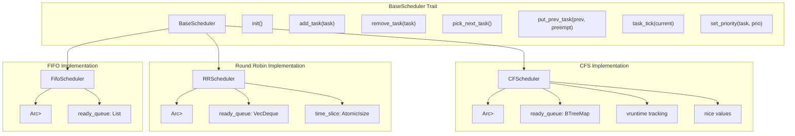
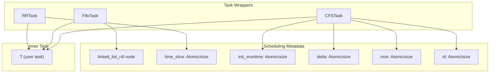
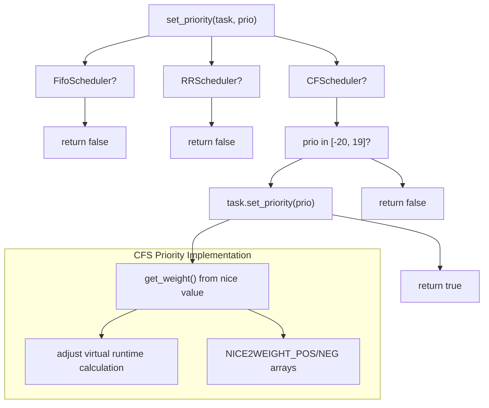

# Scheduler Implementations

> **Relevant source files**
> * [src/cfs.rs](https://github.com/arceos-org/scheduler/blob/7bb444d5/src/cfs.rs)
> * [src/fifo.rs](https://github.com/arceos-org/scheduler/blob/7bb444d5/src/fifo.rs)
> * [src/lib.rs](https://github.com/arceos-org/scheduler/blob/7bb444d5/src/lib.rs)
> * [src/round_robin.rs](https://github.com/arceos-org/scheduler/blob/7bb444d5/src/round_robin.rs)

This document provides an overview of the three scheduler algorithm implementations provided by the crate: FIFO, Round Robin, and Completely Fair Scheduler (CFS). Each implementation adheres to the unified `BaseScheduler` interface while providing distinct scheduling behaviors and performance characteristics.

For details about the `BaseScheduler` trait and core architecture, see [Core Architecture](/arceos-org/scheduler/2-core-architecture). For detailed documentation of each individual scheduler, see [FIFO Scheduler](/arceos-org/scheduler/3.1-fifo-scheduler), [Completely Fair Scheduler (CFS)](/arceos-org/scheduler/3.2-completely-fair-scheduler-(cfs)), and [Round Robin Scheduler](/arceos-org/scheduler/3.3-round-robin-scheduler).

## Scheduler Overview

The crate provides three distinct scheduling algorithms, each designed for different use cases and performance requirements:

|Scheduler|Type|Priority Support|Preemption|Data Structure|Use Case|
| --- | --- | --- | --- | --- | --- |
|FifoScheduler|Cooperative|No|No|linked_list_r4l::List|Simple sequential execution|
|RRScheduler|Preemptive|No|Time-based|VecDeque|Fair time sharing|
|CFScheduler|Preemptive|Yes (nice values)|Virtual runtime|BTreeMap|Advanced fair scheduling|

Each scheduler manages tasks wrapped in scheduler-specific container types that add necessary scheduling metadata.

Sources: [src/lib.rs(L1 - L8)&emsp;](https://github.com/arceos-org/scheduler/blob/7bb444d5/src/lib.rs#L1-L8) [src/fifo.rs(L14 - L22)&emsp;](https://github.com/arceos-org/scheduler/blob/7bb444d5/src/fifo.rs#L14-L22) [src/round_robin.rs(L46 - L56)&emsp;](https://github.com/arceos-org/scheduler/blob/7bb444d5/src/round_robin.rs#L46-L56) [src/cfs.rs(L100 - L102)&emsp;](https://github.com/arceos-org/scheduler/blob/7bb444d5/src/cfs.rs#L100-L102)

## Implementation Architecture

### Trait Implementation Hierarchy

Sources: [src/lib.rs(L24 - L68)&emsp;](https://github.com/arceos-org/scheduler/blob/7bb444d5/src/lib.rs#L24-L68) [src/fifo.rs(L23 - L38)&emsp;](https://github.com/arceos-org/scheduler/blob/7bb444d5/src/fifo.rs#L23-L38) [src/round_robin.rs(L58 - L73)&emsp;](https://github.com/arceos-org/scheduler/blob/7bb444d5/src/round_robin.rs#L58-L73) [src/cfs.rs(L103 - L122)&emsp;](https://github.com/arceos-org/scheduler/blob/7bb444d5/src/cfs.rs#L103-L122)

### Task Wrapper Architecture

Sources: [src/fifo.rs(L7 - L12)&emsp;](https://github.com/arceos-org/scheduler/blob/7bb444d5/src/fifo.rs#L7-L12) [src/round_robin.rs(L7 - L13)&emsp;](https://github.com/arceos-org/scheduler/blob/7bb444d5/src/round_robin.rs#L7-L13) [src/cfs.rs(L7 - L14)&emsp;](https://github.com/arceos-org/scheduler/blob/7bb444d5/src/cfs.rs#L7-L14)

## Scheduling Behavior Comparison

### Core Scheduling Methods

Each scheduler implements the `BaseScheduler` methods differently:

**Task Selection (`pick_next_task`)**:

* `FifoScheduler`: Removes and returns the head of the linked list [src/fifo.rs(L53 - L55)&emsp;](https://github.com/arceos-org/scheduler/blob/7bb444d5/src/fifo.rs#L53-L55)
* `RRScheduler`: Removes and returns the front of the `VecDeque` [src/round_robin.rs(L92 - L94)&emsp;](https://github.com/arceos-org/scheduler/blob/7bb444d5/src/round_robin.rs#L92-L94)
* `CFScheduler`: Removes and returns the task with minimum virtual runtime from `BTreeMap` [src/cfs.rs(L161 - L167)&emsp;](https://github.com/arceos-org/scheduler/blob/7bb444d5/src/cfs.rs#L161-L167)

**Task Insertion (`put_prev_task`)**:

* `FifoScheduler`: Always appends to the back of the queue [src/fifo.rs(L57 - L59)&emsp;](https://github.com/arceos-org/scheduler/blob/7bb444d5/src/fifo.rs#L57-L59)
* `RRScheduler`: Inserts at front if preempted with remaining time slice, otherwise resets time slice and appends to back [src/round_robin.rs(L96 - L103)&emsp;](https://github.com/arceos-org/scheduler/blob/7bb444d5/src/round_robin.rs#L96-L103)
* `CFScheduler`: Assigns new task ID and inserts based on updated virtual runtime [src/cfs.rs(L169 - L174)&emsp;](https://github.com/arceos-org/scheduler/blob/7bb444d5/src/cfs.rs#L169-L174)

**Preemption Logic (`task_tick`)**:

* `FifoScheduler`: Never requests reschedule (cooperative) [src/fifo.rs(L61 - L63)&emsp;](https://github.com/arceos-org/scheduler/blob/7bb444d5/src/fifo.rs#L61-L63)
* `RRScheduler`: Decrements time slice and requests reschedule when it reaches zero [src/round_robin.rs(L105 - L108)&emsp;](https://github.com/arceos-org/scheduler/blob/7bb444d5/src/round_robin.rs#L105-L108)
* `CFScheduler`: Increments virtual runtime delta and requests reschedule when current task's virtual runtime exceeds minimum [src/cfs.rs(L176 - L183)&emsp;](https://github.com/arceos-org/scheduler/blob/7bb444d5/src/cfs.rs#L176-L183)

Sources: [src/fifo.rs(L40 - L68)&emsp;](https://github.com/arceos-org/scheduler/blob/7bb444d5/src/fifo.rs#L40-L68) [src/round_robin.rs(L75 - L113)&emsp;](https://github.com/arceos-org/scheduler/blob/7bb444d5/src/round_robin.rs#L75-L113) [src/cfs.rs(L124 - L193)&emsp;](https://github.com/arceos-org/scheduler/blob/7bb444d5/src/cfs.rs#L124-L193)

### Priority Support

Only the `CFScheduler` supports dynamic priority adjustment through nice values:

Sources: [src/fifo.rs(L65 - L67)&emsp;](https://github.com/arceos-org/scheduler/blob/7bb444d5/src/fifo.rs#L65-L67) [src/round_robin.rs(L110 - L112)&emsp;](https://github.com/arceos-org/scheduler/blob/7bb444d5/src/round_robin.rs#L110-L112) [src/cfs.rs(L185 - L192)&emsp;](https://github.com/arceos-org/scheduler/blob/7bb444d5/src/cfs.rs#L185-L192) [src/cfs.rs(L23 - L29)&emsp;](https://github.com/arceos-org/scheduler/blob/7bb444d5/src/cfs.rs#L23-L29) [src/cfs.rs(L43 - L50)&emsp;](https://github.com/arceos-org/scheduler/blob/7bb444d5/src/cfs.rs#L43-L50)

## Data Structure Performance Characteristics

|Operation|FifoScheduler|RRScheduler|CFScheduler|
| --- | --- | --- | --- |
|add_task|O(1)|O(1)|O(log n)|
|pick_next_task|O(1)|O(1)|O(log n)|
|remove_task|O(1)|O(n)|O(log n)|
|put_prev_task|O(1)|O(1)|O(log n)|
|Memory overhead|Minimal|Low|Moderate|

The choice of data structure reflects each scheduler's priorities:

* `FifoScheduler` uses `linked_list_r4l::List` for optimal insertion/removal performance
* `RRScheduler` uses `VecDeque` for simple front/back operations but suffers from O(n) arbitrary removal
* `CFScheduler` uses `BTreeMap` keyed by `(vruntime, task_id)` to maintain virtual runtime ordering

Sources: [src/fifo.rs(L23 - L25)&emsp;](https://github.com/arceos-org/scheduler/blob/7bb444d5/src/fifo.rs#L23-L25) [src/round_robin.rs(L58 - L60)&emsp;](https://github.com/arceos-org/scheduler/blob/7bb444d5/src/round_robin.rs#L58-L60) [src/cfs.rs(L103 - L107)&emsp;](https://github.com/arceos-org/scheduler/blob/7bb444d5/src/cfs.rs#L103-L107)

## Thread Safety and Atomic Operations

All task metadata requiring atomic access is implemented using `AtomicIsize`:

* `RRTask`: `time_slice` for preemption-safe time tracking [src/round_robin.rs(L10 - L13)&emsp;](https://github.com/arceos-org/scheduler/blob/7bb444d5/src/round_robin.rs#L10-L13)
* `CFSTask`: `init_vruntime`, `delta`, `nice`, and `id` for lock-free virtual runtime calculations [src/cfs.rs(L8 - L14)&emsp;](https://github.com/arceos-org/scheduler/blob/7bb444d5/src/cfs.rs#L8-L14)
* `FifoTask`: No atomic state needed due to cooperative nature [src/fifo.rs(L7 - L12)&emsp;](https://github.com/arceos-org/scheduler/blob/7bb444d5/src/fifo.rs#L7-L12)

This design enables safe concurrent access to task state during scheduling operations without requiring additional synchronization primitives.

Sources: [src/round_robin.rs(L10 - L13)&emsp;](https://github.com/arceos-org/scheduler/blob/7bb444d5/src/round_robin.rs#L10-L13) [src/cfs.rs(L8 - L14)&emsp;](https://github.com/arceos-org/scheduler/blob/7bb444d5/src/cfs.rs#L8-L14) [src/fifo.rs(L7 - L12)&emsp;](https://github.com/arceos-org/scheduler/blob/7bb444d5/src/fifo.rs#L7-L12)