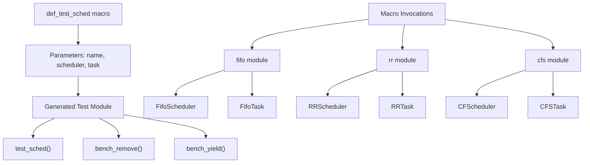
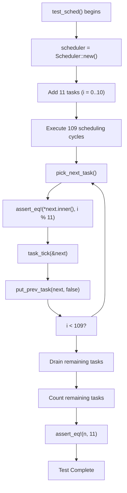
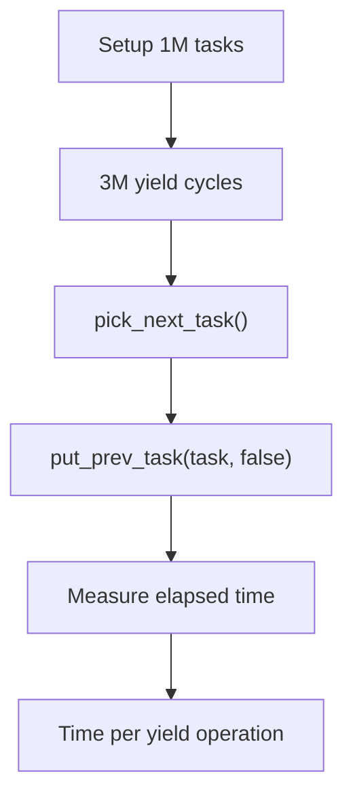
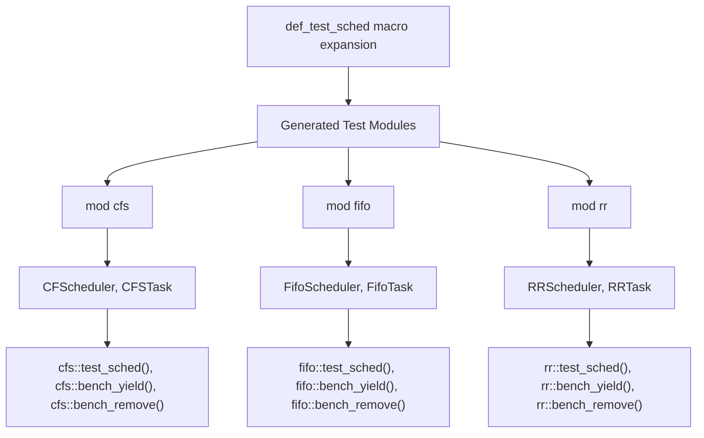

# Testing Framework

> **Relevant source files**
> * [src/tests.rs](https://github.com/arceos-org/scheduler/blob/7bb444d5/src/tests.rs)

The testing framework provides a unified, macro-based testing infrastructure that ensures consistent validation and performance measurement across all scheduler implementations in the crate. The framework automatically generates comprehensive test suites for each scheduler type, including basic functionality verification and performance benchmarks.

For information about the specific scheduler implementations being tested, see [Scheduler Implementations](/arceos-org/scheduler/3-scheduler-implementations). For details about the development workflow and CI pipeline that executes these tests, see [Development Guide](/arceos-org/scheduler/5-development-guide).

## Macro-Based Test Generation

The testing framework is built around the `def_test_sched` macro, which generates a complete test module for any given scheduler and task type combination. This approach ensures that all scheduler implementations are tested consistently with identical test logic.

### Test Generation Architecture

Sources: [src/tests.rs(L1 - L84)&emsp;](https://github.com/arceos-org/scheduler/blob/7bb444d5/src/tests.rs#L1-L84)

The macro accepts three parameters: a module name identifier, a scheduler type, and a task wrapper type. It then generates a complete test module containing three distinct test functions that exercise different aspects of scheduler behavior.

## Test Types

The framework provides three categories of tests, each targeting specific scheduler capabilities and performance characteristics.

### Basic Functionality Tests

The `test_sched` function verifies core scheduler operations using a controlled set of 11 tasks. This test validates the fundamental scheduler contract defined by the `BaseScheduler` trait.

#### Test Execution Flow

Sources: [src/tests.rs(L8 - L29)&emsp;](https://github.com/arceos-org/scheduler/blob/7bb444d5/src/tests.rs#L8-L29)

The test performs multiple scheduling rounds to verify that tasks are selected in the expected order based on each scheduler's algorithm. The `task_tick` call ensures proper time accounting for time-based schedulers like Round Robin and CFS.

### Performance Benchmarks

The framework includes two performance benchmarks that measure different scheduler operations under load.

#### Yield Benchmark

The `bench_yield` function measures task switching performance by repeatedly picking and yielding tasks in a large task set.

|Parameter|Value|Purpose|
| --- | --- | --- |
|NUM_TASKS|1,000,000|Large task set for realistic load testing|
|COUNT|3,000,000|Number of yield operations (3x tasks)|
|Measurement|Time per yield operation|Scheduler switching overhead|

Sources: [src/tests.rs(L32 - L52)&emsp;](https://github.com/arceos-org/scheduler/blob/7bb444d5/src/tests.rs#L32-L52)

#### Remove Benchmark

The `bench_remove` function measures task removal performance by removing tasks from the scheduler in reverse order.

|Parameter|Value|Purpose|
| --- | --- | --- |
|NUM_TASKS|10,000|Moderate task set for removal testing|
|Removal Order|Reverse (9999→0)|Worst-case removal pattern|
|Measurement|Time per removal|Task lookup and removal overhead|

Sources: [src/tests.rs(L54 - L77)&emsp;](https://github.com/arceos-org/scheduler/blob/7bb444d5/src/tests.rs#L54-L77)

## Test Application Across Schedulers

The framework applies identical test logic to all three scheduler implementations through macro invocations, ensuring consistent validation while accommodating scheduler-specific type parameters.

### Scheduler Test Instantiation

Sources: [src/tests.rs(L82 - L84)&emsp;](https://github.com/arceos-org/scheduler/blob/7bb444d5/src/tests.rs#L82-L84)

Each scheduler implementation receives type-appropriate parameters:

* **FIFO**: Simple `usize` task payload with `FifoScheduler` and `FifoTask`
* **Round Robin**: `usize` payload with time slice constant `5` for `RRScheduler<usize, 5>` and `RRTask<usize, 5>`
* **CFS**: `usize` payload with `CFScheduler` and `CFSTask` for virtual runtime scheduling

## Performance Measurement

The benchmarks provide quantitative performance data for comparing scheduler implementations. The framework measures operation latency using `std::time::Instant` and reports results in time per operation.

### Benchmark Output Format

The benchmarks output performance metrics in a standardized format:

* **Yield Benchmark**: `"{scheduler_name}: task yield speed: {duration}/task"`
* **Remove Benchmark**: `"{scheduler_name}: task remove speed: {duration}/task"`

This consistent reporting enables direct performance comparison between scheduler algorithms and helps identify performance characteristics specific to each implementation.

Sources: [src/tests.rs(L47 - L51)&emsp;](https://github.com/arceos-org/scheduler/blob/7bb444d5/src/tests.rs#L47-L51) [src/tests.rs(L72 - L76)&emsp;](https://github.com/arceos-org/scheduler/blob/7bb444d5/src/tests.rs#L72-L76)

The testing framework ensures that all scheduler implementations meet the same functional requirements while providing objective performance data to guide scheduler selection for specific use cases.