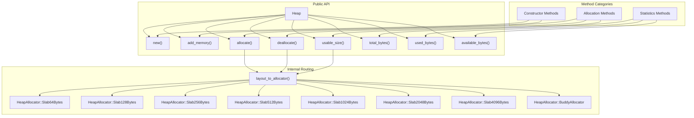
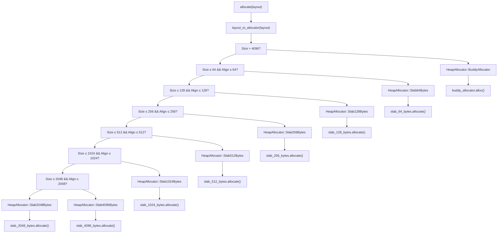
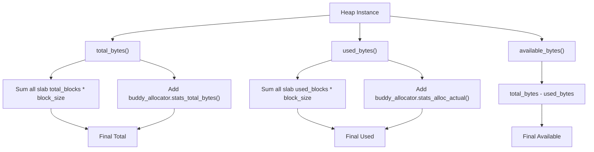

# API Reference

> **Relevant source files**
> * [src/lib.rs](https://github.com/arceos-org/slab_allocator/blob/3c13499d/src/lib.rs)
> * [src/slab.rs](https://github.com/arceos-org/slab_allocator/blob/3c13499d/src/slab.rs)

This page provides comprehensive documentation for all public APIs in the `slab_allocator` crate. It covers the `Heap` struct and its methods, including constructor functions, allocation operations, and memory statistics. For architectural details about how these APIs work internally, see [Core Architecture](/arceos-org/slab_allocator/3-core-architecture). For practical usage examples and integration patterns, see [Getting Started](/arceos-org/slab_allocator/2-getting-started).

## Core Types

### Heap Struct

The `Heap` struct is the primary interface for memory allocation in this crate, implementing a hybrid allocation strategy with multiple slab allocators and a buddy system allocator.

```css
pub struct Heap {
    slab_64_bytes: Slab<64>,
    slab_128_bytes: Slab<128>,
    slab_256_bytes: Slab<256>,
    slab_512_bytes: Slab<512>,
    slab_1024_bytes: Slab<1024>,
    slab_2048_bytes: Slab<2048>,
    slab_4096_bytes: Slab<4096>,
    buddy_allocator: buddy_system_allocator::Heap<32>,
}
```

**API Structure**



Sources: [src/lib.rs(L40 - L49)&emsp;](https://github.com/arceos-org/slab_allocator/blob/3c13499d/src/lib.rs#L40-L49) [src/lib.rs(L27 - L36)&emsp;](https://github.com/arceos-org/slab_allocator/blob/3c13499d/src/lib.rs#L27-L36)

## Constructor Methods

### new()

Creates a new heap instance with the specified memory region.

```rust
pub unsafe fn new(heap_start_addr: usize, heap_size: usize) -> Heap
```

**Parameters:**

* `heap_start_addr: usize` - Starting address of the heap memory region (must be page-aligned)
* `heap_size: usize` - Size of the heap in bytes (must be ≥ MIN_HEAP_SIZE and multiple of MIN_HEAP_SIZE)

**Returns:** `Heap` - A new heap instance

**Safety Requirements:**

* The start address must be valid and accessible
* The memory range `<FileRef file-url="https://github.com/arceos-org/slab_allocator/blob/3c13499d/heap_start_addr, heap_start_addr + heap_size)` must not be used elsewhere\n- `heap_start_addr` must be page-aligned (4096-byte boundary)\n- `heap_size` must be at least `0x8000` bytes (32KB)\n- `heap_size` must be a multiple of `0x8000` bytes\n\nSources#LNaN-LNaN" NaN  file-path="heap_start_addr, heap_start_addr + heap_size)`must not be used elsewhere\n-`heap_start_addr`must be page-aligned (4096-byte boundary)\n-`heap_size`must be at least`0x8000`bytes (32KB)\n-`heap_size`must be a multiple of`0x8000` bytes\n\nSources">Hii [src/lib.rs(L25)&emsp;](https://github.com/arceos-org/slab_allocator/blob/3c13499d/src/lib.rs#L25-L25)

### add_memory()

Extends the heap with additional memory region.

```rust
pub unsafe fn add_memory(&mut self, heap_start_addr: usize, heap_size: usize)
```

**Parameters:**

* `heap_start_addr: usize` - Starting address of the additional memory region (must be page-aligned)
* `heap_size: usize` - Size of the additional memory in bytes (must be multiple of page size)

**Safety Requirements:**

* The start address must be valid and accessible
* The memory range must not overlap with existing allocations
* `heap_start_addr` must be page-aligned (4096-byte boundary)
* `heap_size` must be a multiple of page size (4096 bytes)

Sources: [src/lib.rs(L88 - L106)&emsp;](https://github.com/arceos-org/slab_allocator/blob/3c13499d/src/lib.rs#L88-L106)

## Allocation Methods

### allocate()

Allocates memory according to the specified layout requirements.

```rust
pub fn allocate(&mut self, layout: Layout) -> Result<usize, AllocError>
```

**Parameters:**

* `layout: Layout` - Memory layout specification including size and alignment requirements

**Returns:**

* `Ok(usize)` - Address of the allocated memory block
* `Err(AllocError)` - Allocation failed due to insufficient memory

**Performance:**

* O(1) for allocations ≤ 4096 bytes (slab allocators)
* O(n) for allocations > 4096 bytes (buddy allocator)

**Allocation Routing Logic**



Sources: [src/lib.rs(L131 - L164)&emsp;](https://github.com/arceos-org/slab_allocator/blob/3c13499d/src/lib.rs#L131-L164) [src/lib.rs(L207 - L226)&emsp;](https://github.com/arceos-org/slab_allocator/blob/3c13499d/src/lib.rs#L207-L226)

### deallocate()

Frees a previously allocated memory block.

```rust
pub unsafe fn deallocate(&mut self, ptr: usize, layout: Layout)
```

**Parameters:**

* `ptr: usize` - Address of the memory block to free (must be returned from previous `allocate()` call)
* `layout: Layout` - Original layout used for allocation (must match exactly)

**Safety Requirements:**

* `ptr` must be a valid pointer returned by a previous call to `allocate()` with identical layout
* The memory block must not have been previously freed
* The layout must match the original allocation layout exactly

**Performance:**

* O(1) for blocks ≤ 4096 bytes (slab allocators)
* O(n) for blocks > 4096 bytes (buddy allocator)

Sources: [src/lib.rs(L166 - L190)&emsp;](https://github.com/arceos-org/slab_allocator/blob/3c13499d/src/lib.rs#L166-L190)

### usable_size()

Returns the bounds on the usable size of an allocation with the given layout.

```rust
pub fn usable_size(&self, layout: Layout) -> (usize, usize)
```

**Parameters:**

* `layout: Layout` - Memory layout specification

**Returns:** `(usize, usize)` - Tuple of (minimum_usable_size, maximum_usable_size)

**Behavior:**

* For slab allocations: returns `(layout.size(), slab_block_size)`
* For buddy allocations: returns `(layout.size(), layout.size())`

|Slab Size|Usable Size Range|
| --- | --- |
|64 bytes|(requested_size, 64)|
|128 bytes|(requested_size, 128)|
|256 bytes|(requested_size, 256)|
|512 bytes|(requested_size, 512)|
|1024 bytes|(requested_size, 1024)|
|2048 bytes|(requested_size, 2048)|
|4096 bytes|(requested_size, 4096)|
|Buddy allocator|(requested_size, requested_size)|

Sources: [src/lib.rs(L192 - L205)&emsp;](https://github.com/arceos-org/slab_allocator/blob/3c13499d/src/lib.rs#L192-L205)

## Statistics Methods

### total_bytes()

Returns the total memory size managed by the heap.

```rust
pub fn total_bytes(&self) -> usize
```

**Returns:** `usize` - Total memory in bytes across all slab allocators and buddy allocator

**Calculation:** Sum of (total_blocks × block_size) for each slab plus buddy allocator total bytes.

Sources: [src/lib.rs(L228 - L238)&emsp;](https://github.com/arceos-org/slab_allocator/blob/3c13499d/src/lib.rs#L228-L238)

### used_bytes()

Returns the currently allocated memory size.

```rust
pub fn used_bytes(&self) -> usize
```

**Returns:** `usize` - Currently allocated memory in bytes

**Calculation:** Sum of (used_blocks × block_size) for each slab plus buddy allocator allocated bytes.

Sources: [src/lib.rs(L240 - L250)&emsp;](https://github.com/arceos-org/slab_allocator/blob/3c13499d/src/lib.rs#L240-L250)

### available_bytes()

Returns the available memory size for new allocations.

```rust
pub fn available_bytes(&self) -> usize
```

**Returns:** `usize` - Available memory in bytes

**Calculation:** `total_bytes() - used_bytes()`

Sources: [src/lib.rs(L252 - L255)&emsp;](https://github.com/arceos-org/slab_allocator/blob/3c13499d/src/lib.rs#L252-L255)

## Constants and Configuration

### Memory Size Constants

|Constant|Value|Description|
| --- | --- | --- |
|SET_SIZE|64|Number of blocks allocated when a slab needs to grow|
|MIN_HEAP_SIZE|0x8000 (32KB)|Minimum heap size fornew()constructor|

Sources: [src/lib.rs(L24 - L25)&emsp;](https://github.com/arceos-org/slab_allocator/blob/3c13499d/src/lib.rs#L24-L25)

### Slab Size Configuration

The allocator uses seven fixed-size slab allocators with the following block sizes:

|Slab Type|Block Size|Use Case|
| --- | --- | --- |
|Slab<64>|64 bytes|Small objects, metadata|
|Slab<128>|128 bytes|Small structures|
|Slab<256>|256 bytes|Medium structures|
|Slab<512>|512 bytes|Large structures|
|Slab<1024>|1024 bytes|Very large structures|
|Slab<2048>|2048 bytes|Page-like allocations|
|Slab<4096>|4096 bytes|Page allocations|
|Buddy Allocator|Variable|Allocations > 4096 bytes|

Sources: [src/lib.rs(L41 - L48)&emsp;](https://github.com/arceos-org/slab_allocator/blob/3c13499d/src/lib.rs#L41-L48)

## Usage Patterns

**Memory Statistics Flow**



Sources: [src/lib.rs(L228 - L255)&emsp;](https://github.com/arceos-org/slab_allocator/blob/3c13499d/src/lib.rs#L228-L255)

**Typical API Usage Sequence:**

1. Create heap with `unsafe { Heap::new(start_addr, size) }`
2. Optionally extend with `unsafe { heap.add_memory(addr, size) }`
3. Allocate memory with `heap.allocate(layout)`
4. Use allocated memory
5. Free memory with `unsafe { heap.deallocate(ptr, layout) }`
6. Monitor statistics with `heap.total_bytes()`, `heap.used_bytes()`, `heap.available_bytes()`

Sources: [src/lib.rs(L52 - L255)&emsp;](https://github.com/arceos-org/slab_allocator/blob/3c13499d/src/lib.rs#L52-L255)