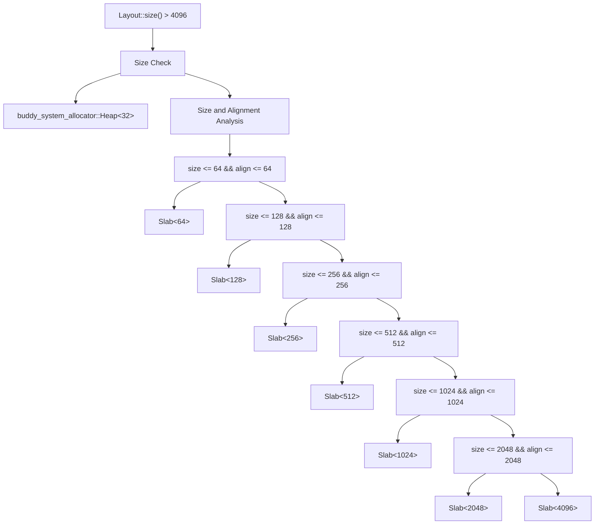
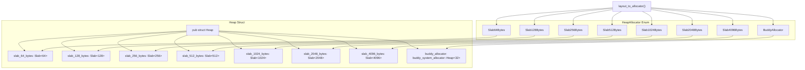
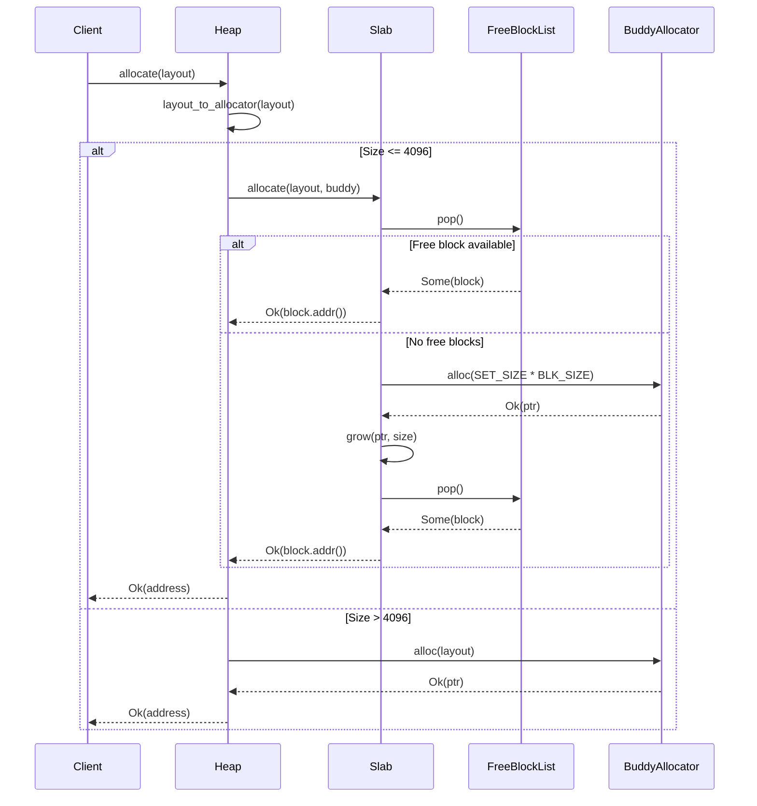
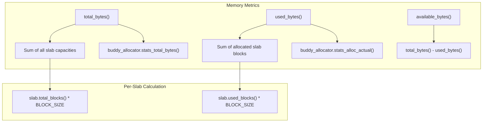

# Core Architecture

> **Relevant source files**
> * [src/lib.rs](https://github.com/arceos-org/slab_allocator/blob/3c13499d/src/lib.rs)
> * [src/slab.rs](https://github.com/arceos-org/slab_allocator/blob/3c13499d/src/slab.rs)

This document provides a comprehensive overview of the slab allocator's hybrid memory management architecture. It explains the fundamental design decisions, component interactions, and allocation strategies that enable efficient memory management in `no_std` environments. For detailed implementation specifics of individual components, see [Heap Allocator Design](/arceos-org/slab_allocator/3.1-heap-allocator-design) and [Slab Implementation](/arceos-org/slab_allocator/3.2-slab-implementation).

## Hybrid Allocation Strategy

The slab allocator implements a two-tier memory allocation system that optimizes for both small fixed-size allocations and large variable-size allocations. The core design principle is to route allocation requests to the most appropriate allocator based on size and alignment requirements.

### Allocation Decision Tree



Sources: [src/lib.rs(L207 - L226)&emsp;](https://github.com/arceos-org/slab_allocator/blob/3c13499d/src/lib.rs#L207-L226)

### Component Architecture

The `Heap` struct orchestrates multiple specialized allocators to provide a unified memory management interface:



Sources: [src/lib.rs(L40 - L49)&emsp;](https://github.com/arceos-org/slab_allocator/blob/3c13499d/src/lib.rs#L40-L49) [src/lib.rs(L27 - L36)&emsp;](https://github.com/arceos-org/slab_allocator/blob/3c13499d/src/lib.rs#L27-L36)

## Memory Organization and Block Management

Each slab allocator manages fixed-size blocks through a linked list of free blocks. The system uses a hybrid approach where slabs can dynamically grow by requesting memory from the buddy allocator.

### Slab Internal Structure

```mermaid
flowchart TD
subgraph subGraph1["FreeBlockList Operations"]
    E["pop()"]
    F["Returns available block"]
    G["push()"]
    H["Adds freed block to list"]
    I["new()"]
    J["Initializes from memory range"]
end
subgraph Slab<BLK_SIZE>["Slab"]
    A["free_block_list: FreeBlockList"]
    B["head: Option<&'static mut FreeBlock>"]
    C["len: usize"]
    D["total_blocks: usize"]
end
subgraph subGraph2["Dynamic Growth"]
    K["allocate() fails"]
    L["Request SET_SIZE * BLK_SIZE from buddy"]
    M["grow()"]
    N["Create new FreeBlockList"]
    O["Transfer blocks to main list"]
end

A --> B
A --> C
A --> E
A --> G
B --> F
B --> H
E --> F
G --> H
I --> J
K --> L
L --> M
M --> N
N --> O
```

Sources: [src/slab.rs(L4 - L7)&emsp;](https://github.com/arceos-org/slab_allocator/blob/3c13499d/src/slab.rs#L4-L7) [src/slab.rs(L65 - L68)&emsp;](https://github.com/arceos-org/slab_allocator/blob/3c13499d/src/slab.rs#L65-L68)

## Allocation Flow and Integration Points

The allocation process demonstrates the tight integration between slab allocators and the buddy allocator, with automatic fallback and growth mechanisms.

### Allocation Process Flow



Sources: [src/lib.rs(L135 - L164)&emsp;](https://github.com/arceos-org/slab_allocator/blob/3c13499d/src/lib.rs#L135-L164) [src/slab.rs(L35 - L55)&emsp;](https://github.com/arceos-org/slab_allocator/blob/3c13499d/src/slab.rs#L35-L55)

## Performance Characteristics and Design Rationale

### Allocation Complexity

|Allocation Type|Time Complexity|Space Overhead|Use Case|
| --- | --- | --- | --- |
|Slab (≤ 4096 bytes)|O(1)|Fixed per slab|Frequent small allocations|
|Buddy (> 4096 bytes)|O(log n)|Variable|Large or variable-size allocations|
|Slab growth|O(SET_SIZE)|Batch allocation|Slab expansion|

### Key Design Constants

```javascript
const SET_SIZE: usize = 64;           // Blocks per growth operation
const MIN_HEAP_SIZE: usize = 0x8000;  // Minimum heap size (32KB)
```

The `SET_SIZE` constant controls the granularity of slab growth operations. When a slab runs out of free blocks, it requests `SET_SIZE * BLK_SIZE` bytes from the buddy allocator, ensuring efficient batch allocation while minimizing buddy allocator overhead.

Sources: [src/lib.rs(L24 - L25)&emsp;](https://github.com/arceos-org/slab_allocator/blob/3c13499d/src/lib.rs#L24-L25) [src/slab.rs(L44 - L48)&emsp;](https://github.com/arceos-org/slab_allocator/blob/3c13499d/src/slab.rs#L44-L48)

## Memory Statistics and Monitoring

The architecture provides comprehensive memory usage tracking across both allocation subsystems:

### Statistics Calculation



Sources: [src/lib.rs(L228 - L255)&emsp;](https://github.com/arceos-org/slab_allocator/blob/3c13499d/src/lib.rs#L228-L255)

## Integration with Buddy Allocator

The system maintains a symbiotic relationship with the `buddy_system_allocator` crate, using it both as a fallback for large allocations and as a memory provider for slab growth operations.

### Buddy Allocator Usage Patterns

1. **Direct allocation**: Requests over 4096 bytes bypass slabs entirely
2. **Slab growth**: Slabs request memory chunks for expansion
3. **Memory initialization**: Initial heap setup uses buddy allocator
4. **Memory extension**: Additional memory regions added through buddy allocator

The buddy allocator is configured with a 32-level tree (`Heap<32>`), providing efficient allocation for a wide range of block sizes while maintaining reasonable memory overhead.

Sources: [src/lib.rs(L48)&emsp;](https://github.com/arceos-org/slab_allocator/blob/3c13499d/src/lib.rs#L48-L48) [src/lib.rs(L80 - L85)&emsp;](https://github.com/arceos-org/slab_allocator/blob/3c13499d/src/lib.rs#L80-L85) [src/lib.rs(L158 - L163)&emsp;](https://github.com/arceos-org/slab_allocator/blob/3c13499d/src/lib.rs#L158-L163)