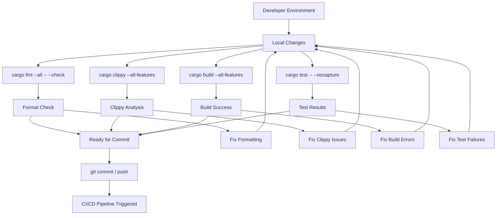
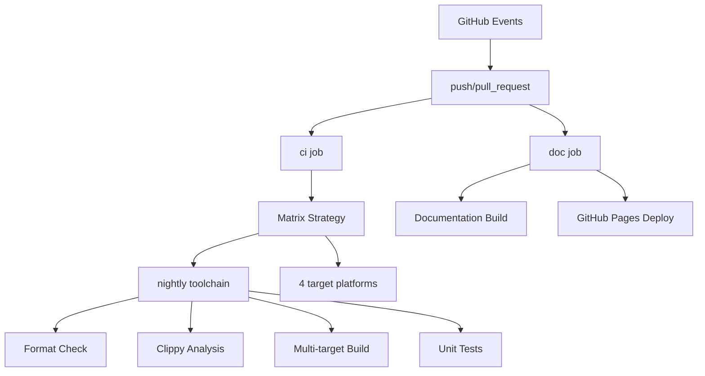
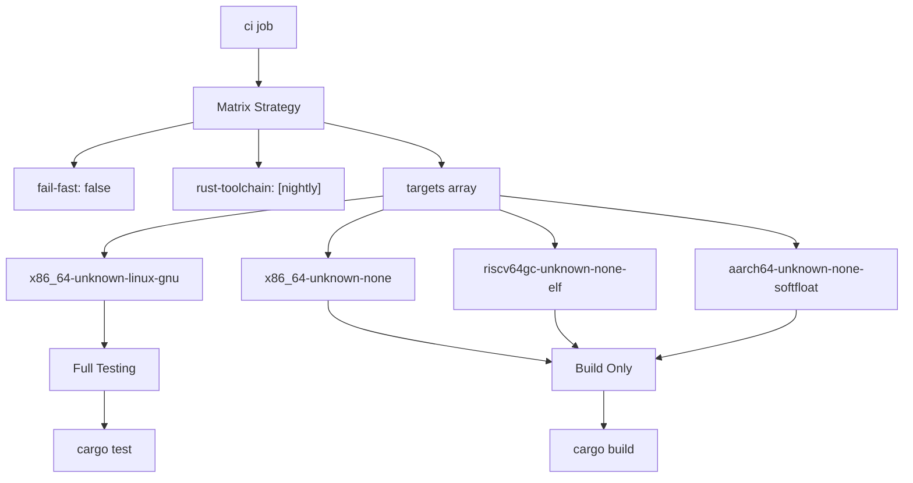
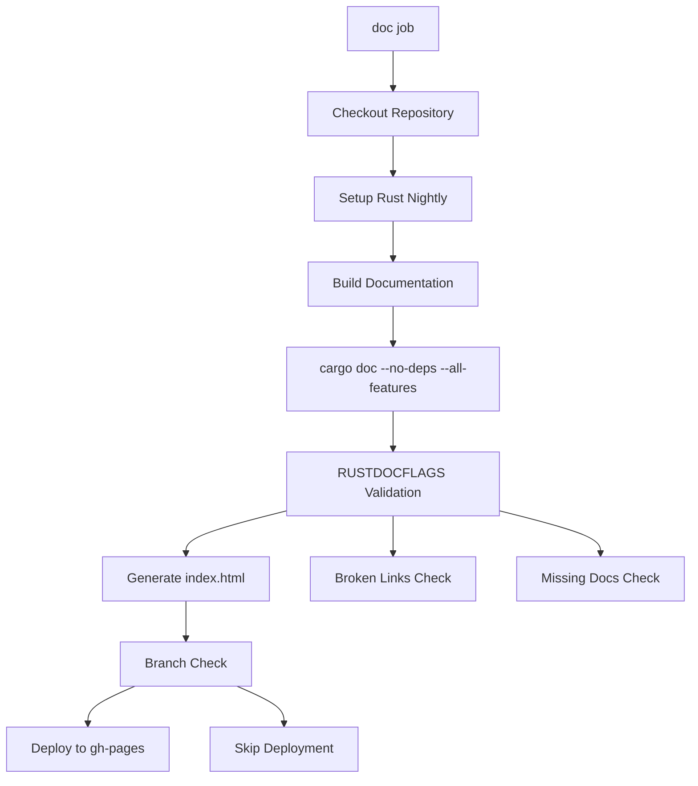

# Development Workflow

> **Relevant source files**
> * [.github/workflows/ci.yml](https://github.com/arceos-org/slab_allocator/blob/3c13499d/.github/workflows/ci.yml)
> * [.gitignore](https://github.com/arceos-org/slab_allocator/blob/3c13499d/.gitignore)
> * [Cargo.toml](https://github.com/arceos-org/slab_allocator/blob/3c13499d/Cargo.toml)

This document provides a comprehensive guide for contributors to the slab_allocator project, covering development environment setup, build system usage, CI/CD pipeline configuration, and project maintenance practices. It focuses on the technical infrastructure that supports development and ensures code quality across multiple target platforms.

For information about running and understanding the test suite, see [Testing and Validation](/arceos-org/slab_allocator/5-testing-and-validation). For API usage examples and integration patterns, see [Getting Started](/arceos-org/slab_allocator/2-getting-started).

## Development Environment Setup

The slab_allocator project is designed for `no_std` environments and requires specific toolchain configurations to support cross-compilation to embedded targets. The development environment must support Rust nightly toolchain with multiple target architectures.

### Required Toolchain Components

The project requires the following Rust toolchain components as defined in the CI configuration:

|Component|Purpose|
| --- | --- |
|rust-src|Source code for cross-compilation|
|clippy|Linting and code analysis|
|rustfmt|Code formatting|
|nightlytoolchain|Access to unstable features required byno_std|

### Supported Target Architectures

The project supports four primary target architectures:

|Target|Environment|Testing|
| --- | --- | --- |
|x86_64-unknown-linux-gnu|Linux development|Full test suite|
|x86_64-unknown-none|Bare metal x86_64|Build only|
|riscv64gc-unknown-none-elf|RISC-V embedded|Build only|
|aarch64-unknown-none-softfloat|ARM64 embedded|Build only|

Sources: [.github/workflows/ci.yml(L11 - L12)&emsp;](https://github.com/arceos-org/slab_allocator/blob/3c13499d/.github/workflows/ci.yml#L11-L12) [.github/workflows/ci.yml(L17 - L19)&emsp;](https://github.com/arceos-org/slab_allocator/blob/3c13499d/.github/workflows/ci.yml#L17-L19)

## Local Development Workflow



The local development process mirrors the CI pipeline checks to catch issues early. Developers should run the same commands locally that will be executed in the CI environment.

Sources: [.github/workflows/ci.yml(L23 - L30)&emsp;](https://github.com/arceos-org/slab_allocator/blob/3c13499d/.github/workflows/ci.yml#L23-L30)

## CI/CD Pipeline Architecture

### Pipeline Overview



The CI/CD system uses GitHub Actions with two parallel job streams: code validation (`ci`) and documentation generation (`doc`).

Sources: [.github/workflows/ci.yml(L1 - L6)&emsp;](https://github.com/arceos-org/slab_allocator/blob/3c13499d/.github/workflows/ci.yml#L1-L6) [.github/workflows/ci.yml(L32 - L33)&emsp;](https://github.com/arceos-org/slab_allocator/blob/3c13499d/.github/workflows/ci.yml#L32-L33)

### CI Job Matrix Configuration



The matrix strategy ensures the codebase builds successfully across all supported embedded architectures while running comprehensive tests only on the Linux target where a full runtime environment is available.

Sources: [.github/workflows/ci.yml(L8 - L12)&emsp;](https://github.com/arceos-org/slab_allocator/blob/3c13499d/.github/workflows/ci.yml#L8-L12) [.github/workflows/ci.yml(L28 - L30)&emsp;](https://github.com/arceos-org/slab_allocator/blob/3c13499d/.github/workflows/ci.yml#L28-L30)

## Code Quality Pipeline

### Quality Check Sequence

The CI pipeline enforces code quality through a structured sequence of checks:

|Step|Command|Purpose|Failure Impact|
| --- | --- | --- | --- |
|Format|cargo fmt --all -- --check|Consistent code style|CI failure|
|Lint|cargo clippy --target $TARGET --all-features|Code analysis|CI failure|
|Build|cargo build --target $TARGET --all-features|Compilation validation|CI failure|
|Test|cargo test --target x86_64-unknown-linux-gnu|Functional validation|CI failure|

### Clippy Configuration

The project uses clippy with a specific configuration to suppress certain warnings:

```css
cargo clippy --target ${{ matrix.targets }} --all-features -- -A clippy::new_without_default
```

The `-A clippy::new_without_default` flag allows `new()` methods without corresponding `default()` implementations, which is appropriate for allocator constructors that require explicit memory region parameters.

Sources: [.github/workflows/ci.yml(L22 - L30)&emsp;](https://github.com/arceos-org/slab_allocator/blob/3c13499d/.github/workflows/ci.yml#L22-L30) [.github/workflows/ci.yml(L25)&emsp;](https://github.com/arceos-org/slab_allocator/blob/3c13499d/.github/workflows/ci.yml#L25-L25)

## Documentation System

### Documentation Build Process



### Documentation Quality Enforcement

The documentation build enforces strict quality standards through `RUSTDOCFLAGS`:

```yaml
RUSTDOCFLAGS: -D rustdoc::broken_intra_doc_links -D missing-docs
```

This configuration treats broken internal documentation links and missing documentation as compilation errors, ensuring comprehensive and accurate documentation.

### GitHub Pages Deployment

Documentation deployment follows a conditional strategy:

* **Default branch pushes**: Automatic deployment to GitHub Pages
* **Pull requests and other branches**: Documentation builds but does not deploy
* **Deployment target**: `gh-pages` branch with single-commit history

Sources: [.github/workflows/ci.yml(L40)&emsp;](https://github.com/arceos-org/slab_allocator/blob/3c13499d/.github/workflows/ci.yml#L40-L40) [.github/workflows/ci.yml(L44 - L55)&emsp;](https://github.com/arceos-org/slab_allocator/blob/3c13499d/.github/workflows/ci.yml#L44-L55)

## Project Configuration

### Dependency Management

The project maintains minimal dependencies to support `no_std` environments:

```
[dependencies]
buddy_system_allocator = { version = "0.10", default-features = false }
```

The `default-features = false` configuration ensures the buddy allocator dependency remains `no_std` compatible.

### Git Configuration

The `.gitignore` configuration excludes development artifacts:

|Pattern|Purpose|
| --- | --- |
|/target|Rust build artifacts|
|/.vscode|IDE configuration|
|.DS_Store|macOS system files|
|Cargo.lock|Dependency lock file (library project)|

Sources: [Cargo.toml(L11 - L12)&emsp;](https://github.com/arceos-org/slab_allocator/blob/3c13499d/Cargo.toml#L11-L12) [.gitignore(L1 - L4)&emsp;](https://github.com/arceos-org/slab_allocator/blob/3c13499d/.gitignore#L1-L4)

## Development Best Practices

### Pre-commit Validation

Contributors should run the complete CI validation suite locally before committing:

```markdown
# Format check
cargo fmt --all -- --check

# Lint analysis
cargo clippy --all-features -- -A clippy::new_without_default

# Multi-target build validation
cargo build --target x86_64-unknown-none --all-features
cargo build --target riscv64gc-unknown-none-elf --all-features
cargo build --target aarch64-unknown-none-softfloat --all-features

# Full test suite
cargo test --target x86_64-unknown-linux-gnu -- --nocapture
```

### Release Management

Version management follows semantic versioning as indicated by the current version `0.3.1` in `Cargo.toml`. The project maintains backwards compatibility within major versions while supporting iterative improvements in minor releases.

Sources: [Cargo.toml(L3)&emsp;](https://github.com/arceos-org/slab_allocator/blob/3c13499d/Cargo.toml#L3-L3) [.github/workflows/ci.yml(L22 - L30)&emsp;](https://github.com/arceos-org/slab_allocator/blob/3c13499d/.github/workflows/ci.yml#L22-L30)