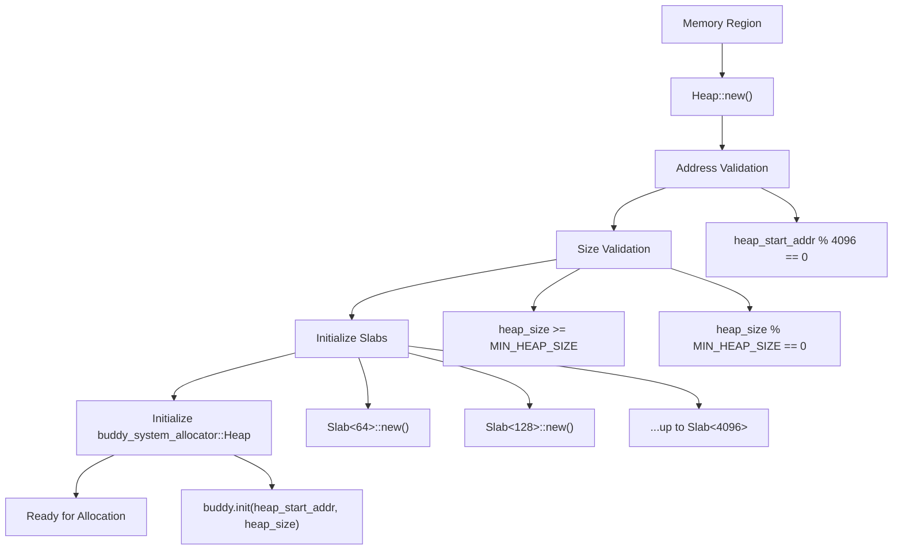
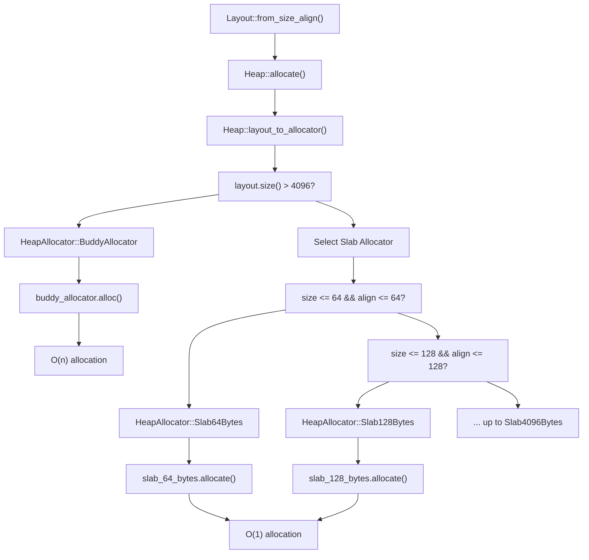

# Getting Started

> **Relevant source files**
> * [Cargo.toml](https://github.com/arceos-org/slab_allocator/blob/3c13499d/Cargo.toml)
> * [src/lib.rs](https://github.com/arceos-org/slab_allocator/blob/3c13499d/src/lib.rs)
> * [src/tests.rs](https://github.com/arceos-org/slab_allocator/blob/3c13499d/src/tests.rs)

This page provides a practical introduction to using the `slab_allocator` crate, covering dependency setup, basic initialization, and simple usage patterns. The examples shown here demonstrate core allocation patterns using code from the test suite. For detailed architectural information, see [Core Architecture](/arceos-org/slab_allocator/3-core-architecture). For complete API documentation, see [API Reference](/arceos-org/slab_allocator/4-api-reference).

## Adding the Dependency

Add the `slab_allocator` crate to your `Cargo.toml` file. The crate is designed for `no_std` environments and requires the `allocator_api` feature.

```
[dependencies]
slab_allocator = "0.3.1"
```

The crate automatically includes `buddy_system_allocator` version 0.10 as a dependency for handling large allocations over 4096 bytes.

Sources: [Cargo.toml(L1 - L13)&emsp;](https://github.com/arceos-org/slab_allocator/blob/3c13499d/Cargo.toml#L1-L13)

## Basic Setup and Initialization

### Memory Requirements

The heap allocator requires page-aligned memory with specific size constraints defined in the core library:

|Requirement|Value|Purpose|
| --- | --- | --- |
|Minimum heap size|32KB (MIN_HEAP_SIZE = 0x8000)|Ensures sufficient space for slab initialization|
|Address alignment|4096 bytes|Page boundary alignment for memory management|
|Size alignment|Multiple ofMIN_HEAP_SIZE|Simplifies buddy allocator integration|

### Heap Initialization Flow



Sources: [src/lib.rs(L52 - L86)&emsp;](https://github.com/arceos-org/slab_allocator/blob/3c13499d/src/lib.rs#L52-L86) [src/lib.rs(L24 - L26)&emsp;](https://github.com/arceos-org/slab_allocator/blob/3c13499d/src/lib.rs#L24-L26)

### Basic Initialization Example

The test suite demonstrates standard heap initialization patterns:

```javascript
// From test suite - basic heap setup
const HEAP_SIZE: usize = 16 * 4096;  // 64KB

#[repr(align(4096))]
struct TestHeap {
    heap_space: [u8; HEAP_SIZE],
}

fn new_heap() -> Heap {
    let test_heap = TestHeap {
        heap_space: [0u8; HEAP_SIZE],
    };
    unsafe { 
        Heap::new(&test_heap.heap_space[0] as *const u8 as usize, HEAP_SIZE) 
    }
}
```

Sources: [src/tests.rs(L5)&emsp;](https://github.com/arceos-org/slab_allocator/blob/3c13499d/src/tests.rs#L5-L5) [src/tests.rs(L8 - L24)&emsp;](https://github.com/arceos-org/slab_allocator/blob/3c13499d/src/tests.rs#L8-L24)

## Simple Usage Examples

### Basic Allocation and Deallocation

The fundamental allocation pattern uses `Layout` to specify size and alignment requirements:

```javascript
use alloc::alloc::Layout;
use core::mem::{size_of, align_of};

let mut heap = new_heap();
let layout = Layout::from_size_align(size_of::<usize>() * 2, align_of::<usize>()).unwrap();

// Allocate memory
let addr = heap.allocate(layout.clone()).unwrap();

// Use the memory
unsafe {
    *(addr as *mut (usize, usize)) = (0xdeafdeadbeafbabe, 0xdeafdeadbeafbabe);
    
    // Deallocate when done
    heap.deallocate(addr, layout);
}
```

Sources: [src/tests.rs(L47 - L68)&emsp;](https://github.com/arceos-org/slab_allocator/blob/3c13499d/src/tests.rs#L47-L68)

### Multi-Size Allocation Example

The allocator efficiently handles multiple allocation sizes simultaneously:

```javascript
let mut heap = new_heap();
let base_size = size_of::<usize>();
let base_align = align_of::<usize>();

let layout_1 = Layout::from_size_align(base_size * 2, base_align).unwrap();
let layout_2 = Layout::from_size_align(base_size * 3, base_align).unwrap();
let layout_3 = Layout::from_size_align(base_size * 3, base_align * 8).unwrap();
let layout_4 = Layout::from_size_align(base_size * 10, base_align).unwrap();

let x = heap.allocate(layout_1.clone()).unwrap();
let y = heap.allocate(layout_2.clone()).unwrap();
let z = heap.allocate(layout_3.clone()).unwrap();
```

Sources: [src/tests.rs(L90 - L117)&emsp;](https://github.com/arceos-org/slab_allocator/blob/3c13499d/src/tests.rs#L90-L117)

## Allocation Strategy Overview

### Layout-to-Allocator Routing

The heap automatically routes allocation requests to the appropriate allocator based on size and alignment requirements:



Sources: [src/lib.rs(L208 - L226)&emsp;](https://github.com/arceos-org/slab_allocator/blob/3c13499d/src/lib.rs#L208-L226) [src/lib.rs(L135 - L164)&emsp;](https://github.com/arceos-org/slab_allocator/blob/3c13499d/src/lib.rs#L135-L164)

### Slab Size Categories

The allocator maintains seven fixed-size slab categories, each optimized for specific allocation patterns:

|Slab Type|Block Size|Target Use Cases|
| --- | --- | --- |
|Slab<64>|64 bytes|Small structures, basic types|
|Slab<128>|128 bytes|Medium structures|
|Slab<256>|256 bytes|Larger data structures|
|Slab<512>|512 bytes|Small buffers|
|Slab<1024>|1024 bytes|Medium buffers|
|Slab<2048>|2048 bytes|Large buffers|
|Slab<4096>|4096 bytes|Page-sized allocations|
|Buddy Allocator|>4096 bytes|Variable large allocations|

Sources: [src/lib.rs(L27 - L36)&emsp;](https://github.com/arceos-org/slab_allocator/blob/3c13499d/src/lib.rs#L27-L36) [src/lib.rs(L40 - L49)&emsp;](https://github.com/arceos-org/slab_allocator/blob/3c13499d/src/lib.rs#L40-L49)

### Memory Statistics

The heap provides real-time memory usage statistics:

```javascript
let total = heap.total_bytes();      // Total heap capacity
let used = heap.used_bytes();        // Currently allocated bytes  
let available = heap.available_bytes(); // Free bytes remaining
let (min_size, max_size) = heap.usable_size(layout); // Allocation bounds
```

Sources: [src/lib.rs(L228 - L255)&emsp;](https://github.com/arceos-org/slab_allocator/blob/3c13499d/src/lib.rs#L228-L255) [src/lib.rs(L192 - L205)&emsp;](https://github.com/arceos-org/slab_allocator/blob/3c13499d/src/lib.rs#L192-L205)

## Error Handling

The allocator returns `AllocError` for failed allocations, typically due to insufficient memory:

```javascript
let layout = Layout::from_size_align(HEAP_SIZE + 1, align_of::<usize>()).unwrap();
let result = heap.allocate(layout);
assert!(result.is_err()); // Out of memory
```

Sources: [src/tests.rs(L40 - L45)&emsp;](https://github.com/arceos-org/slab_allocator/blob/3c13499d/src/tests.rs#L40-L45)

## Next Steps

* For detailed architecture information including slab implementation details, see [Core Architecture](/arceos-org/slab_allocator/3-core-architecture)
* For complete API documentation and advanced usage patterns, see [API Reference](/arceos-org/slab_allocator/4-api-reference)
* For comprehensive testing examples and validation approaches, see [Testing and Validation](/arceos-org/slab_allocator/5-testing-and-validation)
* For development workflow and contribution guidelines, see [Development Workflow](/arceos-org/slab_allocator/6-development-workflow)

Sources: [src/lib.rs(L1 - L257)&emsp;](https://github.com/arceos-org/slab_allocator/blob/3c13499d/src/lib.rs#L1-L257) [src/tests.rs(L1 - L164)&emsp;](https://github.com/arceos-org/slab_allocator/blob/3c13499d/src/tests.rs#L1-L164)