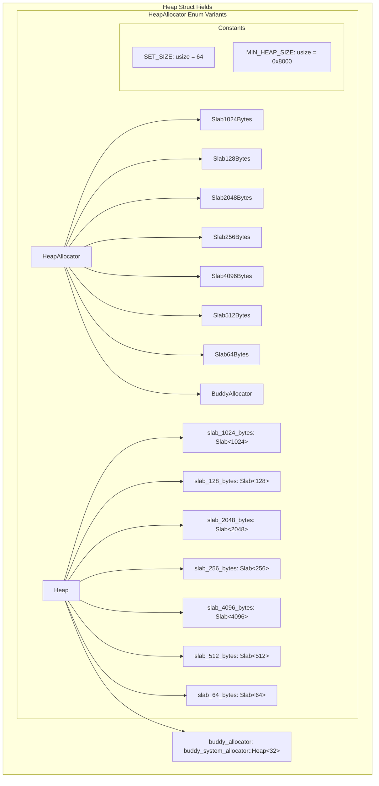
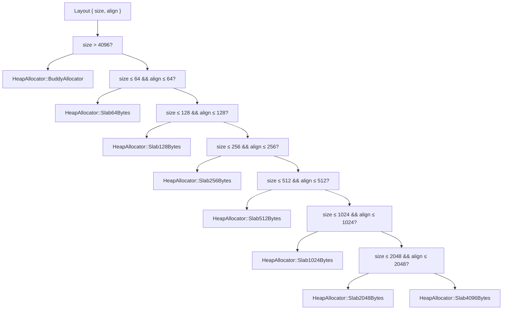
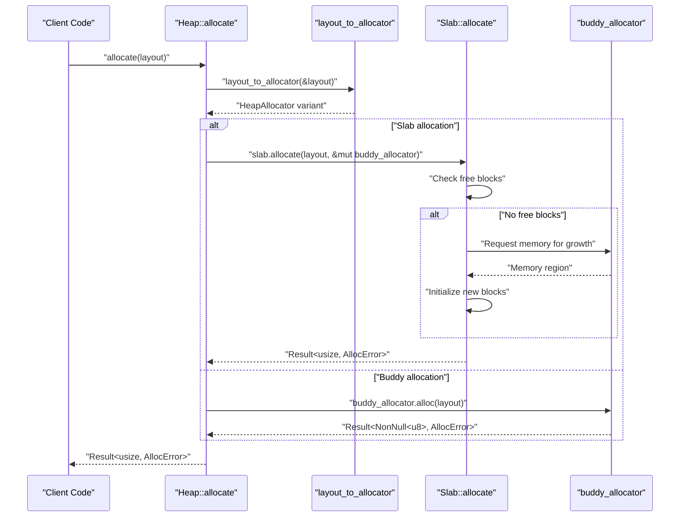
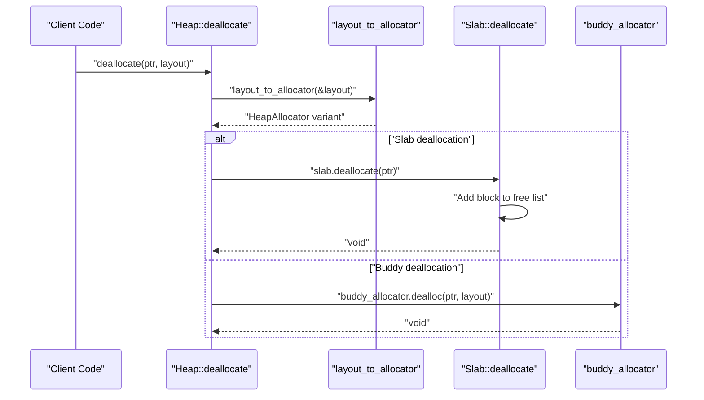
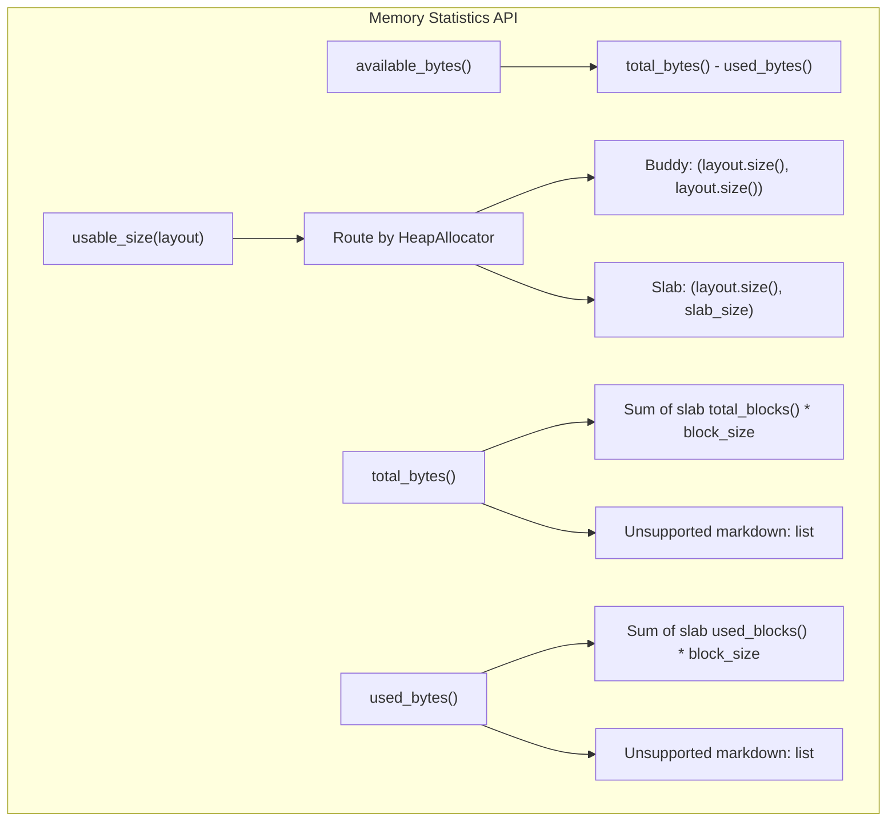

# Heap Allocator Design

> **Relevant source files**
> * [src/lib.rs](https://github.com/arceos-org/slab_allocator/blob/3c13499d/src/lib.rs)

This document covers the design and implementation of the main `Heap` struct, which serves as the primary interface for memory allocation in the slab_allocator crate. It explains the hybrid allocation strategy, routing logic, and integration with the buddy system allocator. For details about individual slab implementations and their internal mechanics, see [Slab Implementation](/arceos-org/slab_allocator/3.2-slab-implementation). For API usage examples and method documentation, see [API Reference](/arceos-org/slab_allocator/4-api-reference).

## Core Components Overview

The heap allocator is built around the `Heap` struct, which coordinates between multiple fixed-size slab allocators and a buddy system allocator for larger requests.

### Heap Structure Components

**Sources:** [src/lib.rs(L40 - L49)&emsp;](https://github.com/arceos-org/slab_allocator/blob/3c13499d/src/lib.rs#L40-L49) [src/lib.rs(L27 - L36)&emsp;](https://github.com/arceos-org/slab_allocator/blob/3c13499d/src/lib.rs#L27-L36) [src/lib.rs(L24 - L25)&emsp;](https://github.com/arceos-org/slab_allocator/blob/3c13499d/src/lib.rs#L24-L25)

The `Heap` struct contains seven slab allocators, each handling fixed-size blocks, plus a `buddy_system_allocator::Heap` for variable-size allocations. The `HeapAllocator` enum provides a type-safe way to route allocation requests to the appropriate allocator.

## Allocation Routing Strategy

The heart of the heap allocator's design is the `layout_to_allocator` function, which determines which allocator to use based on the requested layout's size and alignment requirements.

### Layout Routing Logic

**Sources:** [src/lib.rs(L208 - L226)&emsp;](https://github.com/arceos-org/slab_allocator/blob/3c13499d/src/lib.rs#L208-L226)

The routing logic follows a cascading pattern where both size and alignment constraints must be satisfied. This ensures that allocations are placed in the smallest slab that can accommodate both the requested size and alignment requirements.

## Memory Management Workflow

The allocation and deallocation processes follow a consistent pattern of routing through the `HeapAllocator` enum to the appropriate underlying allocator.

### Allocation Process Flow

**Sources:** [src/lib.rs(L135 - L164)&emsp;](https://github.com/arceos-org/slab_allocator/blob/3c13499d/src/lib.rs#L135-L164) [src/lib.rs(L177 - L190)&emsp;](https://github.com/arceos-org/slab_allocator/blob/3c13499d/src/lib.rs#L177-L190)

### Deallocation Process Flow

**Sources:** [src/lib.rs(L177 - L190)&emsp;](https://github.com/arceos-org/slab_allocator/blob/3c13499d/src/lib.rs#L177-L190)

## Performance Characteristics

The hybrid design provides different performance guarantees depending on allocation size:

|Allocation Size|Allocator Used|Time Complexity|Characteristics|
| --- | --- | --- | --- |
|≤ 4096 bytes|Slab allocator|O(1)|Fixed-size blocks, predictable performance|
|> 4096 bytes|Buddy allocator|O(n)|Variable-size blocks, flexible but slower|

**Sources:** [src/lib.rs(L134 - L135)&emsp;](https://github.com/arceos-org/slab_allocator/blob/3c13499d/src/lib.rs#L134-L135) [src/lib.rs(L172 - L173)&emsp;](https://github.com/arceos-org/slab_allocator/blob/3c13499d/src/lib.rs#L172-L173)

The O(1) performance for small allocations is achieved because slab allocators maintain free lists of pre-allocated blocks. The O(n) complexity for large allocations reflects the buddy allocator's tree-based search for appropriately sized free blocks.

## Memory Statistics and Monitoring

The `Heap` struct provides comprehensive memory usage statistics by aggregating data from all component allocators.

### Statistics Methods

**Sources:** [src/lib.rs(L229 - L255)&emsp;](https://github.com/arceos-org/slab_allocator/blob/3c13499d/src/lib.rs#L229-L255) [src/lib.rs(L194 - L205)&emsp;](https://github.com/arceos-org/slab_allocator/blob/3c13499d/src/lib.rs#L194-L205)

The statistics methods provide real-time visibility into memory usage across both slab and buddy allocators, enabling monitoring and debugging of allocation patterns.

## Integration Points

The heap allocator serves as a coordinator between the slab allocators and the buddy system allocator, handling several key integration scenarios:

### Slab Growth Mechanism

When a slab runs out of free blocks, it requests additional memory from the buddy allocator through the `Slab::allocate` method. This allows slabs to grow dynamically based on demand while maintaining their fixed-block-size efficiency.

### Memory Addition

The `add_memory` and `_grow` methods allow runtime expansion of the heap, with new memory being routed to the appropriate allocator:

**Sources:** [src/lib.rs(L95 - L106)&emsp;](https://github.com/arceos-org/slab_allocator/blob/3c13499d/src/lib.rs#L95-L106) [src/lib.rs(L116 - L129)&emsp;](https://github.com/arceos-org/slab_allocator/blob/3c13499d/src/lib.rs#L116-L129)

* Public `add_memory`: Adds memory directly to the buddy allocator
* Private `_grow`: Routes memory to specific slabs based on the `HeapAllocator` variant

This design enables flexible memory management where the heap can expand as needed while maintaining the performance characteristics of the hybrid allocation strategy.