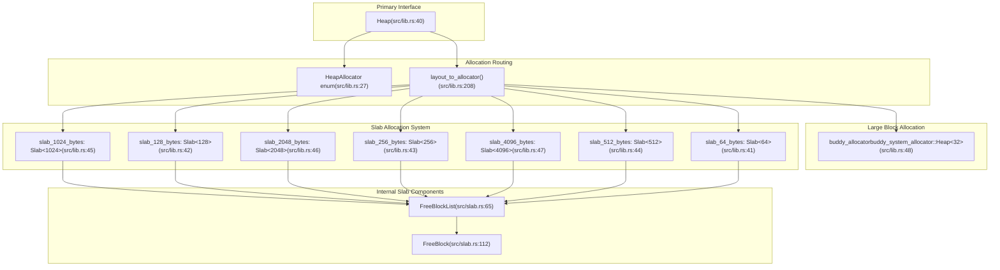
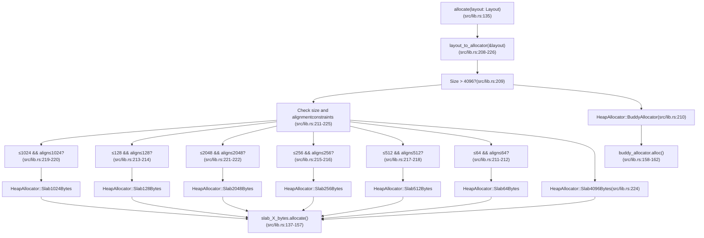
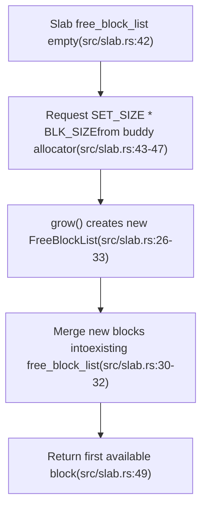

# Overview

> **Relevant source files**
> * [.github/workflows/ci.yml](https://github.com/arceos-org/slab_allocator/blob/3c13499d/.github/workflows/ci.yml)
> * [.gitignore](https://github.com/arceos-org/slab_allocator/blob/3c13499d/.gitignore)
> * [Cargo.toml](https://github.com/arceos-org/slab_allocator/blob/3c13499d/Cargo.toml)
> * [src/lib.rs](https://github.com/arceos-org/slab_allocator/blob/3c13499d/src/lib.rs)
> * [src/slab.rs](https://github.com/arceos-org/slab_allocator/blob/3c13499d/src/slab.rs)
> * [src/tests.rs](https://github.com/arceos-org/slab_allocator/blob/3c13499d/src/tests.rs)

This document provides a comprehensive overview of the `slab_allocator` crate, a hybrid memory allocation system designed for `no_std` environments. The allocator combines the performance benefits of slab allocation for small, fixed-size blocks with the flexibility of buddy allocation for larger, variable-size requests.

For detailed implementation specifics of individual components, see [Core Architecture](/arceos-org/slab_allocator/3-core-architecture). For practical usage examples and setup instructions, see [Getting Started](/arceos-org/slab_allocator/2-getting-started).

## Purpose and Target Environment

The `slab_allocator` crate addresses the critical need for efficient memory management in resource-constrained environments where the standard library is unavailable. It targets embedded systems, kernel development, and real-time applications that require deterministic allocation performance.

The allocator implements a hybrid strategy that provides O(1) allocation for blocks ≤ 4096 bytes through slab allocation, while falling back to a buddy system allocator for larger requests. This design balances performance predictability with memory utilization efficiency.

**Sources:** [Cargo.toml(L8 - L9)&emsp;](https://github.com/arceos-org/slab_allocator/blob/3c13499d/Cargo.toml#L8-L9) [src/lib.rs(L1 - L3)&emsp;](https://github.com/arceos-org/slab_allocator/blob/3c13499d/src/lib.rs#L1-L3)

## System Architecture

The allocator's architecture centers around the `Heap` struct, which orchestrates allocation requests between multiple specialized components based on request size and alignment requirements.

### Core Components Mapping

**Sources:** [src/lib.rs(L40 - L49)&emsp;](https://github.com/arceos-org/slab_allocator/blob/3c13499d/src/lib.rs#L40-L49) [src/lib.rs(L27 - L36)&emsp;](https://github.com/arceos-org/slab_allocator/blob/3c13499d/src/lib.rs#L27-L36) [src/slab.rs(L4 - L7)&emsp;](https://github.com/arceos-org/slab_allocator/blob/3c13499d/src/slab.rs#L4-L7) [src/slab.rs(L65 - L68)&emsp;](https://github.com/arceos-org/slab_allocator/blob/3c13499d/src/slab.rs#L65-L68)

### Allocation Decision Flow

The system routes allocation requests through a deterministic decision tree based on the `Layout` parameter's size and alignment requirements.

**Sources:** [src/lib.rs(L135 - L164)&emsp;](https://github.com/arceos-org/slab_allocator/blob/3c13499d/src/lib.rs#L135-L164) [src/lib.rs(L208 - L226)&emsp;](https://github.com/arceos-org/slab_allocator/blob/3c13499d/src/lib.rs#L208-L226)

## Memory Management Strategy

The allocator employs a two-tier memory management approach that optimizes for different allocation patterns:

|Allocation Size|Strategy|Allocator|Time Complexity|Use Case|
| --- | --- | --- | --- | --- |
|≤ 64 bytes|Fixed-size slab|Slab<64>|O(1)|Small objects, metadata|
|65-128 bytes|Fixed-size slab|Slab<128>|O(1)|Small structures|
|129-256 bytes|Fixed-size slab|Slab<256>|O(1)|Medium structures|
|257-512 bytes|Fixed-size slab|Slab<512>|O(1)|Small buffers|
|513-1024 bytes|Fixed-size slab|Slab<1024>|O(1)|Medium buffers|
|1025-2048 bytes|Fixed-size slab|Slab<2048>|O(1)|Large structures|
|2049-4096 bytes|Fixed-size slab|Slab<4096>|O(1)|Page-sized allocations|
|> 4096 bytes|Buddy system|buddy_system_allocator|O(log n)|Large buffers, dynamic data|

**Sources:** [src/lib.rs(L208 - L226)&emsp;](https://github.com/arceos-org/slab_allocator/blob/3c13499d/src/lib.rs#L208-L226) [src/lib.rs(L41 - L48)&emsp;](https://github.com/arceos-org/slab_allocator/blob/3c13499d/src/lib.rs#L41-L48)

## Dynamic Growth Mechanism

When a slab exhausts its available blocks, the allocator automatically requests additional memory from the buddy allocator in fixed-size chunks defined by `SET_SIZE` (64 blocks per growth operation).

**Sources:** [src/slab.rs(L35 - L55)&emsp;](https://github.com/arceos-org/slab_allocator/blob/3c13499d/src/slab.rs#L35-L55) [src/slab.rs(L26 - L33)&emsp;](https://github.com/arceos-org/slab_allocator/blob/3c13499d/src/slab.rs#L26-L33) [src/lib.rs(L24)&emsp;](https://github.com/arceos-org/slab_allocator/blob/3c13499d/src/lib.rs#L24-L24)

## Platform Support and Testing

The allocator supports multiple embedded architectures and maintains compatibility through extensive CI/CD testing:

|Target Platform|Purpose|Test Coverage|
| --- | --- | --- |
|x86_64-unknown-linux-gnu|Development/testing|Full unit tests|
|x86_64-unknown-none|Bare metal x86_64|Build verification|
|riscv64gc-unknown-none-elf|RISC-V embedded|Build verification|
|aarch64-unknown-none-softfloat|ARM64 embedded|Build verification|

The test suite includes allocation patterns from simple double-usize allocations to complex multi-size scenarios with varying alignment requirements, ensuring robust behavior across different usage patterns.

**Sources:** [.github/workflows/ci.yml(L12)&emsp;](https://github.com/arceos-org/slab_allocator/blob/3c13499d/.github/workflows/ci.yml#L12-L12) [.github/workflows/ci.yml(L28 - L30)&emsp;](https://github.com/arceos-org/slab_allocator/blob/3c13499d/.github/workflows/ci.yml#L28-L30) [src/tests.rs(L39 - L163)&emsp;](https://github.com/arceos-org/slab_allocator/blob/3c13499d/src/tests.rs#L39-L163)

## Key Features and Constraints

### Design Features

* **`no_std` compatibility**: No dependency on the standard library
* **Deterministic performance**: O(1) allocation for blocks ≤ 4096 bytes
* **Automatic growth**: Dynamic expansion when slabs become exhausted
* **Memory statistics**: Runtime visibility into allocation patterns
* **Multiple alignment support**: Handles various alignment requirements efficiently

### System Constraints

* **Minimum heap size**: 32KB (`MIN_HEAP_SIZE = 0x8000`)
* **Page alignment requirement**: Heap start address must be 4096-byte aligned
* **Growth granularity**: Memory added in 4096-byte increments
* **Slab threshold**: Fixed 4096-byte boundary between slab and buddy allocation

**Sources:** [src/lib.rs(L25)&emsp;](https://github.com/arceos-org/slab_allocator/blob/3c13499d/src/lib.rs#L25-L25) [src/lib.rs(L59 - L71)&emsp;](https://github.com/arceos-org/slab_allocator/blob/3c13499d/src/lib.rs#L59-L71) [src/lib.rs(L95 - L106)&emsp;](https://github.com/arceos-org/slab_allocator/blob/3c13499d/src/lib.rs#L95-L106)