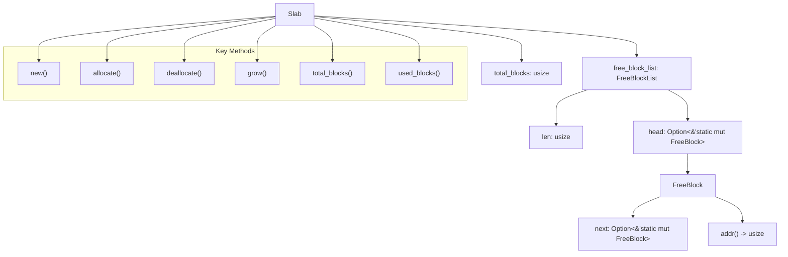
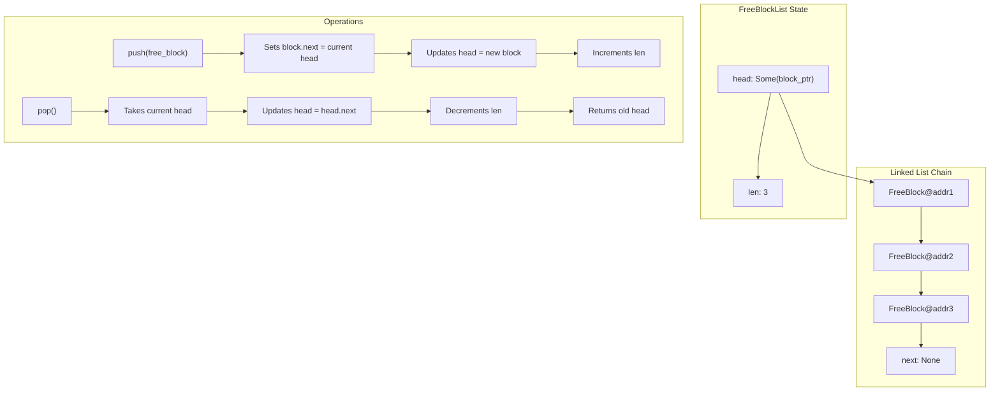
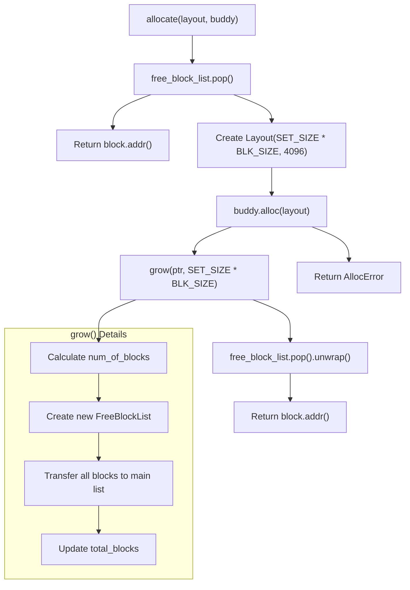
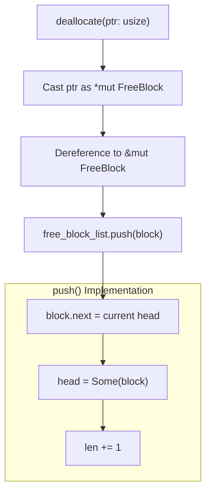
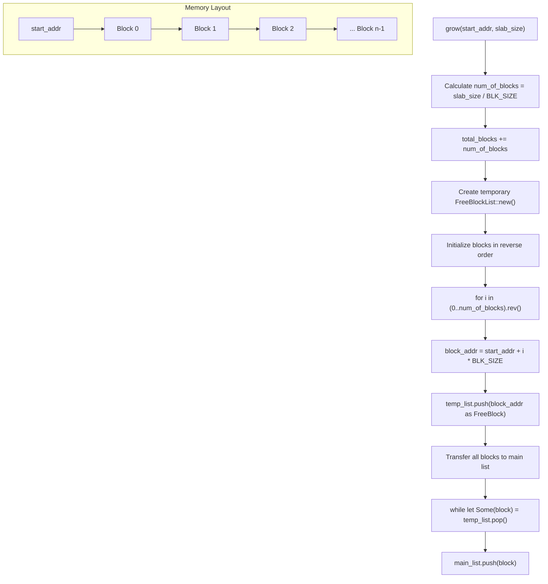
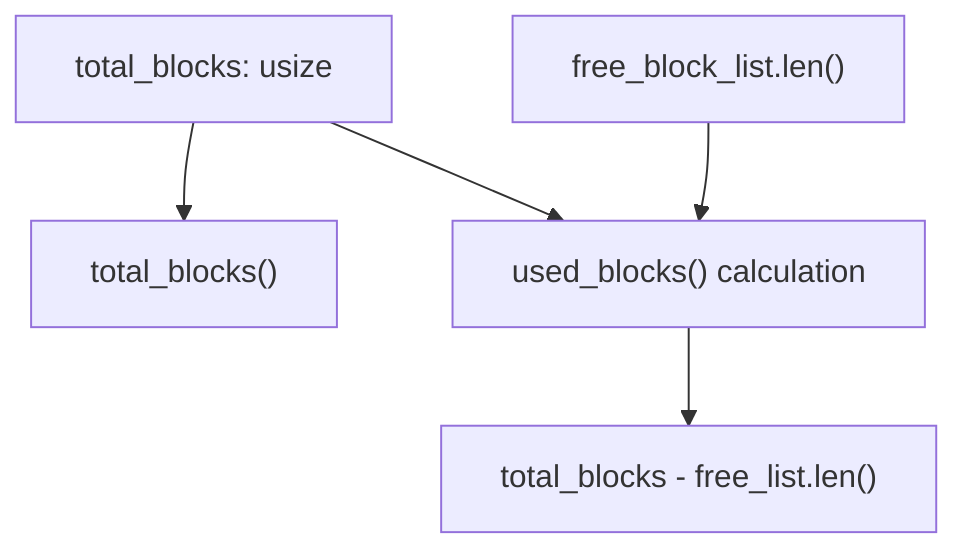

# Slab Implementation

> **Relevant source files**
> * [src/slab.rs](https://github.com/arceos-org/slab_allocator/blob/3c13499d/src/slab.rs)

This document covers the internal implementation of the `Slab` struct and its associated components, including the free block management system, allocation/deallocation mechanisms, and dynamic growth strategies. This is the core component that provides O(1) fixed-size block allocation within the hybrid memory allocator.

For information about how slabs integrate into the overall heap allocation strategy, see [Heap Allocator Design](/arceos-org/slab_allocator/3.1-heap-allocator-design). For complete API documentation, see [API Reference](/arceos-org/slab_allocator/4-api-reference).

## Slab Structure Overview

The slab allocator is implemented as a generic struct that manages fixed-size memory blocks. Each slab is parameterized by its block size and maintains a linked list of free blocks for rapid allocation and deallocation.

**Slab Core Components**

Sources: [src/slab.rs(L4 - L7)&emsp;](https://github.com/arceos-org/slab_allocator/blob/3c13499d/src/slab.rs#L4-L7) [src/slab.rs(L65 - L68)&emsp;](https://github.com/arceos-org/slab_allocator/blob/3c13499d/src/slab.rs#L65-L68) [src/slab.rs(L112 - L114)&emsp;](https://github.com/arceos-org/slab_allocator/blob/3c13499d/src/slab.rs#L112-L114)

## FreeBlockList Management

The `FreeBlockList` implements a stack-based linked list for managing free memory blocks. Each free block contains a pointer to the next free block, creating an intrusive linked list that uses the free memory itself for storage.

**FreeBlockList Structure and Operations**

The `FreeBlockList` provides O(1) operations for both insertion and removal:

|Operation|Method|Complexity|Description|
| --- | --- | --- | --- |
|Insert|push()|O(1)|Adds block to front of list|
|Remove|pop()|O(1)|Removes block from front of list|
|Check Length|len()|O(1)|Returns current free block count|
|Check Empty|is_empty()|O(1)|Tests if any blocks available|

Sources: [src/slab.rs(L92 - L98)&emsp;](https://github.com/arceos-org/slab_allocator/blob/3c13499d/src/slab.rs#L92-L98) [src/slab.rs(L100 - L104)&emsp;](https://github.com/arceos-org/slab_allocator/blob/3c13499d/src/slab.rs#L100-L104) [src/slab.rs(L88 - L90)&emsp;](https://github.com/arceos-org/slab_allocator/blob/3c13499d/src/slab.rs#L88-L90)

## Block Allocation Process

The allocation process follows a straightforward strategy: attempt to pop a free block from the list, and if none are available, grow the slab by requesting memory from the buddy allocator.

**Allocation Flow Diagram**

The allocation mechanism includes automatic growth when the free list is exhausted. The growth size is determined by `SET_SIZE * BLK_SIZE` with 4096-byte alignment, where `SET_SIZE` is imported from the parent module.

Sources: [src/slab.rs(L35 - L55)&emsp;](https://github.com/arceos-org/slab_allocator/blob/3c13499d/src/slab.rs#L35-L55) [src/slab.rs(L26 - L33)&emsp;](https://github.com/arceos-org/slab_allocator/blob/3c13499d/src/slab.rs#L26-L33)

## Block Deallocation Process

Deallocation is simpler than allocation, requiring only the conversion of the memory address back to a `FreeBlock` and pushing it onto the free list.

**Deallocation Mechanism**

The deallocation process assumes the pointer was originally allocated by this slab and is properly aligned for the block size. No validation is performed on the input pointer.

Sources: [src/slab.rs(L57 - L62)&emsp;](https://github.com/arceos-org/slab_allocator/blob/3c13499d/src/slab.rs#L57-L62)

## Dynamic Growth Mechanism

When a slab runs out of free blocks, it can dynamically grow by requesting additional memory from the buddy allocator. This growth is performed in chunks to amortize the allocation overhead.

**Growth Process Details**

The growth mechanism uses reverse iteration to maintain proper block ordering in the free list. Blocks are added to a temporary list first, then transferred to the main free list to ensure correct linkage.

Sources: [src/slab.rs(L26 - L33)&emsp;](https://github.com/arceos-org/slab_allocator/blob/3c13499d/src/slab.rs#L26-L33) [src/slab.rs(L71 - L82)&emsp;](https://github.com/arceos-org/slab_allocator/blob/3c13499d/src/slab.rs#L71-L82)

## Memory Statistics and Tracking

The `Slab` provides methods to track memory usage statistics, essential for monitoring and debugging allocation patterns.

|Statistic|Method|Calculation|Purpose|
| --- | --- | --- | --- |
|Total Blocks|total_blocks()|Direct field access|Maximum capacity|
|Used Blocks|used_blocks()|total_blocks - free_block_list.len()|Current utilization|
|Free Blocks|N/A (internal)|free_block_list.len()|Available capacity|

**Statistics Calculation Flow**

These statistics enable the higher-level heap allocator to make informed decisions about memory management and provide usage information to applications.

Sources: [src/slab.rs(L18 - L24)&emsp;](https://github.com/arceos-org/slab_allocator/blob/3c13499d/src/slab.rs#L18-L24) [src/slab.rs(L88 - L90)&emsp;](https://github.com/arceos-org/slab_allocator/blob/3c13499d/src/slab.rs#L88-L90)