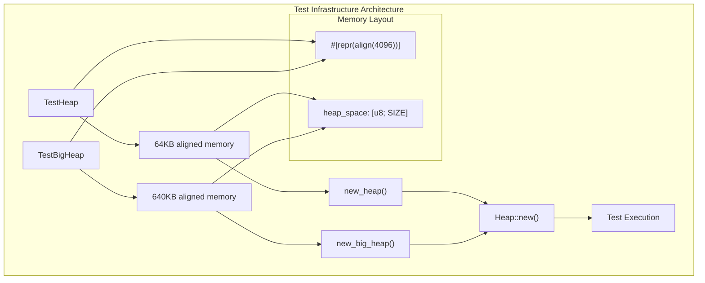
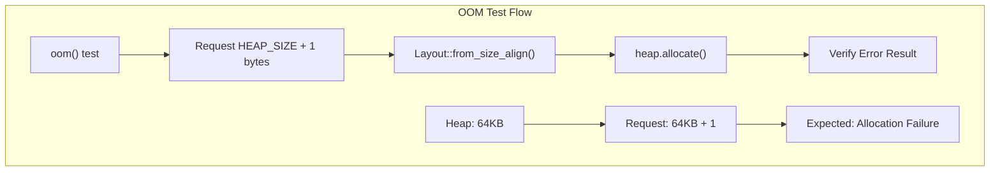
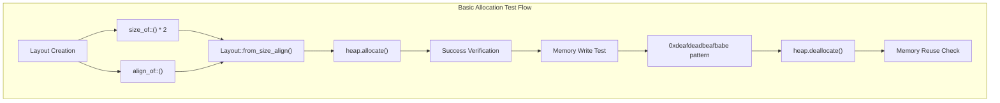
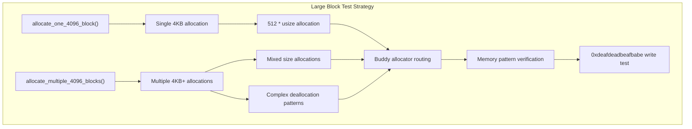
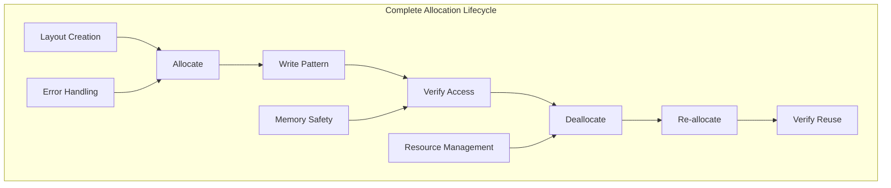

# Testing and Validation

> **Relevant source files**
> * [src/tests.rs](https://github.com/arceos-org/slab_allocator/blob/3c13499d/src/tests.rs)

This page provides a comprehensive guide to the test suite for the slab_allocator crate. It covers the test infrastructure, validation scenarios, test execution procedures, and analysis of different allocation patterns used to ensure the reliability and correctness of the hybrid memory allocation system.

For information about the core allocation architecture being tested, see [Core Architecture](/arceos-org/slab_allocator/3-core-architecture). For API usage patterns demonstrated in tests, see [API Reference](/arceos-org/slab_allocator/4-api-reference).

## Test Infrastructure

The test suite is built around two primary test heap configurations that provide controlled environments for validation.

### Test Heap Configurations

The testing infrastructure uses statically allocated, page-aligned memory regions to simulate real-world heap conditions:

|Configuration|Size|Purpose|
| --- | --- | --- |
|TestHeap|64KB (16 × 4096 bytes)|Small-scale allocation testing|
|TestBigHeap|640KB (64KB × 10)|Large allocation and growth testing|



The test structures use `#[repr(align(4096))]` to ensure proper page alignment, which is critical for the underlying buddy allocator's operation.

**Sources:** [src/tests.rs(L8 - L16)&emsp;](https://github.com/arceos-org/slab_allocator/blob/3c13499d/src/tests.rs#L8-L16) [src/tests.rs(L18 - L37)&emsp;](https://github.com/arceos-org/slab_allocator/blob/3c13499d/src/tests.rs#L18-L37)

### Test Heap Factory Functions

Two factory functions provide standardized heap initialization:

* `new_heap()` - Creates a 64KB heap instance for basic allocation testing
* `new_big_heap()` - Creates a 640KB heap instance for large allocation scenarios

These functions handle the unsafe memory region setup and return initialized `Heap` instances ready for testing.

**Sources:** [src/tests.rs(L18 - L37)&emsp;](https://github.com/arceos-org/slab_allocator/blob/3c13499d/src/tests.rs#L18-L37)

## Test Categories and Validation Scenarios

The test suite validates the allocator through several distinct categories of allocation patterns and edge cases.

### Memory Exhaustion Testing



The `oom()` test validates out-of-memory handling by requesting more memory than the total heap capacity. This ensures the allocator gracefully handles resource exhaustion rather than causing undefined behavior.

**Sources:** [src/tests.rs(L39 - L45)&emsp;](https://github.com/arceos-org/slab_allocator/blob/3c13499d/src/tests.rs#L39-L45)

### Basic Allocation Patterns

The test suite validates fundamental allocation operations through progressively complex scenarios:

|Test Function|Allocation Size|Validation Focus|
| --- | --- | --- |
|allocate_double_usize()|2 ×usize|Basic allocation success|
|allocate_and_free_double_usize()|2 ×usize|Allocation + deallocation cycle|
|reallocate_double_usize()|2 ×usize|Memory reuse verification|



**Sources:** [src/tests.rs(L47 - L87)&emsp;](https://github.com/arceos-org/slab_allocator/blob/3c13499d/src/tests.rs#L47-L87)

### Multi-Size Allocation Testing

The `allocate_multiple_sizes()` test validates the allocator's ability to handle concurrent allocations of different sizes and alignments:

* **Size Variations**: 2×, 3×, 10× base `usize`
* **Alignment Variations**: Standard alignment and 8× alignment
* **Deallocation Patterns**: Non-sequential deallocation order

This test ensures the slab allocator correctly routes different sizes to appropriate slabs and handles fragmentation scenarios.

**Sources:** [src/tests.rs(L89 - L117)&emsp;](https://github.com/arceos-org/slab_allocator/blob/3c13499d/src/tests.rs#L89-L117)

### Large Block Allocation Testing

Two specialized tests validate large allocation handling that exceeds the slab threshold:



These tests specifically target the boundary between slab allocation (≤4096 bytes) and buddy allocation (>4096 bytes), ensuring proper routing and memory management across the threshold.

**Sources:** [src/tests.rs(L119 - L163)&emsp;](https://github.com/arceos-org/slab_allocator/blob/3c13499d/src/tests.rs#L119-L163)

## Test Execution and Validation Patterns

### Layout-Based Testing

All tests use Rust's `Layout` type to specify allocation requirements, ensuring compatibility with the standard allocator interface:

```javascript
// Example pattern from tests
let layout = Layout::from_size_align(size, alignment).unwrap();
let addr = heap.allocate(layout.clone());
```

This approach validates that the allocator correctly handles:

* Size requirements
* Alignment constraints
* Error propagation
* Memory safety

### Memory Pattern Verification

Critical tests write specific bit patterns to allocated memory to verify:

* Successful memory access
* Proper alignment
* Data integrity across allocation/deallocation cycles

The pattern `0xdeafdeadbeafbabe` is used as a recognizable marker for debugging and validation.

**Sources:** [src/tests.rs(L64)&emsp;](https://github.com/arceos-org/slab_allocator/blob/3c13499d/src/tests.rs#L64-L64) [src/tests.rs(L161)&emsp;](https://github.com/arceos-org/slab_allocator/blob/3c13499d/src/tests.rs#L161-L161)

### Allocation Lifecycle Testing



Tests validate the complete allocation lifecycle to ensure:

* Proper initialization
* Safe memory access
* Correct deallocation
* Memory reuse efficiency
* No memory leaks

**Sources:** [src/tests.rs(L71 - L87)&emsp;](https://github.com/arceos-org/slab_allocator/blob/3c13499d/src/tests.rs#L71-L87)

## Running the Test Suite

The test suite runs using Rust's standard testing framework:

```
cargo test
```

### Target Platform Testing

The CI/CD pipeline executes tests across multiple target platforms:

* `x86_64-unknown-linux-gnu` (with full test execution)
* `x86_64-unknown-none` (build verification)
* `riscv64gc-unknown-none-elf` (build verification)
* `aarch64-unknown-none-softfloat` (build verification)

This ensures the allocator works correctly across different embedded and `no_std` environments.

**Sources:** Based on repository CI/CD configuration referenced in overview diagrams

## Test Coverage Analysis

The test suite provides comprehensive coverage of the allocator's functionality:

|Component|Test Coverage|
| --- | --- |
|Heap initialization|✓ Factory functions|
|Small allocations|✓ Slab routing tests|
|Large allocations|✓ Buddy allocator tests|
|Memory exhaustion|✓ OOM handling|
|Fragmentation|✓ Multi-size patterns|
|Alignment|✓ Various alignment requirements|
|Memory reuse|✓ Allocation/deallocation cycles|

The tests validate both the high-level `Heap` interface and the underlying allocation strategy switching between slab and buddy allocation based on size thresholds.

**Sources:** [src/tests.rs(L1 - L164)&emsp;](https://github.com/arceos-org/slab_allocator/blob/3c13499d/src/tests.rs#L1-L164)