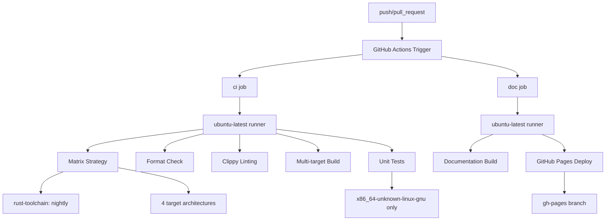
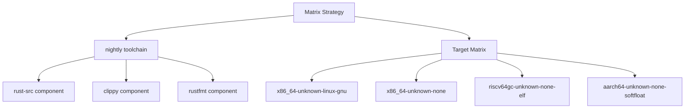
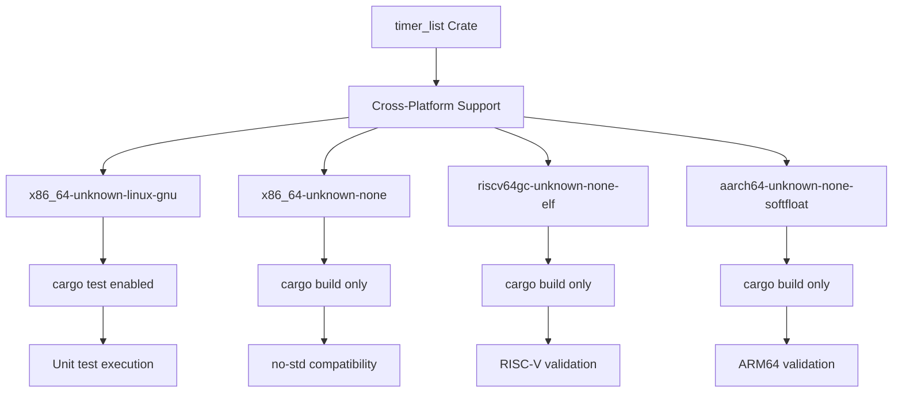
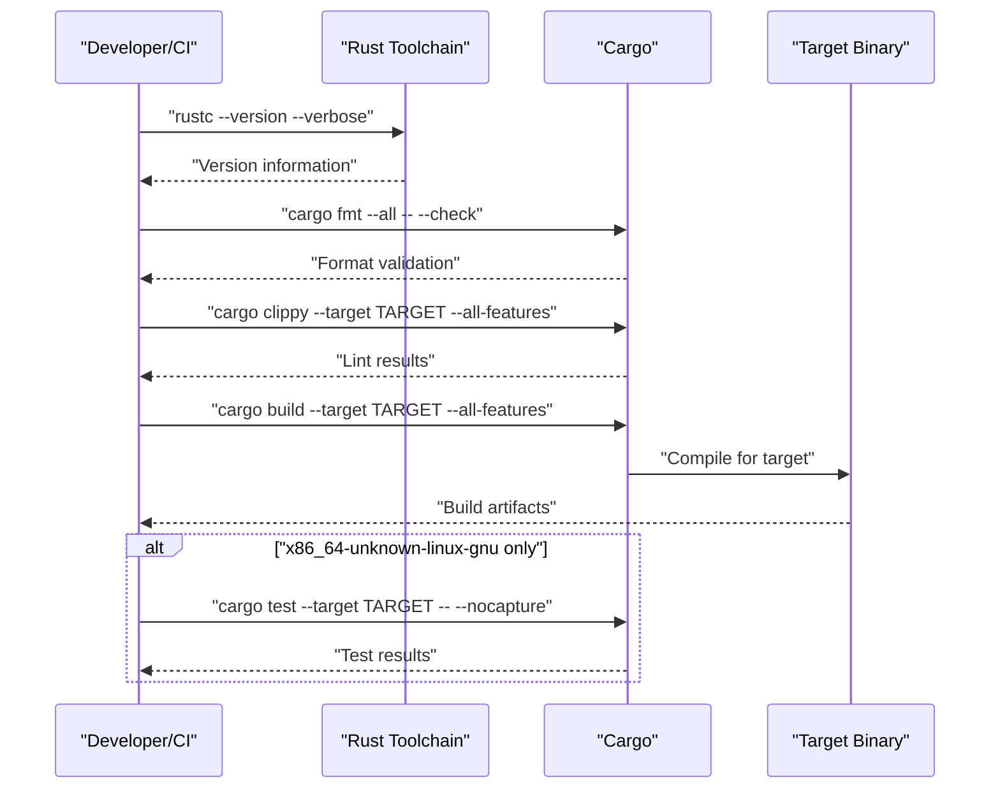
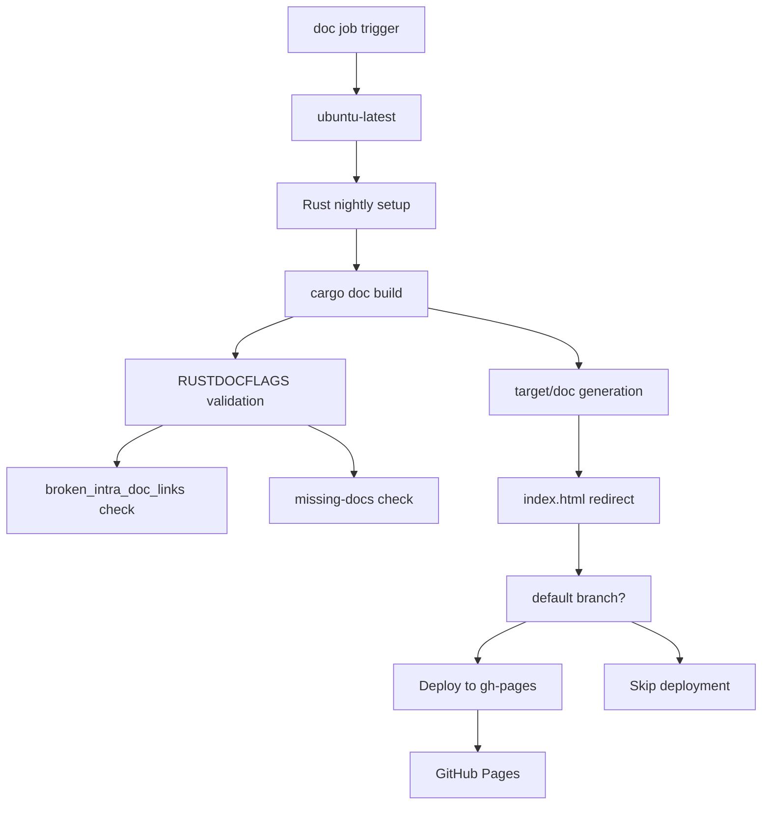

# Building and Testing

> **Relevant source files**
> * [.github/workflows/ci.yml](https://github.com/arceos-org/timer_list/blob/4fa2875f/.github/workflows/ci.yml)

This page documents the automated build and testing infrastructure for the `timer_list` crate, including the CI/CD pipeline configuration, supported target architectures, and local development commands. The information covers both automated workflows triggered by Git events and manual testing procedures for local development.

For information about the project file structure and development environment setup, see [Project Structure](/arceos-org/timer_list/4.2-project-structure).

## CI/CD Pipeline Overview

The `timer_list` crate uses GitHub Actions for continuous integration and deployment. The pipeline consists of two main jobs that ensure code quality, cross-platform compatibility, and automated documentation deployment.

### Pipeline Architecture

The pipeline implements a fail-fast strategy set to `false`, allowing all target builds to complete even if one fails, providing comprehensive feedback across all supported architectures.

Sources: [.github/workflows/ci.yml(L1 - L56)&emsp;](https://github.com/arceos-org/timer_list/blob/4fa2875f/.github/workflows/ci.yml#L1-L56)

### Build Matrix Configuration

The CI system uses a matrix strategy to test across multiple configurations simultaneously:

|Component|Value|
| --- | --- |
|Rust Toolchain|nightly|
|Runner OS|ubuntu-latest|
|Fail Fast|false|
|Target Architectures|4 cross-compilation targets|

The pipeline installs additional Rust components (`rust-src`, `clippy`, `rustfmt`) and configures targets for each architecture in the matrix.

Sources: [.github/workflows/ci.yml(L8 - L19)&emsp;](https://github.com/arceos-org/timer_list/blob/4fa2875f/.github/workflows/ci.yml#L8-L19)

## Target Architecture Support

The crate supports four target architectures, reflecting its use in embedded and operating system environments:

### Architecture Details

|Target|Purpose|Testing|
| --- | --- | --- |
|x86_64-unknown-linux-gnu|Standard Linux development|Full testing enabled|
|x86_64-unknown-none|Bare metal x86_64|Build verification only|
|riscv64gc-unknown-none-elf|RISC-V embedded systems|Build verification only|
|aarch64-unknown-none-softfloat|ARM64 embedded systems|Build verification only|

Unit tests execute only on `x86_64-unknown-linux-gnu` due to the testing framework requirements, while other targets verify `no-std` compatibility and cross-compilation success.

Sources: [.github/workflows/ci.yml(L12)&emsp;](https://github.com/arceos-org/timer_list/blob/4fa2875f/.github/workflows/ci.yml#L12-L12) [.github/workflows/ci.yml(L29 - L30)&emsp;](https://github.com/arceos-org/timer_list/blob/4fa2875f/.github/workflows/ci.yml#L29-L30)

## Build and Test Commands

The CI pipeline executes a specific sequence of commands for each target architecture. These commands can also be run locally for development purposes.

### Core CI Commands

### Local Development Commands

For local development, developers can run the same commands used in CI:

|Command|Purpose|
| --- | --- |
|cargo fmt --all -- --check|Verify code formatting|
|cargo clippy --all-features|Run linter with all features|
|cargo build --all-features|Build with all features enabled|
|cargo test -- --nocapture|Run unit tests with output|

The `--all-features` flag ensures that all conditional compilation features are enabled during builds and linting.

Sources: [.github/workflows/ci.yml(L22 - L30)&emsp;](https://github.com/arceos-org/timer_list/blob/4fa2875f/.github/workflows/ci.yml#L22-L30)

## Documentation Generation

The `doc` job handles automated documentation generation and deployment to GitHub Pages.

### Documentation Workflow

The documentation job includes strict validation using `RUSTDOCFLAGS` to ensure documentation quality by failing on broken internal links and missing documentation.

### Documentation Commands

The documentation generation process uses these key commands:

* `cargo doc --no-deps --all-features` - Generate documentation without dependencies
* `cargo tree | head -1 | cut -d' ' -f1` - Extract crate name for redirect
* Auto-generated `index.html` redirect to the main crate documentation

Sources: [.github/workflows/ci.yml(L32 - L55)&emsp;](https://github.com/arceos-org/timer_list/blob/4fa2875f/.github/workflows/ci.yml#L32-L55)

## Error Handling and Permissions

The CI configuration includes specific error handling strategies:

* **Continue on Error**: Documentation builds continue on error for non-default branches and non-PR events
* **Permissions**: The `doc` job requires `contents: write` permission for GitHub Pages deployment
* **Conditional Deployment**: Pages deployment only occurs on pushes to the default branch

The `clippy` command includes the flag `-A clippy::new_without_default` to suppress specific linting warnings that are not relevant to this crate's design patterns.

Sources: [.github/workflows/ci.yml(L25)&emsp;](https://github.com/arceos-org/timer_list/blob/4fa2875f/.github/workflows/ci.yml#L25-L25) [.github/workflows/ci.yml(L36 - L37)&emsp;](https://github.com/arceos-org/timer_list/blob/4fa2875f/.github/workflows/ci.yml#L36-L37) [.github/workflows/ci.yml(L45)&emsp;](https://github.com/arceos-org/timer_list/blob/4fa2875f/.github/workflows/ci.yml#L45-L45) [.github/workflows/ci.yml(L50)&emsp;](https://github.com/arceos-org/timer_list/blob/4fa2875f/.github/workflows/ci.yml#L50-L50)